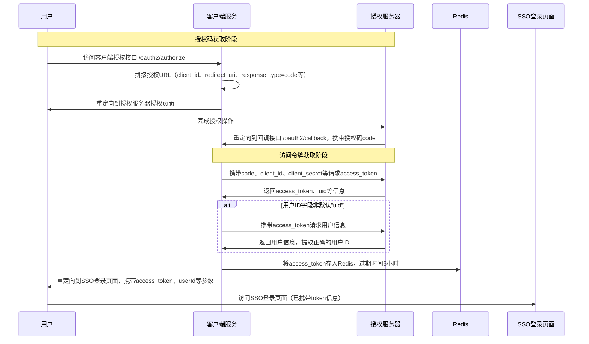

## OAuth 2

传统的账密登录需要用户记住天量的账号密码，很不方便，而且对 SSO 的支持很不友好。其解决方案是 OAuth2 协议，即通过跨应用的授权层协议，实现对账户的精细化管理。
1. 用户在授权服务器完成身份认证（可使用传统账密、免密、生物识别等任何方式）。
2. 用户明确授权第三方应用获取「有限权限」（如仅获取昵称头像、仅读取相册、不可修改数据）。
3. 第三方应用仅能拿到对应权限的令牌，只能访问用户授权的资源，且全程无需获取用户的账密。
4. 资源服务器仅对「有对应权限的令牌」提供服务。

### 向第三方要授权

整体流程如下



其实现首先需要实现一个可以跳转其他页面的实现接口。用于发起 OAuth2 授权请求。

```java
@GetMapping("/oauth2/authorize")
public String authorize() {
    String url = oauth2Properties.getAuthorizeUrl() +               // 第三方服务器的授权端点
        "?redirect_uri=" + oauth2Properties.getRedirectUrl() +      // 授权成功后, 第三方服务器调用的回调地址
        "&state=123&client_id=" + oauth2Properties.getClientId() +  // 传客户端 ID, 而 state 参数用于传一个随机数, 放 CSRF 攻击
        "&response_type=code";                                      // 固定值, 告诉服务器返回授权码
    return "redirect:" + url;
}
```

然后实现一个回调接口，用于在授权成功后，通过授权码 code 获取访问令牌，并提取 token 和用户相关信息，然后将用户的令牌放 redis 上放 6 小时，最后重定向到 SSO 登录页面。

```java
@GetMapping("/oauth2/callback")
public void callback(@RequestParam("code") String code, HttpServletResponse response) throws IOException {
    // 用 code 获取 token, 详细实现见下
    JSONObject tokenResponse = getAccessToken(code);
    if (ObjectUtil.isNotEmpty(tokenResponse)) {
        // 从结果中取出令牌和用户 uid
        String accessToken = tokenResponse.getString("access_token");
        String uid = tokenResponse.getString("uid");

        // 如果这里的用户来的 uid 不是我们存的数据, 那就回数据库去查
        if(!oauth2Properties.getUserIdKey().equals("uid")) {
            uid = getUserInfo(oauth2Properties.getClientId(), accessToken, uid);
        }

        // 拼接跳转地址, 跳转到自己系统的登录页
        String redirectUrl = ssoUrl + "/login.html?" 
            + "token=" + accessToken 
            + "tenantId=default&userId=" + uid;
        redisTemplate.opsForValue().set(REDIS_KEY + accessToken, "true", 6, TimeUnit.HOURS);
        // 重定向到登录页, 完成登录
        response.sendRedirect(redirectUrl);
    } else {
        response.getWriter().write("获取token失败");
    }
}
```

授权接口和回调接口的请求方法强制为 GET。

其中需要的获取 token 的方法，通过授权码获取访问令牌。这是整个流程最关键的一步.

```java
private JSONObject getAccessToken(String code) {
    String url = oauth2Properties.getAccessTokenUrl() +
        "?client_id=" + oauth2Properties.getClientId() +        // 应用 id
        "&grant_type=authorization_code" +                      // 固定值, 代表用授权码换令牌
        "&code=" + code +                                       // 上一步拿到的临时授权码
        "&client_secret=" + oauth2Properties.getClientSecret(); // 应用密钥
    // 构建请求头
    HttpHeaders requestHeaders = new HttpHeaders();
    requestHeaders.add("accept", "application/json");
    // 发送 post 请求
    HttpEntity<String> requestEntity = new HttpEntity<>(requestHeaders);
    ResponseEntity<JSONObject> response = restTemplate.postForEntity(url, requestEntity, JSONObject.class);

    // 解析响应json字符串
    return response.getBody();
}
```

最后, 通过访问令牌获取用户信息。

```java
private String getUserInfo(String clientId, String accessToken, String uid) {
    String url = String.format(oauth2Properties.getUserInfoUrl(), clientId, accessToken, uid);
    // get 请求方式
    ResponseEntity<JSONObject> response = restTemplate.getForEntity(url, JSONObject.class);
    if(response.getStatusCode().is2xxSuccessful()) {
        // 解析响应json字符串
        return response.getBody().getString(oauth2Properties.getUserIdKey());
    }
    return StringConstants.EMPTY;
}
```

用户授权后，授权服务器拿到的首先是有效时间只有几分钟的**授权码**。授权码只能使用一次。然后服务器通过授权码向授权服务器请求获得用户的**访问令牌**。访问令牌的生效时间则比较长，从几小时到几天不等。

这种授权码和访问令牌分离的设计，可以避免访问令牌通过浏览器重定向传递，从而避免在 URL 中暴露，从而被各种手段捕获。并且，即使授权码被截获，攻击者仍然需要密钥才能获取访问令牌。从而防止中间人攻击。

### 授权给第三方

此处的写法就比较多样了。此处列举使用 GET 方法和 POST 方法的情况。GET 方法使用参数传递, 而 POST 方法使用请求体传递, 二者没有差别

**GET 方法**

```java
@Operation(summary = "第三方token校验接口")
@GetMapping(value = "/check")
public ApiResponse<ThdLoginResponse> checkLogin(@RequestParam(name = "userId", required = false) String userId,
                                                @RequestParam(name = "tenantId", required = false) String tenantId,
                                                @RequestParam("sessionId") String sessionId,
                                                @RequestParam("state") String state) {
    ApiResponse<ThdLoginResponse> apiResponse = ApiResponse.successResponse();
    ThdLoginResponse map = thdLoginCheck.checkToken(tenantId, userId, sessionId, state);
    apiResponse.setData(map);
    return apiResponse;
}
```

**POST 方法**

```java
@Operation(summary = "第三方token校验接口")
@PostMapping(value = "/check")
public ApiResponse<ThdLoginResponse> checkLoginPost(@RequestBody ThdLoginRequest requestBody) {
    ApiResponse<ThdLoginResponse> apiResponse = ApiResponse.successResponse();
    String tenantId = requestBody.getTenantId();
    String userId = requestBody.getUserId();
    String sessionId = requestBody.getSessionId();
    String state = requestBody.getState();
    ThdLoginResponse map = thdLoginCheck.checkToken(tenantId, userId, sessionId, state);
    apiResponse.setData(map);
    return apiResponse;
}
```

令牌的申请、校验和吊销都必须使用 POST 方法。

注意到此处需要的请求都可以使用 resttemplate 实现，oauth-starter 依赖的注入不是必要的。

## 邮件收发

电子邮件的上传由 SMTP 协议实现，而发送由 IAMP 或 POP3 协议实现。作为服务器，需要在合适的时候发送合适的协议，从而有效发送信息。而在发送时，可以按照邮件及其附件的类型，调用不同的接口。

要实现邮件收发的功能，需要注入 javamail 依赖。

相关配置信息如下

```yaml
spring:
  flyway:
    enabled: false
  mail:
    host: smtp.qq.com               # 邮件服务器地址
    protocol: smtps                 # 发送协议
    default-encoding: utf-8         # 编码格式
    username: example@qq.com        # 发件邮箱
    password: 1145141919815000      # 16位授权码 不是邮箱密码
    port: 465   #465              # smtp 的指定端口 25 端口默认不启用 ssl 也就是 protocol 为 smtp, 使用 465 要将 protocol 改为 smtps 并且开启 ssl 为 true
    properties:
      mail:
        stmp:
          ssl:
            enable: false
        receive:
          enable: false
          protocol: pop3
          ssl:
            enable: true
          port: 995     #997
```

### 纯文本邮件发送

如果信件只是简单的文字信息，则只需要配置好相关信息，直接抄送即可。

```java
public void sendNormalEmailMessage(TextEmailVO mail) {
    // 创建简单邮件对象
    SimpleMailMessage message = new SimpleMailMessage();
    message.setFrom(mailUserName);          // 发件箱
    message.setTo(mail.getTo());            // 谁要接收
    message.setSubject(mail.getSubject());  // 邮件标题
    message.setText(mail.getContent());     // 邮件内容
    message.setCc(mail.getCc());            // 抄送
    // 发送邮件
    javaMailSender.send(message);
    operatorOfEmail.insert(EmailEntityUtil.convertVo2Do(mail));
}
```

注意，在发送的同时也要在数据库中同步一份数据记录。数据库中应该存放其租户 id、邮件发送时间、消息类型、发送者邮箱、主题、邮件内容、接收者、发送人姓名、发送人用户 id、邮件的附件 OSS 存储地址（或其比特流）、邮件的传输方向、邮件的系统来源这些信息。

### 富文本邮件发送

富文本邮件支持 **HTML 格式**（图片、表格等），同时兼容**前端上传文件**和**文件服务器**文件两种附件来源，附件以二进制流形式处理。

```java
public String sendMimeMessage(EmailVO mail, MultipartFile multipartFile) throws MessagingException, IOException {
    MimeMessage message = javaMailSender.createMimeMessage();

    // 创建一个复杂邮件对象, 参数 true 表示开启多媒体支持
    MimeMessageHelper helper = new MimeMessageHelper(message, true);
    helper.setFrom(mailUserName);               // 发件人
    helper.setTo(mail.getTo());                 // 收件人
    helper.setSubject(mail.getSubject());       // 标题
    helper.setCc(mail.getCc());                 // 抄送
    helper.setText(mail.getContent(), true);    // 邮件内容, true 表示带有附件或 html

    // 附件来源一: 前端上传的文件
    if (!ObjectUtils.isEmpty(multipartFile)) {
        log.info("send email: store email attachment file stream to database");
        byte[] bytes = multipartFile.getBytes();
        String fileName = Optional.ofNullable(multipartFile.getOriginalFilename()).orElse("");

        // 把附件二进制存到邮件对象里, 方便后面放数据库
        mail.setBinaryEmailAttachment(bytes);
        mail.setFileName(fileName);
        helper.addAttachment(fileName, new ByteArrayResource(bytes));
    // 附件来源二: 文件服务器地址
    } else if (StringUtils.hasText(mail.getFileAddress())){
            try {
                // 以流的形式下载文件服务器文件
                InputStream fis = new BufferedInputStream(Files.newInputStream(Paths.get(mail.getFileAddress())));
                byte[] buffer = new byte[fis.available()];
                fis.read(buffer);
                fis.close();
                // 附件二进制写入邮件对象, 添加为邮件附件
                mail.setBinaryEmailAttachment(buffer);
                helper.addAttachment(mail.getFileName(), new ByteArrayResource(buffer));
            } catch (IOException ex) {
                log.error("Error:  {}", ex.getMessage(),ex);
            }
        }
    }
    // 真正执行发送操作
    javaMailSender.send(message);
    // 存到数据库
    EmailDO emailDO = EmailEntityUtil.convertVo2Do(mail);
    operatorOfEmail.insert(emailDO);
    // 查询该邮件的id
    return operatorOfEmail.getEmailId(emailDO);
}
```

其中的 `MultipartFile` 是 Spring Web 中用于处理客户端上传文件的核心接口。用于接收用户上传的文件并封装其元信息（如文件名、大小、字节流等）。
