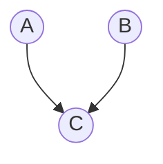

## Java内存模型

Java内存模型（**JMM**）是一套规范，它定义了在多线程环境下，Java程序中变量的访问规则。


**共享变量存储在主内存中，每个线程都有一个私有的本地内存，存储了共享变量的副本。**

- 当一个线程更改了本地内存中共享变量的副本，它需要JVM刷新在主内存中的值。
- 当一个线程需要读取一个共享变量时，如果本地内存中的副本是**过期**的，它必须从主内存中获取最新的值，并将其存储在本地内存中。

这样操作可以减少CPU访问RAM的开销。

JMM主要关注以下几个方面：

1. **原子性**
    一个或多个操作，要么全部成功，要么全部不执行。保证操作的不可分割性。JMM保证了基本数据类型的读写操作的原子性，但对于复合操作（如i++）则不保证原子性。
2. **可见性**
    确保一个线程对共享变量的修改，其他线程能够立即看到。
3. **有序性**
    保证程序执行的顺序符合代码的书写顺序。一般情况下，CPU或编译器会对指令进行重排序优化。从Java源代码到最终的指令序列，会经历3种重排序：编译器重排序、指令并行重排序、内存系统重排序。指令重排可能会导致双重检查锁失效。

JVM 的内存结构和 Java 虚拟机的运行时区域相关，定义了 JVM 在运行时如何分区存储程序数据；而 Java 内存模型和 Java 并发编程相关，抽象了线程和主内存之间的关系。

### Happens-Before原则

JMM 规定了`Happens-Before`原则，用于定义操作之间的可见性关系。常见的 `Happens-Before` 规则包括：

- 程序顺序规则：一个线程内，按代码顺序执行，前面的操作先于后面的操作。
- 监视器锁规则：一个解锁操作先于后续对同一锁的加锁操作。
    `unlock() happens-before lock()`
- `volatile` 变量规则：对一个`volatile`变量的写操作先于后续对该变量的读操作。
    `write to v happens-before read of v`
- 传递性：如果操作A先于操作B，操作B先于操作C，那么操作A先于操作C。
    `A happens-before B` and `B happens-before C` implies `A happens-before C`
- 线程启动规则：`Thread.start()` 方法先于被启动线程的任何操作。
    `Thread.start() happens-before any action in the started thread`
- 线程终止规则：线程的所有操作先于其他线程检测到该线程终止的动作（如 `Thread.join()` 返回）。
    `All actions in a thread happen-before any other thread detects that thread has terminated`

### as-if-serial语义

JMM 允许编译器和处理器对代码进行优化和重排序，但必须保证单线程程序的执行结果与未优化的程序一致。这种优化称为`as-if-serial`语义。

比如在这行语句下

```java
double pi = 3.14;   // A
double r = 1.0;   // B
double area = pi * r * r;   // C
```

语句间的依赖关系如下



因此`C`必须在`A`和`B`之后执行，但`A`和`B`之间没有依赖关系，可以交换顺序执行。

`Happens-Before` 约束多线程间的操作顺序，保障跨线程的内存可见性。`As-If-Serial` 保障单线程内的执行结果不变。二者是 JMM 为并发编程提供的并行安全保障（`Happens-Before`）与单线程性能优化（`As-If-Serial`）的统一体现。

## `volatile`关键字

在加了这个关键字后，可以保证该变量的可见性，线程修改该变量后，其他线程能够立即看到最新值；每次使用它都到主存中读取；同时，防止指令重排，其写操作不会被重排到它以前的代码。

该关键字能保障数据的可见性，但不能保证数据的原子性。而 `synchronized` 关键字能同时保证两者。

为了保证可见性，线程对 `volatile` 变量进行写操作时，会在该变量写入后插入一个写屏障（**StoreStore + StoreLoad**屏障）指令，该指令会强制将本地内存中的变量值刷新到主内存中。在 `x86` 中，通常会使用带 `lock` 前缀的指令实现

```asm
mov [a], 2
lock add [a], 0
```

进行读操作时，JVM会插入一个读屏障指令，强制从主内存中读取最新值到本地内存

总之，该关键字变量在读写前后插入内存屏障，以约束CPU和编译器的优化行为

`volatile` 关键字用于基本数据类型时，能确保变量的读写操作是直接从主内存中读写的，用于引用类型时，能确保引用本身的可见性，即确保引用指向的对象地址是最新的，但不能保证引用对象的内部状态的可见性。若需要保证引用对象的内部状态的可见性，需对该对象的字段也使用 `volatile` 关键字，或者使用其他同步机制（如 `synchronized` 块或 `ReentrantLock`）来确保线程安全。

## `synchronized` 关键字与 `ReentrantLock`

`synchronized` 关键字用于方法或代码块，确保同一时刻只有一个线程可以执行该代码，从而保证线程安全。它通过**对象的监视器锁**（Monitor Lock）实现。

`synchronized` 修饰实例方法时，锁定的是当前对象实例（`this`）；而修饰静态方法或指定 `synchronized(class)` 代码块时，锁定的则是对应的 Class 对象。

线程在进入 `synchronized` 代码块前，必须成功获取对应对象的监视器锁，否则将被阻塞，直到锁被释放。

尽量不要给字符串加锁，因为字符串常量池有缓存功能。也不能给构造方法修饰 `synchronized`，只能在构造方法内部使用。

在同步代码块的实现上，JVM 通过 `monitorenter` 和 `monitorexit` 指令来管理锁的获取与释放。每个对象的对象头中都包含一个 Mark Word，用于存储锁状态和指向 `Monitor` 的指针。`synchronized` 基于 Mark Word 实现了锁状态的动态管理，支持从无锁、偏向锁、轻量级锁到重量级锁的升级。锁只能升级不能降级。当升级为重量级锁后，其同步机制将依赖于操作系统的互斥量（`mutex`）。


`synchronized` 关键字能够保证可见性与有序性：在释放锁时，会将线程本地内存中的变量刷新到主内存；在获取锁时，会从主内存中重新读取变量最新值。同时，通过 `monitorenter` 与 `monitorexit` 指令，可以确保同步块内的指令不会与块外指令发生重排序。

该关键字还支持可重入性：一个线程可以多次获取自己已经持有的锁，每次获取对应锁计数递增，释放时计数递减，直至归零后锁才被彻底释放，从而避免线程自我阻塞。


`synchronized` 的可重入性是通过对象头 Mark Word 中记录的持有锁的线程 ID 及锁计数器实现的。当线程首次获取锁时，JVM 将线程 ID 记录到 Mark Word，并将计数器置为 1。同一线程再次获取锁时，计数器递增；退出同步代码块时计数器递减。当计数器归零时，锁被释放，Mark Word 中线程 ID 被清空。


Java中多线程的锁都是基于对象的，Java中的每一个对象都可以作为一个锁。更精确地说，`synchronized`锁定的是对象的监视器（Monitor），而不是对象本身。

### 锁升级

在JDK 1.6 之前，`synchronized` 使用的是重量级锁，性能较差。JDK 1.6 引入了锁升级机制，包括**偏向锁**、**轻量级锁**和**重量级锁**，以提高性能。这几种锁会随着竞争情况逐渐升级。

锁有四种状态。

- 无锁状态（Unlocked）：对象处于无锁状态，Mark Word 存储对象的哈希码等信息。
- 偏向锁状态（Biased Locking）：适用于没有线程竞争的场景。当第一个线程访问同步块时，JVM 将其线程 ID 记录到 Mark Word 中，并置为偏向模式。此后该线程再次进入时无需执行任何同步操作，消除了加锁开销。注意：偏向锁自 JDK 15 起默认禁用，并在 JDK 18 后被废弃。
- 轻量级锁状态（Lightweight Locking）：当存在轻微竞争（即第二个线程尝试获取锁）时，偏向锁升级为轻量级锁。JVM 会在当前线程的栈帧中创建锁记录（Lock Record），并通过 CAS 操作将对象 Mark Word 替换为指向该锁记录的指针。若线程通过有限次数的自旋仍未能获取锁，表明竞争加剧，轻量级锁将升级为重量级锁。
- 重量级锁状态（Heavyweight Locking）：在竞争激烈的情况下，轻量级锁会升级为重量级锁。此时 JVM 会借助操作系统的互斥量（Mutex）进行线程同步，未获得锁的线程将被挂起并进入阻塞状态，等待系统调度唤醒，因此开销最大。


乐观锁在[redis 使用的相关篇章](https://ivanclf.github.io/2025/09/24/redis-2/#%E8%B6%85%E5%8D%96%E9%97%AE%E9%A2%98%E4%B8%8E%E4%B8%80%E4%BA%BA%E4%B8%80%E5%8D%95)中介绍得比较详细了。在 Java 中，CAS 通过 Unsafe 类的 native 方法实现，这些方法调用底层的硬件指令来完成原子操作。Java 提供了 `AtomicReference` 类来将多个变量封装在一个对象中，以实现 CAS 操作。



### `ReentrantLock`

这二者都是可重入锁。然而 `synchronized` 由JVM内部的 `Monitor` 实现，`ReentrantLock` 基于AQS (AbstractQueuedSynchronized) 实现。因此前者可以由 JVM 自动加锁和解锁，而后者需要手动加锁和解锁。

`ReentrantLock` 相比 `synchronized` 增加了等待可中断，可实现公平锁，可实现选择性通知，支持超时这些机制。
- 通过 `lock.lockInterruptibly()` 实现中断等待锁的线程的机制。当前线程在等待获取锁的过程中，如果其他线程中断当前线程，当前线程就会抛异常，可以通过捕捉异常并进行相应处理，而不是要等到获取锁后才能进行其他逻辑的处理。
- 其实两者都可以实现，而 `ReentrantLock` 通过借助 `Condition` 接口下的 `newCondition` 方法实现
- 通过 `tryLock(timeout)` 方法指定获取锁的最大等待时间。

`ReentrantLock` 内部使用 AQS 的 `state` 字段作为重入计数器。当线程调用 `lock()` 时，若 `state` 为 0，则通过 CAS 操作将其设为 1 并获取锁；若当前线程已持有锁，则 `state` 累加 1。每次调用 `unlock()` 会使 `state` 减 1，直至为 0 时完全释放锁，并唤醒等待队列中的线程。

`ReentrantLock` 默认为非公平锁，若在构造函数传入 `true`，则为公平锁。


公平锁严格按照先进先得原则，严格按照线程请求锁的顺序来分配锁；非公平锁允许插队，谁先抢到就是谁的。


### AQS

AQS（`AbstractQueuedSynchronizer`）是一个抽象同步框架，其核心通过一个 `volatile int state` 变量表示同步状态，确保多线程间的可见性，并通过一个 FIFO 双向队列来管理获取锁失败的线程。

AQS支持两种同步模式：
- **独占模式**（Exclusive Mode）：一次只有一个线程可以获取锁，其他线程必须等待。（如 `ReentrantLock`）
- **共享模式**（Shared Mode）：允许多个线程同时获取锁。（如 `Semaphore` 和 `CountDownLatch`）

核心方法包括
- `acquire(int arg)`：尝试获取锁，如果失败则将当前线程加入等待队列并阻塞。
- `release(int arg)`：释放锁，并唤醒等待队列中的下一个线程。
- `acquireShared(int arg)`：尝试以共享模式获取锁。
- `releaseShared(int arg)`：以共享模式释放锁。

AQS 的核心机制是：当共享资源空闲时，将当前请求线程设为工作线程，并标记资源为锁定状态；若资源被占用，则通过线程阻塞-唤醒机制来管理等待线程。该机制基于 CLH 锁进行改进：将原本单向、自旋的 CLH 队列优化为双向结构，并引入“自旋 + 阻塞”策略，使用 `state` 字段统一表示同步状态。

## 原子操作类


原子操作类是基于`CAS + volatile`实现的。底层基于`Unsafe`类的`compareAndSwapXXX`方法实现。

像 `AtomicIntegerArray` 这种以 Array 结尾的，还可以原子更新数组里的元素；像 `AtomicStampedReference` 还可以通过版本号的方式解决 CAS 中的 ABA 问题。

## 死锁

死锁的问题在[另一篇文章](https://ivanclf.github.io/2025/05/14/os/)中有所提及，此处仅涉及其中的部分问题

### 死锁的排查

首先可以在系统级别上排查，比如在Linux中，可以先使用`top ps`等命令查看线程状态，看看是否有线程占用过多资源。

接着，使用`jps -l`查看当前进程，然后使用`jstack <pid>`查看线程堆栈，若有线程处于`BLOCKED`状态，则说明该线程在等待锁。

也可以使用一些可视化的性能监控工具，比如说 `JConsole`、`VisualVM` 等，查看线程的运行状态、锁的竞争情况等。


尽管在另一篇文章中，讲述了很多死锁的解决方案，但最常用的还是给锁加超时时间，避免线程长时间等待锁。这也是在[这篇文章](https://ivanclf.github.io/2025/09/24/redis-2/)中即使用看门狗机制延长时间也不取消锁过期时间的原因。


## 同步与互斥

同步，意味着线程直接要密切合作，按照一定的顺序执行任务。互斥，意味着线程之间要避免同时访问某些资源。同步关注的是线程直接的协作，互斥关注的是对共享资源的保护。

为了实现同步，可以使用`CountDownLatch`、`CyclicBarrier`等工具类，或者使用`wait()`和`notify()`方法来协调线程之间的执行顺序。
为了实现互斥，可以使用`synchronized`关键字、`ReentrantLock`类等来确保同一时刻只有一个线程可以访问某个资源。

可以使用`synchronized`关键字或者`lock`接口的实现类，如`ReentrantLock`，来给资源加锁。

## 其他并发工具类

### `CountDownLatch`

`CountDownLatch` 是 JUC 包中的同步工具，其核心是一个倒计时计数器，主要用于让一个或多个线程等待其他一组线程完成操作。

假如要查10万多条数据，用线程池分成20个线程去执行，怎么做到等所有线程都查找完后，才输出结果？这就是`CountDownLatch` 的典型应用场景。

1. 创建 `CountDownLatch` 对象，初始值设定为 20，表示 20 个线程需要完成任务。
2. 创建线程池，每个线程执行查询操作，查询完毕后调用 `countDown()` 方法，计数器减 1。
3. 主线程调用 `await()` 方法，等待所有线程执行完毕。

```java
class DataQueryExample {

    public static void main(String[] args) throws InterruptedException {
        // 模拟10万条数据
        int totalRecords = 100000;
        int threadCount = 20;
        int batchSize = totalRecords / threadCount; // 每个线程处理的数据量

        // 创建线程池
        ExecutorService executor = Executors.newFixedThreadPool(threadCount);
        CountDownLatch latch = new CountDownLatch(threadCount);

        // 模拟查询结果
        ConcurrentLinkedQueue<String> results = new ConcurrentLinkedQueue<>();

        for (int i = 0; i < threadCount; i++) {
            int start = i * batchSize; // 起始索引
            int end = (i == threadCount - 1) ? totalRecords : (start + batchSize); // 结束索引
            
            executor.execute(() -> {
                try {
                    // 模拟查询操作
                    for (int j = start; j < end; j++) {
                        results.add("Data-" + j);
                    }
                    System.out.println(Thread.currentThread().getName() + " 处理数据 " + start + " - " + end);
                } finally {
                    latch.countDown(); // 线程任务完成，计数器减1
                }
            });
        }

        // 等待所有线程完成
        latch.await();
        executor.shutdown();

        // 输出结果
        System.out.println("所有线程执行完毕，查询结果总数：" + results.size());
    }
}
```

### `CyclicBarrier`

`CyclicBarrier` 意为“循环屏障”，它让一组线程相互等待，直到所有线程都到达屏障点后，再一起继续执行。该屏障在释放等待线程后可以重置复用。

**核心机制**
- 初始化时设定需要等待的线程数 N。
- 每个线程执行 `await()` 方法后会被阻塞，此时屏障计数减1。
- 当第 N 个线程调用 `await()` 后，计数归零，所有被阻塞的线程将被同时释放。
- 此外，在所有线程到达屏障时，可以触发一个预定义的 `Runnable` 动作（`barrierAction`）。

`CyclicBarrier`和`CountDownLatch`的区别如下表

|对比项|`CountDownLatch`|`CyclicBarrier`|
|-|-|-|
|用途|让主线程等待所有子线程执行完|多个线程相互等待，直到所有线程都到达屏障|
|可重用性|不可重用，计数器只能减到0|可重用，屏障值可以重新设置|
|是否可执行回调|不可以|可以，所有线程到达屏障后可执行 `barrierAction`|
|线程等待情况|主线程等待子线程|所有线程相互等待|
|典型场景|等待多个服务启动完成|多线程计算，最后汇总结果|

## Fork/Join

该框架主要用于分治算法的并行执行，可以将一个大任务拆分成多个小任务并行处理。其底层结构是个特殊的线程池—— `ForkJoinPool`，且使用了工作窃取算法（一个线程执行完自己的任务后，可以窃取其他线程的任务，避免线程闲置）。

## 虚拟线程

虚拟线程于 JDK 21 引入。

虚拟线程是 JDK 而非 OS 实现的轻量级线程，由 JVM 调度。许多虚拟线程共享同一个操作系统线程。虚拟线程的数量可以远大于操作系统线程的数量。

### 平台线程

在引入虚拟线程之前， `Thread` 包下已经支持所谓的**平台线程**。JVM 调度程序通过平台线程来管理虚拟线程，一个平台线程可以在不同的事件执行不同的虚拟线程，当虚拟线程阻塞或等待时，平台线程可以切换到执行另一线程。


**优点**
- 虚拟线程非常轻量级，因此可以在单个线程中创建成百上千个虚拟线程而不会导致过多的线程创建和上下文切换
- 简化了异步编程
- 减少了资源开销，因为整个虚拟线程是由 JVM 实现的，而虚拟线程的切换比平台线程更轻量

**缺点**
- 由于密集计算任务始终需要 CPU 资源支持，因此虚拟线程不适用于计算密集型任务
- 和某些第三方库不兼容

在密集 IO 的场景下，虚拟线程可以大幅提高线程的执行效率，减少线程资源的创建和上下文切换。

有三种启动方式

直接启动

```java
Thread.startVirtualThread(() -> {
    // ...
});
```

使用 `Thread.ofVirtual()` 方法

```java
Thread virtualThread = Thread.ofVirtual()
    .name("my-virtual-thread")
    .start(() -> {
        // ...
    });

virtualThread.join();
```

使用 `Executor`

```java
try (var executor = Executors.newVirtualThreadPerTaskExecutor()) {
    // 提交多个任务
    for (int i = 0; i < 10; i++) {
        int taskId = i;
        executor.submit(() -> {
            System.out.println("Task " + taskId + " executed by: " + Thread.currentThread());
        });
    }
} // executor 自动关闭
```
