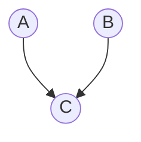
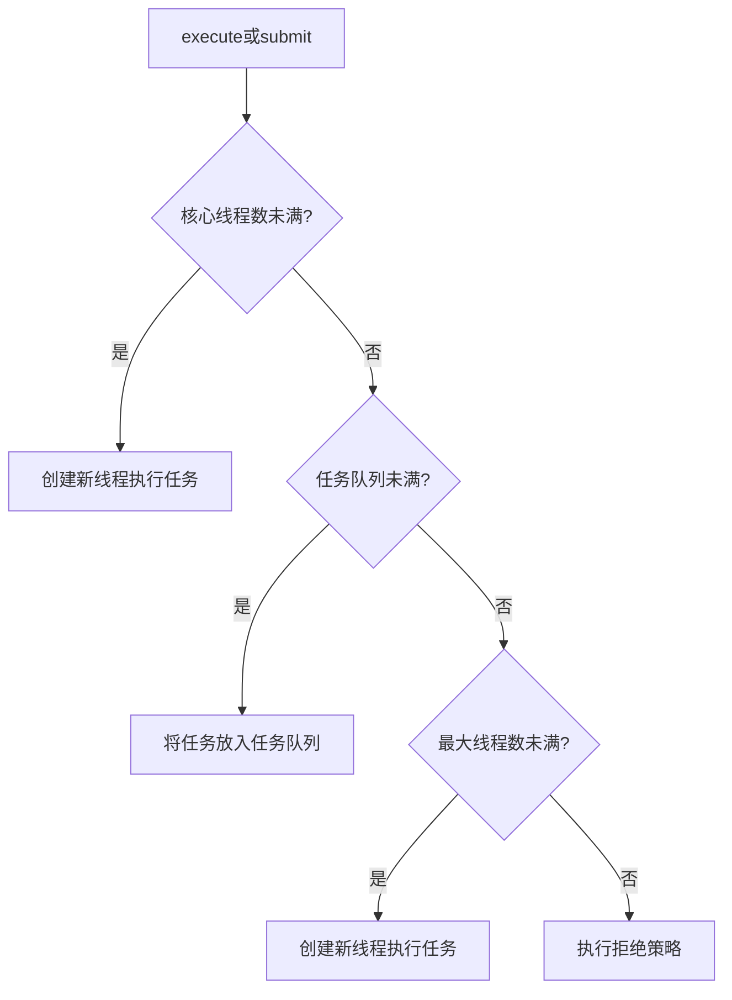
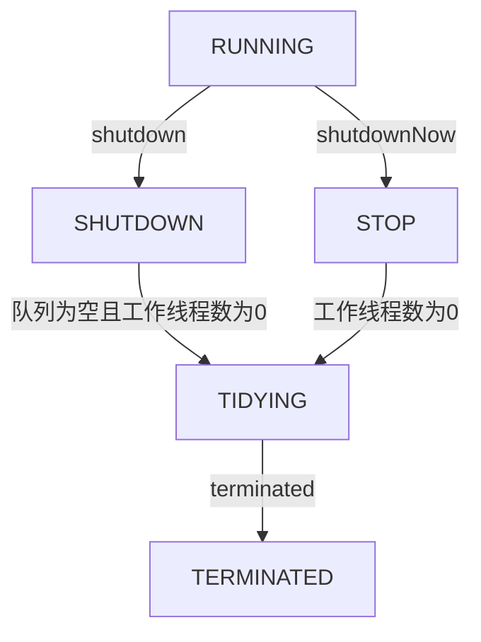

## Java内存模型

Java内存模型（JMM）是一套规范，它定义了在多线程环境下，Java程序中变量的访问规则。


共享变量存储在主内存中，每个线程都有一个私有的本地内存，存储了共享变量的副本。

- 当一个线程更改了本地内存中共享变量的副本，它需要JVM刷新在主内存中的值。
- 当一个线程需要读取一个共享变量时，如果本地内存中的副本是**过期**的，它必须从主内存中获取最新的值，并将其存储在本地内存中。

这样操作可以减少CPU访问RAM的开销。

JMM主要关注以下几个方面：

1. **原子性**
    一个或多个操作，要么全部成功，要么全部不执行。保证操作的不可分割性。JMM保证了基本数据类型的读写操作的原子性，但对于复合操作（如i++）则不保证原子性。
2. **可见性**
    确保一个线程对共享变量的修改，其他线程能够立即看到。
3. **有序性**
    保证程序执行的顺序符合代码的书写顺序。一般情况下，CPU或编译器会对指令进行重排序优化。从Java源代码到最终的指令序列，会经历3种重排序：编译器重排序、指令并行重排序、内存系统重排序。指令重排可能会导致双重检查锁失效。

### Happens-Before原则

JMM规定了`Happens-Before`原则，用于定义操作之间的可见性关系。常见的`Happens-Before`规则包括：

- 程序顺序规则：一个线程内，按代码顺序执行，前面的操作先于后面的操作。
- 监视器锁规则：一个解锁操作先于后续对同一锁的加锁操作。
    `unlock() happens-before lock()`
- `volatile`变量规则：对一个`volatile`变量的写操作先于后续对该变量的读操作。
    `write to v happens-before read of v`
- 传递性：如果操作A先于操作B，操作B先于操作C，那么操作A先于操作C。
    `A happens-before B` and `B happens-before C` implies `A happens-before C`
- 线程启动规则：`Thread.start()`方法先于被启动线程的任何操作。
    `Thread.start() happens-before any action in the started thread`
- 线程终止规则：线程的所有操作先于其他线程检测到该线程终止的动作（如`Thread.join()`返回）。
    `All actions in a thread happen-before any other thread detects that thread has terminated`

### as-if-serial语义

JMM允许编译器和处理器对代码进行优化和重排序，但必须保证单线程程序的执行结果与未优化的程序一致。这种优化称为`as-if-serial`语义。

比如在这行语句下

```java
double pi = 3.14;   // A
double r = 1.0;   // B
double area = pi * r * r;   // C
```

语句间的依赖关系如下



因此`C`必须在`A`和`B`之后执行，但`A`和`B`之间没有依赖关系，可以交换顺序执行。

`Happens-Before` 规则保证了多线程环境下的有序性，防止指令重排导致的并发问题。`As-If-Serial` 规则保证了单线程代码不会因优化而执行错误。

## `volatile`关键字

在加了这个关键字后，可以保证该变量的可见性，线程修改该变量后，其他线程能够立即看到最新值；同时，防止指令重排，其写操作不会被重排到它以前的代码。

为了保证可见性，线程对`volatile`变量进行写操作时，会在该变量写入后插入一个写屏障（**StoreStore + StoreLoad**屏障）指令，该指令会强制将本地内存中的变量值刷新到主内存中。在`x86`中，通常会使用带`lock`前缀的指令实现

```assembly
mov [a], 2
lock add [a], 0
```

进行读操作时，JVM会插入一个读屏障（**LoadLoad + LoadStore**屏障）指令，强制从主内存中读取最新值到本地内存

总之，该关键字变量在读写前后插入内存屏障，以约束CPU和编译器的优化行为

- `StoreStore`屏障：保证该屏障前的写操作必须在该屏障后的写操作之前完成
- `StoreLoad`屏障：保证该屏障前的写操作必须在该屏障后的读操作之前完成
- `LoadLoad`屏障：保证该屏障前的读操作必须在该屏障后的读操作之前完成
- `LoadStore`屏障：保证该屏障前的读操作必须在该屏障后的写操作之前完成

`volatile`关键字用于基本数据类型时，能确保变量的读写操作是直接从主内存中读写的，用于引用类型时，能确保引用本身的可见性，即确保引用指向的对象地址是最新的，但不能保证引用对象的内部状态的可见性。若需要保证引用对象的内部状态的可见性，需对该对象的字段也使用`volatile`关键字，或者使用其他同步机制（如`synchronized`块或`ReentrantLock`）来确保线程安全。

## `synchronized`关键字与`ReentrantLock`

`synchronized`关键字用于方法或代码块，确保同一时刻只有一个线程可以执行该代码，从而保证线程安全。它通过对象的监视器锁（Monitor Lock）实现。

在对代码块进行加锁时，JVM会在进入代码块前调用`monitorenter`指令获取锁，执行完代码块后调用`monitorexit`指令释放锁。如果一个线程尝试获取一个已经被其他线程持有的锁，它将被阻塞，直到锁被释放。

`Monitor`是JVM内置的同步机制，每个对象在内存中都有一个对象头——Mark Word，用于存储锁的状态，以及`Monitor`对象的指针。


`synchronized` 依赖对象头的 Mark Word 进行状态管理，支持无锁、偏向锁、轻量级锁，以及重量级锁。

`synchronized` 升级为重量级锁时，依赖于操作系统的互斥量——`mutex` 来实现。

为了保证可见性，`synchronized`块在释放锁时会将本地内存中的变量值刷新到主内存中，在获取锁时会从主内存中读取最新值到本地内存。

为了保证有序性，该关键字通过 JVM 指令 `monitorenter` 和 `monitorexit`，来确保加锁代码块内的指令不会被重排。

可重入意味着一个线程可以多次获取同一把锁，而不会导致死锁。

`synchronized` 之所以支持可重入，是因为 Java 的对象头包含了一个 Mark Word，用于存储对象的状态，包括锁信息。

当一个线程获取对象锁时，JVM 会将该线程的 ID 写入 Mark Word，并将锁计数器设为 1。

如果一个线程尝试再次获取已经持有的锁，JVM 会检查 Mark Word 中的线程 ID。如果 ID 匹配，表示的是同一个线程，锁计数器递增。

当线程退出同步块时，锁计数器递减。如果计数器值为零，JVM 将锁标记为未持有状态，并清除线程 ID 信息。


Java中多线程的锁都是基于对象的，Java中的每一个对象都可以作为一个锁。更精确地说，`synchronized`锁定的是对象的监视器（Monitor），而不是对象本身。


- 在同步实例方法时，锁的是当前实例对象`this`
- 在同步静态方法时，锁的是类的`Class`对象
- 在同步代码块时，锁的是括号中指定的对象

无论哪种方式，线程在进入`synchronized`块之前，都必须先成功获取指定休想的监视器锁，否则线程将被阻塞，直到锁可用为止。


### 锁升级

在JDK 1.6 之前，`synchronized`使用的是重量级锁，性能较差。JDK 1.6 引入了锁升级机制，包括**偏向锁**、**轻量级锁**和**重量级锁**，以提高性能。这几种锁会随着竞争情况逐渐升级。锁的升级很简单，但发生的条件就很苛刻了。

在没有线程竞争时，就使用低开销的“偏向锁”，此时没有额外的CAS操作。当有轻微竞争时，升级为“轻量级锁”，采用CAS自旋。当竞争激烈时，升级为“重量级锁”，需要进行线程阻塞。

锁有四种状态。

- 无锁状态（Unlocked）：对象处于无锁状态，Mark Word 存储对象的哈希码等信息。
- 偏向锁状态（Biased Locking）：当一个线程访问同步块时，JVM 会将该线程的 ID 写入 Mark Word，并将锁标记为偏向锁状态。后续该线程再次访问该同步块时，无需进行任何同步操作，直接进入同步块，避免了不必要的锁操作开销。
- 轻量级锁状态（Lightweight Locking）：当另一个线程尝试获取已经被偏向锁持有的锁时，JVM 会将偏向锁升级为轻量级锁。JVM 会创建一个锁记录（Lock Record）并将其压入当前线程的栈帧中，同时使用CAS操作将对象的Mark Word替换为指向锁记录的指针。线程在进入同步块时，会尝试通过自旋来获取锁。当自选了一定次数后，仍然没有获取锁，说明竞争比较激烈，JVM 会将轻量级锁升级为重量级锁。
- 重量级锁状态（Heavyweight Locking）：当多个线程竞争同一把锁时，轻量级锁会升级为重量级锁。JVM 会创建一个互斥量（Mutex）对象，并将对象的Mark Word替换为指向该互斥量的指针。线程在获取锁时，如果锁已被其他线程持有，它将被阻塞，直到锁可用为止。


### 与`ReentrantLock`对比

两句话回答：`synchronized`由JVM内部的`Monitor`实现，`ReentrantLock`基于AQS实现。

因此前者可以自动加锁和解锁，而后者需要手动加锁和解锁。


什么是AQS？它是一个抽象类，维护了一个`volatile`类型的`int`变量`state`（保证多线程之间的可见性），表示锁的状态。AQS通过一个FIFO双向队列来管理获取锁失败的线程。

AQS支持两种同步模式：
- 独占模式（Exclusive Mode）：一次只有一个线程可以获取锁，其他线程必须等待。`ReentrantLock`就是基于AQS的独占模式实现的。
- 共享模式（Shared Mode）：允许多个线程同时获取锁。`Semaphore`和`CountDownLatch`是基于AQS的共享模式实现的。

核心方法包括
- `acquire(int arg)`：尝试获取锁，如果失败则将当前线程加入等待队列并阻塞。
- `release(int arg)`：释放锁，并唤醒等待队列中的下一个线程。
- `acquireShared(int arg)`：尝试以共享模式获取锁。
- `releaseShared(int arg)`：以共享模式释放锁。

维护的队列称为CLH队列。在CLH中，当一个线程尝试获取锁失败后，会被添加到队尾并自旋，等待前驱节点释放锁。


### `ReentrantLock`的实现原理

`ReentrantLock`内部通过一个计数器 `state` 来跟踪锁的状态和持有次数。当线程调用 `lock()` 方法获取锁时，`ReentrantLock` 会检查 `state` 的值，如果为 0，通过CAS修改为 1，表示成功加锁。否则根据当前线程的公平性策略，加入到等待队列中。

线程首次获取锁时，`state` 值设为 1；如果同一个线程再次获取锁时，`state` 加 1；每释放一次锁，`state` 减 1。

当线程调用 `unlock()` 方法时，`ReentrantLock` 会将持有锁的 `state` 减 1，如果 `state = 0`，则释放锁，并唤醒等待队列中的线程来竞争锁。

`ReentrantLock`默认为非公平锁，若在创建的时候传入`true`，则为公平锁。


公平锁严格按照先进先得原则，严格按照线程请求锁的顺序来分配锁；非公平锁允许插队，谁先抢到就是谁的。


## 原子操作类


原子操作类是基于`CAS + volatile`实现的。底层基于`Unsafe`类的`compareAndSwapXXX`方法实现。

像 `AtomicIntegerArray` 这种以 Array 结尾的，还可以原子更新数组里的元素；像 `AtomicStampedReference` 还可以通过版本号的方式解决 CAS 中的 ABA 问题。

## 死锁

死锁的问题在[另一篇文章](https://ivanclf.github.io/2025/05/14/os/)中有所提及，此处仅涉及其中的部分问题

### 死锁的排查

首先可以在系统级别上排查，比如在Linux中，可以先使用`top ps`等命令查看线程状态，看看是否有线程占用过多资源。

接着，使用`jps -l`查看当前进程，然后使用`jstack <pid>`查看线程堆栈，若有线程处于`BLOCKED`状态，则说明该线程在等待锁。

也可以使用一些可视化的性能监控工具，比如说 `JConsole`、`VisualVM` 等，查看线程的运行状态、锁的竞争情况等。


尽管在另一篇文章中，讲述了很多死锁的解决方案，但最常用的还是给锁加超时时间，避免线程长时间等待锁。这也是在[这篇文章](https://ivanclf.github.io/2025/09/24/redis-2/)中即使用看门狗机制延长时间也不取消锁过期时间的原因。


## 同步与互斥

同步，意味着线程直接要密切合作，按照一定的顺序执行任务。互斥，意味着线程之间要避免同时访问某些资源。同步关注的是线程直接的协作，互斥关注的是对共享资源的保护。

为了实现同步，可以使用`CountDownLatch`、`CyclicBarrier`等工具类，或者使用`wait()`和`notify()`方法来协调线程之间的执行顺序。
为了实现互斥，可以使用`synchronized`关键字、`ReentrantLock`类等来确保同一时刻只有一个线程可以访问某个资源。

可以使用`synchronized`关键字或者`lock`接口的实现类，如`ReentrantLock`，来给资源加锁。

## 并发工具类

### `CountDownLatch`

`CountDownLatch` 是 JUC 中的一个同步工具类，用于协调多个线程之间的同步，确保主线程在多个子线程完成任务后继续执行。它的核心思想是通过一个倒计时计数器来控制多个线程的执行顺序。

假如要查10万多条数据，用线程池分成20个线程去执行，怎么做到等所有线程都查找完后，才输出结果？这就是`CountDownLatch`的典型应用场景。

1. 创建 `CountDownLatch` 对象，初始值设定为 20，表示 20 个线程需要完成任务。
2. 创建线程池，每个线程执行查询操作，查询完毕后调用 `countDown()` 方法，计数器减 1。
3. 主线程调用 `await()` 方法，等待所有线程执行完毕。

```java
class DataQueryExample {

    public static void main(String[] args) throws InterruptedException {
        // 模拟10万条数据
        int totalRecords = 100000;
        int threadCount = 20;
        int batchSize = totalRecords / threadCount; // 每个线程处理的数据量

        // 创建线程池
        ExecutorService executor = Executors.newFixedThreadPool(threadCount);
        CountDownLatch latch = new CountDownLatch(threadCount);

        // 模拟查询结果
        ConcurrentLinkedQueue<String> results = new ConcurrentLinkedQueue<>();

        for (int i = 0; i < threadCount; i++) {
            int start = i * batchSize; // 起始索引
            int end = (i == threadCount - 1) ? totalRecords : (start + batchSize); // 结束索引
            
            executor.execute(() -> {
                try {
                    // 模拟查询操作
                    for (int j = start; j < end; j++) {
                        results.add("Data-" + j);
                    }
                    System.out.println(Thread.currentThread().getName() + " 处理数据 " + start + " - " + end);
                } finally {
                    latch.countDown(); // 线程任务完成，计数器减1
                }
            });
        }

        // 等待所有线程完成
        latch.await();
        executor.shutdown();

        // 输出结果
        System.out.println("所有线程执行完毕，查询结果总数：" + results.size());
    }
}
```

### `CyclicBarrier`

`CyclicBarrier` 的字面意思是可循环使用的屏障，用于多个线程相互等待，直到所有线程都到达屏障后再同时执行。在使用的时候，我们需要先初始化一个 `CyclicBarrier` 对象，指定一个屏障值 N，表示需要等待的线程数量。然后每个线程执行 `await()` 方法，表示自己已经到达屏障，等待其他线程，此时屏障值会减 1。当所有线程都到达屏障后，也就是屏障值为 0 时，所有线程会继续执行。

`CyclicBarrier`和`CountDownLatch`的区别如下表

|对比项|`CountDownLatch`|`CyclicBarrier`|
|-|-|-|
|用途|让主线程等待所有子线程执行完|多个线程相互等待，直到所有线程都到达屏障|
|可重用性|不可重用，计数器只能减到0|可重用，屏障值可以重新设置|
|是否可执行回调|不可以|可以，所有线程到达屏障后可执行`barrierAction`|
|线程等待情况|主线程等待子线程|所有线程相互等待|
|适用场景|主线程等待子线程完成|线程相互依赖|
|示例场景|等待多个服务启动完成|多线程计算，最后汇总结果|

## 线程池

[推荐阅读](https://tech.meituan.com/2020/04/02/java-pooling-pratice-in-meituan.html)

### 基本信息

线程池是用来管理和复用线程的工具，可以提高系统的性能和资源利用率。Java 中线程池的核心实现为`ThreadPoolExecutor`，并提供了 `Executor` 框架来简化线程池的创建和管理。

其工作流程如下

1. 线程池通过`submit()`或`execute()`方法接收任务。
2. 线程池首先检查核心线程数是否已满，若未满则创建新线程执行任务。
3. 若核心线程数已满，则将任务放入任务队列中。
4. 若任务队列已满且线程数未达最大值，则创建新线程执行任务。
5. 若任务队列已满且线程数已达最大值，则根据拒绝策略处理任务。
6. 线程执行完任务后，若线程数超过核心线程数且空闲时间超过`keepAliveTime`，则终止该线程



线程池的主要参数如下
- `corePoolSize`：核心线程数，线程池中始终保持的线程数量。
- `maximumPoolSize`：最大线程数，线程池中允许的最大线程数量
- `keepAliveTime`：线程空闲时间，超过该时间的非核心线程将被终止。
- `unit`：时间单位，`keepAliveTime`的时间单位。
- `workQueue`：任务队列，用于存储等待执行的任务。
- `threadFactory`：线程工厂，用于创建新线程。
- `handler`：拒绝策略，当任务无法执行时的处理方式。

线程池的提交有两种方式：`execute()`和`submit()`。前者用于提交不需要返回值的任务，后者用于提交需要返回值的任务，返回一个`Future`对象。

其拒绝策略有4种
- `AbortPolicy`：默认策略，抛出`RejectedExecutionException`异常。
- `CallerRunsPolicy`：调用者运行策略，任务由调用者线程执行。
- `DiscardPolicy`：丢弃策略，直接丢弃任务，不抛出异常。
- `DiscardOldestPolicy`：丢弃最旧任务策略，丢弃任务队列中最旧的任务，然后尝试执行当前任务。

线程池的关闭有两种方式，分别是`shutdown()`和`shutdownNow()`。前者会等待所有任务执行完毕后关闭线程池，后者会立即关闭线程池，并尝试停止所有正在执行的任务，停止的方式包括停止接收外部提交的任务、忽略任务队列中未执行的任务、尝试给正在跑的任务大宋`interrupt()`中断信号。


线程数安排多少个比较合适呢？一般需要分析线程池执行的任务类型是CPU密集型还是IO密集型。
- 对于CPU密集型任务，线程数一般设置为CPU核心数加1。
    我们的目标是尽量减少线程的上下文切换，以优化CPU使用率，而+1是以备不时之需。若某线程因等待系统资源而阻塞，其他线程可以继续执行。
- 对于IO密集型任务，线程数可以设置为CPU核心数的2到3倍，甚至更多。


而其他参数则按照业务具体需求来。

若CPU使用率较低，可能是线程数过少；若CPU使用率较高但吞吐量不高，可能是线程数过多。


### 常见的线程池

常见的线程池有4种

- `FixedThreadPool`：固定大小线程池，适用于任务量较大且任务执行时间较长的场景。如IO密集型任务、数据库连接池等。
    其线程池大小是固定的，默认使用`LinkedBlockingQueue`作为任务队列，拒绝策略为`AbortPolicy`。其缺点是任务队列默认无界，可能会导致内存溢出（或者说会导致`OOM`，`OutOfMemoryError`）。
- `CachedThreadPool`：可缓存线程池，适用于任务量较大且任务执行时间较短的场景。如短时间内大量的文件处理或网络请求等。
    其线程池大小不固定。空闲线程超过60秒会被终止，默认使用`SynchronousQueue`作为任务队列，拒绝策略为`AbortPolicy`。其优点是线程池可以根据任务量动态调整大小，缺点是线程数没有上限，可能会创建大量线程，导致系统资源耗尽。
- `SingleThreadExecutor`：单线程线程池，适用于需要顺序执行任务的场景。如日志处理、定时任务等。
    线程池只有一个线程，保证任务按顺序执行，默认使用`LinkedBlockingQueue`作为任务队列，拒绝策略为`AbortPolicy`。其缺点是单线程可能成为性能瓶颈。
- `ScheduledThreadPool`：定时任务线程池，适用于需要定时或周期性执行任务的场景。如定时数据备份、定时清理缓存等。
    线程池大小可配置，支持定时或周期性任务执行。默认使用`DelayedWorkQueue`作为任务队列，拒绝策略为`AbortPolicy`。其优点是支持定时和周期性任务，缺点是线程数没有上限，可能会创建大量线程，导致系统资源耗尽。
### 状态管理

线程池的异常处理常见有四种方式

1. 最简单的，`try-catch`处理。
2. 使用`Future`对象的`get()`方法获取异常。
    建议使用`submit()`的项目使用这种方式。
3. 自定义线程池，重写`afterExecute()`方法处理异常。
    建议想要全局处理异常的项目使用这种方式。
4. 使用`UncaughtExceptionHandler`处理未捕获异常。
    建议使用`execute()`的项目使用这种方式。

线程池有5种状态，并且它们之间严格按照状态流转规则流转。


`RUNNING` 状态的线程池可以接收新任务，并处理阻塞队列中的任务；`SHUTDOWN` 状态的线程池不会接收新任务，但会处理阻塞队列中的任务；`STOP` 状态的线程池不会接收新任务，也不会处理阻塞队列中的任务，并且会尝试中断正在执行的任务；`TIDYING` 状态表示所有任务已经终止；`TERMINATED` 状态表示线程池完全关闭，所有线程销毁。

使用线程池提供的`setter()`方法就可以修改线程池的参数。

需要注意的是，调用 `setCorePoolSize()` 时如果新的核心线程数比原来的大，线程池会创建新的线程；如果更小，线程池不会立即销毁多余的线程，除非有空闲线程超过 `keepAliveTime`。
当然了，还可以利用 `Nacos` 配置中心，或者实现自定义的线程池，监听参数变化去动态调整参数。

### 应用

实现线程池调优：
- 根据任务类型设置核心线程数参数，比如 IO 密集型任务会设置为 CPU 核心数*2 的经验值。
- 结合线程池动态调整的能力，在流量波动时通过 `setCorePoolSize` 平滑扩容，或者直接使用 `DynamicTp` 实现线程池参数的自动化调整。
- 通过内置的监控指标建立容量预警机制。比如通过 JMX 监控线程池的运行状态，设置阈值，当线程池的任务队列长度超过阈值时，触发告警。

线程池是在内存里运行的，断电后相关信息也会丢失。为了防止丢失，可以将线程池的状态信息持久化到数据库或文件中，定期备份。或者配置一个恢复流程。

下面是一个手搓的线程池

```java
import java.util.concurrent.*;

public class SimpleThreadPool {
    private final BlockingQueue<Runnable> taskQueue;
    private final Thread[] workers;
    private volatile boolean isShutdown;

    public SimpleThreadPool(int poolSize) {
        this.taskQueue = new LinkedBlockingQueue<>();
        this.workers = new Thread[poolSize];
        this.isShutdown = false;
        
        // 初始化工作线程
        for (int i = 0; i < poolSize; i++) {
            workers[i] = new Worker("Worker-" + i);
            workers[i].start();
        }
    }

    public void execute(Runnable task) {
        if (isShutdown) {
            throw new IllegalStateException("ThreadPool is shutdown");
        }
        taskQueue.offer(task);
    }

    public void shutdown() {
        isShutdown = true;
        for (Thread worker : workers) {
            worker.interrupt(); // 中断等待中的线程
        }
    }

    private class Worker extends Thread {
        public Worker(String name) {
            super(name);
        }

        @Override
        public void run() {
            while (!isShutdown || !taskQueue.isEmpty()) {
                try {
                    Runnable task = taskQueue.take(); // 阻塞获取任务
                    task.run();
                } catch (InterruptedException e) {
                    // 响应中断，重新检查关闭状态
                }
            }
        }
    }

    // 使用示例
    public static void main(String[] args) {
        SimpleThreadPool pool = new SimpleThreadPool(3);
        
        // 提交10个任务
        for (int i = 0; i < 10; i++) {
            int taskId = i;
            pool.execute(() -> {
                System.out.println(Thread.currentThread().getName() 
                    + " executing task " + taskId);
                try {
                    Thread.sleep(1000);
                } catch (InterruptedException e) {
                    Thread.currentThread().interrupt();
                }
            });
        }
        
        // 关闭线程池
        try {
            Thread.sleep(3000);
            pool.shutdown();
        } catch (InterruptedException e) {
            e.printStackTrace();
        }
    }
}
```

以下是一个数据库链接池

```java
class SimpleConnectionPool {
    // 配置
    private String jdbcUrl;
    private String username;
    private String password;
    private int maxConnections;
    private BlockingQueue<Connection> connectionPool;

    // 构造方法
    public SimpleConnectionPool(String jdbcUrl, String username, String password, int maxConnections) throws SQLException {
        this.jdbcUrl = jdbcUrl;
        this.username = username;
        this.password = password;
        this.maxConnections = maxConnections;
        this.connectionPool = new LinkedBlockingQueue<>(maxConnections);

        // 初始化连接池
        for (int i = 0; i < maxConnections; i++) {
            connectionPool.add(createNewConnection());
        }
    }

    // 创建新连接
    private Connection createNewConnection() throws SQLException {
        return DriverManager.getConnection(jdbcUrl, username, password);
    }

    // 获取连接
    public Connection getConnection(long timeout, TimeUnit unit) throws InterruptedException, SQLException {
        Connection connection = connectionPool.poll(timeout, unit); // 等待指定时间获取连接
        if (connection == null) {
            throw new SQLException("Timeout: Unable to acquire a connection.");
        }
        return connection;
    }

    // 归还连接
    public void releaseConnection(Connection connection) throws SQLException {
        if (connection != null) {
            if (connection.isClosed()) {
                // 如果连接已关闭，创建一个新连接补充到池中
                connectionPool.add(createNewConnection());
            } else {
                // 将连接归还到池中
                connectionPool.offer(connection);
            }
        }
    }

    // 关闭所有连接
    public void closeAllConnections() throws SQLException {
        for (Connection connection : connectionPool) {
            if (!connection.isClosed()) {
                connection.close();
            }
        }
    }

    // 测试用例
    public static void main(String[] args) {
        try {
            SimpleConnectionPool pool = new SimpleConnectionPool(
                "jdbc:mysql://localhost:3306/pai_coding", "root", "", 5
            );

            // 获取连接
            Connection conn = pool.getConnection(5, TimeUnit.SECONDS);

            // 使用连接（示例查询）
            System.out.println("Connection acquired: " + conn);
            Thread.sleep(2000); // 模拟查询

            // 归还连接
            pool.releaseConnection(conn);
            System.out.println("Connection returned.");

            // 关闭所有连接
            pool.closeAllConnections();
        } catch (Exception e) {
            e.printStackTrace();
        }
    }
}
```

