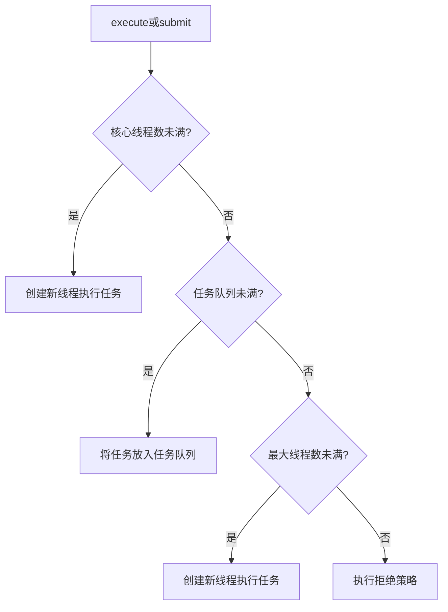
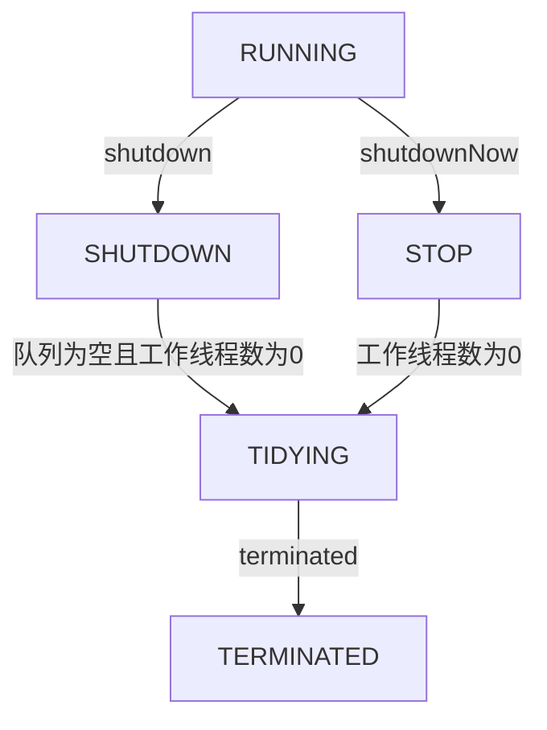

参考文献
- [https://javabetter.cn/sidebar/sanfene/javathread.html](https://javabetter.cn/sidebar/sanfene/javathread.html)
- [https://javaguide.cn/java/concurrent/java-concurrent-questions-01.html](https://javaguide.cn/java/concurrent/java-concurrent-questions-01.html)
- [https://tech.meituan.com/2020/04/02/java-pooling-pratice-in-meituan.html
](https://tech.meituan.com/2020/04/02/java-pooling-pratice-in-meituan.html
)


并行与并发的区别在于，并行是同时执行多个任务的能力，并发是程序交替执行多个任务的能力。

在单核CPU上的多线程程序与js在浏览器中的异步操作为并发但不并行的操作，多核CPU上的Web服务器与分布式系统上的微服务即为既并发又并行的场景。



异步和并发的区别在于，异步在意“等待”，允许任务在等待时不阻碍主线程；并发在乎“同时发生”，指多个任务在重叠的时间段内开始、运行和完成，但不一定在同一瞬间内完成。

异步和同步的区别在于，在发出调用后，异步返回结果前返回调用，而同步在没有得到结果前一直不反回调用。


## 概述

JDK 1.2 之前，Java 线程就是用户线程。JDK 1.2 后，一个 Java 线程直接映射到一个操作系统线程。当我们创建了一个 Thread 对象并调用 start() 方法时，JVM 会通过操作系统 API 请求内核创建一个对应的原生操作系统线程。Java 线程的调度完全委托给操作系统的调度器，以期实现真正的并行域提升性能。因此，在现代 Java 中，Java 线程就是通过 JVM 这个用户程序来管理的，但最终执行体是内核线程。

Java 的线程和普通线程一样，[也需要存储一些私有数据](https://ivanclf.github.io/2025/05/14/os/#Implementation-of-Processes)，程序计数器用于线程切换后能恢复到正确是执行位置，虚拟机栈用于存储局部变量表和常量池引用等信息，本地方法栈用于存储虚拟机使用到的 native 方法。

## 创建

线程的创建有三种方式。

第一种是重写父类Thread的`run()`方法，并且调用`start()`方法启动线程。

```java
class ThreadTask extends Thread {
    public void run() {
        // ...
    }

    public static void main(String[] args) {
        ThreadTask task = new ThreadTask();
        task.start();
    }
}
```

该方法的缺点是如果类已经继承了另外一个类，就不能再继承`Thread`类了。

第二种是实现`Runnable`接口的`run()`方法。并将实现类的对象作为参数传递给`Thread`对象的构造方法，最后调用`start()`方法启动线程。

```java
class RunnableTask implements Runnable {
    public void run() {
        // ...
    }

    public static void main(String[] args) {
        RunnableTask task = new RunnableTask();
        Thread thread = new Thread(task);
        thread.start();
    }
}
```

第三种需要重写`Callable`接口的`call()`方法，然后创建`FutureTask`对象，参数为`Callable`实现类的对象，紧接着创建`Thread`对象，参数为`FutureTask`对象，然后调用`start()`方法启动线程。

```java
class CallableTask implements Callable<String> {
    public String call() {
        // ...
    }

    public static void main(String[] args) throws ExecutionException, InterruptedException {
        CallableTask task = new CallableTask();
        FutureTask<String> futureTask = new FutureTask<>(task);
        Thread thread = new Thread(futureTask);
        thread.start();
        System.out.println(futureTask.get());
    }
}
```

该方法能获取线程的执行结果。

创建线程的时候，至少需要分配一个虚拟机线，在64位操作系统中，默认大小为1M，因此一个线程大约需要1M内存。当然，由于JVM、操作系统本身运行也需要内存，因此只给这么大的内存卡跑到理论值肯定是不够的。


Runnable 和 Callable 的区别如下
|特性|Runnable|Callable|
|-|-|-|
|包路径|`java.lang.Runnable`|`java.util.concurrent.Callable`|
|方法签名|`void.run()`|`V call() throw Exception`|
|返回值|`void`|泛型 `V`|
|异常处理|不能抛出异常|可以抛出受检异常|
|适用场景|简单的异步任务|需要返回结果或处理异常的任务|

Runnable 在 Java 1.0 以来一直存在，但 Callable 在 Java 1.5 后才引入，就是为了处理 Runnable 不支持的用例。工具类 Executors 可以实现将 Runnable 对象转换成 Callable 对象（`Executors.callable(Runnable task)` 或 `Executors.callable(Runnable task, Object result)`）



调用`start()`的时候会执行`run()`方法，那为什么不直接调用`run()`方法？因为`start()`方法是启动一个新的线程，然后让这个线程去执行`run()`方法。而`run()`方法本身只是在当前线程中调用的一个普通方法。
调用`start()`后，线程进入就绪状态，等待操作系统调度；一旦调度执行，线程会执行其`run()`方法中的代码。

如果直接执行 `run()` 方法，就不会以多线程的方式去执行了。


## 调度

### 指令

<table>
    <thead><tr><td>类别</td><td>方法</td><td>说明</td></tr></thead>
    <tbody>
        <tr><td rowspan="2">线程状态控制方法</td><td>start()</td><td>启动线程，使其进入就绪状态，等待CPU调度</td></tr>
        <tr><td>run()</td><td>线程执行体，定义线程要执行的任务逻辑</td></tr>
        <tr><td>线程休眠</td><td>sleep()</td><td>线程休眠，参数填毫秒级时间</td></tr>
        <tr><td rowspan="2">线程等待</td><td>wait()</td><td>必须在synchronized块中使用，<br>让当前线程进入WAITING或TIMED_WAITING状态，<br>需要被notify()或notifyAll()唤醒，<br>参数可指定毫秒级最长等待时间</td></tr>
        <tr><td>join()</td><td>让当前线程等待目标线程执行完毕，<br>参数可指定毫秒级等待时间</td></tr>
        <tr><td rowspan="2">线程唤醒</td><td>notify()</td><td>唤醒单个等待线程</td></tr>
        <tr><td>notifyAll()</td><td>唤醒所有等待线程</td></tr>
        <tr><td rowspan="4">线程让步与中断</td><td>yield()</td><td>线程让步，提示可让出CPU（但不保证立刻让出，<br>线程从RUNNING回到RUNNABLE状态</td></tr>
        <tr><td>interrupt()</td><td>中断线程</td></tr>
        <tr><td>isInterrupted()</td><td>检查中断状态</td></tr>
        <tr><td>interrupted()</td><td>检查并清除中断状态</td></tr>
        <tr><td rowspan="2">线程优先级</td><td>setPriority()</td><td>设置线程优先级，参数从1到10，<br>优先级只是建议，不保证执行顺序</td></tr>
        <tr><td>getPriority()</td><td>获取线程优先级</td></tr>
        <tr><td rowspan="2">守护线程</td><td>setDaemon()</td><td>设置守护线程，<br>当所有非守护线程结束时，JVM会自动退出，不管守护线程是否执行完毕，<br>参数为布尔值</td></tr>
        <tr><td>isDaemon()</td><td>检查是否为守护线程</td></tr>
    </tbody>
</table>


当线程A调用共享对象的`wait()`方法时，线程A会被挂起，直到
- 线程B调用了共享对象的`notify()`方法或者`notifyAll()`方法；
- 其他线程调用线程A的 `interrupt()` 方法，导致线程A抛出 `InterruptedException` 异常。

`notify()`唤醒哪个正在`wait()`的线程是随机的。

由于 `wait()` 是让线程自动释放对象锁的，而每个对象都拥有对象锁，因此该方法自然是要操作对应的对象来执行，而非当前的线程，因此该方法不定义在 Thread 中。

但是，`sleep()` 方法并没有释放锁，只是用于暂停执行。



`interrupt()`方法能中断线程，但它只是改变中断状态，不会中断一个正在运行的线程，需要线程自行处理中断标志。若中断一个已经中断或正在等待的线程，就会抛异常。



守护线程的作用大多是为其他线程提供服务。


### 状态

和[OS课](https://ivanclf.github.io/2025/05/14/os/)上的不大一样，Java中管理线程有6种状态


- NEW 为初始状态，线程被创建出来但还没有 `start()`
- RUNNABLE 为运行状态，线程被调用了 `start()` 等待运行的状态
    在操作系统层面，线程有 READY 和 RUNNING 状态，但在 JVM 层面，只能看到 RUNNABLE 状态
- BLOCKED 为阻塞状态，需要等待锁释放
- WAITING 为等待状态，表示该线程需要等待其他线程做出一些特定动作
- TIME_WAITING 状态，表示该线程可以在指定时间后自行返回
- TERMINATED 终止状态，表示该线程已经执行完毕

### 上下文切换

**上下文**是指线程在执行过程中自己的运行条件和状态，比如程序计数器，栈信息等。当线程从占用 CPU 状态退出时（终止运行除外），OS 需要保存当前线程的上下文以留待下次使用，并加载下一个将要占用的 CPU 线程上下文。这就是所谓的上下文切换。


## 通信

上文中提到的`wait()`和`notify()`之间的互动就是一种线程通信方式。除此之外，还有许多种通信方式。

- 阻塞队列
    这是最常用的通信方式（毕竟用上消息队列就得上redis或者rabbit MQ了）。可以简单实现生产者消费者模式，也不用死记那两个锁的作用了。
    常用的示例有`ArrayBlockingQueue`、`LinkedBlockingQueue`、`PriorityBlockingQueue`等。
    ```java
    BlockingQueue<String> queue = new ArrayBlockingQueue<>(10);

    new Thread(() -> {
        try {
            String data = "message";
            queue.put(data);
        } catch (InterruptedException e) {
            Thread.currentThread().interrupt();
        }
    }).start();

    new Thread(() -> {
        try {
            String data = queue.take();
            System.out.println("收到: " + data);
        } catch (InterruptedException e) {
            Thread.currentThread().interrupt();
        }
    }).start();
    ```

- 信号量
    依旧是经典的信号量和PV操作。控制并发访问资源的线程数量。
    ```java
    Semaphore semaphore = new Semaphore(5); // 最大5个许可

    for (int i = 0; i < 10; i++) {
        new Thread(() -> {
            try {
                semaphore.acquire(); // 获取许可
                // 使用数据库连接
                System.out.println(Thread.currentThread().getName() + " 使用连接");
                Thread.sleep(2000);
            } catch (InterruptedException e) {
                Thread.currentThread().interrupt();
            } finally {
                semaphore.release(); // 释放许可
            }
        }).start();
    }
    ```

    `Semaphore` 可以用于流量控制，比如数据库连接池、网络连接池等。假如有这样一个需求，要读取几万个文件的数据，因为都是 IO 密集型任务，我们可以启动几十个线程并发地读取。但是在读到内存后，需要存储到数据库，而数据库连接数是有限的，比如说只有 10 个，那我们就必须控制线程的数量，保证同时只有 10 个线程在使用数据库连接。这个时候，就可以使用 `Semaphore` 来做流量控制。

- Exchanger 交换器
    两个线程在同步点交换数据。一个线程调用`exchange()`方法时会阻塞，直到另一个线程也调用`exchange()`方法，然后两个线程交换数据后继续执行。
    ```java
    Exchanger<String> exchanger = new Exchanger<>();

    new Thread(() -> {
        try {
            String data = "来自线程1的数据";
            String response = exchanger.exchange(data);
            System.out.println("线程1收到: " + response);
        } catch (InterruptedException e) {
            Thread.currentThread().interrupt();
        }
    }).start();

    new Thread(() -> {
        try {
            String data = "来自线程2的数据";
            String response = exchanger.exchange(data);
            System.out.println("线程2收到: " + response);
        } catch (InterruptedException e) {
            Thread.currentThread().interrupt();
        }
    }).start();
    ```

    `Exchanger` 可以用于遗传算法，也可以用于校对工作，比如我们将纸制银行流水通过人工的方式录入到电子银行时，为了避免错误，可以录入两遍，然后通过 `Exchanger` 来校对两次录入的结果。


多个线程可以通过`volatile`关键字和`synchronized`关键字来实现通信。`volatile`关键字确保变量的可见性，`synchronized`关键字确保线程之间的互斥访问。

`volatile`可以用于修饰成员变量，告知程序任何对该变量的访问均需要从共享内存中获取最新值，而不是从线程的本地缓存中获取。

`synchronized`关键字可以用于修饰方法或代码块，确保同一时刻只有一个线程可以访问被修饰的代码，从而避免数据竞争和不一致的问题。



`CompletableFuture`类提供了一种更简洁和强大的方式来处理异步编程和线程间通信。它允许线程在完成计算后将结果传递给其他线程，并支持链式调用和组合多个异步任务。

```java
CompletableFuture.supplyAsync(() -> {
    try {
        Thread.sleep(1000);
    } catch (InterruptedException e) {
        Thread.currentThread().interrupt();
    }
    return "Hello";
}).thenApply(result -> {
    return result + " World";
}).thenAccept(finalResult -> {
    System.out.println(finalResult);
});
```


## 保证线程安全

Java中提供了许多方法来保证线程安全。

- 可以在代码块或方法上使用`synchronized`关键字。
- 使用`ReentrantLock`类来显式地加锁和解锁，这种锁还支持并发重入。
- 保证变量的可见性，可以使用`volatile`关键字修饰变量。
- 使用`Atomic`类（如`AtomicInteger`、`AtomicLong`等）
- 对于线程独立的数据，可以使用`ThreadLocal`类来存储和访问这些数据。
- 对于需要并发容器的地方，可以使用`ConcurrentHashMap`、`CopyOnWriteArrayList`等线程安全的集合类。


一个`int`的变量为0，10个线程轮流对它进行`++`操作，循环一万次，结果会小于十万。原因是多线程环境下，`++`操作不是原子操作，可能会出现多个线程同时读取和写入变量的情况，导致数据丢失。
一般的`++`操作可以分解为三个步骤：
1. 读取变量的当前值
2. 对值进行加1操作
3. 将新的值写回变量
在多个线程并发进行`++`操作时，可能会出现以下情况：
- 线程A读取变量的值为0
- 线程B读取变量的值也为0
- 线程A对值进行加1操作，得到1
- 线程B对值进行加1操作，得到1
- 线程A将1写回变量
- 线程B将1写回变量
最终变量的值为1，而不是预期的2。因此最后需要通过某种方式保证`++`操作的原子性，比如使用`synchronized`关键字、`ReentrantLock`类或者`AtomicInteger`类。




spring 中的 bean 注入需要实现[单例](https://ivanclf.github.io/2025/10/29/spring/#%E4%BD%9C%E7%94%A8%E5%9F%9F)

如果多个线程同时尝试创建实例，单例类必须确保只创建一个，并提供一个全局访问点。在多种实现单例类的方式中，饿汉式是一种比较直接的实现方式。

```java
public class Singleton {
    private static final Singleton instance = new Singleton();

    private Singleton() {}

    public static Singleton getInstance() {
        return instance;
    }
}
```

饿汉式单例则在第一次使用时初始化单例对象，这种方式需要使用双重检查锁定来确保线程安全。

```java
public class Singleton {
    private static volatile Singleton instance;

    private Singleton() {}

    public static Singleton getInstance() {
        if (instance == null) {
            synchronized (Singleton.class) {
                if (instance == null) {
                    instance = new Singleton();
                }
            }
        }
        return instance;
    }
}
```


## `ThreadLocal`

`ThreadLocal` 提供线程本地存储机制，为每个线程创建变量的独立副本，从而避免多线程环境下的数据竞争问题。

对 `ThreadLocal` 的操作有4种方法：
1. `set(T value)`：设置当前线程的局部变量值。
2. `get()`：获取当前线程的局部变量值。
3. `remove()`：移除当前线程的局部变量值。
4. `initialValue()`：提供初始值的方式，子类可以重写该方法。

应用场景
- 在 Web 应用中，存储用户的会话信息（即 Session）。
- 在数据库操作中，管理连接对象，确保每个线程使用独立的链接，避免冲突。

每个线程内部维护一个 `ThreadLocalMap`（`ThreadLocal` 的静态内部类），它以 `ThreadLocal` 对象为键、变量副本为值进行存储。该结构支持跨方法、跨类传递数据，无需显式参数传递。

`ThreadLocalMap` 是 `ThreadLocal` 类的一个内部类，它是一个哈希表，用于存储每个线程的 `ThreadLocal` 变量及其对应的值。`ThreadLocalMap` 的键是 `ThreadLocal` 对象，值是对应的变量值。键为[弱引用](https://ivanclf.github.io/2025/10/06/jvm/#%E5%AF%B9%E8%B1%A1%E5%BC%95%E7%94%A8)，用于防止 `ThreadLocal` 对象本身的内存泄漏。

`ThreadLocalMap` 的键（即 `ThreadLocal` 对象）为弱引用，值则为强引用。若不手动调用 `remove()` 方法，会导致键被回收后值仍滞留，引发内存泄漏。因此，使用后应及时清理。ThreadLocalMap 在执行 `set()/get()` 时会清理键为 null 的条目，但主动调用 `remove()` 是最可靠的预防手段。当 `ThreadLocal` 不再被强引用，并且由于线程持续存活从而导致 `ThreadLocalMap` 持续存在时，会发生内存泄漏。

**其他**
- `ThreadLocalMap` 使用数组结构，通过线性探测法解决哈希冲突。
- 扩容前会先清理无效条目，当填充率达 2/3 时进行扩容（容量翻倍并重哈希）。
- 默认情况下，子线程无法继承父线程的 `ThreadLocal`，需使用 `InheritableThreadLocal` 实现继承，其原理是在创建子线程时拷贝父线程的 `InheritableThreadLocalMap`。

## 线程池

### 基本信息

线程池是用来管理和复用线程的工具，可以提高系统的性能和资源利用率。Java 中线程池的核心实现为 `ThreadPoolExecutor`，并提供了 `Executor` 框架来简化线程池的创建和管理（但不推荐使用）。

在创建线程时可以显式指定线程组
```java
public Thread(ThreadGroup group, Runnable target);
public Thread(ThreadGroup group, String name);
public Thread(ThreadGroup group, Runnable target, String name);
```

**工作流程**
1. 线程池通过 `submit()` 或 `execute()` 方法接收任务。
2. 线程池首先检查核心线程数是否已满，若未满则创建新线程执行任务。
3. 若核心线程数已满，则将任务放入任务队列中。
4. 若任务队列已满且线程数未达最大值，则创建新线程执行任务。
5. 若任务队列已满且线程数已达最大值，则根据拒绝策略处理任务。
6. 线程执行完任务后，若线程数超过核心线程数且空闲时间超过 `keepAliveTime`，则终止该线程



**核心参数**
- `corePoolSize`：核心线程数，线程池中始终保持的线程数量。
- `maximumPoolSize`：最大线程数，线程池中允许的最大线程数量。
- `workQueue`：任务队列，用于存储等待执行的任务。
    以上三个参数最重要，基本决定了线程池对于任务的处理策略。
- `keepAliveTime`：线程空闲时间，超过该时间的非核心线程将被终止。
- `unit`：时间单位，`keepAliveTime` 的时间单位。
- `threadFactory`：线程工厂，用于创建新线程。
- `handler`：拒绝策略，当任务无法执行时的处理方式。

**提交任务**
- `execute()` 用于提交不需要返回值的任务。当任务执行过程中抛出异常时，会导致执行该任务的线程中止，但线程池会创建一个新的工作线程来替代它，确保线程池的正常运行。
- `submit()` 用于提交需要返回值的任务，返回一个 `Future` 对象。当任务执行过程中发生异常时，异常会被封装在 `Future` 对象中，不会立即抛出。只有在调用 `Future.get()` 方法时，才会抛出执行时遇到的异常。

因此，使用 `submit()` 方法时，务必通过 `Future.get()` 来获取执行结果或捕获可能发生的异常，否则任务中的异常可能会被忽略。


Future 类用于异步计算。其主要实现了以下4种功能
- `boolean cancel()` 取消任务
- `boolean isCancelled()` 查看是否已取消任务
- `boolean isDone()` 查看是否已经执行完成
- `V get(long timeout, TimeUnit unit)` 获取任务执行结果，超时未完成则抛出异常

然而，Future 类在实际使用过程中也存在一些局限，比如不支持异步任务的编排组合，获取结果的 `get()` 方法为阻塞调用等。因此在 Java 8 中引入了 `CompletableFuture` 类，提供了函数式编程和异步编排组合等功能。

若一个任务需要等待多个任务执行之后执行，这种需求就很适合通过 `CompletableFuture` 实现。

```java
// T1
CompletableFuture<Void> futureT1 = CompletableFuture.runAsync(() -> {
    System.out.println("T1 is executing. Current time：" + DateUtil.now());
    // 模拟耗时操作
    ThreadUtil.sleep(1000);
});
// T2
CompletableFuture<Void> futureT2 = CompletableFuture.runAsync(() -> {
    System.out.println("T2 is executing. Current time：" + DateUtil.now());
    ThreadUtil.sleep(1000);
});

// 使用allOf()方法合并T1和T2的CompletableFuture，等待它们都完成
CompletableFuture<Void> bothCompleted = CompletableFuture.allOf(futureT1, futureT2);
// 当T1和T2都完成后，执行T3
bothCompleted.thenRunAsync(() -> System.out.println("T3 is executing after T1 and T2 have completed.Current time：" + DateUtil.now()));
// 等待所有任务完成，验证效果
ThreadUtil.sleep(3000);
```

使用该类时，可以使用 `whenComplete` 方法在任务完成时触发回调函数，比你高正确处理异常；使用 `exceptionally` 处理异常并重新抛出；使用 `handle` 方法处理正常的结果和异常，并返回一个新结果。

`CompletableFuture` 默认使用 ForkJoinPool 作为线程池。



**拒绝策略**
- `AbortPolicy`：默认策略，抛出 `RejectedExecutionException` 异常
- `CallerRunsPolicy`：调用者运行策略，任务由调用者线程执行

- `DiscardPolicy`：丢弃策略，直接丢弃任务，不抛出异常
- `DiscardOldestPolicy`：丢弃最旧任务策略，丢弃任务队列中最旧的任务，然后尝试执行当前任务


`CallerRunsPolicy` 适用于保证任何一个任务请求都要被执行的时候。但是，如果走到 `CallerRunsPolicy` 的任务是个非常耗时的任务，且处理提交任务的线程是主线程，可能会导致主线程阻塞，影响程序的正常进行，甚至导致线程池阻塞，最后堆到其他线程的任务越来越多，导致 OOM。

因此一般是把线程池外的任务存到 MQ 或阻塞队列中。此时需要实现 `RejectedExecutionHandler` 接口自定义拒绝策略。


**关闭方式**
- `shutdown()`：等待所有任务执行完毕后关闭
- `shutdownNow()`：立即关闭，尝试中断所有正在执行的任务，并忽略队列中未执行的任务


线程数安排多少个比较合适呢？一般需要分析线程池执行的任务类型是CPU密集型还是IO密集型。
- CPU 密集型：线程数 ≈ CPU核心数 + 1
    目标是最小化线程上下文切换，+1 作为备用线程处理可能的阻塞

- IO 密集型：线程数 ≈ CPU核心数 × 2～3
    因线程经常在IO操作时阻塞，可配置更多线程提高CPU利用率

实际配置需结合业务场景：CPU使用率低可能需增加线程数，CPU使用率高但吞吐量低可能需减少线程数。


### 常见的线程池

常见的线程池有4种
- `FixedThreadPool`：固定大小线程池，适用于任务量较大且任务执行时间较长的场景。如IO密集型任务、数据库连接池等。
    其线程池大小是固定的，默认使用 `LinkedBlockingQueue` 作为任务队列。其缺点是任务队列默认无界，可能会导致内存溢出（或者说会导致 `OOM`）。
- `CachedThreadPool`：可缓存线程池，适用于任务量较大且任务执行时间较短的场景。如短时间内大量的文件处理或网络请求等。
    其线程池大小不固定。空闲线程超过60秒会被终止，默认使用 `SynchronousQueue` 作为任务队列。其优点是线程池可以根据任务量动态调整大小，缺点是线程数没有上限，可能会创建大量线程，导致系统资源耗尽。
- `SingleThreadExecutor`：单线程线程池，适用于需要顺序执行任务的场景。如日志处理、定时任务等。
    线程池只有一个线程，保证任务按顺序执行，默认使用 `LinkedBlockingQueue` 作为任务队列。其缺点是单线程可能成为性能瓶颈。
- `ScheduledThreadPool`：定时任务线程池，适用于需要定时或周期性执行任务的场景。如定时数据备份、定时清理缓存等。
    线程池大小可配置，支持定时或周期性任务执行。默认使用 `DelayedWorkQueue` 作为任务队列。其优点是支持定时和周期性任务，缺点是线程数没有上限，可能会创建大量线程，导致系统资源耗尽。

这些线程池的默认拒绝策略均为 `AbortPolicy`。

### 状态管理

线程池的异常处理常见有四种方式
1. 最简单的，`try-catch`处理。
2. 使用`Future`对象的`get()`方法获取异常。
    建议使用`submit()`的项目使用这种方式。
3. 自定义线程池，重写`afterExecute()`方法处理异常。
    建议想要全局处理异常的项目使用这种方式。
4. 使用`UncaughtExceptionHandler`处理未捕获异常。
    建议使用`execute()`的项目使用这种方式。

线程池有5种状态，并且它们之间严格按照状态流转规则流转。



`RUNNING` 状态的线程池可以接收新任务，并处理阻塞队列中的任务；`SHUTDOWN` 状态的线程池不会接收新任务，但会处理阻塞队列中的任务；`STOP` 状态的线程池不会接收新任务，也不会处理阻塞队列中的任务，并且会尝试中断正在执行的任务；`TIDYING` 状态表示所有任务已经终止；`TERMINATED` 状态表示线程池完全关闭，所有线程销毁。

使用线程池提供的`setter()`方法就可以修改线程池的参数。

需要注意的是，调用 `setCorePoolSize()` 时如果新的核心线程数比原来的大，线程池会创建新的线程；如果更小，线程池不会立即销毁多余的线程，除非有空闲线程超过 `keepAliveTime`。
当然了，还可以利用 `Nacos` 配置中心，或者实现自定义的线程池，监听参数变化去动态调整参数。

### 应用

线程资源必须通过线程池提供，不应该在应用中自行显式创建线程。并且，线程池不应该使用 `Executor` 创建，更应该通过 `ThreadPoolExecutor` 构造函数的方式构建。因为使用 `Executor` 创建的四种线程池都有或多或少的问题。

`ThreadPoolExecutor` 默认不会回收核心线程。要是实在需要回收核心线程，可以考虑将 `allowCoreThreadTimeout(boolean value)` 设置为 true，这样就会回收空闲的核心线程了，其时间间隔由 `keepAliveTime` 指定。

核心线程在空闲时，会处于 WAITING 状态，当队列中有可用任务时，会唤醒被阻塞的线程，线程的状态会由 WAITING 状态变为 RUNNABLE 状态，之后去执行对应的任务。

要设计一个根据任务的优先级来执行的线程池，可以考虑使用 `PriorityBlockingQueue` 作为任务队列。当然，使用优先队列实现对任务的排序，传入其中的任务必须是具备排序能力的，因此需要提交到线程池的任务实现 `Comparable` 接口或 `Comparator` 接口。并且为了避免 OOM 问题，最好重写一下 `offer` 方法的逻辑，在元素数量超过指定值时返回 false。

**线程池调优**
- 根据任务类型设置核心线程数参数。
- 结合线程池动态调整的能力，在流量波动时通过 `setCorePoolSize` 平滑扩容，或者直接使用 `DynamicTp` 实现线程池参数的自动化调整。
- 通过内置的监控指标建立容量预警机制。比如通过 JMX 监控线程池的运行状态，设置阈值，当线程池的任务队列长度超过阈值时，触发告警。
