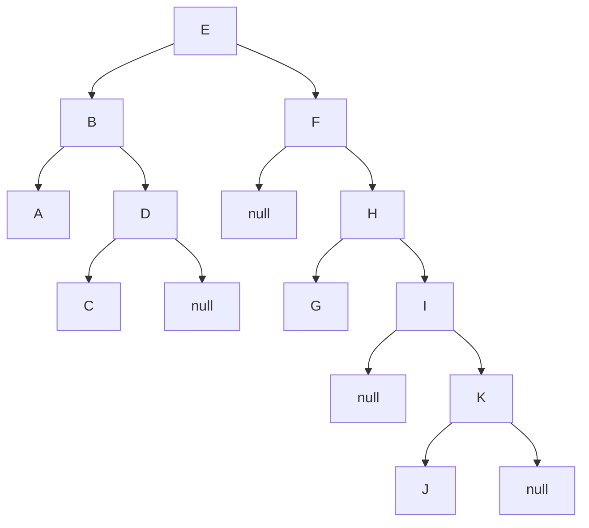

## 频度

```c
k=0;
for(i=1;i<=n;i++) {
    for(j=i; j<=n; j++)
        @  k++;
}
```

`@`语句的频度为

$$
\sum^n_{i=1}i=\frac{n(n+1)}{2}
$$

## 链表

### 链表的初始化

链表的最基础初始化，可以使用C语言的结构体

```c
typedef struct Node {
    int value;
    struct Node *next;
}node, *list_node;
```

也可以使用C++种对象的定义

```cpp
class node {
public:
    int value;
    node *next;

    void function() {

    }
};
```

### 链表节点的插入

#### 尾插法

在末尾插入新节点，返回最后节点的指针
C语言

```c
list_node insert_to_foot(list_node operation, int value) {
    if(!operation) {
        printf("List Error!\n");
        exit(-1);
    }
    list_node to_node;
    to_node->value = value;
    operation->next = to_node;
    return to_node;
}
```

#### 头插法

在头部插入新节点，返回新的头节点
C语言

```c
list_node insert_to_head(list_node operation, int value) {
    if(!operation) {
        printf("list Error!\n");
        exit(-1);
    }
    list_node to_node;
    to_node->value = value;
    to_node->next = operation;
    return to_node;
}
```

### 链表节点的删除

当不存在头部节点时，对节点的删除操作较为复杂。首先，我们需要找到头节点，然后开始向下遍历，搜索到需要的节点

- 若头节点就是待删除的节点，则头节点指针下移，删除头节点。
- 若尾节点就是待删除的节点，则删除尾节点，前一节点的next指针赋空值。
- 其余的一般情况下，找到待删除节点的前一节点，让其指向待删除节点的下一节点，再删除指定节点。

存在头部节点时，可以省略对第一种情况的讨论。

### 链表相关功能

#### 求尺寸或搜索

求尺寸需要从头节点开始遍历，而遍历可以通过迭代或递归实现
迭代

```c
int size(list_node head) {
    int i;
    for(i = 1; head != NULL; head = head->next, ++i);
    return i;
}
```

递归

```c
int size(list_node head) {
    if(head->next == NULL)
        return 1;
    else
        return 1 + size(head->next);
}
```

当需要搜索时，需要再参加相关参数
迭代

```c
bool is_find(list_node head, int target) {
    for(; head != NULL; head = head->next)
        if(head->value = target)
            return true;
    return false;
}
```

递归

```c
bool is_find(list_node head, int target) {
    if(head->value == target)
        return true;
    if(head->next == NULL)
        return false;
    return is_find(head->next, target);
}
```

## 循环队列

假设将循环队列定义为：以域变量`rear`和`length`分别指示循环队列中队尾元素的位置和内含的元素个数，试给出此循环队列的队满条件，写出相应的入队列和出队列算法（出队列算法应返回队头元素）

设`num`为队列大小


队满条件可以设置为`(rear + length) % num = 0` 或 `rear->next == front`
队空条件可设置为`rear == front`


入队列算法，先检查队满与否，若不满，则在`rear`位置插入数据，`rear`和`length`都加一。

```c
int enqueue(int queue[], int rear, int length, int element) {
    // 队满检查
    if ((rear + length) % num== 0) {
        return -1;
    }
    queue[rear] = element;
    rear = (rear + 1) % num;
    length++;
    return 0;
}
```

出队列算法，先检查队空与否，若不空，则在`(rear - length + 1) % num`位置获取`front`，然后减少`length`的值，由于`rear`只指示队尾指针，因此不需要变化。

```c
int dequeue(int queue[], int rear, int length) {
    // 队空检查
    if (*length == 0) {
        return -1;
    }
    int front = (rear - length + 1) % num;
    int element = queue[front];
    length --;
    return element;
}
```


由于队首位置可以直接指定，因此不需要再赋0，当然赋0也可以。


## 模式匹配算法


kmp算法讲得比较好的一位[在这里](https://www.cnblogs.com/Higurashi-kagome/p/18013626)


现在指定字符串的数据结构为

```cpp
typedef struct String {
    char *str;
    int length;
    String(char *str, int length) : str(str), length(length) {}
} *string;

int next[length] = {0};
```

### 暴力匹配算法

赋初值后开始比较，若对应字符相等则i与j同时相加，指示串中下个位置，比较下一字符。否则指针i后退重新开始匹配，从主串的下一个字符开始比较。
如果是j > t->length导致的循环结束，那么就是找到了指定位置，可以进行输出。反之则是匹配不成功，返回-1；

```cpp
int brute_force(string s, string t, int pos) // s串为主串，t串为模式，pos为开始比较的位置
{
    int i = pos, j = 0;
    while (i <= s->length && j <= t->length)
    {
        if (s->str[i] == t->str[j])
            i++, j++;
        else
            i = i - j + 2, j = 1;
    }
    if (j > t->length)
        return i - t->length;
    else
        return -1;
}
```

### 临时数组next

以下举例说明，设模式串为**abaabcac**

- next[0]固定为0
- i = 1，a与b不等，next[1] = j = 0
- i = 2，a和a相等，j = 1，next[2] = 1
- i = 3，b与a不等，j = next[0] = 0，a与a相等，j = 1，next[3] = 1
- i = 4，b与b相等，j = 2，next[4] = 2
- 最后为[0, 0, 1, 1, 2, 0, 1, 0]

```cpp
void get_next(string t, int *next)
{
    for (int i = 0; i < 100; i++) // 包括了next[0] = 0
        next[i] = 0;
    int j = 0;
    for (int i = 1; i < t->length; i++)
    {
        while (j && t->str[i] != t->str[j])
            j = next[j - 1];
        if (t->str[i] == t->str[j])
            ++j;
        next[i] = j;
    }
}
```

### KMP

若匹配失败，则在next数组中寻找对应的回溯位置。

```cpp
int kmp(string s, string t, int pos)
{
    int i = pos, j = 0;
    get_next(t, next);
    while (i <= s->length && j <= t->length)
    {
        if (j == 0 || s->str[i] == t->str[j])
            ++i, ++j;
        else
            j = next[j];
    }
    if (j > t->length)
        return i - t->length;
    else
        return 0;
}
```

## 稀疏矩阵压缩

设有上三角矩阵`A[n][n]`，将其上三角元素逐行存于数组`B[m]`中，使得`B[k] = A[i][j]`, `k = f1(i)+f2(j)+c`，试推导出函数f1，f2和常数c。

对上三角矩阵，设`i<=j`有

$$k=\underbrace{n + (n-1) + (n+2)+…+(n-i+2)}{前i-1行}+\underbrace{(j-i+2)}{第i行}\ =\frac{n-(i-1)}{2}i+j-n\ 故f_1(i) = \frac{n-(i-1)}{2},\ f_2(j)=j,\ c=-n$$

## 二叉树

### 二叉树的遍历

假设一棵二叉树的先序遍历序列为EBADCFHGIKJ，中序遍历序列为ABCDEFGHIJK，请画出该二叉树

可通过递归寻找。

- 先序遍历的第一个节点E一定是根节点，中序遍历从这个节点开始划分成{ABCD}{FGHIJK}两部分
- 以左划分为例，中序遍历对应的先序遍历序列为{BADC}，B为父节点，中序遍历划分为{A}{CD}两部分
- 如此递归，即可得到结果



- 前序遍历

```cpp
void pre(tree t) {
    if (!t)
        return;
    std::cout << t->value << " ";
    pre(t->left);
    pre(t->right);
}
```

- 中序遍历

```cpp
void in(tree t) {
    if (!t)
        return;
    in(t->left);
    std::cout << t->value << " ";
    in(t->right);
}
```

- 后序遍历

```cpp
void post(tree t) {
    if (!t)
        return;
    post(t->left);
    post(t->right);
    std::cout << t->value << " ";
}
```

- 层序遍历（BFS）

```cpp
std::vector<int> BFS(tree t)
{
    std::queue<tree> q;
    std::vector<int> v;
    if(t)
        q.push(t);
    while(!q.empty())
    {
        tree temp = q.front();
        v.push_back(temp->value);
        if(temp->left)
            q.push(temp->left);
        if(temp->right)
            q.push(temp->right);
        q.pop();
    }
    return v;
}
```

### 线索二叉树

其节点形式

|lchild|LTag|data|RTag|rchild|
|-|-|-|-|-|

其中，若`LTag/RTag`为0，则表示child域指示节点的孩子，若为1，则指示节点的前驱/后继。

## 查找

### 平均查找长度

$$\text{ASL}=\sum^n_{n=1}P_iC_i$$

$P_i$为查找表中第i个记录的概率(显然有$\sum^n_{i=1}{P_i}=1$)，$C_i$为找到第i个记录时进行比较的次数，可类比于数学期望。

顺序查找的 $\displaystyle\text{ASL}=\frac{1}{n}\sum^n_{i=1}i=\frac{i+1}{2}$

将顺序表进行排序后可以进行折半查找。

```cpp
int find(int *a, int length, int value) {
    int low = 0, high = length, mid;
    while(low <= high) {
        mid = (low + high) / 2;
        if(key == a[mid])
            return mid;
        else if (key < a[mid])
            high = mid - 1;
        else
            low = mid + 1;
    }
    return -1;
}
```

n很大时，$\displaystyle\text{ASL}=\log_2(n+1)-1$

### Huffman编码

### 哈希表处理冲突（顺序表）

探测公式 $H_i=(H(\text{key})+d_i)$
线性探测时 $d_i=1,2,\cdots,m-1$
伪随机探测时，$d_i$为指定的伪随机序列
进行查找时，通过不断计算下一个散列地址$H_i$查找数据。

## 排序

### 插入排序

按顺序取一个数，放到指定的位置上。时间复杂度为$O(n^2)$，是稳定排序，适合记录基本有序的情况。将插入与折半结合，为折半插入排序，仍然是稳定排序，适合初始记录无序的情况。

```cpp
for (int i = 1; i < length; ++i)
{
    if (array[i] > array[i - 1])
    {
        tmp = array[i];
        array[i] = array[i - 1];
        for (index = i - 1; tmp > array[index]; --index)
            array[index + 1] = array[index];
        array[index + 1] = tmp;
    }
}
```

### 希尔排序

将整个排序记录序列分成几组，从而减少直接插入排序的数据量。需要提前指定分组数量和分组次数。希尔排序不稳定，其最后一个增量必须为1，适合初始记录无序，n较大的情况。

```cpp
void ShellInsert(int *a, int length, int dk) // 对顺序表L进行一趟增量是dk的希尔插入排序
{
    int tmp;
    for (i = dk; i <= length; ++i)
        if (a[i] < a[i - dk].key) // 需将a[i]插入有序增量子表
        {
            tmp = a[i]; // 暂存在tmp中
            for (j = i - dk; j > 0 && tmp < a[j]; j -= dk)
                a[j + dk] = a[j]; // 记录后移，直到找到插入位置
            a[j + dk] = tmp;     // 将tmp即原a[i]，插入正确位置
        }
}
void ShellSort(int *a, int *dt, int t) // 按增量序列dt[0..t-1]对顺序表L进行t趟希尔排序
{
    for (k = 0; k < t; ++k)
        ShellInsert(a, length, dt[k]); // 一趟增量为dt[t]的希尔插入排序
}
```

### 冒泡排序

较为稳定，但n较大时不适宜使用。

### 快速排序

算法partition完成一趟快速排序，返回枢轴的位置。若待排序序列长度大于1（low < high），算法sort调用partition获取枢轴位置，然后递归执行，分别对分割所得的两个子表进行排序。

partition函数

```cpp
int partition(int array[], int low, int high)
{
    int tmp = array[low];
    while (low < high)
    {
        while (low < high && array[high] >= tmp)
            --high;
        array[low] = array[high];
        while (low < high && array[low] <= tmp)
            ++low;
        array[high] = array[low];
    }
    array[low] = tmp;
    return low;
}
```

sort函数

```cpp
void sort(int array[], int low, int high)
{
    if (low < high)
    {
        int tmp = partition(array, low, high);
        sort(array, low, tmp - 1);
        sort(array, tmp + 1, high);
    }
}
```

快速排序不稳定，当枢轴量每次都能平分数组时最快，适合初始记录无序的情况。平均状况下时间复杂度为$O(n\log n)$。

### 简单选择排序

与插入排序相反，从未排序的数组中选择一个合适的数放进去。理论上是稳定的，但稳定与否与交换的方法有关。其移动次数较少，可用于记录占用空间较多时的排序方式。

```cpp
for(int i = 0; i< length; ++i)
{
    index = i;
    for(int j = i; j < length; ++j)
        if(array[j] < array[index])
            index = j;
    tmp = array[index];
    array[index] = array[i];
    array[i] = tmp;
}
```

### 堆排序

序列$k_1,\cdots,k_n$在满足 $$k_i\geq k_{2i},\quad k_i\geq k_{2i+1}\quad 或\quad k_{i}\leq k_{2i},\quad k_i\leq k_{si+1}$$ 其中之一时，可以称为堆。

筛选法调整成堆

```cpp
void heap_adjust(int array[], int s, int m)
{   
    int temp = array[s];
    for(int j = 2 * s; j <= m; j *= 2)
    {
        if(j < m && array[j] < array[j + 1])
            ++j;
        if(temp >= array[j])
            break;
        array[s] = array[j];
        s = j;
    }
    array[s] = temp;
}
```

建初堆

```cpp
void create_heap(int array[])
{
    for(int i = length / 2; i >= 0; --i)
        heap_adjust(array, i, length);
}
```

在堆中进行排序

```cpp
void sort(int array[])
{
    create_heap(array);
    int temp;
    for(int i = length; i > 0; --i)
    {
        temp = array[0];
        array[0] = array[i];
        array[i] = temp;
        heap_adjust(array, 0, i - 1);
    }
}
```

是不稳定排序，时间复杂度接近于 $O(n\log n)$，记录较多时更有优势。

### 归并排序

通过递归进行排序，稳定排序。

## 图

### 图的遍历

以下是对邻接矩阵和邻接表的定义
邻接矩阵

```cpp
typedef struct Matrix_array
{
    bool array[maxnum][maxnum];
    bool visited[maxnum];
    int dot;
    int line;
} Matrix_array;
Matrix_array matrix_array;
```

邻接表

```cpp
typedef struct Node
{
    int belong;
    int weight;
    struct Node *next;
    Node(int belong, int weight, struct Node *next) : belong(belong), weight(weight), next(next) {}
} *node;

typedef struct Link
{
    node matrix_link[maxnum];
    int dot;
    int line;
    int visited[maxnum];
    Link()
    {
        for (int i = 0; i < maxnum; i++)
            matrix_link[i] = new Node(emp, emp, nullptr);
    }
    void insert(int last_node, int next_node, int weight)
    {
        node before = new Node(next_node, weight, matrix_link[last_node]->next);
        matrix_link[last_node]->next = before;
        node after = new Node(last_node, weight, matrix_link[next_node]->next);
        matrix_link[next_node]->next = after;
    }
} Link;
Link link;
```

在邻接数列中进行DFS遍历

```cpp
void DFS_in_array(int v)
{
    matrix_array.visited[v] = true;
    for (int w = 0; w < matrix_array.dot; w++)
    {
        if (matrix_array.array[v][w] && !matrix_array.visited[w])
        {
            q.push(w + 1);
            DFS_in_array(w);
        }
    }
}
```

在邻接表中进行DFS遍历

```cpp
void DFS_in_link(int v)
{
    link.visited[v] = true;
    int w;
    node p = link.matrix_link[v]->next;
    while (p)
    {
        w = p->belong;
        if (!link.visited[w])
        {
            q.push(w + 1);
            DFS_in_link(w);
        }
        p = p->next;
    }
}
```

在邻接数列中进行BFS遍历

```cpp
void BFS_in_array(int v)
{
    std::queue<int> temp;
    matrix_array.visited[v] = true;
    temp.push(v + 1);
    while (!temp.empty())
    {
        q.push(temp.front());
        temp.pop();
        for (int w = 0; w < matrix_array.dot; w++)
            if (matrix_array.array[v][w] && !matrix_array.visited[w])
            {
                temp.push(w + 1);
                BFS_in_array(w);
            }
    }
}
```

在邻接表中进行BFS遍历

```cpp
void BFS_in_link(int v)
{
    queue<int> temp;
    link.visited[v] = true;
    temp.push(v + 1);
    while (!temp.empty())
    {
        q.push(temp.front());
        temp.pop();
        for (node p = link.matrix_link[v]->next; p != nullptr; p = p->next)
            if (!link.visited[p->belong])
            {
                temp.push(p->belong + 1);
                link.visited[p->belong] = true;
            }
    }
}
```


若图中有不止一个连通分量，则需要另设一个大循环，在循环中不断检测未遍历到的分量继续遍历



克鲁斯卡尔算法更适合求稀疏网的最小生成树

