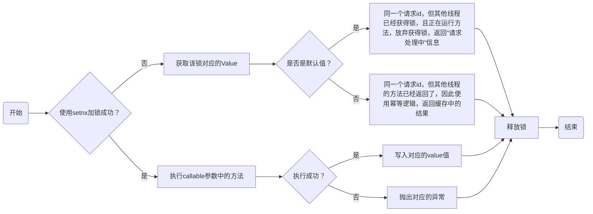
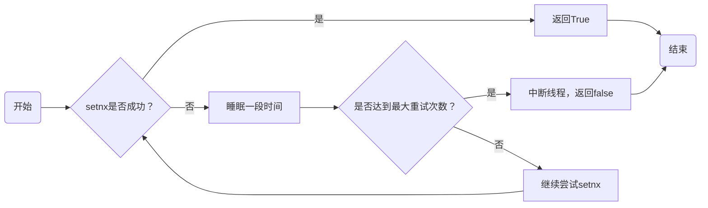

本文主要探讨如何在redis中添加分布式锁。

## 黑马点评中的相关内容

### 分布式锁

对于存在多个后端服务器的场景，就容易出现自己jvm中线程的锁无法顾及另一个jvm的情况，因此需要将一些锁放到redis中，称为分布式锁。在redis中，有命令`setnx`来方便地设置类似锁的键值对。我们可以通过在Spring中操作`setnx`操作来获取锁，通过操作的返回值判断获取成功与否。若获取成功后再释放锁，则通过`del`操作解决。当然，为了解决死锁或其他问题，可以在`setnx`后添加`ex`属性，设置超时时间expire time。但是，分布式锁可能会存在一些问题。

#### 误删锁

假设有这么个场景：线程A拿到了锁，然后阻塞了，且阻塞时间过长，线程A在开始执行前锁就已经释放了。线程B因此拿到了锁，但此时A停止阻塞，开始执行。这样，线程A和B就会同时在这个关键区工作了。

本不应该释放的锁却因为其他原因释放了，导致最后有两个线程在关键区域工作。因此，创建锁的时候要给这个锁创建一个标识（可以是UUID），释放锁的时候要先查看锁是不是自己创建的，若不是自己创建的则释放失败。

#### 原子性操作

线程1拿到了锁，在检查了这个锁是否是自己的后就被堵塞了。随后锁超时自然释放，线程2进来正常工作。线程1醒来，继续工作，将本来是线程2的锁释放了。此时线程3正常拿到锁。这样线程2和3就同时处于关键区内。

当判断锁的表示与释放锁不在同一个原子操作时，就可能出现上述情况。因此需要保证判断和释放锁的操作为一个原子操作。而这个只能通过操作lua脚本实现。


redis是用C语言写的，但也支持使用lua脚本语言执行批处理操作。在这个脚本中的操作redis保证实现原子性。


但是目前还存在四个问题

1. 同一个线程无法多次获取同一把锁
2. 目前获取锁只尝试一次就返回false，没有重试机制
3. 若任务执行时间较长，会导致锁提前超时释放
4. 在多集群redis中，主从的同步存在一定的延迟。当主机宕机时，可能锁会出现问题

### Redisson

[redisson官方网址](https://redisson.pro/)

redisson是一个基于redis的Java客户端，在redis基础上提供了许多Java中许多分布式服务的实现，如各种分布式锁（可重入锁、公平锁、红锁、读写锁等等）。

还可以直接利用redisson中的`RRateLimiter`来实现分布式限流。

#### Redisson可重入锁原理

在redis中存入哈希类型，其中的`field`存储线程的标识、`value`部分存储重入的次数。

加锁时，首先判断锁是否存在。若不存在，则获取锁并添加线程标示，设置过期时间并执行业务。
若存在，则判断锁表示是不是自己的，若不是自己的则获取失败。
是自己的，就将锁的计数加1，并重新设置锁的有效期，执行业务。

解锁时，首先判断锁是不是自己的。若不是自己的，就说明锁已经释放过了，不用管了。
若是自己的，则将锁的计数减1，最后判断计数是否为0。若不为0，则说明还要用，重置锁有效期，执行业务。
若为0，说明已经用好了资源，可以释放锁了。

#### 锁重试与WatchDog机制

注意：若写明了释放锁的时间，则不会触发看门狗机制。

在redisson的`trylock()`方法中，在参数中设置等待时间（与释放锁时间）。在该方法运行时，除了获取等待时间，还需要获取当前时间与线程ID。若释放锁时间没有指定，则设为30秒。获取相关参数后开始尝试获取锁。尝试获取锁的操作与上文一致，即只有锁存在且不是自己的时候获取失败。若成功则返回`nil`。若获取锁失败，则返回锁的剩余有效期。后面执行判断，若剩余有效期为`null`则表示执行成功，返回`true`；反之则需要重试。

重试时，先用当前时间减去获取锁前获得的当前时间，再用等待时间减去这个时间差，获取剩下的等待时间。剩余等待时间小于0则结束。大于0则再次获取当前时间。然后，使用`subscribe()`方法，“订阅”锁释放的消息，在有锁释放的时候再启动，或者在大于剩余等待时间时取消订阅并返回`false`。而在成功等到时，再次获取剩余等待时间，时间有剩余时尝试获取锁。

若依然获取锁失败，则查看当前剩余时间，再次准备获取锁。但这次与上次不同，此次使用了信号量`getLatch()`方法，并且对剩余等待时间进行判定。取其他锁的剩余有效期与剩余等待时间的较小值作获取锁的等待时间。等好了再看看时间，若剩余等待时间不够了就返回`false`，足够则再重复该段操作。

获取锁成功后，为了保证业务先于锁释放执行完，需要运行额外的机制。若抛异常则直接释放。获取锁成功时（即剩余有效期为`null`），执行过期时间更新的方法。

该方法先往map中放入一个键值对（若不存在），键大致为锁的名称，值为一个独特的Entry对象。使用一个Entry获取插入的数据，若锁原先存在则为`null`，若不存在则为全新的Entry，以保证每一个锁拿到的是自己的Entry。原先存在时，只需要往Entry中放入ThreadId即可，等价为重入；原先不存在的情况下，除了要往Entry中放入ThreadId，还要更新有效时间。

在更新操作中，先拿到Entry，然后设置一个定时任务，在释放时间参数的1/3（没有指定时为10s）后拿出Entry与线程ID，然后更新有效期，最后再调用自己，从而不断更新。老线程中由于一直在执行这个操作，就不用另行执行时间更新的方法了。

而释放锁时，从map中拿出Entry，然后销毁线程ID，取消任务，最后销毁Entry本身，锁成功释放。

总之，可以归纳为以下流程

**加锁流程：**
1. 调用tryLock()时，若指定释放时间则禁用看门狗，否则设为30秒
2. 尝试获取锁：锁不存在或为自己所有则成功，否则失败返回剩余有效期
3. 获取失败时进行重试：计算剩余等待时间，订阅锁释放消息，使用信号量等待
4. 成功后在map中创建/更新Entry对象管理锁状态
5. 未指定释放时间时启动看门狗：每10秒自动续期，防止业务未完成锁过期

**解锁流程：**
1. 从map中获取Entry，移除线程ID
2. 取消看门狗定时任务
3. 销毁Entry，释放锁资源


反反复复折腾有效期，为什么不直接不设置有效期呢？这个主要是防止服务器宕机时锁还没释放，导致服务器重启时发生各种问题。


#### 主从一致性

什么是redis主从呢？是设置多个redis节点，一个为主节点，其他的为从节点。主节点处理所有写操作，从节点处理所有读操作，主节点会不断把数据同步到从节点。若主节点宕机，则将一个从节点转化为主节点。但不同机子之间毕竟存在延迟，就可能存在不一致的问题。要是Java应用设置了锁，还没同步到从节点，主节点就宕机了，又应该如何解决呢？

redisson的解决方案比较暴力，就是将所有的redis节点都做读写，不做主从分别，主从设置在每一个节点直接做。换句话说，就是搞多个主从集群。Java应用设置锁则将所有节点加锁，反之亦然。这种多个锁的方法称为`multilock`（联锁）。

#### Redlock

红锁用于解决单个redis示例作为分布式锁时存在的单点故障问题。红锁会尝试依次向所有redis示例获取锁，并记录成功获取的锁的数量，当数量达到`minLockAmount`(默认为`locks.size()/2 + 1`)就认为获取成功。虽然红锁存在一些争议，比如说时钟漂移问题、网络分区导致的脑裂问题，但它仍然是一个相对成熟的分布式锁解决方案。在实际应用中，可以通过重试机制来提高锁的获取成功率。

## 幂等锁

在实际操作中我们可能并不需要如此复杂的操作，因为假设分布式锁超时时间为12小时，那么一个请求过来根本就不可能花这么多时间（大模型生成也不可能）。并且有时候只需要保证相同请求id或相同类型主键id（如活动id、工单id等）保持其幂等性即可。此时我们就不需要考虑这么多种情况，保证其幂等性即可。在某线上服务的实践中，其操作如下



该锁的优势在于非等待，且幂等。在保证不会出现上述因超时而产生问题的前提下，可以放心使用。

这种锁也有另一种形式



前者保证幂等，后者通过重试机制让该活动有乐观锁机制的重试机会。不通过发送消息队列的方式去解决的主要原因还是出于业务上的考量，放到消息队列中难免会有重试或死信队列的情况，与其设计大量机制保证最终事务性，不如直接同步在该请求中解决，要是成功就返回成功，要是失败就直接返回并发异常，从而保证用户看到的和实际请求到的完全一致。

其函数声明为

```java
public <T> T idempotentLock(String key, Callable<T> callable, Supplier<T> supplier) throw Exception {}
```

其中key为存入 setnx  中 的 key，而 callable 用于执行拿到锁后的操作，supplier 用于执行拿不到锁时的兜底操作。


callable 可以返回结果，也可以抛出异常，因此用于复杂操作中的返回结果和异常情况。但 supplier 只有结果没有异常，因此只适合用于兜底，比如包装一个错误体响应之类。
