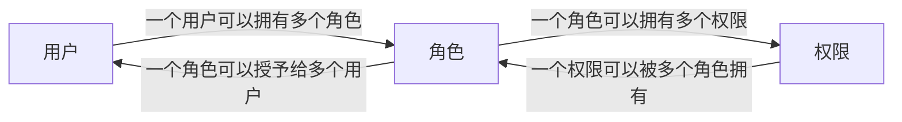

参考文献
- [https://javaguide.cn/system-design/security/basis-of-authority-certification.html](https://javaguide.cn/system-design/security/basis-of-authority-certification.html)
- [https://javaguide.cn/cs-basics/network/other-network-questions.html](https://javaguide.cn/cs-basics/network/other-network-questions.html)
- [https://tech.meituan.com/2018/10/11/fe-security-csrf.html](https://tech.meituan.com/2018/10/11/fe-security-csrf.html)
- [https://javaguide.cn/system-design/security/jwt-intro.html](https://javaguide.cn/system-design/security/jwt-intro.html)

## HTTP

打开一个网页，整个过程会用到什么协议？在打开一个网页时，需要经过以下步骤
1. 在浏览器输入指定网页的 URL
2. 浏览器通过 **DNS** 协议，获取域名对应的 IP 地址
3. 浏览器根据 IP 地址和端口号，向目标服务器发起一个 **TCP**链接请求
4. 浏览器在 TCP 链接上向服务器发送一个 HTTP 请求报文，请求获取网页的内容
5. 服务器收到 HTTP 请求报文后，处理请求，并返回 HTML 响应报文给浏览器
6. 浏览器收到 HTTP 响应报文后，解析响应体中的 HTML 代码，渲染网页的结构和样式。同时根据 HTML 中的其他内容的 URL （如 CSS 或 JS 文件），再次发起 HTTP 请求，直到网页完全加载
7. 浏览器在不需要和服务器通信时，可以主动关闭 TCP 链接

#### HTTP header

##### User-Agent

请求头。UA 提供了关于访问网站的设备、操作系统和浏览器的详细信息。现在以 `Mozilla/5.0 (Windows NT 10.0; Win64; x64) AppleWebKit/537.36 (KHTML, like Gecko) Chrome/142.0.0.0 Safari/537.36 Edg/142.0.0.0` 为例，说明包含的信息
- `Windows NT 10.0; Win64; x64` 表示操作系统是 Windows 10 或 Windows 11，是 64 位的，处理器架构是 x86-64
- `AppleWebKit/537.36 (KHTML, like Gecko)` WebKit 是一个开源的网页渲染引擎，后面是版本号。这表示浏览器使用的是基于 Chromium 的渲染引擎 （Blink，WebKit 的一个分支）。保持这个名字是为了保持兼容性
- `Chrome/142.0.0.0` `Safari/537.36` `Edg/142.0.0.0` 浏览器版本

##### Cookie

Cookie 是一些数据，用于存储 web 页面的用户信息。当 web 链接关闭后，服务端不会记录用户信息。而 Cookie 可以将相关信息存储在电脑上的文本文件中。

可以使用 JS 相关方法创建 cookie，并且设置过期时间等属性。cookie 的字符串通常表示简单的键值对信息。


cookie 和 session 有什么区别呢？简单来说，cookie 只存钥匙，而 session 存储数据。web 服务通常通过 cookie 来查找对应用户的 session。

|特性|cookie|session|
|-|-|-|
|存储位置|客户端，用户的浏览器|服务端，服务器的内存、文件、数据库等|
|存储内容|通常是简单的键值对字符串|可以是任何数据结构|
|安全性|较低，容易被查看、篡改过窃取|较高，客户端只能拿到一个 id|
|生命周期|可以设置长期有效|通常有效时间较短，如在用户关闭浏览器后失效|
|存储容量|小，每个 cookie 约 4k，每个域名下有限制|大，受服务器资源限制|
|性能影响|不直接影响，但可能会增加带宽|占服务器内存|
|依赖关系|可以不依赖 session 独立使用|通常依赖于 cookie 来传递 session id|



##### Accept

请求头。能够接受的信息
- Accept
    能够接受的内容（对应响应头显示的内容 `Content-Type`），按照 MIME 格式
- Accept-Charset
    能够接受的字符集
- Accept-Encoding
    能够接受的编码方式列表
- Accept-Language
    能够接受回应内容的语言列表

    如 `Accept-Language: zh,en-US;q=0.9,en;q=0.8,zh-CN;q=0.7,ja;q=0.6,en-GB;q=0.5`，表示接受中文（最高优先级），美式英语次之（0.9），通用英语为 0.8，简体中文为 0.7，日语为 0.6，英式英语为 0.5

##### Cache-Control

指定这次请求/响应链中的所有缓存机制

##### If 类

以下的请求头允许客户端在发起请求时设置前提条件，服务器只有在满足这些条件时才执行预期操作


**ETag** 是 Entity Tag 的缩写，是服务器为特定版本的资源分配的一个唯一字符串，可以理解为该资源在某个时间点的“指纹”或“版本号”，主要用于缓存验证或条件请求。


- If-Match
    通常用于安全更新或删除资源。匹配成功时执行操作，不匹配则报 412
    只有我手里的版本号和服务器上现在的版本号一样时，才允许我覆盖它
- If-None-Match
    通常用于缓存验证或安全创建。匹配成功时显示 304 (GET)/ 412 (其他)，不匹配则执行操作
    只有我本地缓存的指纹和服务器上的不一样，或者文件不存在，才把新内容发给我
- If-Modified_since
    通常用于条件获取缓存。匹配成功时显示 304，不匹配则执行操作
    如果我本地缓存的文件自从这个时间点后就没被修改过，就不用发给我了
- If-Unmodified-Since
    通常用于安全更新。匹配成功时执行操作，不匹配时返回 412
    只有在我上次下载这个文件后没人动过它，才允许我现在的更新操作
- If-Range
    通常用于断点续传。匹配成功时返回 206，不匹配时返回 200，返回整个资源。通常和 `Range` 头一起用
    如果我要下载的文件还是原来那个，就从我上次断掉的地方继续传，否则就把整个新文件传给我

#### HTTPS

HTTPS = HTTP + Secure，这层安全保障的核心是 SSL/TLS 协议。
|特性|HTTP|HTTPS|
|-|-|-|
|安全性|明文传输，不安全|加密传输，安全|
|协议|基于 TCP|基于 TCP + SSL/TLS|
|端口|80|443|
|工作方式|直接传输数据|先建立安全的 SSL/TLS 链接，再传输加密数据|
|需要证书|否|是，有证书颁发机构签发|
|数据完整性|无法验证数据是否被篡改|可验证数据在传输过程中是否被篡改|
|SEO|主流浏览器不会直接打开，对 SEO 不利|可直接打开，是 SEO 排名因素之一|

浏览器链接到服务器的 443 端口，然后服务器选择一种加密算法，并将其 SSL 证书（包含公钥）发送给浏览器。浏览器验证证书是否由可信的证书颁发机构签发，是否过期，是否与正在访问的域名匹配。若均通过，浏览器用服务器的公钥加密一个随机生成的“预主密钥”。此时，双方都有了相同的信息，可以独立计算出同一把对称的会话密钥。这样，握手完成，双方开始使用这把会话密钥对所有传输的 HTTP 数据进行对称加密和解密了。

为什么最后还是使用对称加密呢？因为公私钥加密计算复杂，速度慢，对称加密速度相对较快，适合加密大量数据。

#### HTTP 协议

HTTP 协议经历了四个阶段
|特性|HTTP/1.0|HTTP/1.1|HTTP/2.0|HTTP/3.0|
|-|-|-|-|-|
|连接方式|短链接|长连接|多路复用|基于 QUIC 的多路复用|
|队头阻塞|严重|存在|在 HTTP 层解决|在传输层解决|
|服务器推送|不支持|不支持|支持|支持，但实现机制不同|
|传输协议|TCP|TCP|TCP|UDP|
|安全|无要求|无要求|非强制|强制|
|头部压缩|无|无|HPACK|QPACK|
|建立链接速度|慢|较慢|较慢|极快|

HTTP/1.0 的核心特点即为短链接，每次请求都需要重新建立一次 TCP 链接，收到响应后立即关闭链接。放方式的性能极差，开销巨大，并且会造成**队头阻塞**：上一个请求响应慢了，会阻塞后面所有请求。

HTTP/1.1 解决了 1.0 的核心痛点。其核心特点是长连接，默认保持 TCP 链接打开，可以在一个链接上发送多个请求和响应。该实现方式减少了建立和关闭连接的开销，并且能够实现管道化。但是仍存在队头阻塞和**头部冗余**：每个请求都携带大量重复的头部信息。

并且 HTTP/1.1 也有堆料上的差别。HTTP/1.1 中加入了大量的状态码，如 `100` (请求大资源前的预热请求)、`409` (请求和当前资源的规定冲突) 等。

HTTP/2 的主要目标是提升性能。HTTP/2 使用更紧凑和高效的二进制帧进行数据传输，不同于先前的使用文本格式的报文。并且实现了**多路复用**：在同一个 TCP 上，可以同时交错地发送多个请求/响应流，而不会互相阻塞。每个流都有自己的 id。

这样一来，由于响应可以乱序返回，慢的响应也不会阻塞快的响应了。并且还使用了 HPACK 算法大大减少了头部开销。同时，服务器还可以主动向客户端推送资源，如当客户端请求 HTML 时，服务器也会把对应的 CSS 和 JS 推过去。

但其底层的 TCP 本身是有序的，如果网络中有一个 TCP 包丢失，整个 TCP 链接都会停下来等待重传，这个阻塞该链接上所有的 HTTP/2 流。

HTTP/3 是下一代协议，彻底更换了底层传输协议来解决 HTTP/2 的终极协议。其使用基于 UDP 开发的 QUIC 协议。它
- 解决了 TCP 层的队头阻塞，在传输层原生实现了多路复用。每个流是独立的，一个流的包丢失只会影响该流，对其他流不受影响
- 极快的链接确立，通常只需要 0-RTT 或 1-RTT，而TCP + TLS 需要 1-3 个 RTT。
- 链接迁移，当用户切换网络时，TCP 需要中断重连，而 QUIC 链接可以无缝迁移
- 强制加密，加密内置于 QUIC 协议中


HTTP/1.0 到 HTTP/2 的切换在应用层协商。从 HTTP/1.0 升级到 HTTP/1.1 通过 `Connection: keep-alive` 请求头实现（已成为默认行为）。而升级到 HTTP/2 主要有两种方式
- 客户端在 TLS 握手时通过 ALPN 扩展告诉服务器自己支持 HTTP/2
- 客户端发送一个 HTTP/1.1 的请求，其中包含 `Upgrade: h2c` 头部，若服务器同意，则返回 `101` (切换协议) 状态码，之后双方切换为 HTTP/2 通信




### 保存用户状态

HTTP 协议本身是无状态的，这意味着服务器默认情况下无法区分两个请求是否来自同一个用户，因此对于需要记住用户状态的业务，往往有以下几种机制

#### Session 配合 Cookie

[详见下](#cookie)

#### URL 重写

浏览器禁用 Cookie 时，还可以将 SessionID 直接附加到 URL 的末尾，该方法使得 URL 变长，且安全性较低，容易被复制、分享或记录到日志中，还可能对 SEO 不太友好。

#### Token-Based 认证

JWT (JSON Web Tokens) 就是使用这种方法。该方法简化的步骤如下
1. 用户向服务器发送用户名、密码及验证码用于登录系统
2. 若校验正确，服务端会返回已签名的 Token，假如为 JWT
3. 客户端收到 Token 后自己保存到浏览器的 LocalStorage
4. 用户在此后每次向后端发送请求都在 header 中带上这个 JWT
5. 服务器检查 JWT 并从中获取用户相关信息

## WebSocket

### 区别

#### 和 HTTP 的区别

WebSocket 是一种双向实时通信协议，而 HTTP 是一种单向通信协议。并且 HTTP 协议下的通信通信只能由客户端发起，服务器无法主动通知客户端。

WebSocket 使用 `ws://` 或 `wss://` (加密版) 作为协议前缀，和 HTTP/HTTPS 不同。

WebSocket 可以支持扩展，用户也可以扩展协议，实现部分自定义的子协议。

WebSocket 通信数据格式比较轻量，用于协议控制的数据包头部相对较小，网络开销小。

#### 和短轮询、长轮询的区别

短轮询指客户端每隔固定时间（如 5 秒）发起一次 HTTP 请求，询问服务器是否有新数据。服务器收到请求后立即响应；长轮询指客户端发起请求后，若服务器赞数无新数据，则会保持链接，直到有新数据或超时才响应。客户端收到响应后立即发起下一次请求，实现“伪实时”。短实时的实时性一般，长实时的服务器资源浪费较大，且由于大部分时候请求收到的都是“无新消息”，极大增加服务器和网络压力。

WebSocket 可以在服务器和客户端之间建立一条持久的 TCP 链接。之后双方可以随时、主动发送数据，实现真正的全双工、低延迟通信。然而，WebSocket 对连接管理有一定要求，且实现较为麻烦。

#### 与 SSE 的区别

SSE (Server-Sent Event) 基于 HTTP，用于实现服务器向浏览器实时推送消息。它本质上是一个“长连接”的 HTTP 请求，服务器保持链接打开并持续发送事件流，只需要 HTTP 基础设施就能用，因此实现较为简单。目前的语言大模型的流式响应的标准技术选择。

然而 WebSocket 需要独立的协议，器断线重连等功能的实现也更为复杂。

## IP

为了获取客户端真实 IP，通常可以采用以下方法
- 应用层：通过 `X-Forwarded-For` 请求头获取，但这里的 IP 可能不是真实 IP。如果经过代理服务器，该字段可能会有多个值。并且，这种方法只适用于 HTTP 和 SMTP 协议
- 传输层：利用 TCP Option 字段承载真实源 IP 信息。这需要通信双方都支持发送这种独特的 TCP 包
- 网络层：隧道 + DSR 模式，但实施起来比较麻烦

## 认证与授权

### BRAC 模型

BRAC 即实现基于角色的权限访问控制 (Role-Based Access Control)。这是一种通过角色关联权限，用户同时又关联用户的授权方式。简单地说，一个用户可以拥有多个角色，同一个角色可以被分配若干权限。



### SSO

单点登录 (Single Sign On) 指用户在登录多个子系统中的一个就有权访问与其相关的其他系统，从而使可用性大大提高。

### Cookie

这是最经典的机制，基本流程如下
1. 用户向服务器发送用户名、密码、验证码等信息登录系统
2. 服务器验证通过，为这个用户创建一个专属的 Session 对象存储起来，并给这个 Session 分配一个唯一的 SessionID
3. 服务器通过 HTTP 响应头中的 Set-Cookie 命令，把这个 SessionID 发送给用户的浏览器
4. 浏览器收到 SessionID 后，会将其以 Cookie 的形式保存在本地。当用户保持登录状态时，每次向该服务器发请求，浏览器都会自动带上这个存有 SessionID 的 Cookie
5. 服务器收到请求后，从 Cookie 中拿出 SessionID，就能找到之前保存的那个 Session 对象，从而知道是哪个用户

对于简单的业务，可以将 Session 数据储存在服务器内存里；对于较大业务，一般储存在分布式缓存（如 redis）中；数据库也可以存，但不太建议。

为了保证 SessionID 的安全性，需要在 Cookie 中设置 `HttpOnly` 标志防止客户端脚本窃取，同时设置 Secure 标志保证 SessionID 只在 HTTPS 链接下传输，增加安全性。

当服务器拓展成多节点时，Cookie 中的 SessionID 在另一个服务器中就找不到对应的 Session 了。因此可以
1. 将某个用户的所有请求都通过特性的哈希策略分配给同一个服务器处理。然而在这个服务器宕机后，其保存的 Session 就全部丢失了
2. 每一个服务器都保存了全量的 Session 信息。这样成本太高
3. 放 redis 等缓存里，并且避免单点
4. Spring Session 是一个用于在多个服务器之间管理会话的项目。它可以和多种后端存储 (Redis, MongoDB) 继承，从而实现分布式会话管理。

注意，并不是没有 Cookie 后就不能用 Session 了，还可以使用[重写 URL](#url-重写)的方法，但安全性和用户体验降低。

在 spring boot 项目中
设置 Cookie 给客户端

```java
@GetMapping("/change-username")
public String setCookie(HttpServletResponse response) {
    // 创建一个 cookie
    Cookie cookie = new Cookie("username", "Jovan");
    //设置 cookie过期时间
    cookie.setMaxAge(7 * 24 * 60 * 60); // expires in 7 days
    //添加到 response 中
    response.addCookie(cookie);

    return "Username is changed!";
}
```

使用 spring 框架的 `@CookieValue` 注解获取特定 cookie 的值

```java
@GetMapping("/")
public String readCookie(@CookieValue(value = "username", defaultValue = "Atta") String username) {
    return "Hey! My username is " + username;
}
```

读取所有的 cookie 值

```java
@GetMapping("/all-cookies")
public String readAllCookies(HttpServletRequest request) {

    Cookie[] cookies = request.getCookies();
    if (cookies != null) {
        return Arrays.stream(cookies)
                .map(c -> c.getName() + "=" + c.getValue()).collect(Collectors.joining(", "));
    }

    return "No cookies";
}
```

### CSRF 攻击

#### 说明

跨站请求伪造 (Cross Site Request Forgery) 攻击时，攻击者诱导受害者进入第三方网站，在第三方网站中，向被攻击网站发送跨站请求。利用受害者在被攻击网站已经获取的注册凭证，绕过后台用户的验证，达到冒充的目的。

一次攻击流程有以下流程
- 受害者登录 `bank.com`，并保留了登陆凭证
- 攻击者引诱受害者访问了 `evil.com`
- `evil.com` 中有一个自动向 `bank.com` 发送请求的代码。浏览器在发送这个请求时，自动携带 `bank.com` 的 Cookie
- `bank.com` 收到请求后，校验确认是受害者的凭证，误认为是受害者自己发送的请求
- `bank.com` 以受害者的名义执行了该请求

常见的攻击类型有以下几种
- GET 类型
    受害者访问这个某个页面后，浏览器自动向指定的 URL 发送一次 HTTP 请求。网站就会收到包含受害者登录信息的一次跨域请求
- POST 类型
    这种类型的 CSRF 利用起来通常是一个自动提交的表单。在访问某页面后，表单会自动提交
- 链接类型
    链接类型的 CSRF 并不常见，因为这种需要用户点击链接才会触发。这种类型通常是在论坛中发布的图片中嵌入恶意链接

CSRF 通常是跨域的，因为外域通常更容易被攻击者掌控。浏览器通常规定了**同源策略**：允许跨域发送请求，阻止跨域读取相应。这刚好契合了 CSRF 的需求。

#### 防护

##### CSRF Token

服务器在返回给用户的表单中，嵌入一个随机的，不可预测的字符串，即 CSRF Token。当用户提交表单时，前端必须将这个 Token 一起提交。这个 Token 通常放在一个隐藏字段 `_csrf` 中，因此恶意网站无法通过任何方式读取嵌入在原始页面中的 Token 值 （受同源策略保护）。

##### SameSite Cookie

在设置 Cookie 时，指定其 SameSite 属性
- `SameSite=Strict` 最严格，浏览器在任何跨站请求中都不会发送此 Cookie，这会导致从别的网站链接跳转回来时也会重新登录
- `SameSite=Lax` 宽松模式，在安全的跨站请求 (如 GET 中的导航) 发送 Cookie，但在不安全的跨站 POST 请求或嵌入的请求中不会发送
- `SameSite=None` 关闭此限制

##### 同源检测

既然 CSRF 大多来自第三方网站，那么我们就直接禁止外域（或者不受信任的域名）对我们发起请求。在 HTTP 协议中，每一个异步请求都会携带两个 Header，用于标记来源域名：
- Origin Header
- Referer Header

这两个 Header 在浏览器发起请求时，大多数情况会自动带上，并且不能由前端自定义内容。服务器可以通过解析这两个 Header 中的域名，确定请求的来源域。

##### 双重提交 Cookie

这是一种基于无状态 (如 JWT) 的 API 简化方案。用户登录后，服务器会给一个随机的 Cookie，这个 Cookie 对前端 JS 是可读的。前端在发起任何非幂等请求时，必须从 Cookie 中读取这个值，并将其作为自定义请求头或请求体字段再次发送。服务端比较请求头/体重的 Token 值是否和 Cookie 的值一致。

由于恶意网址无法读取目标网址设置的 Cookie，因此无法在伪造请求中设置正确的请求头。

注意，此方案如果部署的域名存在子域漏洞，则可能会被攻破，因此用的较少。

### JWT

JWT (JSON Web Token) 是目前最流行的跨域认证解决方案，是一种基于 Token 的认证授权机制。

JWT 由三部分组成
- Header 头部，描述 JWT 的元数据，包含签名算法和 Token 类型

    ```json
    {
        "alg": "H256",
        "typ": "JWT"
    }
    ```

    通常由两部分构成
    - `typ` 令牌类型，也就是 JWT
    - `alg` 签名算法

- Payload 载荷，存放实际需要传递的数据
    ```json
    {
        "sub": "1234567890",
        "name": "John",
        "iat": 1145141919
    }
    ```

    通常有多部分
    - `iss` JWT 签发方
    - `iat` JWT 签发时间
    - `sub` JWT 主题
    - `aud` JWT 接收方
    - `exp` JWT 过期时间
    - `nbf` JWT 生效时间，遭遇该定义的时间的 JWT 不能被处理
    - `jti` JWT 唯一标识

    该部分默认不加密，因此**不要把隐私信息放在里面**
- Signature 签名，确保 JWT 的完整性和真实性，是一串利用指定算法生成的签名
    ```json
    HMACSHA256(
        base64UrlEncode(header) + "." +
        base64UrlEncode(payload),
        secret)
    ```

    其中的密钥存放在服务端中

这三部分通过 `.` 切分。

建议将 JWT 放在 LocalStorage 中，放在 Cookie 中会有 [CSRF](#csrf-攻击) 风险。

该方案无状态，方便管理，能避免 CSRF 攻击，适合移动端应用，并且能实现 OSS 功能——只要用户的 JWT 存放在电脑上，就能很方便地进行认证。

然而，JWT 在处理 退出登录/修改密码/修改权限/账户封禁/被迫下线/强制注销/主动注销 的场景比较麻烦。对此可以将 JWT 存入 redis （但违反了 JWT 的无状态原则），或者在 redis 中放一个黑名单，或者修改用户另外的专属密钥，或者经常轮换，等等。

若 JWT 需要续签，则可以采取客户端检测（不推荐），每次请求都返回新 JWT （不推荐），增加有效期或者设置到半夜（废话），或者返回两个 JWT —— accessJWT 和 refreshJWT。前者过期时间短，用于认证；后者过期时间长，用于刷新前者过期时间。

## XSS 攻击

攻击者在网页中注入恶意脚本。当其他用户浏览该网页时，脚本会在其浏览器中执行，从而执行窃取数据等操作。

一般情况下，恶意脚本可能会通过 URL 参数传递信息，或者被永久存储在服务器里，或者通过修改页面的 DOM 结构来实现（该方法无需经过服务器）。

该攻击的本质在于让浏览器执行本不应该信任的代码，因此不应该信任任何用户的输入，并对输出内容进行严格处理。

比如，假设一个网站的搜索功能能显示用户的输入内容

```html
<p>您搜索的关键词为: <%= user_input %></p>
```

若用户输入 `<script>alert('XSS')</script>`，则脚本将被执行。而防御方法是对输出进行转义，如

```html
<p>您搜索的关键词：<%= escape(user_input) %></p>
```