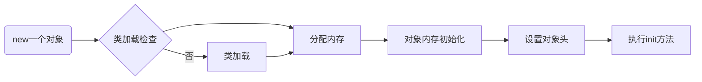
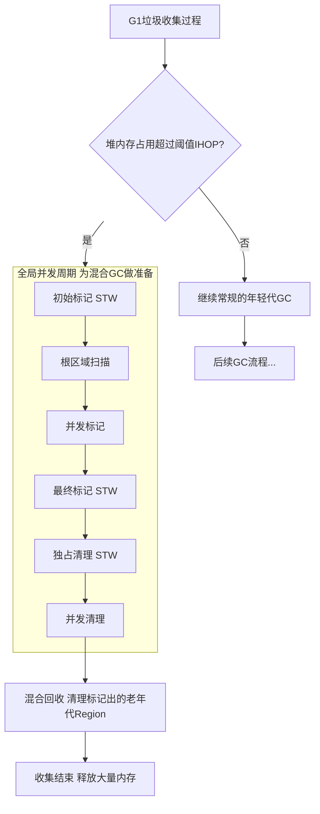
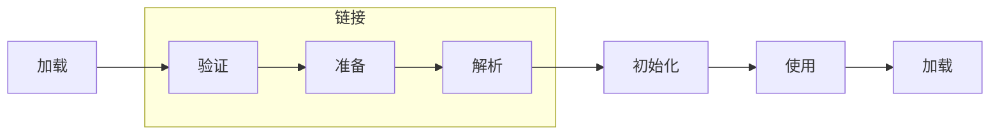
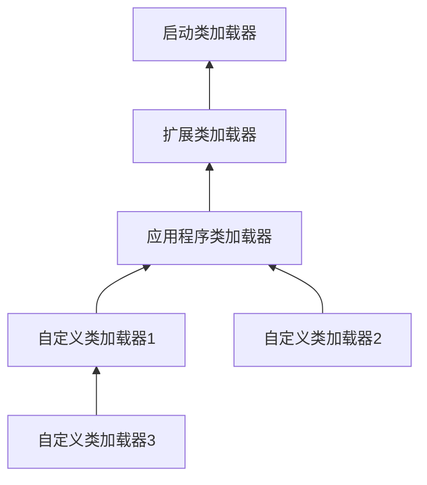
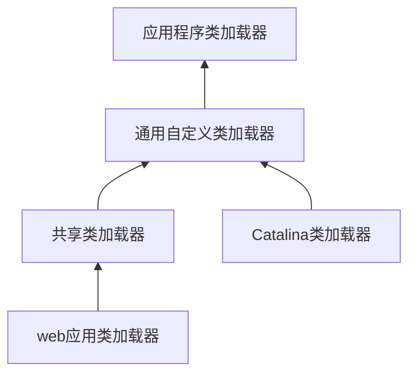

参考文献：
- [https://javabetter.cn/sidebar/sanfene/jvm.html](https://javabetter.cn/sidebar/sanfene/jvm.html)
- [https://javaguide.cn/java/jvm/jvm-garbage-collection.html](https://javaguide.cn/java/jvm/jvm-garbage-collection.html)
- [https://javaguide.cn/java/basis/java-basic-questions-01.html](https://javaguide.cn/java/basis/java-basic-questions-01.html)
- [https://tech.meituan.com/2020/10/22/java-jit-practice-in-meituan.html](https://tech.meituan.com/2020/10/22/java-jit-practice-in-meituan.html)
- [https://mp.weixin.qq.com/s/4haTyXUmh8m-dBQaEzwDJw](https://mp.weixin.qq.com/s/4haTyXUmh8m-dBQaEzwDJw)

JVM是Java实现跨平台的基石。Java源代码（或者 Groovy、Kotlin 等等）经编译后变成字节码文件，最后在运行时JVM会将字节码文件逐行解释，翻译成机器码指令，由此实现一次编译，处处运行的特性。并且，JVM还能实现自动管理内存和使用即时编译器JIT进行热点代码缓存的功能。

JVM 并非只有一种，不过平时接触到的都是 HotSpot VM。

而JVM本身可以分成3部分：类加载器、运行时数据区和执行引擎。

- 类加载器。负责从其他来源加载`.class`文件，将`.class`文件中的二进制数据读入到内存当中。
- 运行时数据区。JVM在运行Java程序时，需要从内存中分配空间来处理各种数据。
- 执行引擎。负责执行字节码，包括一个虚拟处理器、即时编译器JIT和垃圾回收器。

## 编译器

### JIT 编译器

JVM 中集成了两种编译器：Client Compiler (C1) 和 Server Compiler (C2)。JVM 最初会以**解释器**的方式逐条执行字节码，当它发现某些代码被频繁执行时，JIT 编译器就会介入，将这部分字节码动态编译成高度优化的本地代码，供 JVM 直接执行。

C1 编译器的启动速度快，但是性能相比 C2 来说会差一点。C1 会做3件事
- 局部简单可靠的优化，如在字节码上进行的一些基础优化、方法内敛、常量传播等
- 将字节码构造成高级中间显示 (High-level Intermediate Representation **HIR**)，HIR 和平台无关，通常采用图结构，更适合 JVM 对程序进行优化
- 再将 HIR 转换成低级中间显示 (Low-level Intermediate Representation **LIR**)，LIR 再经过转换，最终生成机器码

在 HotSpot VM 中默认的 Server Compiler 是 C2 编译器。其在进行编译优化时，会使用控制流和数据流结合的图的数据结构，成为 Ideal Graph。该图表示当前程序的数据流向和指令之间的关系。依靠这种图结构，某些优化步骤就能简化了。

C2 编译耗时更长，进行更激进的优化，比如[锁的分级](https://ivanclf.github.io/2025/09/30/concurrent-2/#%E9%94%81%E5%8D%87%E7%BA%A7)、[逃逸分析](#逃逸分析)等。

从 JDK 9 开始，HotSpot VM 中集成了新的 Server Compiler，Graal 编译器。该编辑器具有以下几种关键特性
- Graal 相比 C2 更青睐分支预测（根据程序不同分支的运行概率，选择性地编译一些概率较大的分支）优化，因此其峰值性能通常比 C2 好
- 支持虚函数内联、部分逃逸分析等

### AOT

JDK 9 引入了新的编译模式 AOT (Ahead of Time Complication)。与 JIT 不同，AOT 会在程序被执行前就将其编译成机器码，属于静态编译（像 C 或者 C++ 那样）。AOT 避免了 JIT 预热等各方面的开销，可以提高 Java 程序的启动速度，避免预热时间过长，特别适合云原生场景。

通过静态编译，程序会被编译成一个和运行时环境强相关的 `native image` 文件，最后直接执行该文件即可启动程序进行执行，**不经过 JVM**。

GraalVM 是目前主流的 Java 静态编译实现方案，它不仅是一个多语言运行时平台（包含了上文提到的一个 JIT 编译器），其内置的 GraalVM 静态编译器更支持将 Java 程序直接编译为本地可执行文件。此过程的核心是 Substrate VM，它通过上下文不敏感的指向分析技术在程序运行前进行静态分析，从而构建出所有可达函数的列表，并以此作为编译基础。然而，这种静态分析方式存在固有局限，无法有效处理 Java 的反射、动态代理和 JNI 调用等动态特性，这导致许多严重依赖这些特性的主流 Java 框架难以直接通过 Substrate VM 完成编译。为解决这一难题，社区推动了相关工具的发展，例如 Spring 框架便专门提供了 AOT（Ahead-Of-Time）引擎，其作用正是在编译阶段对项目中的反射、动态代理等行为进行精确分析并生成必要的元数据，从而确保 Spring 应用能够顺利适配 GraalVM 的静态编译流程。

## 内存管理

按照Java虚拟机规范，JVM的内存区域可以细分为`程序计数器`、`虚拟机栈`、`本地方法栈`、`堆`和`方法区`。其中后两者是线程共享的，前三者是线程私有的。

- 程序计数器
    即计组的`PC`寄存器，存放下一条指令的地址。
- 虚拟机栈
    即方法执行时创建的**栈帧**，存储方法的参数和返回值等信息（存储局部变量表、操作数栈、动态链接、方法出口等信息）。我们平时所说的Java的`栈`就是Java虚拟机栈。

    在空方法中，静态方法由于不需要访问实例对象，因此在局部变量表中不会有任何变量。但非静态方法中即使是空方法也会有一个用于存储`this`引用的变量。该引用指向当前实例对象，在方法调用时隐式传入。
- 本地方法栈
    这个栈与虚拟机栈的不同之处在于，本地方法栈为虚拟机用到的本地`native`方法服务，如在Java中调用用C/C++等语言编写的底层库方法。常用于需要与操作系统底层或硬件交互的时候。如获取系统时间或`Object`类中的`hashCode()`和`clone()`方法等。

    
    `native`作为一个关键字来声明方法，表示一个在Java代码中声明，但具体实现是由C或C++来编写，并在JVM外部实现的方法。其实际实现不在`.class`文件中，而在`.dll`(Windows)或`.so`(Linux)中。这个库需要被JVM加载。

    Java代码中调用`native`方法后，JVM接收到这个调用，并通过JNI接口找到已加载的本地库中对应的C/C++函数。执行完成后将返回值通过JNI返回给JVM。
    

- 堆
    JVM所管理的最大一块内存区域，也是垃圾收集器管理的主要区域，因此很多时候也被称为`GC堆`。几乎所有的对象实例以及数组都应当在堆上分配内存。存放在这里的对象数据都是线程不安全的，进行并发操作时需要同步机制。

    从 JDK 7 开始，JVM 默认开启了逃逸分析，意味着如果某些方法中的对象引用没有被返回或者没有在方法体外使用，也就是未逃逸出去，那么对象可以直接在栈上分配内存。
- 方法区
    存储已被虚拟机加载的类型信息、常量、静态变量、代码缓存等数据。

    
    在JDK 7之前，该区域常被称为“永久代”。但在JDK 8及以后，JVM使用元空间作为方法区的实现。元空间不再使用JVM内存，而是使用本地内存，因此受到本地内存大小的限制。
    


堆和栈的区别是什么？
堆属于线程共享的内存区域，几乎所有`new`出来的对象都会在堆上分配，在不再被任何变量引用时被垃圾收集器回收。
栈属于线程的私有区域，主要存储局部变量等数据，通常随着方法调用的结束而自动释放，不需要垃圾收集器参与。



JDK 1.6中使用永久代来实现方法区；JDK1.7中将字符串常量池、静态变量存放到了堆上；JDK1.8后直接在内存里划出一块叫做元空间的区域，并将运行时常量池、类常量池都放到了元空间。

这种改变带来了一些好处
- 永久代是JVM的一部分，受JVM进程本身的内存限制，容易内存溢出。
- 永久代是堆的一部分，但其回收规则和普通的类不一样，导致GC算法变得复杂。换成元空间后，由元空间虚拟机管理。



### 对象的生命周期

#### 创建

1. JVM遇到一条`new`指令时，首先会检查这个指令的参数是否能在运行时常量池中定位到一个类的符号引用，检查这个符号引用代表的类是否已经被**加载**、**解析**和**初始化**过。如果没有，就必须要先执行响应的**类加载**过程，这是对象创建的前提。

2. 类加载检查通过后，JVM将为新生对象分配内存。JVM在堆中划分出一块确定大小的内存有两种方式：
    1. **指针碰撞**，在堆内存是绝对规整的情况下，所有用过的内存在一边，空闲的内存在另一边，中间放着一个指针作为分界点的指示器。分配内存就是把这个指针向空闲方向移动合适的距离。
    2. **空闲列表**，在堆内存不规整的情况下，JVM维护一个记录那些内存块是可用的列表。在分配时，从列表中找出一块足够大的空间划分给对象，并更新列表记录。
    
    这不就是[操作系统里的](https://ivanclf.github.io/2025/05/22/os-2/#Managing-Free-Memory)里的**first fit**嘛
    

    其线程安全问题主要通过CAS机制和分配缓冲区的方法解决。

    
    每个线程在Java堆中分配一小块称为`TLAB`的内存空间。线程需要分配对象时，直接从`TLAB`中分配。只有当`TLAB`用完并分配新的`TLAB`时，才需要同步锁定，使用全局分配指针。

    当没有`TLAB`时，`Eden`区更快被填满，导致年轻代`GC`频繁触发，一部分长生命周期对象被晋升为老年代，间接导致老年代`GC`频繁触发。
    

3. JVM将分配到的空间都初始化为零值（`0`、`0.0`、`false`、`null`等）。

4. JVM对对象进行必要的设置，这些消息主要放在对象头中。

5. 从JVM的视角看，对象已经产生了。但对于Java程序来说，对象创建才刚刚开始。构造器代码开始执行。编译器将实例变量初始化语句和构造器代码合并后，生成了`<init>`方法。
    1. 递归向上，执行父类的`<init>`方法，确保父类先初始化
    2. 按出现顺序初始化类中的实例变量（如`int a = 1`这样的语句）
    3. 执行构造器中的剩余代码

#### 内存分区转移

Java堆被分为新生代和老生代两个区域。其中，新生代又被划分为一个较大的`Eden`空间和两个较小的`Survivor`空间（`From Survivor`和`To Survivor`）。

新创建的对象会被分配到`Eden`空间。当`Eden`区填满时，会触发一次`Minor GC`，清除不再使用的对象。存活下来的对象会移动到`Survivor`区。

详细来说，新创建的对象绝大多数会首先被分配在`Eden`区。在`Minor GC`时，`Eden`区和一个`Survivor`（这个`Survivor`称为`From Survivor`）区中存活的对象，会被复制到另一个空的`Survivor`（`To Survivor`）中，然后清空`Eden`和刚使用的`Survivor`，将`To Survivor`转变为新的`From Survivor`，另一个同理。如此`Survivor`的角色互换。

对象在新生代中经历多次GC后仍然存活的（默认为15次），或者很大的对象，会被移动到老年代。若`Survivor`中所有对象的总大小超过了一定比例，那么年龄较小的对象也可能提前移动到老年代。老年代内存不足时，会触发`Major GC`，对整个堆进行垃圾回收。

而对于大对象的定义，一般由参数`-XX:PretenureSizeThreshold`控制。但在JDK 8中这个值默认为0。在G1垃圾收集器中，大对象会被直接分配到`HUMONGOUS`区域。当对象大小超过一个Region容量的一半时，会被认为是一个大对象。

#### 销毁

垃圾收集器通过可达性分析算法判断对象是否可达，若对象不可达则会被回收。

可以通过 `java -XX:+PrintCommandLineFlags -version` 和 `java -XX:+PrintGCDetails -version` 命令查看 JVM 的 GC 收集器。

JVM在进行垃圾回收的过程中，会涉及到对象的移动。为了保证对象引用过程中不被修改，必须暂停所有用户线程。这样的停顿称为`Stop The World`，简称**STW**。

JWT会使用一个名为安全点(`Safe Point`)的机制来确保线程能够安全地暂停。通常位于方法调用、循环跳转、异常处理等位置。其过程包括四个步骤
- JVM发出暂停信号
- 线程执行到安全点后，挂起自身并等待垃圾收集完成
- 垃圾回收器完成操作
- 线程恢复执行

该机制会导致应用程序的响应延迟，可能会出现短暂的卡顿。对于高并发任务，频繁或长时间的STW会严重影响到服务的响应时间。但在现代垃圾回收器中，STW导致的性能问题已经能得到较好解决。

### 内存布局

对象在内存中包括三部分：对象头、示例数据与对齐填充。

对象头在32位JVM上是8字节，在64位JVM上是16字节。对象头包括
1. `Mark Word`：用于存储对象自身运行时数据，如哈希码、GC分代、锁状态、持有锁、偏向线程ID、偏向时间戳等。详见[上一篇文章](https://ivanclf.github.io/2025/09/30/concurrent-2/#synchronized%E5%85%B3%E9%94%AE%E5%AD%97%E4%B8%8EReentrantLock)
2. 类型指针：即对象指向它的类元数据的指针，JVM通过这个指针确定这个对象是哪个类的实例。
3. 如果是数组，对象头还有一块用于记录数据长度的数据。

在JDK 8中，只要堆内存不大于32GB，类型指针默认会被压缩，以节省内存空间。比如说在开启压缩指针的情况下占 4 个字节，否则占 8 个字节。

JVM会对实例数据进行对齐/重排，以提高内存访问速度。
JVM（特别是HotSpot JVM）一般会对数据进行8字节对齐。因为常用的64位CPU进行内存访问时，一次寻址的指针大小是8字节，这也正好是`L1 Cache`缓存行的大小。若未对齐访问
- CPU需要发起两次内存访问（而非一次）
- 可能发生并发问题
- 可能造成缓存行污染
    即加载一个对象需要占用两个缓存行。
- 可能造成伪共享
    即两个无关的变量在同一个缓存中，当一个线程修改其中的一个变量时，会导致整个缓存行失效。

一个`Object`对象在64位的JVM上的大小是16字节（12字节的对象头 + 4字节的对齐填充）。而一般而言，一个对象的引用占4个字节（在压缩指针的情况下）。


`Object o = new Object()`占多少个字节？其中`Object`的实例化对象占16个字节，然后`Object o`这个指针占4个字节。（但这个问题本身指向性就很模糊，不严谨）


#### 对象访问
JVM一般通过两种方式访问对象：句柄和直接指针。
句柄访问中，`reference`中存储的是对象的句柄地址，而句柄中则包含了对象实例数据和类型数据各自的具体地址信息。优点是在对象移动时较为稳定，只需要更新句柄池中“实例数据指针”的值就行。这对垃圾收集算法非常友好。但缺点是访问速度较慢。
直接指针访问则引用直接存储对象的地址，通过对象实例内部的“类型数据指针”再找到方法区中的类信息。优点是访问速度快，缺点是在垃圾收集器移动对象时，需要更新所有指向该对象的`reference`，开销较大。这是`HotSpot VM`等主流虚拟机默认采用的方式。

#### 对象引用
对象的引用有4种：强引用、软引用、弱引用和虚引用。
- 强引用是最普遍的引用类型。只有在该对象不可达时垃圾收集器才会回收。一般`new`出来的对象就是强引用。
- 软引用用来描述一些还有用但非必需的对象。在内存即将溢出前，垃圾收集器会把这些对象列入回收范围进行第二次回收。若回收后内存还是不够则抛出OOM错误。
- 弱引用强度比软引用更弱，被弱引用关联的对象只能生存到下一次垃圾收集器发生之前。
- 虚引用是最弱的一种引用关系。
    完全无法通过虚引用来获取一个对象。其`get()`方法总返回`null`。
    必须与`ReferenceQueue`（引用队列）联合使用。当GC准备回收一个对象时，如果发现它还有虚引用，就会在回收对象的内存之后，把这个虚引用加入到与之关联的引用队列中。
    用于在对象被销毁后，执行一些后续的清理工作，比如管理堆外部的内存等。

#### 逃逸分析
逃逸分析的核心目的是分析一个新创建的对象在方法中定义后，其引用是否会被暴露到方法之外，即这个对象的“活动范围”是否会“逃逸”出当前方法或当前线程。

根据对象的作用域，可以将对象分为3种状态：
- 不逃逸。对象仅在当前方法内部使用，也没有被其他线程操作的可能。
- 方法逃逸。对象的引用被传递到其他方法中，或者作为返回值返回。
- 线程逃逸。对象的引用被赋值给了一个可以被其他线程访问的实例变量（如静态变量），或者在一个线程中创建并启动另一个线程中直接使用。

对于不逃逸的对象，即使是`new`出来的对象JVM也会将对象进行拆解，将其成员变量当作局部变量，直接分配在栈帧上。

对于方法逃逸的对象，若其被证实不会发生线程逃逸，那么JVM就可以移除这个对象上的所有`synchronized`块。

逃逸分析是JIT在编译器**运行时**进行的优化。由于其本身是一个复杂的算法，因此JVM往往只对热点代码进行。

#### 内存溢出和内存泄漏
内存溢出指程序在申请内存时发现内存不够了，此时程序就会跑出`OOM`(`OutOfMemoryError`)，一般是因为堆内存或者机器内存太小，或者内存中存在大量无法回收的对象。

内存泄漏指程序在申请内存后，无法释放已经不再使用的对象的内存。这是导致内存溢出的常见原因。

发生内存泄漏有以下可能原因
- 静态集合类持有对象引用，导致对象无法被回收。这是最常见的情况。
- 数据库链接、网络链接、文件流等资源使用后没有正确关闭，导致资源泄漏甚至内存泄漏，因为这些对象可能持有缓冲区或其他大型对象的引用。
- 监听器或回调函数在不需要时没有注销，那么发布者会一直持有对监听器的引用。
- 非静态内部类（包括匿名内部类）会隐式持有其外部类引用（如后台线程）。内部类不回收时外部类也不会回收。
- 使用强引用构建内存，并且没有有效的淘汰策略。
- `ThreadLocal`中存储了对象且没有在任务结束后调用`ThreadLocal.remove()`进行清理，那么对象就会一直存在与线程的`ThreadLocalMap`中。

## 垃圾收集

### 判断

判断一个对象是不是垃圾主要有两种方法：引用计数算法和可达性分析算法。

引用计数算法在对象中添加一个引用计数器，当计数器为0时不再被使用。该方法实现简单，但不能处理对象之间相互循环引用的问题。因此这不是目前JVM使用的算法。

目前主流JVM均使用可达性分析算法。其通过一系列`GC Roots`的根对象作为起始节点集，然后从这个节点开始，根据引用关系向下搜索。搜索的路径称为**引用链**。若某个对象到`GC Roots`没有任何引用链相连，那么该对象不再被使用。

一般`GC Roots`包含以下对象
1. 虚拟机栈（栈帧中的局部变量表）中引用的对象。
2. `native`方法引用的对象。
3. 静态属性引用的对象。
4. 方法区中静态属性或者常量池引用的对象。
5. Java虚拟机内部引用。例如基本数据类型对应的`Class`对象，还有一些常驻的异常对象。
6. 所有被同步锁持有的对象。
7. 反映Java虚拟机内部情况的JMXBean、JVMTI中注册的回调、本地代码缓存等。

即使是被标记为不可达对象，也并非是“非死不可”的。经过可达性分析后，不可达的对象会被第一次标记。然后JVM会判断此对象是否有必要执行`finalize()`方法。对于有必要执行`finalize()`方法的对象，会被放置到一个名为`F-Queue`队列中，稍后由一个由虚拟机自动创建的、低优先级的`Finalizer`线程去执行它们的`finalize()`方法。

若对象没有覆盖`finalize()`方法或该方法已经被虚拟机调用过，虚拟机会认为该方法“没有必要执行”，也不会将其放入`F-Queue`里。放入`F-Queue`的对象还会进行二次标记，在执行`finalize()`方法中成功通过重新引用拯救了自己，那么也可以不在标记中，避免被回收。

`finalize()`方法运行代价高昂，不确定性大，无法保证对象的调用顺序。因此一般使用`try-finally`或其他方式来做此类清理工作。

### 清理

#### 回收算法
在确定了哪些对象是垃圾之后，不同的收集算法采用了不同的回收策略。主要可以分为以下几类：
- 标记-清除算法
    最基础的收集算法。它将要清理的对象分为“标记”和“清除”两个阶段。首先标记出所有需要回收的对象，然后统一回收所有被标记的对象。这样做虽然实现简单，也不需要移动对象，但标记和清除两个过程的效率都不高，且容易产生大量不连续的内存碎片。
- 标记-复制算法
    将可用内存按容量分为大小相等的两块，每次只使用其中的一块。当这一块的内存用完了，就将还存活者的对象复制到另一块上，然后再把已经使用过的内存空间一次清理掉。这样，在实现简单的同时还避免了产生内存碎片的问题。但这样就浪费了一半的内存，代价高昂。同时其标记和复制阶段都会有STW，标记阶段是为了保证对象的引用关系不被修改，复制阶段是防止对象在复制过程不被修改。
- 标记-整理算法
    标记完成后，不是直接清理，而是让所有存活的对象都向内存空间的一端移动，然后直接清理掉边界之外的内存。这样就没有内存碎片，也没有空间浪费。但这种操作需要STW。
- 分代收集算法
    目前商业虚拟机的普遍做法。新生代中使用复制算法，老年代中使用清除或整理算法。因为新生代中大部分对象生命周期较短，复制算法可以实现快速回收。老年代中对象生命周期长，整理算法可以减少移动对象的成本。

#### GC分类
前面提及了许多种GC机制，此处做一个总结
- `Minor GC`
    也叫做`Young GC`，指发生在年轻代的垃圾收集。
- `Major GC`
    也叫做`Old GC`，指发生在老年代的垃圾收集，是CMS的特有行为
- `Mixed GC`
    G1收集器特有的一种GC类型，在一次GC种同时清理年轻代和部分老年代
- `Full GC`
    最彻底的垃圾收集，涉及整个Java堆和方法区，最为耗时，往往在JVM压力很大时发生。
    
在`Minor GC`发现老年代可用的连续空间小于新生代历次`Minor GC`后升入老年代的对象总和的平均大小，说明本次`Minor GC`后升入老年代的对象大小很可能超过了老年代当前可用的内存空间，就会触发`Full GC`。

空间分配担保是指在进行 `Minor GC` 前，JVM会确保老年代有足够的空间存放从新生代晋升的对象。如果老年代空间不足，可能会触发 `Full GC`。

#### 垃圾收集器种类
|名称|分代|线程模式|回收算法|搭配|说明|
|-|-|-|-|-|-|
|`Serial`|新生代|串行|复制|可与`Serial Old`搭配|最古老最基础的收集器， 是Client模式下的默认新生代收集器|
|`ParNew`|新生代|并行|复制|是`CMS`默认的新生代搭配|本质上是`Serial`的多线程版本， 是许多JVM在Server模式下的首选新生代收集器，因为在JDK 5时，只有它能和`CMS`配合工作|
|`Parallel Scavenge`|新生代|并行|复制|与`Parallel Old`搭配|JDK 8的默认配置 $吞吐量=\frac{运行用户代码时间}{运行用户代码时间\ +\ 垃圾收集时间}$ 该收集器的目标是达到一个可控制的吞吐量。高吞吐量意味着高效率利用CPU时间，适合在后台进行运算而不需要太多交互的任务|
|`Serial Old`|老年代|串行|整理|可与`Serial`/`Parallel Scavenge`搭配|主要意义也是在于给Client模式下的虚拟机使用。 在Server模式下，它主要作为CMS收集器的后备预案，在并发收集发生`Concurrent Mode Failure`时使用。|
|`Parallel Old`|老年代|并行|整理|与`Parallel Scavenge`搭配|是 `Parallel Scavenge`的老年代版本，二者组合是一个吞吐量优先的经典组合，适合关注吞吐量和CPU资源敏感的应用。|
|`CMS`|老年代|并发|清除|与`Serial`/`ParNew`搭配|见下|
|`G1`|全堆|并发+并行|整体整理，局部复制|自身管理，不分代|见下|
|`ZGC`|全堆|并发|染色指针+读屏障|自身管理，不分代|见下|

`CMS`(`COncurrent Mark-Sweep`)，在JDK 1.5时引入，JDK 9时标记为弃用，JDK 14时移除。CMS是第一个关注GC停顿时间的垃圾收集器。

1. 初始标记。标记出`GC Roots`能直接关联到的对象。该阶段单线程进行，且需要STW。但由于只标记直接关联的对象，所以停顿时间非常短。
2. 并发标记。从初始标记的对象开始，进行`GC Roots Tracing`，标记出所有存活的对象。这个过程是和用户线程并发执行的。该过程耗时最长，但不需要STW，也不会影响程序响应速度。
3. 重新标记。修正在并发标记期间因程序运作而导致变动的记录，需要STW，但时间非常短。
4. 并发清除。清理掉死亡对象，回收占用的空间。

因此，CMS在整个收集过程种只有两次短暂的停顿，极大改善了用户体验。但是CMS也存在一些问题，如并发时占用CPU资源而导致总吞吐量降低，无法对在并发标记和并发清理阶段产生的新垃圾进行清理，可能会产生内存碎片等问题。当然还有一个问题在于，若在垃圾清理时，老年代没有足够空间容纳新生代上来的对象，JVM将不得不使用`Serial Old`收集器进行重新垃圾收集，大大拖慢速度。

G1(`Garbage First`)收集器在JDK 1.7时引入，在JDK 9时称为默认的收集器，其运作更加复杂。首先，G1把Java堆划分成多个大小相等的独立区域Region，每个Region可以扮演新生代或老生代的角色。同时，G1还有一个专门为大对象设计的`Humongous`区。

1. 年轻代 GC
    当 `Eden` 区被对象填满时，就会触发一次年轻代垃圾回收。这个过程会暂停所有应用线程（STW），然后把还存活的对象复制到 `Survivor` 区或老年代。
2. 全局并发标记周期（核心阶段）
    当整个堆内存的使用量超过一定比例（默认 45%）时，G1 会启动一个完整的标记流程，目的是找出老年代里哪些区域垃圾最多、最值得回收。这个周期分几步走：
    1. 初始标记：STW，快速标记那些直接被 `GC Roots` 引用到的对象。
    2. 根区域扫描：并发进行，不暂停应用。主要扫描 `Survivor` 区中被标记的对象，看它们是否引用了老年代的对象。这一步必须在下次年轻代 GC 前完成，因为年轻代 GC 会改变 `Survivor` 区的布局。
    3. 并发标记：同样不暂停应用，系统会顺着 `GC Roots` 遍历整个堆，找出所有存活对象。G1 采用“初始快照”技术，确保标记期间新产生的垃圾不会干扰本次回收。
    4. 最终标记：再一次短暂暂停，处理并发标记期间因程序运行产生的变动记录，停顿时间很短。
    5. 清理准备：最后一次暂停，这一步并不实际清理垃圾，而是统计各个老年代区域的存活对象比例和回收价值，排出优先级，并直接回收那些完全空闲的区域。
    6. 并发清理：不暂停应用，把在标记阶段发现的完全空闲区域归还给系统，供后续使用。
3. 混合回收
    在全局并发标记完成之后，G1 已经清楚知道哪些老年代区域是“回收性价比最高”的。当老年代中积压的待回收区域达到一定数量，G1 就会启动一次混合回收：在暂停应用的同时，采用复制算法，同时清理年轻代和选中的老年代区域。
4. 后备方案：`Full GC`
    如果上述回收速度跟不上对象分配的速度，G1 会启用最后的保障——一次完全的 `Full GC`。这时候会使用 `Serial Old` 收集器，暂停时间会比较长，是 G1 尽力避免发生的情况。


其实可以发现，G1和CMS有许多相同之处，甚至G1还要用更多次的STW，那为什么目前的主流是G1呢？首先列表显示其核心差别

|对比项|CMS|G1|
|-|-|-|
|设计目标|低延迟，追求最短的单次停顿时间|**可预测**的停顿时间，在保证吞吐量的同时尽可能控制每次停顿在一个可控范围内|
|堆内存布局|物理分代：严格分为连续的新生代、老年代|逻辑分代，物理分区：堆被划分为多个大小相等的Region，每个Region在逻辑上属于不同区域|
|算法|标记-清除|标记-整理（整体上看）|
|内存碎片|严重，清除法容易产生碎片，可能导致`Full GC`|有效避免，通过复制算法进行回收|
|对堆大小的适应性|适合中小堆，堆太大时，扫描时间变长|更适合大堆|
|预测能力|弱，难以预测下次停顿会多久|强，可以建立可靠的停顿时间|

G1就是为了解决CMS中的内存碎片与不可预测的停顿而诞生的。G1在混合回收阶段就已经将存活的Region复制到新的空Region中了，整理好了。并且在大堆时，G1可以做到每次只回收一部分Region，而不是像CMS那样每次回收老年代都要扫描整个堆，对性能更加友好。


ZGC是JDK 11时引入的低延迟垃圾处理器，可以将垃圾收集的停顿时间控制在10ms内，它通过并发标记和重定位来避免大部分STW，主要依赖指针染色来管理对象状态。

ZGC从指针中“偷”出几个比特位来存储与垃圾收集相关的元数据（如标记、重定位信息）。
同时，使用了读屏障技术，当线程读取一个对象指针时，读屏障会检查这个指针上的“染色”信息。如果这个对象正在被GC并发地移动，读屏障会立即“拦截”这个操作。并返回对象的新地址，同时甚至会帮忙完成这个对象的移动和指针的更新。

适用于需要超低延迟的场景，如金融交易系统、电商平台。

## 类加载机制

### 类加载过程
类的生命周期，从被加载到虚拟机内存中开始到被卸载为止，共经历7个阶段

而类的加载过程包括三个阶段：加载，链接和初始化。
- 在加载时，JVM需要完成这三件事
    1. 通过全类名获取定义此类的二进制字节流
    2. 将字节流所代表的静态存储结构转换为方法区运行时数据结构（和反序列化类似，可理解为方法的反序列化）
    3. 内存中生成一个代表该类的`Class`对象，作为方法区这些数据的访问入口

    每个Java类都有一个引用指向加载它的`ClassLoader`
- 验证是链接阶段的第一步。其主要包含
    1. 文件格式验证，`Class`文件格式检查
    2. 元数据验证，字节码语义检查
    3. 字节码验证，程序语义检查
    4. 符号引用验证，类的正确性检查

- 准备阶段，正式为类变量分配内存并设置变量初始值的阶段，此时为静态变量进行内存分配并设置默认值（零值）。
- 解析阶段是虚拟机将常量池内符号引用替换为直接引用的过程。
    
    符号引用用一组符号来描述引用的目标，如`com/example/MyClass`等，而直接引用则是直接指向内存的指针。
    
- 初始化阶段是开始执行初始化方法`<clinit>()`的过程。准备阶段中对一些静态变量赋过零值了，此时会赋值为期望值。

### 类加载器

类加载器主要有4种

1. 启动类加载器，负责加载JVM核心库，也是最顶层的加载类，由C++实现，通常表示为`null`，因为这个加载器在Java中没有对应的类
2. 扩展类加载器，负责加载`%JRE_HOME%/lib/ext` 目录下的 jar 包和类以及被 `java.ext.dirs` 系统变量所指定的路径下的所有类
3. 应用程序类加载器，面向用户的类加载器，加载当前应用目录下的所有jar包和类
4. 用户自定义的类加载器，通过继承`java.lang.ClassLoader`类实现

选用加载器时，一般选用**双亲委派模型**，即先委托父加载器尝试加载，只有父加载器无法加载时，子加载器才会加载。又或者说，先自底向上查找判断类是否被加载，然后自顶向下尝试加载类。无法加载类则会抛异常`ClassNotFoundException`。

自定义加载器时，若不想打破双亲委派模型，则重写`ClassLoader`类中的`findClass()`方法；若需要打破双亲委派模型，则重写`ClassLoader`类中的`loadClass()`方法。

打破该模型的应用有很多

- SPI机制
    SPI(`Service Device Interface`)是Java的一种扩展机制，用于加载和注册第三方库，常见于JDBC等框架。

    其接口定义方是Java核心库，由启动类加载器加载，然而接口的实现方为第三方厂商的jar包，由应用类加载器加载。按照双亲委派模型，启动类加载器无法知道应用类加载器加载的实现类，从而导致服务接口找不到具体的实现。

    因此使用线程上下文加载器实现。每个线程都持有一个类加载器引用，该引用默认继承父线程的。而SPI场景中通过`META-INF/services/接口全限定名`文件声明实现类。然后父加载器委托子加载器完成加载。
- 热部署
    指在不重启服务器的情况下更新应用程序的代码，需要替换旧版本的类，但旧版本的累可能由父加载器加载。如spring boot的DevTools通常会自定义加载器。
- Tomcat
    Tomcat基于双亲委派模型进行了一些扩展。其中`Catalina ClassLoader`加载Tomcat的核心类库，`Shared ClassLoader`加载共享类库，`WebApp ClassLoader`加载Web应用程序的类库，支持多应用隔离和优先加载应用自定义的类库。
    

