### 滑动窗口

#### 无重复字符的最长子串

给定一个字符串 s ，请你找出其中不含有重复字符的 最长 子串 的长度。

示例:
    输入: s = "abcabcbb"
    输出: 3
    解释: 因为无重复字符的最长子串是 "abc"，所以其长度为 3。
既然字母不能重复，那么最直接的办法就是一个个字符去遍历，当遇到重复字符时就重新开始遍历。使用双指针可以完成这个功能

```java
class Solution {
    public int lengthOfLongestSubstring(String s) {
        Set<Character> occ = new HashSet<Character>();
        int n = s.length(), rk = -1, ans = 0;
        for (int i = 0; i < n; ++i) {
            if (i != 0) {
                occ.remove(s.charAt(i - 1));
            }
            while (rk + 1 < n && !occ.contains(s.charAt(rk + 1))) {
                occ.add(s.charAt(rk + 1));
                ++rk;
            }
            ans = Math.max(ans, rk - i + 1);
        }
        return ans;
    }
}
```

当左指针 `i` 不在起始位置时，集合需要删掉 `i`前面的字母，然后右指针往后遍历，直到遇到相同字母为止。


或者这样

```java
class Solution {
    public int lengthOfLongestSubstring(String s) {
        int[] index = new int[128]; // 记录每个字符最后一次出现的位置 +1
        int maxLen = 0;
        int left = 0;

        for (int right = 0; right < s.length(); right++) {
            char ch = s.charAt(right);
            left = Math.max(left, index[ch]);
            maxLen = Math.max(maxLen, right - left + 1);
            index[ch] = right + 1; 
        }

        return maxLen;
    }
}
```

第一个max函数用于比较右指针字符上一次出现的位置是否在左指针后，是则让左指针移动到后面一位。



#### 找到字符串中的所有字母异位词

给定两个字符串 s 和 p，找到 s 中所有 p 的 异位词 的子串，返回这些子串的起始索引。不考虑答案输出的顺序。

示例:
    输入: `s = "cbaebabacd", p = "abc"`
    输出: `[0,6]`
    解释:
    起始索引等于 `0` 的子串是 `"cba"`, 它是 `"abc"` 的异位词。
    起始索引等于 `6` 的子串是 `"bac"`, 它是 `"abc"` 的异位词。
由于异位词的长度一定是一样的的，所以可以指定滑动窗口的长度

```java
class Solution {
    public List<Integer> findAnagrams(String s, String p) {
        int sLen = s.length(), pLen = p.length();
        if (sLen < pLen)
            return new ArrayList<Integer>();
        List<Integer> ans = new ArrayList<Integer>();
        int[] sCount = new int[26];
        int[] pCount = new int[26];
        for (int i = 0; i < pLen; ++i) {
            ++sCount[s.charAt(i) - 'a'];
            ++pCount[p.charAt(i) - 'a'];
        }
        if (Arrays.equals(sCount, pCount))
            ans.add(0);
        for (int i = 0; i < sLen - pLen; ++i) {
            --sCount[s.charAt(i) - 'a'];
            ++sCount[s.charAt(i + pLen) - 'a'];
            if (Arrays.equals(sCount, pCount))
                ans.add(i + 1);
        }
        return ans;
    }
}
```

第一个循环用于统计两个字符串中 **`pLen`部分** 字母的个数。第二个循环用于让字串`s`对应的滑动窗口向右移动一位，更新字母数量数据。最后，如果两个数组一样则表明符合条件。

在该方法的基础上，我们可以不再分别统计两个字串中字母的数量，转而统计每种字母数量的差，并额外引入变量 `differ` 来记录当前窗口和字符串`p`中数量不同的字母个数。

```java
public List<Integer> findAnagrams(String s, String p) {
    int sLen = s.length(), pLen = p.length(), temp;
    if (sLen < pLen) return new ArrayList<Integer>();
    List<Integer> ans = new ArrayList<Integer>();
    int[] count = new int[26];
    for (int i = 0; i < pLen; ++i) {
        ++count[s.charAt(i) - 'a'];
        --count[p.charAt(i) - 'a'];
    }
    int differ = 0;
    for (int j = 0; j < 26; ++j)
        if (count[j] != 0)
            ++differ;
    if (differ == 0)
        ans.add(0);
    for (int i = 0; i < sLen - pLen; ++i) {
        temp = count[s.charAt(i) - 'a'];
        if (temp == 1)
            --differ;
        else if (temp == 0)
            ++differ;
        --count[s.charAt(i) - 'a'];

        temp = count[s.charAt(i + pLen) - 'a'];
        if (temp == -1)
            --differ;
        else if (temp == 0)
            ++differ;
        ++count[s.charAt(i + pLen) - 'a'];
        if (differ == 0)
            ans.add(i + 1);
    }
    return ans;
}
```

其中的`count`数组存着串`s - p`的各个字母的差，其中每一个非0项都会让`differ` + 1。在`differ`赋值后，开始进行循环。`temp`变量用于获取当前的差值。首先是将左端划出窗口的情况，需要将`differ`中包含的情况给出清。然后是将右端划入窗口的情况，需要在`differ`中增加新差值。而循环体本身则演示滑动的过程。

### 链表

#### 相交链表

给你两个单链表的头节点 `headA` 和 `headB` ，请你找出并返回两个单链表相交的起始节点。如果两个链表不存在相交节点，返回 `null` 。


    输入：`intersectVal = 8`, `listA = [4,1,8,4,5]`, `listB = [5,6,1,8,4,5]`, `skipA = 2`, `skipB = 3`
    输出：`Intersected at '8'`
    解释：相交节点的值为 `8` （注意，如果两个链表相交则不能为 0）。从各自的表头开始算起，链表 `A` 为 `[4,1,8,4,5]`，链表 B 为 `[5,6,1,8,4,5]`。在 A 中，相交节点前有 2 个节点；在 B 中，相交节点前有 3 个节点。
    - 请注意相交节点的值不为 1，因为在链表 A 和链表 B 之中值为 1 的节点 (A 中第二个节点和 B 中第三个节点) 是不同的节点。换句话说，它们在内存中指向两个不同的位置，而链表 A 和链表 B 中值为 8 的节点 (A 中第三个节点，B 中第四个节点) 在内存中指向相同的位置。


C++丢人版。扔两个栈里，然后一个个弹出，若找到不一样的就返回最后一个一样的节点。

```cpp
class Solution {
public:
    ListNode *getIntersectionNode(ListNode *headA, ListNode *headB)
    {
        if (headA == nullptr || headB == nullptr)
            return nullptr;
        else if(headA == headB)
            return headA;
        stack<ListNode *> a, b;
        ListNode *ha, *hb, *temp = ha;
        for (ListNode *p = headA; p != nullptr; p = p->next)
            a.push(p);
        for (ListNode *p = headB; p != nullptr; p = p->next)
            b.push(p);
        while (!a.empty() && !b.empty())
        {
            ha = a.top(), hb = b.top();
            a.pop(), b.pop();
            if(ha == hb)
                temp == ha;
            else
                return ha->next;
        }
        
        return temp;
    }
};
```



##### 哈希集合

先将 `headA` 中的节点加入哈希集合中，再遍历链表 `headB`，然后将 `headB` 中的节点与表中的进行比较。

```java
public class Solution {
    public ListNode getIntersectionNode(ListNode headA, ListNode headB) {
        Set<ListNode> visited = new HashSet<ListNode>();
        ListNode temp = headA;
        while (temp != null) {
            visited.add(temp);
            temp = temp.next;
        }
        temp = headB;
        while (temp != null) {
            if (visited.contains(temp)) {
                return temp;
            }
            temp = temp.next;
        }
        return null;
    }
}
```

##### 双指针

先判空，若二者均为非空，则在两个链表头创建两个指针 `pA` 和 `pB`。然后每步操作同时更新指针 `pA` 和 `pB`，若均不为空则移动到下一节点；一方为空则将该指针放到另一条的头部；指向同一节点则指向该节点；均为空则指向空。

设 `headA` 不相交部分长度为 $a$，`headB` 部分不相交部分长度为 $b$，二者相交部分为 $c$。若二者相交，一开始双方会同时走向相交节点(若 $a=b$)，或者分别走向链表尾，并走向另一条链表，而后者二者均需走$a+b+c$的长度碰到交汇点。若二者不相交，则在各自走了$a+c+b+c=a+b+2c$的长度下同时走向空值，返回`null`。

```java
public class Solution {
    public ListNode getIntersectionNode(ListNode headA, ListNode headB) {
        if (headA == null || headB == null)
            return null;
        ListNode pA = headA, pB = headB;
        while (pA != pB) {
            pA = pA == null ? headB : pA.next;
            pB = pB == null ? headA : pB.next;
        }
        return pA;
    }
}
```


错的人就算走过了对方的路也还是会错过😔 这题我希望大家都返回`true`
<p align="right">——某神评</p>


#### **反转链表**

给你单链表的头节点 head ，请你反转链表，并返回反转后的链表。

示例：

    输入：`head = [1,2,3,4,5]`
    输出：`[5,4,3,2,1]`


C++超过100%的办法(虽然空间很难看)

```cpp
class Solution {
public:
    ListNode *Head1 = new ListNode(-10000), *Head2 = new ListNode(-10000);
    ListNode *reverseList(ListNode *head)
    {
        if(head == nullptr)
            return nullptr;
        if (Head1->val == -10000)
            Head1 = head;
        ListNode *pointer;
        if (head->next != nullptr)
            pointer = reverseList(head->next);
        else
        {
            Head2 = head;
            return head;
        }

        pointer->next = head;
        head->next = nullptr;
        if (head == Head1)
            return Head2;
        return head;
    }
};
```



##### 迭代

头插法创建新链表。


```java
class Solution {
    public ListNode reverseList(ListNode head) {
        ListNode prev = null;
        ListNode curr = head;
        while (curr != null) {
            ListNode next = curr.next;
            curr.next = prev;
            prev = curr;
            curr = next;
        }
        return prev;
    }
}
```

##### 递归

相比迭代的从头来过，这个只是逆转了箭头的方向


```java
class Solution {
    public ListNode reverseList(ListNode head) {
        if (head == null || head.next == null) {
            return head;
        }
        ListNode newHead = reverseList(head.next);
        head.next.next = head;
        head.next = null;
        return newHead;
    }
}
```

#### 回文链表

给你一个单链表的头节点 `head` ，请你判断该链表是否为回文链表。如果是，返回 `true` ；否则，返回 `false` 。
示例：

    输入：`head = [1,2,2,1]`
    输出：`true`


C++摆烂版，全部用栈。压一半，奇数个弹出中间那个，再比较一半。虽然比较慢但是很好懂（废话）

```cpp
class Solution {
public:
    bool isPalindrome(ListNode* head) {
        int counter = 0;
        stack<int> s;
        ListNode *temp = head;
        for(ListNode *pointer = head; pointer != nullptr; pointer = pointer->next, counter++);
        for(int i = 0; i < counter / 2; temp = temp->next, i++)
            s.push(temp->val);
        if(counter % 2)
            temp = temp->next;
        for(;temp != nullptr && !s.empty(); temp = temp->next)
            if(s.top() != temp->val)
                return false;
            else
                s.pop();
        if(!s.empty())
            return false;
        return true;
    }
};
```



##### 将值复制到数组中后用双指针法

```java
class Solution {
    public boolean isPalindrome(ListNode head) {
        List<Integer> vals = new ArrayList<Integer>();
        int front = 0, back = vals.size() - 1;  
        for(ListNode node = head; node != null; node = node.next)
            vals.add(currentNode.val);
        while (front < back) {
            if (!vals.get(front).equals(vals.get(back)))
                return false;
            front++;
            back--;
        }
        return true;
    }
}
```

顾名思义，这里不分析了，太狂暴了。

##### 递归

该方法可以以一种优雅的形式解决单向链表不能倒查的问题。

```java
class Solution {
    private ListNode frontPointer;

    private boolean recursivelyCheck(ListNode currentNode) {
        if (currentNode != null) {
            if (!recursivelyCheck(currentNode.next))
                return false;
            if (currentNode.val != frontPointer.val)
                return false;
            frontPointer = frontPointer.next;
        }
        return true;
    }

    public boolean isPalindrome(ListNode head) {
        frontPointer = head;
        return recursivelyCheck(head);
    }
}
```

`frontPointer`变量存储前面的值，递归的 `currentNode` 部分存储后面的值。若前面的`false`则传递下去，若二者值不相等也返回`false`。`frontPointer`通过`next`赋值实现迭代，`currentNode`部分通过递归的返回部分实现往回迭代。

##### 快慢指针

前三种的空间复杂度都是$O(n)$，这里是$O(1)$的做法。讲链表后半部分反转后再进行比较。由于该方法会改变链表本身，因此不适合在并发条件下使用。

```java
class Solution {
    public boolean isPalindrome(ListNode head) {
        if (head == null)
            return true;
        ListNode firstHalfEnd = endOfFirstHalf(head);
        ListNode secondHalfStart = reverseList(firstHalfEnd.next);

        ListNode p1 = head;
        ListNode p2 = secondHalfStart;
        boolean result = true;
        while (result && p2 != null) {
            if (p1.val != p2.val) {
                result = false;
            }
            p1 = p1.next;
            p2 = p2.next;
        }

        firstHalfEnd.next = reverseList(secondHalfStart);
        return result;
    }

    private ListNode reverseList(ListNode head) {
        ListNode prev = null;
        ListNode curr = head;
        while (curr != null) {
            ListNode nextTemp = curr.next;
            curr.next = prev;
            prev = curr;
            curr = nextTemp;
        }
        return prev;
    }

    private ListNode endOfFirstHalf(ListNode head) {
        ListNode fast = head;
        ListNode slow = head;
        while (fast.next != null && fast.next.next != null) {
            fast = fast.next.next;
            slow = slow.next;
        }
        return slow;
    }
}
```

后面的函数 `reverseList` 用于逆转链表（见上一题），`endOfFirstHalf`用于快慢指针的遍历。先使用快慢指针在一次遍历中找到。快指针一次两步，慢指针一次一步。快指针到链表末尾时慢指针刚好到链表中间。现在有了慢指针作为基准，我们可以以此为起点进行逆转链表。逆转完了就可以再比较。由于两边都是顺序，直接`next`索引即可。

#### 环形链表

给你一个链表的头节点 `head` ，判断链表中是否有环。

如果链表中有某个节点，可以通过连续跟踪 `next` 指针再次到达，则链表中存在环。 为了表示给定链表中的环，评测系统内部使用整数 pos 来表示链表尾连接到链表中的位置（索引从 0 开始）。注意：`pos` 不作为参数进行传递 。仅仅是为了标识链表的实际情况。

如果链表中存在环 ，则返回 `true` 。 否则，返回 `false` 。

示例：

    输入：`head = [3,2,0,-4], pos = 1`
    输出：`true`
    解释：链表中有一个环，其尾部连接到第二个节点。


赖皮做法：本地链表最长为10000条，我遍历10001次还没跑完不就有环了嘛

```cpp
class Solution {
public:
    bool hasCycle(ListNode *head) {
        ListNode *pointer = head;
        for(int i = 0; i < 10001; i++, pointer = pointer->next){
            if(pointer == nullptr)
                return false;
        }
        return true;
    }
};
```



##### 哈希表

```java
public class Solution {
    public boolean hasCycle(ListNode head) {
        Set<ListNode> seen = new HashSet<ListNode>();
        while (head != null) {
            if (!seen.add(head))
                return true;
            head = head.next;
        }
        return false;
    }
}
```

如果加不了就是已经加过了，遇到环了。

##### 快慢指针

此方法又叫 “Floyd判图算法”，又叫龟兔赛跑算法。快指针一次两步，慢指针一次一步。若无环则慢指针永远碰不上快指针；若有环则二者都会在环路中转圈，当二者路程差刚好是环长度的倍数时就是二者相遇的时候。

```java
public class Solution {
    public boolean hasCycle(ListNode head) {
        if (head == null || head.next == null)
            return false;
        ListNode slow = head, fast = head.next;
        while (slow != fast) {
            if (fast == null || fast.next == null)
                return false;
            slow = slow.next;
            fast = fast.next.next;
        }
        return true;
    }
}
```

#### 环形链表II

给定一个链表的头节点  `head` ，返回链表开始入环的第一个节点。 如果链表无环，则返回 `null。`

如果链表中有某个节点，可以通过连续跟踪 `next` 指针再次到达，则链表中存在环。 注意：此处的`pos` 不作为参数进行传递，仅仅是为了标识链表的实际情况。
不允许修改 链表。

示例：

    输入：`head = [3,2,0,-4], pos = 1`
    输出：返回索引为 1 的链表节点
    解释：链表中有一个环，其尾部连接到第二个节点。


可以把上一题的哈希表法改一改

```java
public class Solution {
    public boolean hasCycle(ListNode head) {
        Set<ListNode> seen = new HashSet<ListNode>();
        while (head != null) {
            if (!seen.add(head))
                return true;
            head = head.next;
        }
        return false;
    }
}
```



用快慢指针改一改同样能实现定位环的效果。


设`slow`指针走了 `b` 距离与 `fast` 相遇，此时，`fast`指针已经走了`n`圈，此时快指针走过的总距离为
$$
a+n(b+c)+b=a+(n+1)b+nc
$$
由于$v_{fast}=2v_{slow}$，因此有
$$
\underbrace{a+(n+1)b+nc}_{\text{快指针}}=\underbrace{2(a+b)}_{\text{慢指针}}⟹a=c+(n−1)(b+c)
$$
但对于指针而言，绕圈圈数可以忽略。因此最后简化成
$$
a=c
$$
于是，在二者相遇时，我们再用一个指针指向头部，并与slow指针同步走动，二者相遇的位置即是环开始点。

```java
class Solution {
public:
    ListNode *detectCycle(ListNode *head) {
        ListNode *slow = head, *fast = head;
        while (fast != nullptr) {
            slow = slow->next;
            if (fast->next == nullptr)
                return nullptr;
            fast = fast->next->next;
            if (fast == slow) {
                ListNode *ptr = head;
                while (ptr != slow) {
                    ptr = ptr->next;
                    slow = slow->next;
                }
                return ptr;
            }
        }
        return nullptr;
    }
};
```

#### 合并两个有序链表

将两个升序链表合并为一个新的 升序 链表并返回。新链表是通过拼接给定的两个链表的所有节点组成的。

示例：

    输入：l1 = [1,2,4], l2 = [1,3,4]
    输出：[1,1,2,3,4,4]


可以把链表2合并到链表1上。

```cpp
/**
 * Definition for singly-linked list.
 * struct ListNode {
 *     int val;
 *     ListNode *next;
 *     ListNode() : val(0), next(nullptr) {}
 *     ListNode(int x) : val(x), next(nullptr) {}
 *     ListNode(int x, ListNode *next) : val(x), next(next) {}
 * };
 */
class Solution
{
public:
    ListNode *mergeTwoLists(ListNode *list1, ListNode *list2)
    {
        ListNode *temp = list2, *swap = list2, *head = list1;
        if(list1 == nullptr || list2 == nullptr)
            return list1 == nullptr ? list2 : list1;
        if (list2->val < list1->val)
        {
            swap = list2, head = list2;
            while (swap->next != nullptr && swap->next->val < list1->val)
                swap = swap->next, temp = temp->next;
            temp = temp->next;
            swap->next = list1;
        }

        for (ListNode *p = list1; p->next != nullptr && temp != nullptr; p = p->next)
        {
            if (temp != nullptr && temp->val >= p->val && temp->val <= p->next->val)
            {
                swap = temp;
                temp = temp->next;
                swap->next = p->next;
                p->next = swap;
            }
        }
        if (temp != nullptr)
        {
            ListNode *p = list1;
            for (; p->next != nullptr; p = p->next);
            p->next = temp;
        }
        return head;
    }
};
```

指定两个指针`p1`和`p2`，分别指向两个链表。若`p2 >= p1`，则说明是时候插入了，于是在`p1->next`处进行插入。然后对余下部分循环插入。


##### 递归

定义两个链表的merge操作如下（忽略空链表的情况）

$$
\begin{cases}
list_1[0]+merge(list_1[1:],list_{2})\quad list_1[0]<list_2[0] \\\\
list_2[0]+merge(list_1,list_2[1:])\quad \text{otherwise}
\end{cases}
$$

也就是说，两个链表头部值较小的一个节点与剩下元素的 `merge` 操作结果合并。

```java
class Solution {
    public ListNode mergeTwoLists(ListNode l1, ListNode l2) {
        if (l1 == null) {
            return l2;
        } else if (l2 == null) {
            return l1;
        } else if (l1.val < l2.val) {
            l1.next = mergeTwoLists(l1.next, l2);
            return l1;
        } else {
            l2.next = mergeTwoLists(l1, l2.next);
            return l2;
        }
    }
}
```

哪个值更小，就把哪个放进递归里面，当最后返回时，已经帮排好序了。

##### 迭代


然后l1的1为最小值（相等取l1），l1向前，比较l1和l2的值，然后将prev的值指向更小的那个


一次操作的结果如上图

```java
class Solution {
    public ListNode mergeTwoLists(ListNode l1, ListNode l2) {
        ListNode prehead = new ListNode(-1);
        ListNode prev = prehead;
        while (l1 != null && l2 != null) {
            if (l1.val <= l2.val) {
                prev.next = l1;
                l1 = l1.next;
            } else {
                prev.next = l2;
                l2 = l2.next;
            }
            prev = prev.next;
        }
        prev.next = l1 == null ? l2 : l1;
        return prehead.next;
    }
}
```

#### 两数相加

给你两个 **非空** 的链表，表示两个非负的整数。它们每位数字都是按照 **逆序** 的方式存储的，并且每个节点只能存储 **一位** 数字。
请你将两个数相加，并以相同形式返回一个表示和的链表。
你可以假设除了数字 `0` 之外，这两个数都不会以 `0` 开头。

示例：

    输入：`l1 = [2,4,3], l2 = [5,6,4]`
    输出：`[7,0,8]`
    解释：`342 + 465 = 807`.


本人的迭代思路。虽然时间和题解一样但不知道为什么空间复杂度特别高

```java
class Solution {
    public ListNode addTwoNumbers(ListNode l1, ListNode l2) {
        ListNode head = l1;
        int add, c = 0;
        while(true) {
            add = l1.val + l2.val + c;
            c = add > 9 ? 1 : 0;
            l1.val = add > 9 ? add - 10 : add;

            if(l1.next == null || l2.next == null)
                break;
            l1 = l1.next;
            l2 = l2.next;
        }

        if(l1.next != null) {
            l1 = l1.next;
            while(c == 1) {
                l1.val = l1.val + c;
                c = l1.val > 9 ? 1 : 0;
                l1.val = l1.val > 9 ? l1.val - 10 : l1.val;
                if(l1.next == null)
                    break;
                l1 = l1.next;
            }
        } else if(l2.next != null) {
            l2 = l2.next;
            while(true) {
                add = l2.val + c;
                c = add > 9 ? 1 : 0;
                add = add > 9 ? add - 10 : add;
                l1.next = new ListNode(add);
                l1 = l1.next;
                if(l2.next == null)
                    break;
                l2 = l2.next;
            }
        }

        if(c == 1) {
            l1.next = new ListNode(1);
        }
        return head;
    }
}
```



这个和数电的ALU计算器类似，一位位计算他们的值并存储进位。以下是题解的模拟法

```java
class Solution {
public:
    ListNode* addTwoNumbers(ListNode* l1, ListNode* l2) {
        ListNode *head = nullptr, *tail = nullptr;
        int carry = 0;
        while (l1 || l2) {
            int n1 = l1 ? l1->val: 0;
            int n2 = l2 ? l2->val: 0;
            int sum = n1 + n2 + carry;
            if (!head)
                head = tail = new ListNode(sum % 10);
            else {
                tail->next = new ListNode(sum % 10);
                tail = tail->next;
            }
            carry = sum / 10;
            if (l1)
                l1 = l1->next;
            if (l2)
                l2 = l2->next;
        }
        if (carry > 0)
            tail->next = new ListNode(carry);
        return head;
    }
};
```

确实是比自己写的简洁。

#### 删除链表的倒数第N个节点

给你一个链表，删除链表的倒数第 `n` 个结点，并且返回链表的头结点。
示例：
    输入：`head = [1,2,3,4,5], n = 2`
    输出：`[1,2,3,5]`

题目的提示给得很明显了，可以使用双指针，让两个指针之间的距离保持n步。然后慢指针就是要删去的值。

题解如下

```java
class Solution {
    public ListNode removeNthFromEnd(ListNode head, int n) {
        ListNode dummy = new ListNode(0, head);
        int length = getLength(head);
        ListNode cur = dummy;
        for (int i = 1; i < length - n + 1; ++i) {
            cur = cur.next;
        }
        cur.next = cur.next.next;
        ListNode ans = dummy.next;
        return ans;
    }

    public int getLength(ListNode head) {
        int length = 0;
        while (head != null) {
            ++length;
            head = head.next;
        }
        return length;
    }
}
```


又臭又长，不如看看我这个

```java
class Solution {
    public ListNode removeNthFromEnd(ListNode head, int n) {
        ListNode p1 = head, p2 = head;
        int length;
        for(length = 0; p1 != null; p1 = p1.next, length++)
            p2 = length > n ? p2.next : p2;
        if(length == n)
            return head.next;
        p2.next = p2.next.next;
        return head;
    }
}
```

在遍历的时候顺便把长度算出来就行了。


#### 两两交换链表中的节点

给你一个链表，两两交换其中相邻的节点，并返回交换后链表的头节点。你必须在不修改节点内部的值的情况下完成本题（即，只能进行节点交换）。

示例：
    输入：`head = [1,2,3,4]`
    输出：`[2,1,4,3]`

##### 迭代

为减少需要讨论的情况。创建头节点 `dummyHead`，在`head`的前面，然后开始交换(图中交换`2`和`3`)


`temp.next = node2`


`node1.next = node2.next`


`node2.next = node1`


`temp = node1`

```mermaid
flowchart LR

temp[temp]
node1[node1]
node2[node2]
next[next]

subgraph list[链表]
    one[1]
    two[2]
    three[3]
end

one-->three
temp-.->two
node1-.->two-.->next
node2-.->three-->two
```



交换完成

```java
class Solution {
    public ListNode swapPairs(ListNode head) {
        ListNode dummyHead = new ListNode(0);
        dummyHead.next = head;
        ListNode temp = dummyHead;
        while (temp.next != null && temp.next.next != null) {
            ListNode node1 = temp.next;
            ListNode node2 = temp.next.next;
            temp.next = node2;
            node1.next = node2.next;
            node2.next = node1;
            temp = node1;
        }
        return dummyHead.next;
    }
}
```


当然也可以不声明这个头节点，让`head`专事专办也可以

```java
class Solution {
    public ListNode swapPairs(ListNode head) {
        if(head == null || head.next == null)
            return head;
        ListNode left = head, right = head.next, front = head, ans = right;
        left.next = right.next;
        right.next = left;
        while(front.next != null && front.next.next != null) {
            left = front.next;
            right = left.next;
            front.next = right;
            left.next = right.next;
            right.next = left;
            front = left;
        }
        return ans;
    }
}
```



#### K个一组翻转链表

给你链表的头节点 `head` ，每 `k` 个节点一组进行翻转，请你返回修改后的链表。
`k` 是一个正整数，它的值小于或等于链表的长度。如果节点总数不是 `k` 的整数倍，那么请将最后剩余的节点保持原有顺序。
你不能只是单纯的改变节点内部的值，而是需要实际进行节点交换。

示例：
    输入：`head = [1,2,3,4,5], k = 2`
    输出：`[2,1,4,3,5]`

明明中间就是[逆转链表](#反转链表)的过程，只要放个循环就行，为何会变成困难题呢？因为需要考虑的细节比较多，需要简化。

```java
class Solution {
    public ListNode reverseKGroup(ListNode head, int k) {
        ListNode hair = new ListNode(0);
        hair.next = head;
        ListNode pre = hair;

        while (head != null) {
            ListNode tail = pre;
            for (int i = 0; i < k; ++i) {
                tail = tail.next;
                if (tail == null)
                    return hair.next;
            }
            ListNode nex = tail.next;
            ListNode[] reverse = myReverse(head, tail);
            head = reverse[0];
            tail = reverse[1];
            pre.next = head;
            tail.next = nex;
            pre = tail;
            head = tail.next;
        }

        return hair.next;
    }

    public ListNode[] myReverse(ListNode head, ListNode tail) {
        ListNode prev = tail.next;
        ListNode p = head;
        while (prev != tail) {
            ListNode nex = p.next;
            p.next = prev;
            prev = p;
            p = nex;
        }
        return new ListNode[]{tail, head};
    }
}
```

需要几个辅助指针：

- hair: 头节点
- head: 开始逆转的开始部分
- tail: 逆转的结束部分
- pre: 开始逆转的前一个部分
- nex: 逆转部分后的第一个

由于逆转后的部分早已不知道哪个是哪个了，因此统一指定`pre`的下一个是`head`，`nex`的上一个为`tail`（前提是确保逆转部分是清晰的）。逆转部分使用迭代法（更加方便传送头尾两个节点）。
思维上没有什么难度，但巨麻烦。

#### 随机链表的复制

给你一个长度为 `n` 的链表，每个节点包含一个额外增加的随机指针 `random` ，该指针可以指向链表中的任何节点或空节点。
构造这个链表的*深拷贝*[^1]。 深拷贝应该正好由 n 个 全新 节点组成，其中每个新节点的值都设为其对应的原节点的值。新节点的 `next` 指针和 `random` 指针也都应指向复制链表中的新节点，并使原链表和复制链表中的这些指针能够表示相同的链表状态。复制链表中的指针都不应指向原链表中的节点 。
例如，如果原链表中有 `X` 和 `Y` 两个节点，其中 `X.random --> Y` 。那么在复制链表中对应的两个节点 `x` 和 `y` ，同样有 `x.random --> y` 。
返回复制链表的头节点。

提示中显示的做法是在原链表每个节点后面新建一个节点，这样就可以直接复制原节点的`random`值了。


本人做法，和题解差不多

```java
class Solution {
    public Node copyRandomList(Node head) {
        Node temp, nodeNew = new Node(0), tempNew;
        for (Node node = head; node != null; node = node.next.next) {
            temp = node.next;
            Node n = new Node(node.val);
            n.next = temp;
            node.next = n;
        }
        for (Node node = head; node != null; node = node.next.next) {
            temp = node.next;
            temp.random = node.random == null ? null : node.random.next;
        }
        tempNew = nodeNew;
        for (Node node = head; node != null; node = node.next) {
            tempNew.next = node.next;
            node.next = node.next.next;
            tempNew = tempNew.next;
        }
        return nodeNew.next;
    }
}
```



题解的做法如下

```java
class Solution {
    public Node copyRandomList(Node head) {
        if (head == null) {
            return null;
        }
        for (Node node = head; node != null; node = node.next.next) {
            Node nodeNew = new Node(node.val);
            nodeNew.next = node.next;
            node.next = nodeNew;
        }
        for (Node node = head; node != null; node = node.next.next) {
            Node nodeNew = node.next;
            nodeNew.random = (node.random != null) ? node.random.next : null;
        }
        Node headNew = head.next;
        for (Node node = head; node != null; node = node.next) {
            Node nodeNew = node.next;
            node.next = node.next.next;
            nodeNew.next = (nodeNew.next != null) ? nodeNew.next.next : null;
        }
        return headNew;
    }
}
```

由于第二次循环只是给`random`赋值而已，应该可以把第三次的一起合并起来，只要循环两次即可。但还没想到可以怎么做。

### 脚注

[^1]: 深拷贝出来的两个链表有3个特征：1. 原来的值全部拷贝；2. 保证拷贝后的链表和原来的链表不重叠（`return head`是不行的）；3. 原来的链表必须保持原样（删去原来链表一部分的行为是不行的）。
