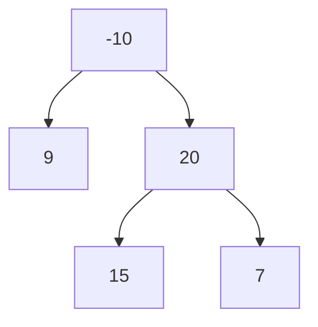

### 二叉树

#### 二叉树中序遍历

无需多言

```java
class Solution {
    public List<Integer> inorderTraversal(TreeNode root) {
        List<Integer> list = new ArrayList<>();
        if(root == null)
            return new ArrayList<Integer>();
        list.addAll(inorderTraversal(root.left));
        list.add(root.val);
        list.addAll(inorderTraversal(root.right));
        return list;
    }
}
```


接下来提供迭代做法。由于递归实质上也是在维护一个栈（拿内存当栈用），因此迭代可以将这个栈显示出来

```java
class Solution {
    public List<Integer> inorderTraversal(TreeNode root) {
        List<Integer> res = new ArrayList<Integer>();
        Deque<TreeNode> stk = new LinkedList<TreeNode>();
        while (root != null || !stk.isEmpty()) {
            while (root != null) {
                stk.push(root);
                root = root.left;
            }
            root = stk.pop();
            res.add(root.val);
            root = root.right;
        }
        return res;
    }
}
```

存储一个栈。栈每次固定弹出一个。在此题中，放入的条件为先放入左子树，读取栈数据，再放入其右子树。



#### 二叉树的最大深度

也无需多言

```java
class Solution {
    public int maxDepth(TreeNode root) {
        return root == null ? 0 : Math.max(maxDepth(root.left) + 1, maxDepth(root.right) + 1);
    }
}
```


递归更多是使用dfs的思想，也可以使用bfs来解决。

```java
class Solution {
    public int maxDepth(TreeNode root) {
        if (root == null)
            return 0;
        Queue<TreeNode> queue = new LinkedList<TreeNode>();
        queue.offer(root);
        int ans = 0;
        while (!queue.isEmpty()) {
            int size = queue.size();
            while (size > 0) {
                TreeNode node = queue.poll();
                if (node.left != null)
                    queue.offer(node.left);
                if (node.right != null)
                    queue.offer(node.right);
                size--;
            }
            ans++;
        }
        return ans;
    }
}
```

使用bfs时，队列里存放的是当前层的所有节点，每次拓展下一层时，bfs算法每次从队列中拿出一个节点并遍历出其左右节点。而在此题中需要把队列中的所有节点都拿来拓展



#### 翻转二叉树

给你一棵二叉树的根节点 `root` ，翻转这棵二叉树，并返回其根节点。

    输入：root = [4,2,7,1,3,6,9]
    输出：[4,7,2,9,6,3,1]

无需多言

```java
class Solution {
    public TreeNode invertTree(TreeNode root) {
        if(root == null)
            return null;
        TreeNode temp = invertTree(root.left);
        root.left = invertTree(root.right);
        root.right = temp;
        return root;
    }
}
```


只要能用递归的二叉树都不算难，并且递归都能用队列迭代来替代实现。


#### 对称二叉树

给你一个二叉树的根节点 `root` ， 检查它是否轴对称。

示例：

    输入：`root = [1,2,2,3,4,4,3]`
    输出：`true`

依然可以使用递归。难点在于互为镜像的条件。本题中镜像条件如下

- 对应的两个根结点具有相同的值
- 每个右子树都与另一个左子树镜像对称

因此可以实现这样一个递归函数，通过“同步移动”两个指针的方法来遍历这棵树。当一个左移时另一个右移，反之亦然。每次检查两个值是否相等，若相等再判断两个子树是否对称。

```java
class Solution {
    public boolean isSymmetric(TreeNode root) {
        return check(root.left, root.right);
    }

    public boolean check(TreeNode p, TreeNode q) {
        if (p == null && q == null)
            return true;
        if (p == null || q == null)
            return false;
        return p.val == q.val && check(p.left, q.right) && check(p.right, q.left);
    }
}
```


使用迭代时，需要把根节点入队两个并提取两个节点，最后比较他们的值。然后将两个节点的左右子节点按相反的顺序插入队列中。

```java
class Solution {
    public boolean isSymmetric(TreeNode root) {
        return check(root, root);
    }

    public boolean check(TreeNode u, TreeNode v) {
        Queue<TreeNode> q = new LinkedList<TreeNode>();
        q.offer(u);
        q.offer(v);
        while (!q.isEmpty()) {
            u = q.poll();
            v = q.poll();
            if (u == null && v == null)
                continue;
            if ((u == null || v == null) || (u.val != v.val))
                return false;

            q.offer(u.left);
            q.offer(v.right);

            q.offer(u.right);
            q.offer(v.left);
        }
        return true;
    }
}
```



#### 二叉树的直径

给你一棵二叉树的根节点，返回该树的直径 。
二叉树的 **直径** 是指树中任意两个节点之间最长路径的 **长度** 。这条路径可能经过也可能不经过根节点 `root` 。
两节点之间路径的长度由它们之间边数表示。

示例：

    输入：`root = [1,2,3,4,5]`
    输出：`3`
    解释：`3` ，取路径 `[4,2,1,3]` 或 `[5,2,1,3]` 的长度。

任意一条路径的长度为该路径经过的节点数减一，而任一路径均可以看作由某个节点为起点，从其左儿子和右儿子向下遍历的路径拼接得到。

![路径 [9, 4, 2, 5, 7, 8] 可以被看作以 2 为起点，从其左儿子向下遍历的路径 [2, 4, 9] 和从其右儿向下遍历的路径 [2, 5, 7, 8] 拼接得到。](explain1.jpg)

于是，某节点为起点的路径纪念馆过节点数的最大值为$L+R+1$。而二叉树直径就是所有结点路径的最大值减一。

```java
class Solution {
    int ans;
    public int diameterOfBinaryTree(TreeNode root) {
        ans = 1;
        depth(root);
        return ans - 1;
    }
    public int depth(TreeNode node) {
        if (node == null)
            return 0;
        int L = depth(node.left);
        int R = depth(node.right);
        ans = Math.max(ans, L+R+1);
        return Math.max(L, R) + 1;
    }
}
```

其中的`ans`为路径的最大值。

#### 二叉树层序遍历

参考[求最大高度的迭代代码](#二叉树的最大深度)即可

```java
class Solution {
    public List<List<Integer>> levelOrder(TreeNode root) {
        if(root == null)
          return new ArrayList<>();
        List<List<Integer>> ans = new ArrayList<>();
        Queue<TreeNode> queue = new LinkedList<>();
        queue.offer(root);
        while(!queue.isEmpty()) {
          int size = queue.size();
          ArrayList<Integer> temp = new ArrayList<>();
          while(size > 0) {
            TreeNode node = queue.poll();
            temp.add(node.val);
            if(node.left != null)
              queue.offer(node.left);
            if(node.right != null)
              queue.offer(node.right);
            size--;
          }
          ans.add(temp);
        }
        return ans;
    }
}
```

#### 将有序数组转换为二叉搜索树

给你一个整数数组 `nums` ，其中元素已经按 **升序** 排列，请你将其转换为一棵 **平衡** 二叉搜索树。

示例：

    输入：`nums = [-10,-3,0,5,9]`
    输出：`[0,-3,9,-10,null,5]`
    解释：`[0,-10,5,null,-3,null,9]` 也将被视为正确答案


平衡二叉树的子树也一定是平衡二叉树，因此可以通过子数列递归实现。就我的通过代码来看，时间最快但空间使用率吓人

```java
class Solution {
    public TreeNode sortedArrayToBST(int[] nums) {
        int length = nums.length, middle = length / 2;
        TreeNode ans = new TreeNode(nums[middle]);
        if(middle != 0) {
            int[] left = Arrays.copyOfRange(nums, 0, middle);
            ans.left = sortedArrayToBST(left);
        }
        if(middle != length - 1) {
            int[] right = Arrays.copyOfRange(nums, middle + 1, length);
            ans.right = sortedArrayToBST(right);
        }
        return ans;
    }
}
```



按照题解，选择中间靠左、中间靠右、任意数作为根节点都有对应的BST，此处仅选择第一种。此时的根节点下标为（整数除法）
$$
\text{mid}=\frac{\text{left+right}}{2}
$$

```java
class Solution {
    public TreeNode sortedArrayToBST(int[] nums) {
        return helper(nums, 0, nums.length - 1);
    }

    public TreeNode helper(int[] nums, int left, int right) {
        if (left > right)
            return null;

        int mid = (left + right) / 2;

        TreeNode root = new TreeNode(nums[mid]);
        root.left = helper(nums, left, mid - 1);
        root.right = helper(nums, mid + 1, right);
        return root;
    }
}
```

#### 验证二叉搜索树

给你一个二叉树的根节点 `root` ，判断其是否是一个有效的二叉搜索树。
示例略


观察到BST的中序遍历是升序排列，因此只要比较中序遍历出来的数组是否满足升序排列就行。但该方法还不是最快。

```java
class Solution {
    public boolean isValidBST(TreeNode root) {
        Deque<TreeNode> stack = new LinkedList<>();
        Integer history = null, now;
        while(root != null || !stack.isEmpty()) {
            while(root != null) {
                stack.push(root);
                root = root.left;
            }
            root = stack.pop();
            now = root.val;
            if(history != null && now <= history)
                return false;
            history = now;
            root = root.right;
        }
        return true;
    }
}
```



依然可以使用递归来做

```java
class Solution {
    public boolean isValidBST(TreeNode root) {
        return isValidBST(root, Long.MIN_VALUE, Long.MAX_VALUE);
    }

    public boolean isValidBST(TreeNode node, long lower, long upper) {
        if (node == null)
            return true;
        if (node.val <= lower || node.val >= upper)
            return false;
        return isValidBST(node.left, lower, node.val) && isValidBST(node.right, node.val, upper);
    }
}
```



```java
public boolean isValidBST(TreeNode root) {
    if(root.left == null && root.right == null)
        return true;
    else if(root.right == null)
        return root.left.val < root.val && isValidBST(root.left);
    else if(root.left == null)
        return root.right.val > root.val && isValidBST(root.right);
    else
        return root.left.val < root.val && root.right.val > root.val && isValidBST(root.left) && isValidBST(root.right);
}
```

我写的递归和这个递归的思路是一致的：BST的子树也会是BST。但是我的会因为这种情况而判错


这里增加了上下界判断条件，通过根节点的值为条件不断添加上下界。


当然迭代也是可以的，这里不写了。思路和蓝色注释部分是一样的。

#### 二叉搜索树中第K小的元素

给定一个二叉搜索树的根节点 `root` ，和一个整数 `k` ，请你设计一个算法查找其中第 `k` 小的元素（从 `1` 开始计数）。

示例：

    输入：`root = [3,1,4,null,2], k = 1`
    输出：`1`

牢记BST的中序遍历呈升序排列

```java
class Solution {
    public int kthSmallest(TreeNode root, int k) {
        Deque<TreeNode> stack = new LinkedList<>();
        TreeNode temp;
        int counter = 1;
        while(root != null || !stack.isEmpty()) {
          while(root != null) {
            stack.push(root);
            root = root.left;
          }
          root = stack.pop();
          if(counter == k)
            return root.val;
          counter++;
          root = root.right;
        }
        return 0;
    }
}
```

#### 二叉树的右视图

给定一个二叉树的 根节点 `root`，想象自己站在它的右侧，按照从顶部到底部的顺序，返回从右侧所能看到的节点值。

示例：

    输入：`root = [1,2,3,null,5,null,4]`
    输出：`[1,3,4]`


我是sb，最🤡的一次，明明知道了出来的是同高度最右边的那个，结果敲了半天的中序遍历🤡🤡🤡。然后看评论是层序遍历，一语惊醒梦中人。如果是中序遍历，高度根本不好找。知道了可以用层序遍历，10分钟就敲完了。

```java
class Solution {
    public List<Integer> rightSideView(TreeNode root) {
        if(root == null)
            return new ArrayList<>();
        Queue<TreeNode> queue = new LinkedList<>();
        List<Integer> ans = new ArrayList<>();
        TreeNode temp;
        int node = -10000, size;
        queue.offer(root);
        while (!queue.isEmpty()) {
            size = queue.size();
            while (size > 0) {
                temp = queue.poll();
                if(temp.left != null)
                    queue.offer(temp.left);
                if(temp.right != null)
                    queue.offer(temp.right);
                node = temp.val;
                size--;
            }
            ans.add(node);
        }
        return ans;
    }
}
```



官方题解是基于dfs的递归实现，我们总是先访问右子树，这样出来的就是最右边的结点了。

```java
class Solution {
    public List<Integer> rightSideView(TreeNode root) {
        Map<Integer, Integer> rightmostValueAtDepth = new HashMap<Integer, Integer>();
        int max_depth = -1;

        Deque<TreeNode> nodeStack = new LinkedList<TreeNode>();
        Deque<Integer> depthStack = new LinkedList<Integer>();
        nodeStack.push(root);
        depthStack.push(0);

        while (!nodeStack.isEmpty()) {
            TreeNode node = nodeStack.pop();
            int depth = depthStack.pop();

            if (node != null) {
                max_depth = Math.max(max_depth, depth);

                if (!rightmostValueAtDepth.containsKey(depth))
                    rightmostValueAtDepth.put(depth, node.val);

                nodeStack.push(node.left);
                nodeStack.push(node.right);
                depthStack.push(depth + 1);
                depthStack.push(depth + 1);
            }
        }

        List<Integer> rightView = new ArrayList<Integer>();
        for (int depth = 0; depth <= max_depth; depth++)
            rightView.add(rightmostValueAtDepth.get(depth));

        return rightView;
    }
}
```

#### 二叉树展开为链表

给你二叉树的根结点 `root` ，请你将它展开为一个单链表：

- 展开后的单链表应该同样使用 `TreeNode` ，其中 `right` 子指针指向链表中下一个结点，而左子指针始终为 `null` 。
- 展开后的单链表应该与二叉树 **先序遍历** 顺序相同。

示例：

    输入：`root = [1,2,5,3,4,null,6]`
    输出：`[1,null,2,null,3,null,4,null,5,null,6]`


简简单单的递归

```java
class Solution {
    public void flatten(TreeNode root) {
        if(root == null)
            return;
        flatten(root.right);
        if(root.left == null)
            return;
        flatten(root.left);
        TreeNode temp = root.left, right = root.right;
        while(temp.right != null)
            temp = temp.right;
        root.right = root.left;
        root.left = null;
        temp.right = right;
    }
}
```



最简单的办法就是先序遍历，然后在先序遍历的过程中一个个加链表的值。如果执意要实现$O(1)$空间复杂度的话，就需要寻找前驱节点。
前驱节点的具体做法是

- 对于当前节点，若左节点不为空，则寻找左子树最右边的节点，作为前驱节点


- 当前节点的右子节点赋给前驱节点的右子节点


- 当前节点的左子节点赋给当前节点的右子节点，左子节点赋空


- 继续处理下一节点(即cur移动到2)

故最后的源码如下

```java
class Solution {
    public void flatten(TreeNode root) {
        TreeNode curr = root;
        while (curr != null) {
            if (curr.left != null) {
                TreeNode next = curr.left;
                TreeNode pre = next;
                while (pre.right != null) {
                    pre = pre.right;
                }
                pre.right = curr.right;
                curr.left = null;
                curr.right = next;
            }
            curr = curr.right;
        }
    }
}
```

#### 从前序与中序遍历序列构造二叉树

给定两个整数数组 `preorder` 和 `inorder` ，其中 `preorder` 是二叉树的先序遍历， `inorder` 是同一棵树的中序遍历，请构造二叉树并返回其根节点。

示例：

    输入: `preorder = [3,9,20,15,7], inorder = [9,3,15,20,7]`
    输出: `[3,9,20,null,null,15,7]`

先序遍历的第一个数一定是根节点，中序遍历中根节点的左边一定在左子树上，而这篇数据在先序遍历中也一定是连续的，因此可以通过某种手段将这两个序列分成两半，分别对应左子树和右子树。然后通过递归或迭代生成对应结果。


先前写的C++的代码。该题不难，主要是比较复杂。学校数据结构oj也有原题，但给的参数是数组，数组的分割和参数传递极其简单，算是给降难度了。

```cpp
class Solution {
public:
    TreeNode* buildTree(vector<int>& preorder, vector<int>& inorder) {
        if(preorder.empty() || inorder.empty())
        return nullptr;
        int root_val = preorder[0];
        auto it_in = inorder.begin(), it_pre = preorder.begin() + 1;
        for(; *it_in != root_val; ++it_in);
        vector<int> left_inorder, right_inorder, left_preorder, right_preorder;
        if(it_in != inorder.begin())
            left_inorder.insert(left_inorder.end(), inorder.begin(), it_in);
        if(it_in != inorder.end() - 1)
            right_inorder.insert(right_inorder.end(), it_in + 1, inorder.end());
        left_preorder.insert(left_preorder.end(), it_pre, it_pre + left_inorder.size());
        if(it_pre != preorder.end())
            right_preorder.insert(right_preorder.end(), it_pre + left_inorder.size(), preorder.end());
        return new TreeNode(root_val, buildTree(left_preorder, left_inorder), buildTree(right_preorder, right_inorder));
    }
};
```



在中序遍历中对根节点进行定位时，一种简单的方法是直接扫描整个中序遍历的结果并找出根节点，但这样做的时间复杂度较高。我们可以考虑使用哈希表来帮助我们快速地定位根节点。对于哈希映射中的每个键值对，键表示一个元素（节点的值），值表示其在中序遍历中的出现位置。在构造二叉树的过程之前，我们可以对中序遍历的列表进行一遍扫描，就可以构造出这个哈希映射。在此后构造二叉树的过程中，我们就只需要 $O(1)$ 的时间对根节点进行定位了。

以下为递归法

```java
class Solution {
    private Map<Integer, Integer> indexMap;

    public TreeNode myBuildTree(int[] preorder, int[] inorder, int preorder_left, int preorder_right, int inorder_left, int inorder_right) {
        if (preorder_left > preorder_right)
            return null;

        int preorder_root = preorder_left;
        int inorder_root = indexMap.get(preorder[preorder_root]);
        
        TreeNode root = new TreeNode(preorder[preorder_root]);
        int size_left_subtree = inorder_root - inorder_left;
        root.left = myBuildTree(preorder, inorder, preorder_left + 1, preorder_left + size_left_subtree, inorder_left, inorder_root - 1);
        root.right = myBuildTree(preorder, inorder, preorder_left + size_left_subtree + 1, preorder_right, inorder_root + 1, inorder_right);
        return root;
    }

    public TreeNode buildTree(int[] preorder, int[] inorder) {
        int n = preorder.length;
        indexMap = new HashMap<Integer, Integer>();
        for (int i = 0; i < n; i++)
            indexMap.put(inorder[i], i);
        return myBuildTree(preorder, inorder, 0, n - 1, 0, n - 1);
    }
}
```


看到题解的递归传参也这么丑陋我就放心了


以下为迭代法

```java
class Solution {
    public TreeNode buildTree(int[] preorder, int[] inorder) {
        if (preorder == null || preorder.length == 0)
            return null;
        TreeNode root = new TreeNode(preorder[0]);
        Deque<TreeNode> stack = new LinkedList<TreeNode>();
        stack.push(root);
        int inorderIndex = 0;
        for (int i = 1; i < preorder.length; i++) {
            int preorderVal = preorder[i];
            TreeNode node = stack.peek();
            if (node.val != inorder[inorderIndex]) {
                node.left = new TreeNode(preorderVal);
                stack.push(node.left);
            } else {
                while (!stack.isEmpty() && stack.peek().val == inorder[inorderIndex]) {
                    node = stack.pop();
                    inorderIndex++;
                }
                node.right = new TreeNode(preorderVal);
                stack.push(node.right);
            }
        }
        return root;
    }
}
```

对前序遍历某个连续的节点`u`和`v`，只有两种可能的关系

- `v`是`u`的左儿子
- `u`没有左儿子，并且`v`是`u`的某个祖先节点（或者`u`本身）的右儿子。

    - 若`u`没有左儿子，那么`v`就是`u`的右儿子
    - 若`u`没有右儿子，那么可以向上追溯，直到遇到第一个有右儿子的节点。该节点的右儿子就是`v`


题解中的例子如下

我们以树


和其遍历

```
preorder = [3, 9, 8, 5, 4, 10, 20, 15, 7]
inorder = [4, 5, 8, 10, 9, 3, 15, 20, 7]
```

为例。我们使用栈和指针进行维护。

- 栈压入根节点3，指针指向4
- 遍历9，9不等于栈顶3，因此9是3的左儿子，入栈
    假如9是3的右儿子，那么由于先序遍历，3没有左儿子。这与中序遍历开头不是3相矛盾
- 遍历8、5、4同理，是上一节点的左儿子，入栈 `stack=[3 9 8 5 4] *index=4`
- 遍历10，此时栈顶为4，和中序一样了，那么4没有左儿子。那么10一定是栈中某个节点的右儿子
    如何找到这个节点呢？我们可以把指针不断移动，同时弹出栈顶节点（若栈顶节点等于指针指向值），直到指针指向值不等于栈顶值(此例中为`stack=[3 9] *index=10`)。不等于时，说明 10 就是弹出的最后一个节点 8 的右儿子
    8在此时是根节点，中序遍历中遍历完8后会先遍历其右儿子10，而先序遍历中会先遍历完左儿子再遍历枝杈，这就是二者不同的原因
    最后把10入栈 `stack=[3 9 10] *index=10`
- 遍历到20，刚好又和栈顶10相等，弹出9、3，栈空，因此20是3的右儿子。20入栈 `stack=[20] *index=15`
- 遍历15与栈顶20不等，入栈 `stack=[20 15] *index=15`
- 遍历7，指针指向值刚好是15，弹出15和20，栈空，因此7为20的右儿子
- 遍历结束


于是，我们可以用一个栈辅助进行二叉树的构造，栈的含义为“当前节点的所有还没有考虑过右儿子的祖先节点”。初始时栈中存放了根节点（前序遍历第一个节点），指针指向中序遍历的第一个节点，该指针对应的节点是“当前节点不断往左走达到的最终节点”。
我们依次枚举前序遍历中除了第一个节点以外的每个节点。若指针恰好指向栈顶，那么我们不断地弹出栈顶节点并向右移动指针，并将当前节点作为最后一个弹出节点的右儿子。若指针和栈顶节点不同，我们将当前节点作为栈顶节点的右儿子。
无论哪一种情况，我们最后都将当前的节点入栈。

#### 路径总和III

给定一个二叉树根节点`root`，和一个整数 `targetSum` ，求该二叉树里节点值之和等于 `targetSum` 的 **路径** 的数目。
**路径** 不需要从根节点开始，也不需要在叶子节点结束，但是路径方向必须是向下的（只能从父节点到子节点）。

示例：

    输入：`root = [10,5,-3,3,2,null,11,3,-2,null,1], targetSum = 8`
    输出：`3`
    解释：和等于 `8` 的路径有 `3` 条，如图所示。

##### 深度优先搜索

使用dfs递归肯定是最自然的，但怎么实现是个问题。太简单的递归容易多算情况。

- 我们首先定义`rootSum(p,val)`表示以节点`p`为起点向下且满足路径总和为`val`的路径数目（而非使用自带函数递归），对二叉树上每个节点`p`求出`rootSum(p,val)`，然后对这些路径数目求合就是结果。
- 对节点`p`求`rootSum(p,targetSum)`时，以当前节点`p`为目标路径的起点递归向下进行搜索。假设当前的节点`p`的值为`val`，我们对左子树合右子树进行递归搜索，对其左孩子节点求出`rootSum(p.left,targetSum - val)`，右孩子同理。最后求和。同时我们还需要判断一下节点本身是否刚好等于`targetSum`。
- 采用递归遍历二叉树每个节点`p`，求`rootSum(p,val)`，然后将每个节点所有求的值进行相加求和并返回。

简单来说，`pathSum`的递归是对每一条可能的不同路径进行递归，而`rootSum`的递归是对某条特定路径进行求值。由此可以避免出现求多情况的可能。

```java
class Solution {
    public int pathSum(TreeNode root, long targetSum) {
        if (root == null)
            return 0;

        int ret = rootSum(root, targetSum);
        ret += pathSum(root.left, targetSum);
        ret += pathSum(root.right, targetSum);
        return ret;
    }

    public int rootSum(TreeNode root, long targetSum) {
        int ret = 0;
        if (root == null)
            return 0;
        int val = root.val;
        if (val == targetSum)
            ret++;
        ret += rootSum(root.left, targetSum - val);
        ret += rootSum(root.right, targetSum - val);
        return ret;
    }
}
```

##### 前缀和

此此方法可以把时间复杂度由$O(n^2)$降到$O(n)$。
我们定义前缀和为，由根节点到当前节点的路径上，所有节点的和。

- 先序遍历二叉树，记录下根节点到当前节点的路径上，除当前节点意外所有节点的前缀和。在已保存的路径前缀和中查找是否存在前缀和刚好等于当前节点到根节点的前缀和
- 空路径也需要保存预先处理一下。因为空路径不经过任何节点，因此它的前缀和为0
- 其他路径的前缀和由节点到根节点的数据相减获得

```java
class Solution {
    public int pathSum(TreeNode root, int targetSum) {
        Map<Long, Integer> prefix = new HashMap<Long, Integer>();
        prefix.put(0L, 1);
        return dfs(root, prefix, 0, targetSum);
    }

    public int dfs(TreeNode root, Map<Long, Integer> prefix, long curr, int targetSum) {
        if (root == null)
            return 0;

        int ret = 0;
        curr += root.val;

        ret = prefix.getOrDefault(curr - targetSum, 0);
        prefix.put(curr, prefix.getOrDefault(curr, 0) + 1);
        ret += dfs(root.left, prefix, curr, targetSum);
        ret += dfs(root.right, prefix, curr, targetSum);
        prefix.put(curr, prefix.getOrDefault(curr, 0) - 1);

        return ret;
    }
}
```

代码中的`curr`即为前缀和。一开始先更新前缀和数据。然后检查有多少个祖先节点满足条件（即从根节点到某个祖先节点的路径）,赋值给`ret`

```
根节点 → A → B → [当前节点]
|----- 前缀和=7 -----|      (祖先节点路径)
|---------- 前缀和=15 ---------| (当前路径)
          |----- 8 -----|      (有效路径：B的下一个节点 → 当前节点)
```

`curr - targetSum = 15 - 8 = 7`

查找前缀和为7的出现次数，若结果为2，则说明存在2个不同的祖先节点，`节点->当前节点`的路径和为8。

#### 二叉树的最近公共祖先

给定一个二叉树, 找到该树中两个指定节点的最近公共祖先。

示例：

    输入：root = [3,5,1,6,2,0,8,null,null,7,4], p = 5, q = 1
    输出：3
    解释：节点 5 和节点 1 的最近公共祖先是节点 3 。

##### 递归

遍历整棵二叉树，定义$f_x$表示$x$节点的子树是否包含$p$节点或$q$节点。需要最近公共祖先满足以下条件
$$
(f_{lson} \cap f_{rson}) \cup ((x=p\cup x=q)\cap (f_{lson}\cup f_{rson}))
$$


也就是说，需要这个节点

- 同时有左右孩子，并且两个子树上都有要求的节点
- 自己本身等于一个值，并且有一个子树上有要求的节点



```java
class Solution {

    private TreeNode ans;

    public Solution() {
        this.ans = null;
    }

    private boolean dfs(TreeNode root, TreeNode p, TreeNode q) {
        if (root == null) return false;
        boolean lson = dfs(root.left, p, q);
        boolean rson = dfs(root.right, p, q);
        if ((lson && rson) || ((root.val == p.val || root.val == q.val) && (lson || rson)))
            ans = root;
        return lson || rson || (root.val == p.val || root.val == q.val);
    }

    public TreeNode lowestCommonAncestor(TreeNode root, TreeNode p, TreeNode q) {
        this.dfs(root, p, q);
        return this.ans;
    }
}
```

##### 存储父节点

- 从根节点遍历整棵二叉树，用哈希表记录每个节点的父节点指针
- 从$p$节点开始不断往它的祖先移动，并用数据结构记录已访问过的祖先节点
- 对$q$同理，但是，若有祖先已经被访问过，那么返回这个节点

```java
class Solution {
    Map<Integer, TreeNode> parent = new HashMap<Integer, TreeNode>();
    Set<Integer> visited = new HashSet<Integer>();

    public void dfs(TreeNode root) {
        if (root.left != null) {
            parent.put(root.left.val, root);
            dfs(root.left);
        }
        if (root.right != null) {
            parent.put(root.right.val, root);
            dfs(root.right);
        }
    }

    public TreeNode lowestCommonAncestor(TreeNode root, TreeNode p, TreeNode q) {
        dfs(root);
        while (p != null) {
            visited.add(p.val);
            p = parent.get(p.val);
        }
        while (q != null) {
            if (visited.contains(q.val))
                return q;
            q = parent.get(q.val);
        }
        return null;
    }
}
```

#### 二叉树中最大的路径和

二叉树中的 **路径** 被定义为一条节点序列，序列中每对相邻节点之间都存在一条边。同一个节点在一条路径序列中 至多出现一次 。该路径 **至少包含一个** 节点，且不一定经过根节点。**路径和** 是路径中各节点值的总和。给你一个二叉树的根节点 `root` ，返回其 **最大路径和** 。

##### 递归

考虑一个函数`maxGain(node)`，计算二叉树某个节点的最大贡献值，也就是说，以该节点为根节点的子树中，寻找以该节点为起点的一条路径，使得该路径上的节点之和最大。
计算方式如下

- 空姐点的最大贡献值为0
- 非空节点的最大贡献值等于该节点与其子节点中的最大贡献值之和（叶节点则为节点值本身）

对于以下子树



`9` `15` `7`的最大贡献值是其本身，`20`的贡献值为`20 + max(15,7) = 35`，节点`-10`的最大贡献值为`-10 + max(9,35) = 25`。
计算完每个节点的最大贡献值后，某节点的最大路径和取决于该节点的值和这个节点的左右子节点的最大贡献值。若子节点的最大贡献值为正，那么就计入该节点的最大路径和。维护变量存贮最大路径和并不断更新

```java
class Solution {
    int maxSum = Integer.MIN_VALUE;

    public int maxPathSum(TreeNode root) {
        maxGain(root);
        return maxSum;
    }

    public int maxGain(TreeNode node) {
        if (node == null)
            return 0;
        
        int leftGain = Math.max(maxGain(node.left), 0);
        int rightGain = Math.max(maxGain(node.right), 0);
        int priceNewpath = node.val + leftGain + rightGain;
        maxSum = Math.max(maxSum, priceNewpath);
        return node.val + Math.max(leftGain, rightGain);
    }
}
```

### 堆

#### 数组中第K个最大的元素

给定整数数组 `nums` 和整数 `k`，请返回数组中第 `k` 个最大的元素。
你必须设计并实现时间复杂度为 $O(n)$ 的算法解决此问题。

##### 快排

[有关快排的内容可以看这里](https://ivanclf.github.io/2024/12/30/data-structure-1/#%E5%BF%AB%E9%80%9F%E6%8E%92%E5%BA%8F)
快排需要进行划分操作，而每次划分后，对于子数组`a[l...q-1]`中的每个元素，都小于`a[q]`，且`a[q]`小于`a[q+1...r]`中的每个元素，因此，只要某次划分的`q`为倒数第`k`个下标的时候，我们就找到了答案。
因此在划分中，若划分的`q`恰好就是需要的数，就返回`a[q]`；若`q`比目标下标小，就递归右区间，否则递归左区间。

```java
class Solution {
    int quickselect(int[] nums, int l, int r, int k) {
        if (l == r) return nums[k];
        int x = nums[l], i = l - 1, j = r + 1;
        while (i < j) {
            do i++; while (nums[i] < x);
            do j--; while (nums[j] > x);
            if (i < j){
                int tmp = nums[i];
                nums[i] = nums[j];
                nums[j] = tmp;
            }
        }
        if (k <= j) return quickselect(nums, l, j, k);
        else return quickselect(nums, j + 1, r, k);
    }
    public int findKthLargest(int[] _nums, int k) {
        int n = _nums.length;
        return quickselect(_nums, 0, n - 1, n - k);
    }
}
```

`quickselect()`函数中，第二第三个参数是数组的指定区间，最后一个参数为指定元素的索引。在入口函数`findKthLargest()`中，寻找的是第`k`大的元素在升序数组中的位置`n - k`。以最左元素`nums[l]`为基准，

- 初始化指针`i = l - 1`和`j = r + 1`
- 移动`i`直到找到不小于基准的元素，移动`j`直到找到不大于基准的元素
- 交换`i`和`j`的元素，确保左侧元素不大于基准，右侧元素不小于基准

这其实就是快排的过程。然后自然就是递归。但我们只需要找出对应元素即可，因此可以递归半边。若`k <= j`，说明目标在左半部分，只需递归左半部分即可，右边同理。
平均时间复杂度为$O(n)$

##### 堆排

建立一个大根堆，做$k-1$次删除操作后堆顶的元素就是我们要找的答案。
[有关堆排序的内容可以看这里](https://ivanclf.github.io/2024/12/30/data-structure-1/#%E5%A0%86%E6%8E%92%E5%BA%8F)
大根堆中，每个节点的值都大于等于其节点的值。代码首先将数组重新排列成一个最大堆，然后每次我们拿走塔顶的数字（最大值），然后重新调整金字塔，让下一个最大的数字升到塔顶，重复K次后就是最后结果。

```java
class Solution {
    public int findKthLargest(int[] nums, int k) {
        int heapSize = nums.length;
        buildMaxHeap(nums, heapSize);
        for (int i = nums.length - 1; i >= nums.length - k + 1; --i) {
            swap(nums, 0, i);
            --heapSize;
            maxHeapify(nums, 0, heapSize);
        }
        return nums[0];
    }

    public void buildMaxHeap(int[] a, int heapSize) {
        for (int i = heapSize / 2 - 1; i >= 0; --i)
            maxHeapify(a, i, heapSize);
    }

    public void maxHeapify(int[] a, int i, int heapSize) {
        int l = i * 2 + 1, r = i * 2 + 2, largest = i;
        if (l < heapSize && a[l] > a[largest])
            largest = l;
        if (r < heapSize && a[r] > a[largest])
            largest = r;
        if (largest != i) {
            swap(a, i, largest);
            maxHeapify(a, largest, heapSize);
        }
    }

    public void swap(int[] a, int i, int j) {
        int temp = a[i];
        a[i] = a[j];
        a[j] = temp;
    }
}
```

时间复杂度为$O(n \log n)$

#### 前K个高频元素

给你一个整数数组 `nums` 和一个整数 `k` ，请你返回其中出现频率前 `k` 高的元素。你可以按 **任意顺序** 返回答案。
你所设计算法的时间复杂度 **必须** 优于 $O(n \log n)$ ，其中 `n` 是数组大小。

##### 堆

维护一个“出现次数数组”，建立一个小顶堆，然后给这个“出现次数数组”排序。

- 若堆的元素个数小于k，就直接插入堆中
- 若堆的元素个数等于k，就检查堆顶与当前出现次数的大小，堆顶值更小时就弹出堆顶，并将当前值插入堆中

```java
class Solution {
    public int[] topKFrequent(int[] nums, int k) {
        Map<Integer, Integer> occurrences = new HashMap<Integer, Integer>();
        for (int num : nums)
            occurrences.put(num, occurrences.getOrDefault(num, 0) + 1);

        // int[] 的第一个元素代表数组的值，第二个元素代表了该值出现的次数
        PriorityQueue<int[]> queue = new PriorityQueue<int[]>(new Comparator<int[]>() {
            public int compare(int[] m, int[] n) {
                return m[1] - n[1];
            }
        });
        for (Map.Entry<Integer, Integer> entry : occurrences.entrySet()) {
            int num = entry.getKey(), count = entry.getValue();
            if (queue.size() == k)
                if (queue.peek()[1] < count) {
                    queue.poll();
                    queue.offer(new int[]{num, count});
                }
            else
                queue.offer(new int[]{num, count});
        }
        int[] ret = new int[k];
        for (int i = 0; i < k; ++i)
            ret[i] = queue.poll()[0];
        return ret;
    }
}
```


`PriorityQueue`是一个优先队列，在Java中默认是一个小顶堆，中间的`Comparator<int[]>`是其优先级插队规则（按出现次数排序）
`Map.Entry<Integer, Integer> entry`表示`Map`的一个键值对


##### 快排

在进行划分时，根据k与左侧子数组的长度`q - i`的大小关系

- 若`k <= q - i`，则数组`arr[i...r]`前k大的值就等于数组`arr[i...q - 1]`中前k大的值
- 否则，数组`arr[i...r]`前k大的值，就等于左侧子数组的全部元素

```java
class Solution {
    public int[] topKFrequent(int[] nums, int k) {
        Map<Integer, Integer> occurrences = new HashMap<Integer, Integer>();
        for (int num : nums)
            occurrences.put(num, occurrences.getOrDefault(num, 0) + 1);
        List<int[]> values = new ArrayList<int[]>();
        for (Map.Entry<Integer, Integer> entry : occurrences.entrySet()) {
            int num = entry.getKey(), count = entry.getValue();
            values.add(new int[]{num, count});
        }
        int[] ret = new int[k];
        qsort(values, 0, values.size() - 1, ret, 0, k);
        return ret;
    }

    public void qsort(List<int[]> values, int start, int end, int[] ret, int retIndex, int k) {
        int picked = (int) (Math.random() * (end - start + 1)) + start;
        Collections.swap(values, picked, start);
        
        int pivot = values.get(start)[1];
        int index = start;
        for (int i = start + 1; i <= end; i++)
            if (values.get(i)[1] >= pivot) {
                Collections.swap(values, index + 1, i);
                index++;
            }
        Collections.swap(values, start, index);

        if (k <= index - start)
            qsort(values, start, index - 1, ret, retIndex, k);
        else {
            for (int i = start; i <= index; i++)
                ret[retIndex++] = values.get(i)[0];
            if (k > index - start + 1)
                qsort(values, index + 1, end, ret, retIndex, k - (index - start + 1));
        }
    }
}
```


讽刺的是这两个官方题解都没过。


#### 数据流的中位数

实现 `MedianFinder` 类:

- `MedianFinder()` 初始化 `MedianFinder` 对象。
- `void addNum(int num)` 将数据流中的整数 `num` 添加到数据结构中。
- `double findMedian()` 返回到目前为止所有元素的中位数。与实际答案相差 $10^{-5}$ 以内的答案将被接受。

用两个优先队列`queMax`和`queMin`来存比中位数小的数和大于等于中位数的数。
当累计添加的数量为奇数时，`queMin`中的数量比`queMax`多一个，此时中位数为`queMin`的队头；为偶数时中位数为两个优先队列的平均数。特别地，当累计添加的数据为0时，先将数据加到小的那半。
尝试添加一个数时，若数字小于`queMin`中的中位数，就将这个数添加到`queMin`中，否则加到`queMax`中。若两个堆的元素数量尽量平衡，若不平衡（相差超过1）就把多的那堆放一个数据到另一边。

```java
class MedianFinder {
    PriorityQueue<Integer> queMin;
    PriorityQueue<Integer> queMax;

    public MedianFinder() {
        queMin = new PriorityQueue<Integer>((a, b) -> (b - a));
        queMax = new PriorityQueue<Integer>((a, b) -> (a - b));
    }
    
    public void addNum(int num) {
        if (queMin.isEmpty() || num <= queMin.peek()) {
            queMin.offer(num);
            if (queMax.size() + 1 < queMin.size())
                queMax.offer(queMin.poll());
        } else {
            queMax.offer(num);
            if (queMax.size() > queMin.size())
                queMin.offer(queMax.poll());
        }
    }
    
    public double findMedian() {
        if (queMin.size() > queMax.size())
            return queMin.peek();
        return (queMin.peek() + queMax.peek()) / 2.0;
    }
}
```
