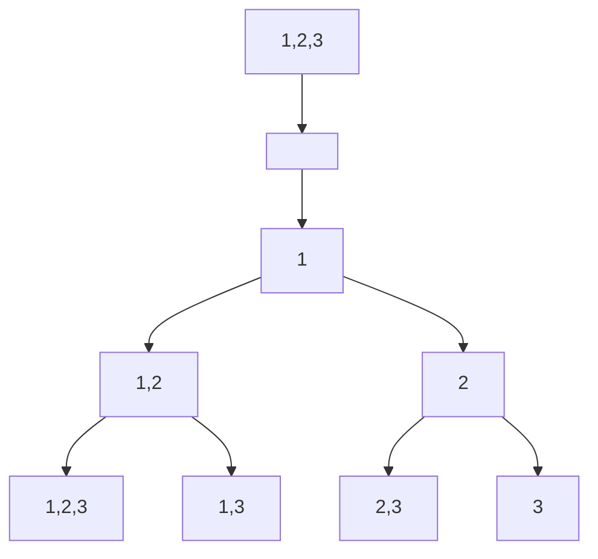
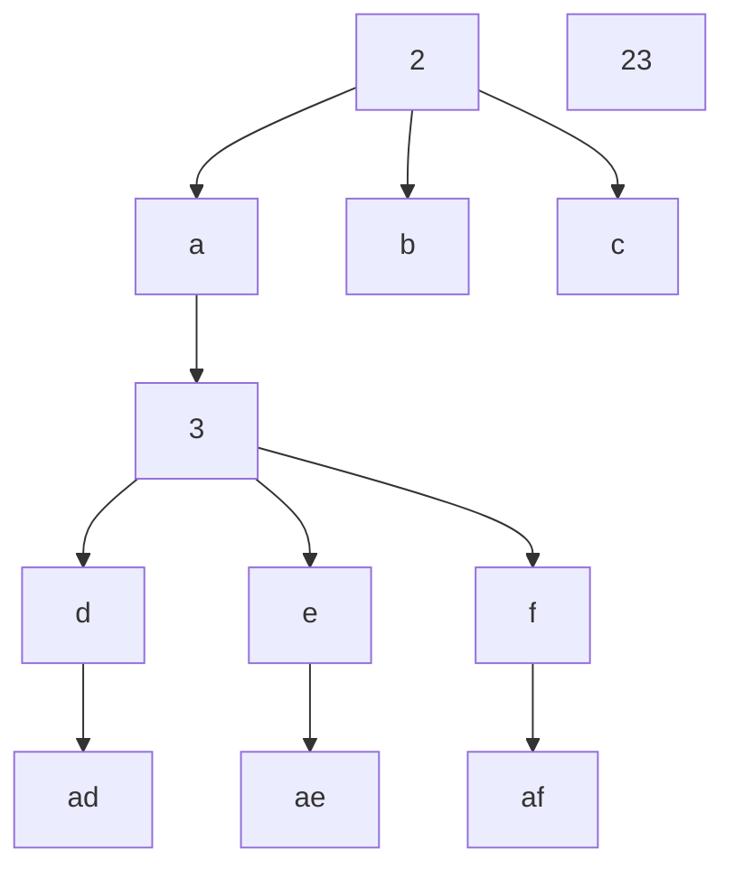

### 矩阵

#### 矩阵置零

定一个 `m x n` 的矩阵，如果一个元素为 `0` ，则将其所在行和列的所有元素都设为 `0` 。请使用**原地**算法。

示例：

    输入：`matrix = [[1,1,1],[1,0,1],[1,1,1]]`
    输出：`[[1,0,1],[0,0,0],[1,0,1]]`


最直观的方法就是使用标记数组，用`boolean`类型的数组标记出现0的行数与列数，最后再遍历

```java
class Solution {
    public void setZeroes(int[][] matrix) {
        int m = matrix.length, n = matrix[0].length;
        boolean[] row = new boolean[m], column = new boolean[n];
        for (int i = 0; i < m; i++)
            for (int j = 0; j < n; j++)
                if (matrix[i][j] == 0) {
                    row[i] = true;
                    column[j] = true;
                }
        for (int i = 0; i < m; i++) {
            if (row[i])
                Arrays.fill(matrix[i], 0);
            else
                for (int j = 0; j < n; j++)
                    if (column[j])
                        matrix[i][j] = 0;
        }
    }
}
```



本题的时间基本都是定死在$O(mn)$左右了，因此主要是讨论如何省空间。我们可以用矩阵的第一行和第一列代替标记数组。但需要另外的标记变量来标记第一列是否存在0

```java
class Solution {
    public void setZeroes(int[][] matrix) {
        int m = matrix.length, n = matrix[0].length;
        boolean flagCol0 = false;
        for (int i = 0; i < m; i++) {
            flagCol0 = matrix[i][0] == 0;
            for (int j = 1; j < n; j++) {
                if (matrix[i][j] == 0)
                    matrix[i][0] = matrix[0][j] = 0;
            }
        }
        for (int i = m - 1; i >= 0; i--)
            for (int j = 1; j < n; j++)
                if (matrix[i][0] == 0 || matrix[0][j] == 0) {
                    matrix[i][j] = 0;
            if (flagCol0)
                matrix[i][0] = 0;
        }
    }
}
```

#### 螺旋矩阵

给你一个 `m` 行 `n` 列的矩阵 `matrix` ，请按照 **顺时针螺旋顺序** ，返回矩阵中的所有元素。

示例：



古法模拟，可读性为0

```java
class Solution {
    public List<Integer> spiralOrder(int[][] matrix) {
        int n = matrix[0].length, m = matrix.length, i = 0, j = 0, left = -1, right = n, up = -1, down = m;
        List<Integer> ans = new ArrayList<>();
        while (true) {
            if (down - up <= 1 && right - left <= 1) {
                ans.add(matrix[i][j]);
                return ans;
            }

            for (; j + 1 < right; j++)
                ans.add(matrix[i][j]);
            if (down - up <= 2)
                left = j;
            else
                up++;
            
            for (; i + 1 < down; i++)
                ans.add(matrix[i][j]);
            if (right - left <= 2)
                up = i;
            else
                right--;
            
            for (; j - 1 > left; j--)
                ans.add(matrix[i][j]);
            if (down - up <= 2)
                right = j;
            else
                down--;
            
            for (; i - 1 > up; i--)
                ans.add(matrix[i][j]);
            if (right - left <= 2)
                down = i;
            else
                left++;
        }
    }
}
```



除了以上的方法，还可以使用其他的方法模拟。

- 使用`boolean`矩阵进行辅助
- 使用向量变换，乘矩阵
    `[cos(a) -sin(a)]`
    `[sin(a)   cos(a)]`

#### 旋转图像

给定一个 `n × n` 的二维矩阵 `matrix` 表示一个图像。请你将图像顺时针旋转 `90` 度。

你必须在 **原地** 旋转图像，这意味着你需要直接修改输入的二维矩阵。请不要 使用另一个矩阵来旋转图像。

示例：
.jpg)


原地旋转的思路不难，但实现的话幼多次调试

```java
class Solution {
    public void rotate(int[][] matrix) {
        int temp;
        if(matrix.length == 1)
            return;
        for(int i = 0; i < matrix.length / 2; i++)
            for(int j = 0; j < matrix.length / 2 + (matrix.length % 2 == 1 ? 1 : 0); j++) {
                temp = matrix[i][j];
                matrix[i][j] = matrix[matrix.length - 1 - j][i];
                matrix[matrix.length - 1 - j][i] = matrix[matrix.length - 1 - i][matrix.length - 1 - j];
                matrix[matrix.length - 1 - i][matrix.length - 1 - j] = matrix[j][matrix.length - 1 - i];
                matrix[j][matrix.length - 1 - i] = temp;
            }
    }
}
```



#### 搜索二叉矩阵

编写一个高效的算法来搜索 `m x n` 矩阵 `matrix` 中的一个目标值 `target` 。该矩阵具有以下特性：

- 每行的元素从左到右升序排列。
- 每列的元素从上到下升序排列。

示例：

    输入：`matrix = [[1,4,7,11,15],[2,5,8,12,19],[3,6,9,16,22],[10,13,14,17,24],[18,21,23,26,30]], target = 5`
    输出：`true`


经评论区高人提醒，可以把表格当作以右上角为根节点的BST，问题迎刃而解

```java
class Solution {
    public boolean searchMatrix(int[][] matrix, int target) {
        int m = matrix.length, n = matrix[0].length, i = 0, j = n - 1;
        if(m == n && m == 1)
            return target == matrix[0][0];
        while(i >= 0 && i < m && j >= 0 && j < n) {
            if(target == matrix[i][j])
                return true;
            else if(target > matrix[i][j])
                i++;
            else
                j--;
        }
        return false;
    }
}
```



也可以二分查找

```java
class Solution {
    public boolean searchMatrix(int[][] matrix, int target) {
        for (int[] row : matrix) {
            int index = search(row, target);
            if (index >= 0)
                return true;
        }
        return false;
    }

    public int search(int[] nums, int target) {
        int low = 0, high = nums.length - 1;
        while (low <= high) {
            int mid = (high - low) / 2 + low;
            int num = nums[mid];
            if (num == target) {
                return mid;
            else if (num > target)
                high = mid - 1;
            else
                low = mid + 1;
            }
        }
        return -1;
    }
}
```


是我自作多情，想着可以横纵两边都用分治的。


### 普通数组

#### 最大子数组和

给你一个整数数组 `nums` ，请你找出一个具有最大和的连续子数组（子数组最少包含一个元素），返回其最大和。
子数组是数组中的一个连续部分。
示例：
    输入：`nums = [-2,1,-3,4,-1,2,1,-5,4]`
    输出：`6`
    解释：连续子数组 `[4,-1,2,1]` 的和最大，为 `6` 。

##### 动态规划

用$f(i)$表示以第$i$个数结尾的“连续子数组最大和”，那么很容易有
$$
f(i)=\max \{f(i-1)+num[i], nums[i]\}
$$

```java
class Solution {
    public int maxSubArray(int[] nums) {
        int pre = 0, maxAns = nums[0];
        for (int x : nums) {
            pre = Math.max(pre + x, x);
            maxAns = Math.max(maxAns, pre);
        }
        return maxAns;
    }
}
```

##### 分治

我们定义一个操作 `get(a, l, r)` 表示查询 `a` 序列 `[l,r]` 区间内的最大子段和，那么最终我们要求的答案就是 `get(nums, 0, nums.size() - 1)`。如何分治实现这个操作呢？对于一个区间 `[l,r]`，我们取 $m=\lfloor 2l+r​ \rfloor$，对区间 `[l,m]` 和 `[m+1,r]` 分治求解。当递归逐层深入直到区间长度缩小为 1 的时候，递归“开始回升”。这个时候我们考虑如何通过 `[l,m]` 区间的信息和 `[m+1,r]` 区间的信息合并成区间 `[l,r]` 的信息。最关键的两个问题是如何维护区间内信息和如何合并信息。

对于一个区间`[l,r]`，我们维护4个量

- `lSum`表示`[l,r]`内以`l`为左端点的最大子段和
- `rSum`表示`[l,r]`内以`l`为右端点的最大子段和
- `mSum`表示`[l,r]`内的最大子段和
- `iSum`表示`[l,r]`内的区间和

设`[l.m]`为`[l,r]`的左子区间，`[m.r]`为`[l,r]`的右子区间。若区间长度为1，这4个量都相等。对于长度大于1的区间

- $iSum = iSum_{左子区间}+iSum_{右子区间}$
- $lSum = \max \{ lSum_{左子区间},iSum_{右子区间}+lSum_{右子区间}\}$
- $rSum = \max \{ rSum_{右子区间},iSum_{左子区间}+rSum_{左子区间}\}$
- $mSum = \max \{ mSum_{左子区间},mSum_{右子区间},rSum_{左子区间}+lSum_{左子区间}\}$

```java
class Solution {
    public class Status {
        public int lSum, rSum, mSum, iSum;

        public Status(int lSum, int rSum, int mSum, int iSum) {
            this.lSum = lSum;
            this.rSum = rSum;
            this.mSum = mSum;
            this.iSum = iSum;
        }
    }

    public int maxSubArray(int[] nums) {
        return getInfo(nums, 0, nums.length - 1).mSum;
    }

    public Status getInfo(int[] a, int l, int r) {
        if (l == r) {
            return new Status(a[l], a[l], a[l], a[l]);
        }
        int m = (l + r) >> 1;
        Status lSub = getInfo(a, l, m);
        Status rSub = getInfo(a, m + 1, r);
        return pushUp(lSub, rSub);
    }

    public Status pushUp(Status l, Status r) {
        int iSum = l.iSum + r.iSum;
        int lSum = Math.max(l.lSum, l.iSum + r.lSum);
        int rSum = Math.max(r.rSum, r.iSum + l.rSum);
        int mSum = Math.max(Math.max(l.mSum, r.mSum), l.rSum + r.lSum);
        return new Status(lSum, rSum, mSum, iSum);
    }
}
```

将分治下来以后区间的信息用堆式存储的方式记忆下来，即建成了一棵真正的树以后，我们就可以在$O(\log n)$时间内找到任意区间的答案。这棵树称为**线段树**。

##### 前缀和

```java
class Solution {
    public int maxSubArray(int[] nums) {
        int ans=Integer.MIN_VALUE;
        int min=0;
        int sum=0;
        for(int i : nums) {
            sum += i;
            ans=Math.max(ans, sum - min);
            min=Math.min(min, sum);
        }
        return ans;
    }
}
```

数组犹如一座山，我们用最高的山峰减去最低的山谷。

#### 合并区间

以数组 `intervals` 表示若干个区间的集合，其中单个区间为 `intervals[i] = [starti, endi]` 。请你合并所有重叠的区间，并返回 一个不重叠的区间数组，该数组需恰好覆盖输入中的所有区间 。

示例：
    输入：`intervals = [[1,3],[2,6],[8,10],[15,18]]`
    输出：`[[1,6],[8,10],[15,18]]`
    解释：区间 `[1,3]` 和 `[2,6]` 重叠, 将它们合并为 `[1,6]`.


按位图来做会有`[1,4][5,6]`这种情况出现


其中的区间按照左端点升序排序。然后我们建第一个区间加入`merged`数组中，并按顺序考虑以后的每个区间。

- 若当前区间的左端点在返回数组中最后一个区间的右端点后，就不会重合，直接加入返回数组中。
- 否则，二者冲个，用当前区间的右端点更新数组`merged`中最后一个区间的右端点。

```java
class Solution {
    public int[][] merge(int[][] intervals) {
        if (intervals.length == 0)
            return new int[0][2];
        Arrays.sort(intervals, (a, b) -> a[0] - b[0]);
        List<int[]> merged = new ArrayList<int[]>();
        for (int i = 0; i < intervals.length; ++i) {
            int L = intervals[i][0], R = intervals[i][1];
            if (merged.size() == 0 || merged.get(merged.size() - 1)[1] < L)
                merged.add(new int[]{L, R});
            else
                merged.get(merged.size() - 1)[1] = Math.max(merged.get(merged.size() - 1)[1], R);
        }
        return merged.toArray(new int[merged.size()][]);
    }
}
```

#### 轮转数组

给定一个整数数组`nums`，将数组中的元素向右轮转 `k` 个位置，其中 `k` 是非负数。

示例:
    输入: `nums = [1,2,3,4,5,6,7], k = 3`
    输出: `[5,6,7,1,2,3,4]`
    解释:
    向右轮转 1 步: `[7,1,2,3,4,5,6]`
    向右轮转 2 步: `[6,7,1,2,3,4,5]`
    向右轮转 3 步: `[5,6,7,1,2,3,4]`


此处仅介绍环状替换这种办法。其实思路是不难的，但面对`k`恰好是数组长的倍数的情况，就要想新办法。


我们不妨先考虑这样一个问题：从 `0` 开始不断遍历，最终回到起点 `0` 的过程中，我们遍历了多少个元素？
由于最终回到了起点，故该过程恰好走了整数数量的圈，不妨设为 $a$ 圈；再设该过程总共遍历了 $b$ 个元素。因此，我们有$an=bk$，即$an$一定是$n,k$的公倍数。$a$又要尽可能小，因此$an=\text{lcm} (n,k)$，因此$b=\frac{\text{lcm}(n,k)}{k}$。
这说明单次遍历会访问到$\frac{\text{lcm}(n,k)}{k}$个元素，为了访问到所有的元素，我们需要遍历的次数为
$$
\frac{n}{\displaystyle\frac{\text{lcm}(n,k)}{k}}=\frac{nk}{\text{lcm}(n,k)}=\text{gcd}(n,k)
$$

也可以换个方式完成代码。使用单独的变量`count`跟踪当前已访问的元素数量。`count = n`时结束遍历。

```java
class Solution {
    public void rotate(int[] nums, int k) {
        int n = nums.length;
        k = k % n;
        int count = gcd(k, n);
        for (int start = 0; start < count; ++start) {
            int current = start, prev = nums[start];
            do {
                int next = (current + k) % n;
                int temp = nums[next];
                nums[next] = prev;
                prev = temp;
                current = next;
            } while (start != current);
        }
    }

    public int gcd(int x, int y) {
        return y > 0 ? gcd(y, x % y) : x;
    }
}
```

或者可以用更简单的方式解决？数组中有些元素是要放到数组头部的，那不如直接反转

```java
class Solution {
    public void rotate(int[] nums, int k) {
        k %= nums.length;
        reverse(nums, 0, nums.length - 1);
        reverse(nums, 0, k - 1);
        reverse(nums, k, nums.length - 1);
    }

    public void reverse(int[] nums, int start, int end) {
        while (start < end) {
            int temp = nums[start];
            nums[start] = nums[end];
            nums[end] = temp;
            start += 1;
            end -= 1;
        }
    }
}
```

#### 除自身外数组的乘积

给你一个整数数组 `nums`，返回 数组 `answer` ，其中 `answer[i]` 等于 `nums` 中除 `nums[i]` 之外其余各元素的乘积 。
题目数据 保证 数组 `nums`之中任意元素的全部前缀元素和后缀的乘积都在  **32 位** 整数范围内。
请 **不要使用除法**，且在 `O(n)` 时间复杂度内完成此题。
示例:
    输入: `nums = [1,2,3,4]`
    输出: `[24,12,8,6]`


这是按照提示写的前后缀和法

```java
class Solution {
    public int[] productExceptSelf(int[] nums) {
        int[] prefix = new int[nums.length], suffix = new int[nums.length], ans = new int[nums.length];
        prefix[0] = 1;
        suffix[nums.length - 1] = 1;
        for(int i = 1; i < nums.length; i++) {
            prefix[i] = prefix[i - 1] * nums[i - 1];
            suffix[nums.length - i - 1] = suffix[nums.length - i] * nums[nums.length - i];
        }
        for(int i = 0; i < nums.length; i++)
            ans[i] = prefix[i] * suffix[i];
        return ans;
    }
}
```



也可以将前缀和或后缀和数组用输出数组来计算。先用结果数组放前缀和，再将后缀和放到一个变量上。

```java
class Solution {
    public int[] productExceptSelf(int[] nums) {
        int length = nums.length;
        int[] answer = new int[length];
        answer[0] = 1;
        for (int i = 1; i < length; i++)
            answer[i] = nums[i - 1] * answer[i - 1];
        int R = 1;
        for (int i = length - 1; i >= 0; i--) {
            answer[i] = answer[i] * R;
            R *= nums[i];
        }
        return answer;
    }
}
```

#### 缺失的第一个正数

给你一个未排序的整数数组 `nums` ，请你找出其中没有出现的最小的正整数。
请你实现时间复杂度为 $O(n)$ 并且只使用常数级别额外空间的解决方案。

示例：
    输入：`nums = [3,4,-1,1]`
    输出：`2`
    解释：`1` 在数组中，但 `2` 没有。


如果不要求时空复杂度，那么就是简单题

```java
class Solution {
    public int firstMissingPositive(int[] nums) {
        Set<Integer> set = new HashSet<>();
        for(int i : nums)
            if(i > 0)
                set.add(i);
        for(int i = 1; i <= Integer.MAX_VALUE; i++)
            if(!set.contains(i))
                return i;
        return 0;
    }
}
```



##### 哈希表

我们为什么需要哈希表，因为哈希表可以快速寻找需要的数字的数据结构。我们需要设计一个标记以替代哈希表的功能。
实际上，没有出现的最小正整数只能在[1, N+1]中，因此可以这样设计：对于遍历到的树$x$，如果它在[1, N]范围内，那么久将数组中的第$x-1$个位置打上“标记”。若所有位置都打上了标记，那么答案就是N + 1，否则答案是最小的没有打上标记的数。
于是

- 小于0的数统一变成 N + 1
- 遍历每一个数$x$，它可能已经被打了标记，因此原本对应的数是$|x|$，若$|x|\in [1,N]$，那么就给第$|x|-1$个元素加负号（原先就有的不用加了）
- 若数组中每一个数字都是负数，那么结果就是N + 1，否则答案是第一个正数的位置加1。


长话短说：给负数作不可能的答案作标记，正数作负号标记。妙哉妙哉。


```java
class Solution {
    public int firstMissingPositive(int[] nums) {
        int n = nums.length;
        for (int i = 0; i < n; ++i)
            if (nums[i] <= 0)
                nums[i] = n + 1;
        for (int i = 0; i < n; ++i) {
            int num = Math.abs(nums[i]);
            if (num <= n)
                nums[num - 1] = -Math.abs(nums[num - 1]);
        }
        for (int i = 0; i < n; ++i)
            if (nums[i] > 0)
                return i + 1;
        return n + 1;
    }
}
```

##### 置换

若数组中包含$x\in [1,N]$，那么恢复后，数组第$x-1$个元素为$x$。因此可以尝试进行恢复数组。
对数组进行一次遍历，对于$x=\text{nums[i]}$，若$x\in [1,N]$，那么交换`num[i]`和`nums[x - 1]`，若`nums[i]`依然满足则继续交换，直到$x \notin [1,N]$。
若`num[i] = num[x - 1]`，则跳出循环。

```java
class Solution {
    public int firstMissingPositive(int[] nums) {
        int n = nums.length;
        for (int i = 0; i < n; ++i) {
            while (nums[i] > 0 && nums[i] <= n && nums[nums[i] - 1] != nums[i]) {
                int temp = nums[nums[i] - 1];
                nums[nums[i] - 1] = nums[i];
                nums[i] = temp;
            }
        }
        for (int i = 0; i < n; ++i)
            if (nums[i] != i + 1)
                return i + 1;
        return n + 1;
    }
}
```

### 回溯

#### 全排列

给定一个不含重复数字的数组`nums`，返回其*所有可能的全排列*。可以按任意顺序返回答案

示例：
    输入：`nums = [1,2,3]`
    输出：`[[1,2,3],[1,3,2],[2,1,3],[2,3,1],[3,1,2],[3,2,1]]`

**回溯法**：一种通过探索所有可能的候选解来找出所有的解的算法。如果候选解被确认不是一个解（或者至少不是最后一个解），回溯算法会通过在上一步进行一些变化抛弃该解，即回溯并且再次尝试。

我们定义递归函数`backtrack(first, output)`表示从左到右填到第`first`个位置，当前排列为`output`

- 若`first = n`，说明我们已经填完了这么多位置。我们将`output`放入答案数组中，递归结束。
- 若`first = n`，我们要考虑第`first`位置应该填什么数。这里主要是不能填已经填过的数。我们要么是定义一个标记数组，要么是将原有数组`nums`划分为两部分，左边为已经填过的数，右边表示将要填的数。在回溯的时候动态维护这个数组即可。

```java
class Solution {
    public List<List<Integer>> permute(int[] nums) {
        List<List<Integer>> res = new ArrayList<List<Integer>>();
        List<Integer> output = new ArrayList<Integer>();
        for (int num : nums)
            output.add(num);
        int n = nums.length;
        backtrack(n, output, res, 0);
        return res;
    }

    public void backtrack(int n, List<Integer> output, List<List<Integer>> res, int first) {
        if (first == n)
            res.add(new ArrayList<Integer>(output));
        for (int i = first; i < n; i++) {
            Collections.swap(output, first, i);
            backtrack(n, output, res, first + 1);
            Collections.swap(output, first, i);
        }
    }
}
```

#### 子集

给你一个整数数组`nums`，数组中的元素互不相同。返回该数组所有可能的子集。
不能有重复的自己，可以按任意顺序返回子集。

示例：
输入：`nums = [1,2,3]`
输出：`[[],[1],[2],[1,2],[3],[1,3],[2,3],[1,2,3]]`

##### 迭代

原序列中每个数字$a_i$的状态只有在不在子集中的两种状态。可以使用位图实现这种关系。

```java
class Solution {
    List<Integer> t = new ArrayList<Integer>();
    List<List<Integer>> ans = new ArrayList<List<Integer>>();

    public List<List<Integer>> subsets(int[] nums) {
        int n = nums.length;
        for (int mask = 0; mask < (1 << n); ++mask) {
            t.clear();
            for (int i = 0; i < n; ++i)
                if ((mask & (1 << i)) != 0)
                    t.add(nums[i]);
            ans.add(new ArrayList<Integer>(t));
        }
        return ans;
    }
}
```

`1 << n`表示有这么多位的0（`n+1`位为1）。若`i`走到了`mask`中标1的位置则加入数据。

##### 递归

```java
class Solution {
    List<Integer> t = new ArrayList<Integer>();
    List<List<Integer>> ans = new ArrayList<List<Integer>>();

    public List<List<Integer>> subsets(int[] nums) {
        dfs(0, nums);
        return ans;
    }

    public void dfs(int cur, int[] nums) {
        if (cur == nums.length) {
            ans.add(new ArrayList<Integer>(t));
            return;
        }
        t.add(nums[cur]);
        dfs(cur + 1, nums);
        t.remove(t.size() - 1);
        dfs(cur + 1, nums);
    }
}
```

第一个`add`为考虑选择当前位置的情况，第二个`add`为不考虑选择当前位置的情况



#### 电话号码的字母组合

给定一个仅包含数字 `2-9` 的字符串，返回所有它能表示的字母组合。答案可以按 **任意顺序** 返回。


示例：
输入：`digits = "23"`
输出：`["ad","ae","af","bd","be","bf","cd","ce","cf"]`

思路其实不难，就是实现起来比较麻烦




终于对回溯法有了一点点理解

```java
class Solution {
    List<String> ans = new ArrayList<>();
    char[][] table = { { '\0' }, { '\0' }, { 'a', 'b', 'c' }, { 'd', 'e', 'f' }, { 'g', 'h', 'i' }, { 'j', 'k', 'l' },{ 'm', 'n', 'o' }, { 'p', 'q', 'r', 's' }, { 't', 'u', 'v' }, { 'w', 'x', 'y', 'z' } };

    public List<String> letterCombinations(String digits) {
        if (digits.length() == 0)
            return new ArrayList<>();
        function(0, new String(), digits);
        return ans;
    }

    public void function(int first, String output, String digits) {
        if (first == digits.length()) {
            ans.add(output);
            return;
        }
        for (int i = 0; i < table[(int) (digits.charAt(first) - '0')].length; i++) {
            StringBuilder sb = new StringBuilder(output);
            sb.append(table[digits.charAt(first) - '0'][i]);
            function(first + 1, sb.toString(), digits);
        }
    }
}
```



官解利用哈希表替代了我这个数组

```java
class Solution {
    public List<String> letterCombinations(String digits) {
        List<String> combinations = new ArrayList<String>();
        if (digits.length() == 0) {
            return combinations;
        }
        Map<Character, String> phoneMap = new HashMap<Character, String>() {{
            put('2', "abc");
            put('3', "def");
            put('4', "ghi");
            put('5', "jkl");
            put('6', "mno");
            put('7', "pqrs");
            put('8', "tuv");
            put('9', "wxyz");
        }};
        backtrack(combinations, phoneMap, digits, 0, new StringBuffer());
        return combinations;
    }

    public void backtrack(List<String> combinations, Map<Character, String> phoneMap, String digits, int index, StringBuffer combination) {
        if (index == digits.length()) {
            combinations.add(combination.toString());
        } else {
            char digit = digits.charAt(index);
            String letters = phoneMap.get(digit);
            int lettersCount = letters.length();
            for (int i = 0; i < lettersCount; i++) {
                combination.append(letters.charAt(i));
                backtrack(combinations, phoneMap, digits, index + 1, combination);
                combination.deleteCharAt(index);
            }
        }
    }
}
```

#### 组合总和

给你一个 **无重复元素** 的整数数组 `candidates` 和一个目标整数 `target` ，找出 `candidates` 中可以使数字和为目标数 `target` 的 所有 **不同组合** ，并以列表形式返回。你可以按 **任意顺序** 返回这些组合。
`candidates` 中的 **同一个** 数字可以 **无限制重复被选取** 。如果至少一个数字的被选数量不同，则两种组合是不同的。
对于给定的输入，保证和为 `target` 的不同组合数少于 `150` 个。

示例：
    输入：`candidates = [2,3,6,7], target = 7`
    输出：`[[2,2,3],[7]]`
    解释：
    2 和 3 可以形成一组候选，`2 + 2 + 3 = 7` 。注意 2 可以使用多次。
    7 也是一个候选， `7 = 7` 。
    仅有这两种组合

定义递归函数`dfs(target, combine, idx)`表示当前在`candidates`数组的前`idx`位，还剩`target`要组合，已经组合的列表为`combine`，递归的终止条件为`target < 0`或`candidate`数组元素全部用完。
若不选择`idx`，则执行`dfs(target, combine, idx + 1)`；若选择，则执行`idx``dfs(target - candidate[idx], combine, idx)`，由于数字可以重复选取，那么搜索的下标仍为`idx`。


```java
class Solution {
    public List<List<Integer>> combinationSum(int[] candidates, int target) {
        List<List<Integer>> ans = new ArrayList<List<Integer>>();
        List<Integer> combine = new ArrayList<Integer>();
        dfs(candidates, target, ans, combine, 0);
        return ans;
    }

    public void dfs(int[] candidates, int target, List<List<Integer>> ans, List<Integer> combine, int idx) {
        if (idx == candidates.length)
            return;
        if (target == 0) {
            ans.add(new ArrayList<Integer>(combine));
            return;
        }
        dfs(candidates, target, ans, combine, idx + 1);
        if (target - candidates[idx] >= 0) {
            combine.add(candidates[idx]);
            dfs(candidates, target - candidates[idx], ans, combine, idx);
            combine.remove(combine.size() - 1);
        }
    }
}
```

#### 括号生成

数字 `n` 代表生成括号的对数，请你设计一个函数，用于能够生成所有可能的并且 **有效的** 括号组合。

示例：
    输入：`n = 3`
    输出：`["((()))","(()())","(())()","()(())","()()()"]`



简单点的回溯，不用删除节点，就是一个个向下，一个不那么递归的递归

```java
class Solution {
    public List<String> generateParenthesis(int n) {
        List<String> ans = new ArrayList<>();
        dfs(ans, n, "", 0, 0);
        return ans;
    }

    public void dfs(List<String> ans, int n, String output, int left, int right) {
        if ((left == n && right == n)) {
            ans.add(output);
            return;
        }
        if (left < n)
            dfs(ans, n, output + "(", left + 1, right);
        
        if (right < left)
            dfs(ans, n, output + ")", left, right + 1);

    }
}
```



官解中回溯法的思路和我这里是差不多的

```java
class Solution {
    public List<String> generateParenthesis(int n) {
        List<String> ans = new ArrayList<String>();
        backtrack(ans, new StringBuilder(), 0, 0, n);
        return ans;
    }

    public void backtrack(List<String> ans, StringBuilder cur, int open, int close, int max) {
        if (cur.length() == max * 2) {
            ans.add(cur.toString());
            return;
        }
        if (open < max) {
            cur.append('(');
            backtrack(ans, cur, open + 1, close, max);
            cur.deleteCharAt(cur.length() - 1);
        }
        if (close < open) {
            cur.append(')');
            backtrack(ans, cur, open, close + 1, max);
            cur.deleteCharAt(cur.length() - 1);
        }
    }
}
```


为什么我这里不删除最后一个括号也不影响？


还可以换种方法递归。任何一个括号序列都一定是由`(`开头，并且有唯一对应的`)`。这样一来，每一个括号序列都可以用`(a)b`表示。
我们定义一个函数`generate(n)`来返回长度为`2n`的所有可能的括号序列。在这个函数中，我们需要

- 枚举与第一个`(`对应的`)`的位置`2i+1`
- 递归调用`generate(i)`计算`a`的所有可能性
- 递归调用`generate(n - i - 1)`计算`b`的所有可能性

为了节约计算时间，还可以用`cache`数组存储每次`generate[i]`的结果

```java
class Solution {
    ArrayList[] cache = new ArrayList[100];

    public List<String> generate(int n) {
        if (cache[n] != null)
            return cache[n];
        ArrayList<String> ans = new ArrayList<String>();
        if (n == 0)
            ans.add("");
        else
            for (int c = 0; c < n; ++c)
                for (String left: generate(c))
                    for (String right: generate(n - 1 - c))
                        ans.add("(" + left + ")" + right);

        cache[n] = ans;
        return ans;
    }

    public List<String> generateParenthesis(int n) {
        return generate(n);
    }
}
```

#### 单词搜索

给定一个 `m x n` 二维字符网格 `board` 和一个字符串单词 `word` 。如果 `word` 存在于网格中，返回 `true` ；否则，返回 `false` 。

单词必须按照字母顺序，通过相邻的单元格内的字母构成，其中“相邻”单元格是那些水平相邻或垂直相邻的单元格。同一个单元格内的字母不允许被重复使用。

示例：

输入：`board = [["A","B","C","E"],["S","F","C","S"],["A","D","E","E"]], word = "ABCCED"`
输出：`true`



若找到第一个合适的就停下来，dfs搜索下来的字母合不合适。

```java
class Solution {
    String word;
    char[][] board;
    boolean[][] t;

    public boolean exist(char[][] board, String word) {
        this.word = word;
        this.board = board;
        t = new boolean[board.length][board[0].length];
        for(int i = 0; i < board.length; i++)
            for(int j = 0; j < board[0].length; j++)
                if(board[i][j] == word.charAt(0))
                    if(isValid(1, i, j))
                        return true;
        return false;

    }

    public boolean isValid(int index, int i, int j) {
        boolean ans = false;
        t[i][j] = true;
        if (index == word.length())
            return true;
        if (i - 1 >= 0 && board[i - 1][j] == word.charAt(index) && !t[i - 1][j])
            ans |= isValid(index + 1, i - 1, j);
        if (i + 1 < board.length && board[i + 1][j] == word.charAt(index) && !t[i + 1][j])
            ans |= isValid(index + 1, i + 1, j);
        if (j - 1 >= 0 && board[i][j - 1] == word.charAt(index) && !t[i][j - 1])
            ans |= isValid(index + 1, i, j - 1);
        if (j + 1 < board[0].length && board[i][j + 1] == word.charAt(index) && !t[i][j + 1])
            ans |= isValid(index + 1, i, j + 1);
        if(!ans)
            t[i][j] = false;
        return ans;
    }
}
```



这是官解

```java
class Solution {
    public boolean exist(char[][] board, String word) {
        int h = board.length, w = board[0].length;
        boolean[][] visited = new boolean[h][w];
        for (int i = 0; i < h; i++)
            for (int j = 0; j < w; j++) {
                boolean flag = check(board, visited, i, j, word, 0);
                if (flag)
                    return true;
            }
        return false;
    }

    public boolean check(char[][] board, boolean[][] visited, int i, int j, String s, int k) {
        if (board[i][j] != s.charAt(k))
            return false;
        else if (k == s.length() - 1)
            return true;
        visited[i][j] = true;
        int[][] directions = {{0, 1}, {0, -1}, {1, 0}, {-1, 0}};
        boolean result = false;
        for (int[] dir : directions) {
            int newi = i + dir[0], newj = j + dir[1];
            if (newi >= 0 && newi < board.length && newj >= 0 && newj < board[0].length) {
                if (!visited[newi][newj]) {
                    boolean flag = check(board, visited, newi, newj, s, k + 1);
                    if (flag) {
                        result = true;
                        break;
                    }
                }
            }
        }
        visited[i][j] = false;
        return result;
    }
}
```

其实思路是差不多的

#### 分割回文串

给你一个字符串 `s`，请你将 `s` 分割成一些子串，使每个子串都是 **回文串** 。返回 `s` 所有可能的分割方案。

示例：
    输入：`s = "aab"`
    输出：`[["a","a","b"],["aa","b"]]`

假设我们当前搜索到的字符串的第`i`个字符，且`s[0...i-1]`位置的所有字符已经被分割成若干个回文串，并且结果已经被放入了答案数组`ans`中。那么我们可以从`i`开始，从小到大依次枚举`j`。对于该`j`用双指针法判断`s[i...j]`是否为回文串。若是，则将该子串加入答案数组中，且执行`i = j + 1`。

状态转移方程为
$$
f(i,j)=\begin{cases}
\text{True},\quad i\geq j \\\\
f(i+1，j-1) \cap (s[i]=s[j]),\quad \text{otherwise}
\end{cases}
$$

```java
class Solution {
    boolean[][] f;
    List<List<String>> ret = new ArrayList<List<String>>();
    List<String> ans = new ArrayList<String>();
    int n;

    public List<List<String>> partition(String s) {
        n = s.length();
        f = new boolean[n][n];
        for (int i = 0; i < n; ++i)
            Arrays.fill(f[i], true);

        for (int i = n - 1; i >= 0; --i)
            for (int j = i + 1; j < n; ++j)
                f[i][j] = (s.charAt(i) == s.charAt(j)) && f[i + 1][j - 1];
        dfs(s, 0);
        return ret;
    }

    public void dfs(String s, int i) {
        if (i == n) {
            ret.add(new ArrayList<String>(ans));
            return;
        }
        for (int j = i; j < n; ++j) {
            if (f[i][j]) {
                ans.add(s.substring(i, j + 1));
                dfs(s, j + 1);
                ans.remove(ans.size() - 1);
            }
        }
    }
}
```

通过动态规划数组`f`先算好那些是回文串，然后再通过dfs的回溯将它们划分好。

#### N 皇后

**n 皇后问题** 研究的是如何将 `n` 个皇后放置在 `n × n` 的棋盘上，并且使皇后彼此之间不能相互攻击。
给你一个整数 `n` ，返回所有不同的 **n 皇后问题** 的解决方案。
每一种解法包含一个不同的 **n 皇后问题** 的棋子放置方案，该方案中 `'Q'` 和 `'.'` 分别代表了皇后和空位。


    输入：`n = 4`
    输出：`[[".Q..","...Q","Q...","..Q."],["..Q.","Q...","...Q",".Q.."]]`
    解释：如上图所示，4 皇后问题存在两个不同的解法。

都知道要回溯，要枚举所有可能的格子。但如何回溯才能高效？

##### 基于集合

使用3个集合$columns$、$diagonals_1$、$diagonals_2$分别记录每一列以及两个方向的每条斜线上是否有皇后。其中，左上-右下方向斜线可以用行下表和列下标之差表示（这种斜线的同一条斜线上的差恒定）值，左下-右上可以用行下标与列下标之和（与上一种斜线同理）。

```java
class Solution {
    public List<List<String>> solveNQueens(int n) {
        List<List<String>> solutions = new ArrayList<List<String>>();
        int[] queens = new int[n];
        Arrays.fill(queens, -1);
        Set<Integer> columns = new HashSet<Integer>();
        Set<Integer> diagonals1 = new HashSet<Integer>();
        Set<Integer> diagonals2 = new HashSet<Integer>();
        backtrack(solutions, queens, n, 0, columns, diagonals1, diagonals2);
        return solutions;
    }

    public void backtrack(List<List<String>> solutions, int[] queens, int n, int row, Set<Integer> columns, Set<Integer> diagonals1, Set<Integer> diagonals2) {
        if (row == n) {
            List<String> board = generateBoard(queens, n);
            solutions.add(board);
        } else {
            for (int i = 0; i < n; i++) {
                if (columns.contains(i)) {
                    continue;
                }
                int diagonal1 = row - i;
                if (diagonals1.contains(diagonal1)) {
                    continue;
                }
                int diagonal2 = row + i;
                if (diagonals2.contains(diagonal2)) {
                    continue;
                }
                queens[row] = i;
                columns.add(i);
                diagonals1.add(diagonal1);
                diagonals2.add(diagonal2);
                backtrack(solutions, queens, n, row + 1, columns, diagonals1, diagonals2);
                queens[row] = -1;
                columns.remove(i);
                diagonals1.remove(diagonal1);
                diagonals2.remove(diagonal2);
            }
        }
    }

    public List<String> generateBoard(int[] queens, int n) {
        List<String> board = new ArrayList<String>();
        for (int i = 0; i < n; i++) {
            char[] row = new char[n];
            Arrays.fill(row, '.');
            row[queens[i]] = 'Q';
            board.add(new String(row));
        }
        return board;
    }
}
```

##### 基于位运算

使用三个整数，1的位置不能放，0的位置能放

```java
class Solution {
    public List<List<String>> solveNQueens(int n) {
        int[] queens = new int[n];
        Arrays.fill(queens, -1);
        List<List<String>> solutions = new ArrayList<List<String>>();
        solve(solutions, queens, n, 0, 0, 0, 0);
        return solutions;
    }

    public void solve(List<List<String>> solutions, int[] queens, int n, int row, int columns, int diagonals1, int diagonals2) {
        if (row == n) {
            List<String> board = generateBoard(queens, n);
            solutions.add(board);
        } else {
            int availablePositions = ((1 << n) - 1) & (~(columns | diagonals1 | diagonals2));
            while (availablePositions != 0) {
                int position = availablePositions & (-availablePositions);
                availablePositions = availablePositions & (availablePositions - 1);
                int column = Integer.bitCount(position - 1);
                queens[row] = column;
                solve(solutions, queens, n, row + 1, columns | position, (diagonals1 | position) << 1, (diagonals2 | position) >> 1);
                queens[row] = -1;
            }
        }
    }

    public List<String> generateBoard(int[] queens, int n) {
        List<String> board = new ArrayList<String>();
        for (int i = 0; i < n; i++) {
            char[] row = new char[n];
            Arrays.fill(row, '.');
            row[queens[i]] = 'Q';
            board.add(new String(row));
        }
        return board;
    }
}
```
