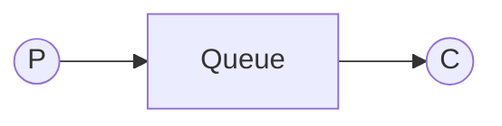
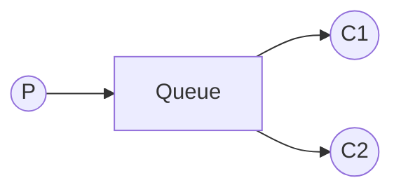
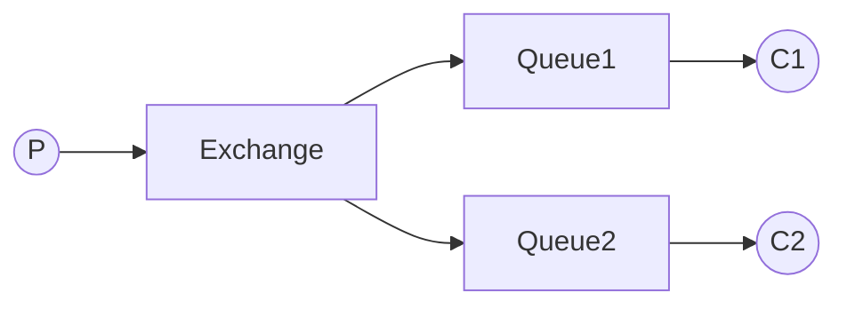
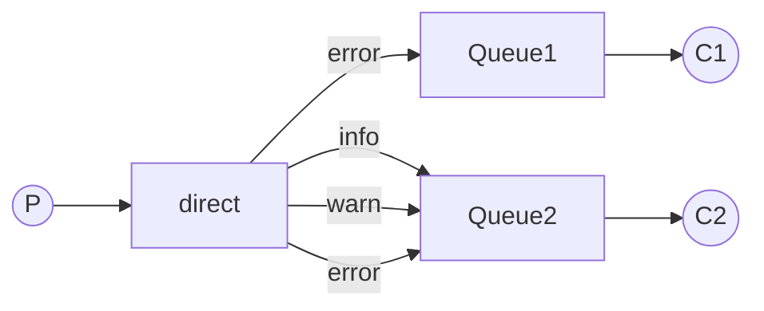

参考文献
- [https://rabbitmq.org.cn/tutorials](https://rabbitmq.org.cn/tutorials)
- [https://javabetter.cn/sidebar/sanfene/rocketmq.html](https://javabetter.cn/sidebar/sanfene/rocketmq.html)
- [https://www.bilibili.com/video/BV1h94y1Q7Xg](https://www.bilibili.com/video/BV1h94y1Q7Xg)

消息队列是一种用于在应用程序之间传递消息的通信机制。它可以异步地将消息从一个应用程序发送到另一个应用程序，以实现**解耦**、**异步处理**和**削峰填谷**等功能。

目前常用的 MQ 有三种

|特性维度|Rabbit MQ|Rocket MQ|Kafka|
|-|-|-|-|
|语言|erlang|java|Scala&java|
|吞吐量|中，万级到十万级 QPS|高，十万到百万级 QPS|极高，百万级以上 QPS|
|消息顺序|单个队列保证顺序，但若一个队列有多个消费者，顺序无法保证|严格保证顺序消息|保证分区内消息顺序|
|消息可靠性|很高，支持生产者确认、消费者确认、消息持久化|很高，支持同步/异步刷盘、主从同步/异步复制|高，通过 ACKS 机制、ISR 副本同步机制保证|
|消息传递语义|支持 At Most Once、At Least Once|支持 At Most Once、 At Least Once|主要支持 At Least Once，通过事务实现 Exactly Once|
|延迟|低，通常在微妙到毫秒级|低，毫秒级|较高，采用拉取模式，并且通过批量压缩来优化吞吐量，通常导致毫秒到秒级的延迟|
|事务消息|支持，但性能较差|原生支持，通过 2PC 实现|支持，但相对较重|
|回溯消费|不支持，消费被确认即被删除|支持，可按时间戳回溯消费|原生支持，消费者可重置便一辆到任意位置重新消费|
协议||AMQP、XMQP、SMTP、STOMP|自定义协议，使用长连接|自定义协议，基于 TCP|
|应用|对延迟敏感，需要复杂路由的场景|电商/金融等核心交易系统及大数据采集|日志聚合、流式处理、网站活动追踪等|

以下将通过 spring AMQP 来实现 MQ 的各种功能。

## 相关术语

### Message

消息是消息队列中传输和存储的最小数据单元。一条消息通常包含
- 业务的主体 如一串字符串
- 及其系统属性 如 Key （消息键，用于查找）、Tag （消息标签，用于过滤）、Message Id （用于标识） 等

### Topic

主题是消息的逻辑分类或集合。生产者将消息发送到某个主题，消费者从某个主题拉取信息。如一个电商系统的 `order_topic` `user_topic` 等。

### Queue

Topic 在物理上的分区/分片。一个 Topic 下包含一个或多个 Queue。消息实际上存储在 Queue 中而非 Topic 中。

### Offset

Offset 是消息在 Queue 中的位置标识，可以将其理解为一个自增的、连续的序列号。

### Consumer Group

Rocket MQ 中订阅者的概念是通过消费组来体现的。每个消费者组都消费主题中一份完整的消息。不同消费者组之间的消费进度彼此不受影响。


1. 生产者将一条带有 Tag 的信息的 Message 发送到指定的 Topic
2. 消费系统根据负载均衡的策略，将这条 Message 存入 Topic 下的某个 Queue，并赋予它一个 Offset
3. 消费者组中的多个消费者示例共同订阅 Topic，系统将不同的 Queue 下的数据按照规则分配给不同的 Consumer。



### 消费模式

作为一种 broker，消息队列用于接收和广播数据，一般分为以下两种消费模式
- 集群消费，一个消费者组共同能一个主题的多个队列，一个队列只会被一个消费者消费，默认情况下就是集群消费。若某个消费者挂掉，组内其他消费者会接替挂掉的消费者继续消费
- 广播消费，会给消费者组中的每一个消费者继续消费


Rocket MQ 中的 **NameServer** 是一个设计精巧的轻量级路由注册中心，在消息队列集群中扮演着至关重要的角色。它主要负责管理整个集群的元数据（如 Broker 地址、Topic 主题信息），并为生产者和消费者提供服务发现和路由查找功能。


## Rabbit MQ

### Hello World

现在是最简单的生产消费者模型



在实行正式操作之前，首先需要放置配置类。不然如果队列不存在，生产者就放不了了

```java
@Configuration
public class Tut1Config {

    @Bean
    public Queue hello() {
        return new Queue("hello");
    }

    @Bean
    public Tut1Receiver receiver() {
        return new Tut1Receiver();
    }

    @Bean
    public Tut1Sender sender() {
        return new Tut1Sender();
    }
}
```

创建时有以下可选属性
- `durable` 持久化，布尔值，true Rabbit MQ 服务器重启后是否存在
- `exclusive` 非排他，布尔值，true 时只能被创建它的链接使用
- `autoDelete` 自动删除，布尔值，true 则当最后一个消费者取消订阅时自动删除

#### 生产

在 spring AMQP 中使用 rabbit mq 较为简单。使用 `convertAndSend(queue, value)` 即可

```java
public class Tut1Sender {

    @Autowired
    private RabbitTemplate template;

    @Autowired
    private Queue queue;

    public void send() {
        String message = "Hello World!";
        this.template.convertAndSend(queue.getName(), message);
    }
}
```

然后一条信息就发送出去了。当然，这里面的 Queue 也可以不注入，只需要提前规定好名字就行。

#### 消费

此处有两种写法

一种是在类上面定义
```java
@RabbitListener(queues = "hello")
public class Tut1Receiver {

    @RabbitHandler
    public void receive(String in) {
        System.out.println(" [x] Received '" + in + "'");
    }
}
```

一种是在方法上面定义
```java
public class Tut1Receiver {

    @RabbitListener(queues = "hello")
    public void receive(String in) {
        System.out.println(" [x] Received '" + in + "'");
    }
}
```

### Work Queues

现在需要在多个 worker 中进行分布式消费。 work queues 的主要思想是避免任务密集任务等待，而是直接发送。



#### 准备工作

配置类多了一些改变

```java
@Configuration
public class Tut2Config {

	// ...

	@Bean
	public Tur2Receiver receiver2() {
		return new Tur2Receiver();
	}

	// ...
}
```

发送端其实是不需要做什么改变的。其实只要定义了接收端的配置，消费者也不需要额外配置。最多在 `@RabbitListener` 中添加 `concurrency = 2` 属性就行了。

在默认情况下，Rabbit MQ 会轮询分发信息到不同的队列中。

#### 消息确认

若消费者开始一个时间很长的任务，并且在完成前就结束了，但 rabbit mq 默认情况下在发送完信息就删除了，从而导致无法回滚。因此需要一个确认机制来保证消息有结果。

Rabbit MQ 主要提供了两种消息确认模式
- 自动确认。模式为 `autoAck = true`。当消费者成功接收到一条消息后（或者说是 Rabbit MQ 将消息发送到消费者的 TCP 套接字后），Rabbit MQ 会立即在内部将这条消息标记为已投递并立即删除。该方法吞吐量高，但风险极高，适合在对消息丢失不敏感，且处理速度非常快的场景。
- 手动确认。模式为 `autoAck = false`。当消费者接收到并成功处理完一条消息后，它必须显式向 Rabbit MQ 服务器发送一条确认指令。这样就可以保证其安全可靠了。

在手动确认的情况下，消费者可以向 Rabbit MQ 发送两种命令
1. 肯定确认 `channel.basicAck(deliveryTag, multiple)`
	`deliveryTag` 指消息的唯一标识 ID，在同一个 Channel 内单调递增；`multiple` 若为 true，则表示确认所有比当前 `deliveryTag` 小的消息，否则只确认这条消息。
2. 否定确认 `channel.basicNack(deliveryTag, multiple, requeue)`
	若 `requeue` 为 true，Rabbit MQ 会将该消息重新放回队列，否则会直接丢弃该消息。

```java
@Bean
public SimpleRabbitListenerContainerFactory rabbitListenerContainerFactory(
        ConnectionFactory connectionFactory) {
    SimpleRabbitListenerContainerFactory factory = new SimpleRabbitListenerContainerFactory();
    factory.setConnectionFactory(connectionFactory);
    factory.setAcknowledgeMode(AcknowledgeMode.MANUAL); // 手动确认
    return factory;
}
```

#### 分发

默认情况下 Rabbit MQ 会轮询分发。可以通过以下参数在 `AbstractMessageListenerContainer` 类的相关方法进行改动
- `prefetchCount` 默认为 250，表示不会给一个工作者超过 250 条消息

### 发布订阅机制



Spring AMQP 中，发布订阅的模型通常使用 Fanout Exchange 实现。在配置类中，除了声明队列外，还需要声明 Fanout Exchange。

```java
// 定义 Fanout Exchange
@Bean
public FanoutExchange fanoutExchange() {
    return new FanoutExchange("fanout.exchange");
}

// 将队列绑定到 Fanout Exchange
@Bean
public Binding bindingA(FanoutExchange fanoutExchange, Queue queueA) {
    return BindingBuilder.bind(queueA).to(fanoutExchange);
}

@Bean
public Binding bindingB(FanoutExchange fanoutExchange, Queue queueB) {
    return BindingBuilder.bind(queueB).to(fanoutExchange);
}
```

在发送信息时，发送的对象就变了，生产者直接向路由发送信息

```java
public void publishMessage(String message) {
    rabbitTemplate.convertAndSend(fanoutExchange.getName(), "", message);
}
```

此时的消费者没有变化。

#### 匿名队列

有了多个该模型，那么就可以实现多种扩容机制了。匿名队列可以实现处理临时信息。

其匿名队列的实现定义。Exchange 绑定时写的是方法名。

```java
@Bean
public Queue anonymousQueue() {
    return new AnonymousQueue();
}
```

其内部实现为 `return new Queue(UUID.randomUUID().toString(), false, true, true);` 。其创建队列的 Bean 是唯一的，但使用的方法是不唯一的。

在使用时，引用的是 Bean 而不是固定名称。

```java
@Component
public class TemporaryQueueConsumer {
    // 引用Bean而不是固定名称
    @RabbitListener(queues = "#{@temporaryQueue.name}")
    public void receiveFromTemporary(String message) {
        System.out.println("临时队列收到: " + message);
    }
    
    // 或者直接注入队列Bean
    @Autowired
    private Queue temporaryQueue;
    
    @RabbitListener(queues = "#{temporaryQueue.name}")
    public void anotherTemporaryListener(String message) {
        System.out.println("另一个临时监听器: " + message);
    }
}
```

### 路由

有时候对转发的信息要求比较复杂，比如



此时就需要 Direct Exchange 转发消息

```java
// 定义 Direct Exchange
@Bean
public DirectExchange directExchange() {
    return new DirectExchange("direct.exchange");
}

// 绑定队列1到 Direct Exchange，只监听 error 路由键
@Bean
public Binding bindingErrorToQueue1(DirectExchange directExchange, Queue queue1) {
    return BindingBuilder.bind(queue1)
            .to(directExchange)
            .with("error");
}

// 绑定队列2到 Direct Exchange，监听多个路由键
@Bean
public Binding bindingErrorToQueue2(DirectExchange directExchange, Queue queue2) {
    return BindingBuilder.bind(queue2)
            .to(directExchange)
            .with("error");
}

@Bean
public Binding bindingInfoToQueue2(DirectExchange directExchange, Queue queue2) {
    return BindingBuilder.bind(queue2)
            .to(directExchange)
            .with("info");
}

@Bean
public Binding bindingWarnToQueue2(DirectExchange directExchange, Queue queue2) {
    return BindingBuilder.bind(queue2)
            .to(directExchange)
            .with("warn");
}
```

此后生产者直接找路由发消息即可。


可以发现，目前的路由都是通过不同的种类的 Exchange 实现。Rabbit MQ 提供了多种 Exchange 类型，每种都有不同的路由机制和适应场景
|Exchange 类型|路由机制|绑定方式|性能|适用场景|
|-|-|-|-|-|
|Direct|精确匹配|队列绑定指定路由键|高|点对点的任务分发|
|Fanout|广播到所有队列|不需要路由键|高|发布订阅，广播通知|
|Topic|模式匹配路由键|支持通配符|中|灵活路由、消息分类|
|Headers|消息头匹配|基于 header 属性|低|复杂条件路由|



## Kafka

### 结构

在 Kafka 中，同一个消息通常存在同一个 **topic** 下，而一个 topic 下分有多个 **partition** (分区)。每一个分区是一个线性增长的不可变的提交日志。消息存储到分区后即不可变更。Kafka 回味每一个消息提供一个偏移量，以记录每条消息的位置。

每一条消息都是一个键值对，若键为空，则 Kafka 会以轮询的方式放到每一个分区中；若键不为空，则 Kafka 会将消息放到符合条件的分区中。

可以通过设置 `replication-factor` 的数量，来指定一个分区中的队列数量。这样，一旦主分区宕机，备份也可以立刻顶上，以实现高可用。

### 消费模型

一个分区中的数据不能被一个消费者组中的多个消费者消费。通过合理分配消费者和消费者组，可以实现发布订阅模式和点对点模式。

同一个生产者发送到同一分区的消息，先发送的 offset 肯定比后发送的 offset 小。同一个生产者发送到不同分区内的消息，其消息顺序无法保证。同理，对于消费者，Kafka 也只能保证分区内的消息顺序。

### 消息传递语义

Kafka 提供了三种消息传递语义
- 最多一次：消息可能会丢失，永远不重复发送
- 最少一次：消息不会丢失，但可能会重复
- 精确一次：保证消息被传递到服务端且在服务端不重复

在最多一次的情况下，消费者先读取消费位置，再读取消息，即使读取失败，下次读取的偏移量也不一样了；在最少一次的情况下，消费者先读取消息，再提交消费位置，若读取或提交失败，则再次读取一样的数据。

### 发送与消费流程

在通过 `send()` 方法异步发送时，生产者处会为每一个分区建立一个缓存，用于存放消息。若消息已发送到缓存区则返回结果。而后台的线程则将缓冲区的消息发送给服务端。若需要实现同步发送，则需要接收 send 方法返回 `Future<RecordMetadata>` 数据。

设置 `linger.ms` (发送间隔时间，单位为毫秒)，`Batch.size` (发送单批的数量) 来实现批量发送。当二者满足任一条件时则会发送。

设置 `acks` 为 1  `all` 则说明每一条消息都需要手动确认，为 0 则说明不需要确定，为 -1 则需要落盘后确认。

要实现精确一次语义，需要设置 `enable.idempotence` 参数值为 true，且 `acks` 为 `all`。

### 事务

Kafka 默认的 `isolation-level`，即隔离级别为读未提交。这可能会导致事务风险。需要自己设置隔离级别。

## Rocket MQ

### 消息可用性保证

消息可能会在生产阶段、存储阶段、消费阶段发生丢失。

生产阶段的丢失主要通过请求确认机制来保证消息的可靠传递。在同步发送的时候，要注意处理响应结果和异常。如果返回 OK，则表示成功发送到了 broker，如果响应失败或发生了其他异常，那么都应该重发。

存储阶段的丢失往往由机子宕机造成。因此对可靠性优先的场景都应该使用同步。broker 通过同步刷盘或异步刷盘，将消息持久化到 CommitLog 日志文件中。即使 broker 宕机，未消费的消息也能重新恢复再消费。同步刷盘会在 producer 发送消息后等数据持久化到磁盘后再返回响应给 producer。

broker 还能通过主从模式来保证高可用。

至于消费端，则通过消费端的主动确认来保证。需要保证消费端执行完所有的消费业务逻辑后，再发送消息确认。

### 消息幂等与去重

Rocket MQ 能保证消息一定能投递，且不丢失，但无法保证消息不重复消费。但不能保证幂等性。因此在业务端需要做好去重功能，如生成全局唯一 id 等。

### 消息积压

有时候消息队列中会有大量消息无法及时消费。Rocket MQ 提供了两种方式来处理这种积压问题。
- 消费者扩容
    如果当前 Topic 的 MQ 的数量大于消费者数量，则对消费者进行扩容
- 消息迁移 Queue 扩容
    如果当前 Topic 的 MQ 数量小于或等于消费者的数量，则对 MQ 进行扩容，新建一个临时的 Topic，临时的 Topic 多设置一些 MQ，然后用一些消费者把消费的数据丢到临时的 Topic。

### 顺序消息

Rocket MQ 提供全局顺序消息和局部顺序消息两种机制。全局顺序指整个 Topic 的所有消息都严格按照发送顺序消费；而局部顺序指特定分区内的消息保证顺序。要保证顺序，关键是把需要保证顺序的消息发送到同一个 MQ 中。当消费者开始消费某个 MQ 时，会在 broker 端对该队列加锁，其他消费者就无法消费这个队列了，从而保证了消费顺序。

### 消息过滤

常用的消息过滤有三种：根据 Tag 过滤、使用 SQL 表达式过滤和使用 Filter Server 过滤。

使用 Tag 过滤是更常见的方法，用起来高效简单

```java
DefaultMQPushConsumer consumer = new DefaultMQPushConsumer("CID_EXAMPLE");
consumer.subscribe("TOPIC", "TAGA || TAGB || TAGC");
```

而 SQL 表达式则更加灵活

```java
DefaultMQPushConsumer consumer = new DefaultMQPushConsumer("please_rename_unique_group_name_4");
// 只有订阅的消息有这个属性a, a >=0 and a <= 3
consumer.subscribe("TopicTest", MessageSelector.bySql("a between 0 and 3");
consumer.registerMessageListener(new MessageListenerConcurrently() {
   @Override
   public ConsumeConcurrentlyStatus consumeMessage(List<MessageExt> msgs, ConsumeConcurrentlyContext context) {
       return ConsumeConcurrentlyStatus.CONSUME_SUCCESS;
   }
});
consumer.start();
```

### 延时消息

电商的订单超时自动取消，就是一个典型的利用演示信息的例子，用户提交了一个订单，就可以发送一个演示消息，1h 后去检查这个订单的状态，如果还是未付款就取消订单释放库存。

但目前 Rocket MQ 支持的演示级别是有限的

```java
private String messageDelayLevel = "1s 5s 10s 30s 1m 2m 3m 4m 5m 6m 7m 8m 9m 10m 20m 30m 1h 2h";
```

Broker 收到延迟消息后会先发送到主题（SCHEDULE_TOPIC_XXXX）相应时间段的 MQ 中，然后通过一个定时任务轮询到这些队列。到期后，把消息投递到目标 Topic 的队列。

### 分布式消息事务和半消息

**半消息**指暂时还不能被消费者消费的信息，生产者成功发送到 broker 的消息，此消息被标记为”暂不可投递“的状态，只有等生产端执行完本地事务并经过二次确认后，消费者才能消费此条消息。

依赖半消息，就可以实现分布式消息事务，其中的关键在于二次确认和消息回查。

1. 生产者发送半消息，并执行本地事务
    1. 生产者向 MQ Server 发送一条半消息。MQ 收到后，将其持久化存储，但不会将其投递到目标 Topic 中。MQ 返回 ACK 相应给生产者。
    2. 生产者收到半消息发送成功相应后，开始执行本地数据库事务。本地事务执行完成后，生产者会向 MQ 发送提交会回滚指令。
2. 若生产者在执行完本地事务后，发送指令前，发生了宕机合伙网络异常，此时的半消息就处于未知状态。Rocket MQ 引入了**事务回查**机制。MQ 会定期扫描所有处于“半消息”状态且超时未确认的消息。对于每条需要回查的消息，MQ 会回调消息中指定的生产者应用程序的一个接口。生产者会对该消息检查本地事务的执行结果，并发送提交或回调指令。


MQ、数据库和 redis 的事务实现按照其业务功能的实现各不相同。

数据库事务基于 WAL (Write-Ahead Logging)、锁机制、MVCC 等，以及各种隔离性级别，实现符合 ACID 特性的强一致性。

redis 事务基于单线程和命令队列的批量执行保证，但是其隔离性不强，也没有回滚机制。

MQ 的分布式事务通过半消息 + 事务状态回查 + 本地事务实现，没有实现隔离。

总之，数据库事务提供单点的强一致性，redis 事务提供缓存层的批量操作，MQ 分布式事务协调多点的最终一致性。



### 死信队列


若消费者在处理消息时发生异常，且达到了最大重试次数，这条消息就成了**死信**。当消费失败的原因排查并解决后，就可以重发这条死信消息，让消费者重新消费；如果暂时无法处理，可以将死信进行保存或直接丢弃。

### 工作流程

Rocket MQ 作为一个分布式消息队列，兼具消息队列和分布式系统的功能。作为消息队列，它只是一个队列，对应生产者、broker、消费者；作为分布式系统，它就有服务端、客户端、注册中心，对应 broker、生产/消费者、NameServer。

1. broker 在启动时去向所有的 NameServer 注册，并保持长连接，每 30s 发一次心跳
2. 生产者在发送信息时从 NameServer 中获取 broker 服务器地址，按照负载均衡算法选择一台服务器发送
3. 消费者在接收信息时从 NameServer 中获取 broker 地址，然后通过 Push 或 Pull 模式消费消息


此处的注册中心不应该太重，NameServer 足矣。而 ZooKeeper 满足的是 CP 原则，且选举流程较长，但 MQ 往往更看重 A，因此注重 AP 的NameServer 更有优势。


### 储存

Rocket MQ 主要的存储文件包括 Commit Log 文件、Consume Queue 文件、Indexfile 文件
- Commit log 消息主体和元数据的存储主体。存储生产者端写入的所有消息内容。消息内容不是定长的，但单个文件大小是固定的（默认 1G）。文件名长度为20位，左侧补0，表示该文件的起始全局物理偏移量，而非已使用的存储大小。
- Consume Queue 消息消费队列，用于提高消息消费的性能。由于 RocketMQ 是基于主题主题的订阅模式，直接遍历 Commit Log 来根据主题检索消息会非常低效。Consume Queue 可以看成是基于主题的 Commit Log 索引文件。Consume Queue 采取定长设计，一个条目共20个字节，分别为8字节的 Commit Log 物理偏移量、4字节的消息长度、8字节的 Tag 哈希码。单个文件由30W个条目组成，因此每个 Consume Queue 文件大小约为 30W * 20字节 = 5.72MB。
- 索引文件，提供了一种通过 Key 或时间区间来查询消息的方法。该文件的文件名是以创建时的时间戳（精确到小时）命名的，固定的单个 Index File 大小约为 400MB（准确说是 400M + 结尾部分统计信息），一个 Index File 可以保存 2000W 个索引。

RocketMQ 的具体做法是使用 Broker 端的后台服务线程 `ReputMessageService`，持续不断地监听 Commit Log 中新消息的到达，然后主动、异步地构建 Consume Queue 和 Index File 数据，而不是“分发请求”。

### 文件读写

MQ 对文件读写有很高的速度要求。因此对文件读写的机制也和一般程序不同。

Rocket MQ 中 Consume Queue 存储的数据较少，并且是顺序读取，因此在 page cache 的预读取作用下，Consume Queue 文件的读性能几乎接近读内存，即使在有消息堆积的情况下也不会影响性能。而对于 Commit log 中存储的文件，当消费者根据 Consume Queue 的索引去拉取消息内容时，会访问 Commit Log 中的不同位置。这种访问模式在逻辑上是随机的。然而，由于消息在 Commit Log 中是顺序写入的，其在物理磁盘上的分布相对连续，加之 OS 的 PageCache 和 SSD 硬盘的高 IOPS，使得这种读取模式的性能依然很高，其影响远没有在机械硬盘上传统随机读写那样严重。


**页缓存** (PageCache) 是 OS 对文件的缓存。对于数据的写入，OS 回写入至 Cache 中，然后通过异步的方式由内核线程将 Cache 内的数据异步刷盘至物理磁盘上。


此外，Rocket MQ 主要通过 `MappedByteBuffer` 对文件进行读写操作。其中，利用了 `mmap` 系统调用，将磁盘文件直接映射到进程的虚拟内存地址空间。这样，应用程序对这段内存的读写操作，就由操作系统在后台自动转换为对文件的读写，从而避免了使用传统 `read`/`write` 系统调用引发的用户态和内核态间的数据拷贝，极大提高了文件效率


注意，`mmap` 可以看作是一种实现**零拷贝**读写文件的技术，但和零拷贝的定义不同。零拷贝通常特指在网络传输等场景下，避免在内核地址空间内部的多次多次拷贝（如从内核缓冲区到 socket 缓冲区的拷贝）的机制。


### 长轮询

所谓的长轮询，就是消费者拉取消息，如果对应的 Queue 没有数据，broker 就不会立即返回，而是将这个 pull request 挂起，等 Queue 有消息后，或者阻塞时间到后，再重新处理。

### 负载均衡

负载均衡策略根据角色不同有所区分
- 生产者侧，关键在于消息的分布，主要有两种模式
    - RoundRobin 模式让消息均匀分布到所有队列，最大化主题的传输能力
    - MessageGroupHash 模式通过哈希算法确保同一消息组的消息进入同意队列，是保证顺序消息的正确处理的基础
- 消费者侧，关键在于消息的分配
    - 消息粒度负载均衡是较后版本中的默认策略。它允许单个队列的消息被组内多个消费者并行处理，并通过消息锁机制避免重复消费。
    - 队列粒度负载均衡是较为传统的策略，将一个队列固定分配给一个消费者。