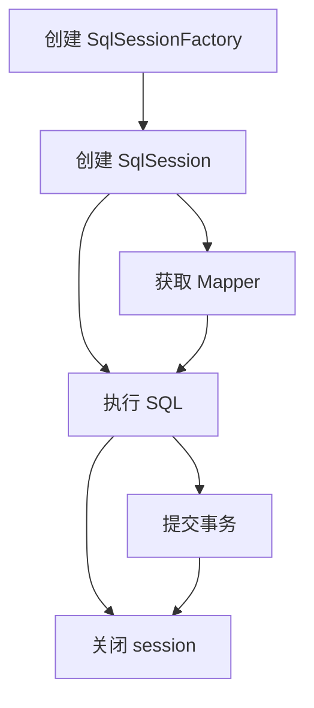

MyBatis 将 Java 对象 (POJO) 和数据库中的记录通过 SQL 语句映射起来（**半 ORM**）。避免了几乎所有的 JDBC 代码和手动配置参数以及获取结果集。其核心组件包括
- 实体类 (POJO)： 普通的 Java 对象，用于映射数据库中的表
- 接口 Mapper：一个 Java 接口，里面定义了数据库操作的办法
- Mapper XML 文件：这是 MyBatis 的核心，用于编写 SQL 语句和定义 SQL 的相关参数
- SqlSessionFactory：通过读取配置文件（如`mybatis-config.xml`）创建，是生产 SqlSession 的工厂
- SqlSession：代表和数据库交互的一次绘画，可以通过它来获取 Mapper 接口的代理实现，并执行其中定义的方法

而 Hibernate 是全自动对象关系映射框架（**全 ORM**），无需开发者填写 SQL 语句。然而学习难度较大，多表关联关系配置复杂。

## 原理和生命周期

MyBatis 的原理可以分为以下几步



1. 从配置或直接编码来创建 SqlSessionFactory。在此之前会先创建一个 SqlSessionFactoryBuilder， 一旦创建了 SqlSessionFactory，就不再需要它了。但整个 SqlSessionFactory 应该是单例的，被所有应用共享，相当于数据库连接池。
2. 通过 SqlSessionFactory 创建 SqlSession，一个 SqlSession （会话）可以理解为程序和数据库之间的桥梁，相当于 JDBC 的 Connection。该会话不是线程安全的，每次请求都应该创建新的实例，用完后必须关闭
    MyBatis 的执行核心是 Executor，它才是真正干活的。当接到一个任务时，Executor 会协调几个专门的助手来完成：首先让 StatementHandler 去预编译 SQL 语句，然后由 ParameterHandler 负责为 SQL 填充参数，接着 StatementHandler 再次出场执行 SQL，最后将结果集交给 ResultSetHandler 这个专家，由它来转换成我们想要的 Java 对象
3. 可以通过 SqlSession 实例直接执行已映射的 SQL 语句。或者先获取 Mapper ，再执行 SQL 语句。 Mapper 用于绑定映射语句的接口。该实例从 SqlSession 中获取，不需要显式关闭

当 MyBatis 和 spring 集成时，SqlSessionFactory 仍然由 spring 容器管理，SqlSession 被 SqlSessionTemplate 替代，由 spring 管理生命周期。Mapper 实例可以由 spring 注入，spring 负责创建和销毁

## 杂记

- 若实体类属性名和表中字段名不一样，可以在查询的 SQL 语句中定义字段名的别名，让字段名的的别名和实体类的属性名一致，或者通过 resultMap 中的 `<result>` 来映射字段名和实体类的属性名的一一对应关系。

- MyBatis 也支持映射 Enum 枚举类，MyBatis 还支持将枚举映射到表的一列上。映射方式为自定义一个 TypeHandler，实现其 `setParameter()` 和 `getParameter()` 方法。

- `#{}` 和 `${}` 的区别在于，前者是 SQL 的参数占位符，MyBatis 会将 SQL 中的 `#{}` 替换为 `?` 号，在 SQL 执行前使用 PreparedStatement 的参数设置方法，按顺序给 `?` 的占位符设置参数值；而后者是 Properties 文件中的变量占位符，它可以用于标签属性值和 SQL 内部，属于原样文本替换。
    所以后者容易产生 SQL 注入风险，通常用于不能使用预处理的场合，如动态表名、列名、排序等，要提前对参数进行安全性校验。

- MyBatis 支持 `association` (一对一) 和 `collection` (一对多) 的延迟加载。在 MyBatis 配置文件中，可以配置是否启用延迟加载/懒加载 `lazyLoadingEnabled = true`。
    它的原理是，通过 Cglib 生成目标对象的代理对象。当调用目标方法时，会进入拦截器的 `invoke()` 方法进行拦截。以调用 `a.getB().getName()` 为例，拦截器发现 `a.getB()` 返回值为 null 时，会单独发送预先保存的查询关联 B 对象的 SQL 语句，从数据库中查询 B 对象；随后调用 `a.set(B)` 为 a 设置获取到的 B 对象，这样 a 中的 b 属性就不会是 null。最后，继续执行 `a.getB().getName()` 方法调用。不仅 MyBatis，几乎所有的 Hibernate，支持延迟加载的原理都是一样的。

- 在新增的对象的 xml 标签中添加 `keyProperty = "ID"`，可以为放入的对象参数写入主键，需要时再取即可

- `<foreach>` 主要用在构建 `in` 条件或批量插入中，可以在这个标签中写入如下属性
    - item 集合中每一个元素进行迭代时的别名
    - index 指定一个名字，用于表示在迭代过程中每次迭代到的位置
    - open 语句开始，常用 `(`
    - close 语句结束，常用 `)`
    - separator 迭代之间的分隔符，常用 `,`

- 最佳实践中，通常一个 xml 映射文件都会写一个 Dao 接口与之对应。Dao 接口就是人们常说的 `Mapper` 接口，接口的全限名就是映射文件的 namespace 的值，接口的方法名就是映射文件的 MappedStatement 的 id 值，接口方法的参数就是传递给 SQL 的参数。Mapper 接口是没有实现类，在调用接口方法时，接口全限名 + 方法名拼接字符串作为 key 值，可唯一定位一个 MappedStatement。Dao 接口里的方法可以重载，但是 MyBatis 的 xml 里的 id 不能重复。

- MyBatis 使用动态代理技术，在运行时为 Mapper 接口自动创建了代理对象，因此 Mapper 接口不需要实现类。当我们在 SqlSession 获取 Mapper 接口时，MyBatis 会返回一个动态代理对象。这个代理对象拦截了所有接口方法的调用，并开始定位 SQL （使用 接口全限定名 + 方法名 拼接起来），执行 SQL 并返回结果

- MyBatis 存在二级缓存，一般一级缓存是 SqlSession 级别的缓存，无法关闭，二级缓存需要手动开启，是 Mapper 中一个 namespace 级别的缓存，可以跨 SqlSession 共享
    - 一级缓存会存储第一次执行查询语句的结果。在同一个 SqlSession 中，再次执行完全相同的 SQL 语句和参数时，MyBatis 会直接读缓存；如果中途执行了其他类型的操作（无论是否修改了缓存的数据），MyBatis 都会清空缓存，避免出现脏读
    - 若想要开启二级缓存，需要在该文件中添加 `<cache/>` 标签。在关闭和提交 SqlSession 时，它的一级缓存的内容才会转存到对应的二级缓存中。其缓存读取和清空操作和一级缓存一致

- MyBatis 有三种 Executor，分别是 `SimpleExecutor`、`ReuseExecutor`、`BatchExecutor`
    - `SimpleExecutor` 默认执行器，每执行一次 update 或 select，就开启一个 Statement 对象，用完立刻关闭
    - `ReuseExecutor` 执行 update 或 select，以 SQL 作为 key 查找 Statement 对象，存在则使用，不存在就创建。用完后，不关闭 Statement 对象，而是放置在一个 Map 中，供下一次用
    - `BatchExecutor` 执行 update，将所有的 SQL 都添加到批处理中，等待统一执行。它缓存了多个 Statement 对象，在调用 `flushStatements()` 时一次性执行所有批处理命令

    在 MyBatis 全局配置文件中，在设置 `settings` 可以指定默认的 ExecutorType 执行器类型，也可以手动给 `SqlSessionFactory` 的创建 `SqlSession` 方法传递 ExecutorType 类型参数，如 `SqlSession openSession(ExecutorType execType)`

## 插件

Mybatis 会话的运行需要 `ParameterHandler`、`ResultSetHandler`、`StatementHandler`、`Executor` 这四大对象的配合，插件的原理就是在这四大对象调度的时候，插入一些我我们自己的代码。

MyBatis 使用 JDK 的动态代理，为目标对象生成代理对象。它提供了一个工具类 Plugin，实现了 `InvocationHandler` 接口。使用 Plugin 生成代理对象，代理对象在调用方法的时候，就会进入 `invoke` 方法，在 `invoke` 方法中，如果存在签名的拦截方法，插件的 `intercept` 方法就会在这里被我们调用，然后就返回结果。如果不存在签名方法，那么将直接反射调用我们要执行的方法。

如果我们自己编写 MyBatis 插件，只需要实现拦截器接口 `Interceptor (org.apache.ibatis. plugin Interceptor)`，实现类中对拦截对象和方法进行处理。然后再给插件写好注解，确定要拦截的对象，要拦截的方法，最后在 MyBatis 配置文件中配置插件

### 分页

MyBatis 使用 RowBounds 对象进行分页，它是针对结果集执行的内存分页，而非物理分页。可以在 SQL 内内置直接书写带有物理分页的参数来完成物理分页的功能，也可以用分页插件来完成物理分页。分页插件的基本原理就是使用 MyBatis 提供的插件接口，实现自定义插件，拦截 Executor 的 query 方法。在执行查询的时候，拦截待执行的 SQL，然后重写 SQL，添加对应的物理分页语句和物理分页参数。

## JDBC

Java 数据库链接 JDBC 是一个用于执行 SQL 语句的 Java API，它为多种关系数据库提供了统一访问的机制。使用 JDBC 操作数据库通常包括以下步骤：
1. 加载数据库驱动
    在现代 JDBC 中可省略。在和数据库链接前首先需要通过 `Class.forName()` 加载对应的数据库驱动，确保 JDBC 驱动注册到了 `DriverManager` 类中

    ```java
    Class.forName("com.mysql.cj.jdbc.Driver");
    ```

2. 建立数据库链接
    使用 `DriverManager.getConnection()` 方法简历里到数据库的链接。这一步需要提供数据库 URL、用户名和密码作为参数

    ```java
    Connection conn = DriverManager.getConnection(":jdbc:mysql://localhost:3306/databaseName", "username", "password");
    ```

3. 创建 Statement 对象
    通过建立的数据库连接对象 `Connection` 创建 `Statement`、`PreparedStatement` (预编译 SQL 语句，适用于带参的 SQL) 或 `CallableStatement` 对象，用于执行 SQL 语句。
4. 执行 SQL 语句
    使用上一步建立的对象，执行 SQL 语句。在执行查询语句时，使用 `executeQuery()` 方法；在执行更新语句时，使用 `executeUpdate()` 方法
5. 处理结果集
    如果执行的是查询操作，需要处理返回的 `ResultSet` 对象来获取数据
6. 关闭资源
    最后需要依次关闭 `ResultSet`、`Statement` 和 `Connection` 资源，释放数据库连接等资源

在 Java 开发时通常会使用模板库 `JdbcTemplate` 或 ORM 框架来简化操作

在创建链接后，拿到的对象是 `java.sql.Connection` 对象，这是 JDBC API 中用于表示数据库链接的接口，提供了执行 SQL 语句、管理事务等一系列操作的方法。