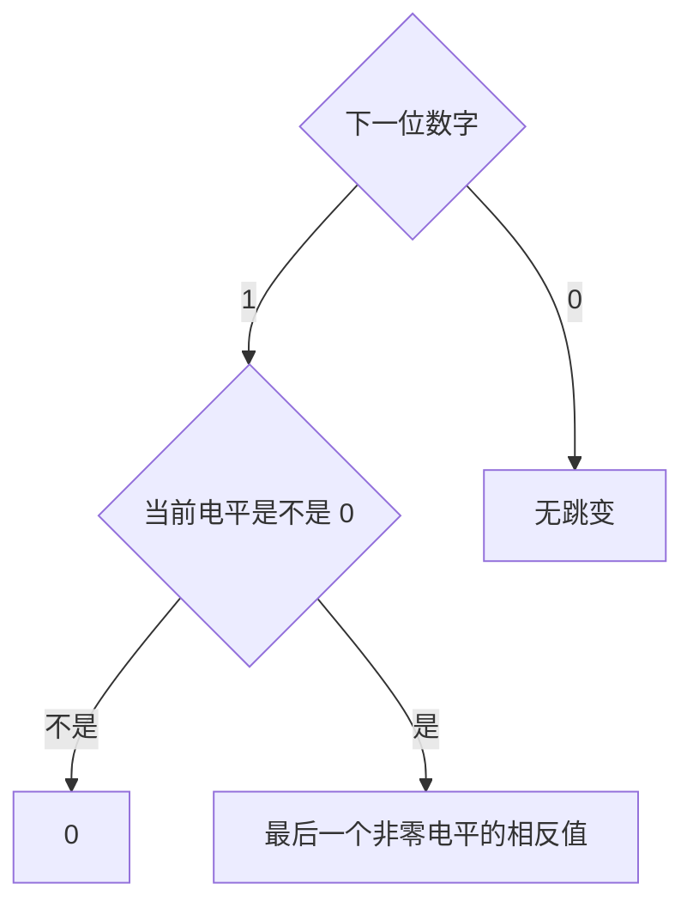

## 网络模型

### OSI 模型

OSI 模型是一个理论模型，它将网络通信划分为7个逻辑层次，每一层都有特定的功能
- 7th 应用层
    直接和用户的应用程序交互，提供网络服务接口。
    此处的协议有 HTTP （网页）、SMTP/POP3 （电子邮件）、FTP（文件传输）、DNS。
- 6th 表示层
    负责数据的转换和格式化，如加密、压缩、解压等。
    此处的协议有 SSL/TLS、JPEG、MPEG。
- 5th 会话层
    建立、管理和中止两个应用程序之间的对话，负责协调通信，负责决定通信是全双工还是半双工。
    此处的协议有 RPC、NetBIOS。
- 4th 传输层
    提供端对端的可靠或不可靠的数据传输。负责流量控制、错误恢复和数据分段。
    此处的协议有 TCP、UDP
- 3rd 网络层
    负责将数据包从一个网络路由到另一个网络。
    此处有 IP （IPv4, IPv6）、ICMP（用于 Ping）、路由器。
- 2nd 数据链路层
    负责在一个局域网内，节点到节点间的可靠的数据传输，将数据封装成“帧”，并处理物理寻址（MAC 地址）和错误检测。
    此处有以太网、交换机、MAC 地址。
- 1st 物理层
    负责在物理介质上传输原始的比特流。
    可以使用网线、光纤、网卡等工具进行传输。

### TCP/IP 协议簇

该协议是实际实施的协议集合，比 OSI 模型更早出现。
1. 应用层
    对应 OSI 的应用层、表示层、会话层
    包含了所有的应用程序相关的逻辑
    使用**专用地址**
2. 传输层
    对应 OSI 的传输层
    和 OSI 传输层的功能完全相同
    使用**端口地址**
3. 网际层
    对应 OSI 的网络层
    和 OSI 网络层的功能相同
    使用**逻辑地址**
4. 网络接入层
    对应 OSI 的数据链路层、物理层
    负责在本地网络介质上传输数据
    使用**物理地址**


**全双工通信**指通信双方可以同时向对方发送和接收数据，如打电话和以太网等；**半双工通信**指双方不能同时发送和接收数据，只能一方发送，一方接收，如对讲机等


## 信号传输

数据通信中通常使用周期模拟信号和非周期数字信号。周期模拟信号需要更少的带宽，非周期数字信号可以表示数据的变化。

### 周期模拟信号

模拟信号的**频率**表示1秒内的周期数，也表示相应于时间的变化速率。变化占用的时间短意味着频率高，反之则频率低。若信号始终不变化，则其频率是0；若信号瞬间发生变化，则其频率是无限大。

可以进行时域分析和频率分析。

### 数字信号

数字信号是一种复合模拟信号，复合多个正弦波，其带宽无限大。

可以将1编码为正电平，0编码为零电平。也可以发送多于两个电平。若信号有 $L$ 个电平，则每个信号位可以携带 $\log_2 L$ 个 bit 位（几位的 01 串）。

**比特率**指每秒发送的位数，以每秒位 (bits per second, or **`bps`**) 表示。

#### 传输方式

数字信号的传输有基带传输和宽带传输两种形式
- **基带传输** 通过通道发送数字信号，不转换成模拟信号
    使用**低通通道**发送没有调制的信号，这种通道具有无限大带宽的特点。
    在基带传输中，所需的带宽和比特率成正比，如果需要更宽地发送位，就需要更大的带宽。而在同样比特率的情况下，叠加更多谐波，其合成后的模拟信号越接近于数字信号，则需要更宽的带宽。
    该种传输方式在同一时间的同一点上只能传输一路信号，主要用于有线 LAN。
- **宽带传输**
    使用调制，将数字信号转换成模拟信号进行传输，允许使用带通通道。
    同一时间同一通道可以同时传输多路信号，用于各种远程传输。

#### 传输减损

信号传输时，可能产生衰减、失真和噪声
- 衰减：信号强度随传输距离增长而不断减弱，可通过安装放大器（模拟信号）或中继器（数字信号）解决。
- 失真：只发生在有线传输介质上，符合信号中的不同频率的成分传播速度不同，导致到达最终接收端时有各自的延迟
- 噪声：在发送设备和接收设备之间插入进来的多余因而有害的信号

#### 噪声

噪声有四种
- 热噪声，分子热运动引起，俗称“白噪声”
- 互调噪声，不同频率的信号共享同一传输介质时产生的额外信号
- 串扰，某一线路上的信号被另一线路收到
- 脉冲噪声，主要影响数字数据通信

通常采用如下指标衡量噪声

**SNR** (Signal-to-Noise Ratio) 信噪比。指在同一个点上，有用信号的平均功率和噪声平均功率的比值，越高越好。

$$
\text{SNR} = \frac{P_{\text{signal}}}{P_{\text{noise}}}
$$

还有一种单位，$\text{SNR}_{\text{dB}}$ 是以分贝为单位的信噪比，换算关系为

$$
\text{SNR}_{\text{dB}} = 10 \times \text{lg} (\text{SNR})
$$

#### 通道容量

数据速率用 bps 表示，而**通道容量**指的是给定条件下通道上的最大数据速率，单位同样是 bps。通道通量取决于三种因素
- 通道的有效带宽 (Hz)
- 通道的质量，即通道上的平均噪声电平
- 使用的信号电平数，增加的电平数会显著降低可靠性

可以使用**奈奎斯特带宽公式**估算无噪声数字通道的通道容量（最大数据率）。当通道上传送的数据率大于通道容量时，将因严重失真而失效。

$$
C=2B\log_2 L
$$

其中的 $C$ 表示通道容量 (bps)，$B$ 表示通道带宽 (Hz)，$L$ 表示数字信号的电平数。

使用**香农容量公式**估算存在热噪声干扰情况下的通道容量。数据率越高，无用的噪声引起的破坏就越严重。

$$
C=B\log_2(1+\text{SNR})
$$

其中 $C$ 表示通道容量 (bps)，$B$ 表示通道带宽 (Hz)，SNR 表示信噪比。当 SNR 很大时，也可以将公式中的1略去。

香农容量定理给出数据速率的上限，奈奎斯特公式给出所需的信号电平数。

#### 性能指标

- **带宽**
    除了表示复合信号中包含的频率范围或传输通道能通过的频率范围（此时的单位是 Hz），也能表示某通道的数据速率（此时单位是 bps）。是潜在的衡量值。
- **吞吐量**
    通道在单位时间内成功传输的总信息量 bps，是实际的衡量值。
- **延迟**
    通道在第一个比特发出开始到整个报文完全到达接收端所经历的时间
- **带宽和延迟的积**
    定义了可可充满该链路的比特数
- **抖动**
    数据不同分组的延迟时间不同，引起的实时接收和出现间断
- **误码率**
    计算机网络中要求低于 $10^{-6}$，即每传送1兆位错误不多于1位

## 数字传输

### 线路编码

#### 比率

**数据速率**或者比特率指1秒钟发送的数据元素数量，单位即 bps；**信号速率**或者脉冲速率、调制速率、波特率是1秒钟发送的信号元素的数量，单位是波特率 (baud)。

**比率** $r$ 指数据元素和信号元素的比值，即

$$
r=\frac{数据元素}{信号元素}
$$

信号元素数量的计算公式为

$$
S=c\times N\times \frac{1}{r}
$$

$S$ 是信号元素的数量，$c$ 是情形因子（会根据情形改变），$N$ 是数据速率，单位是 bps，$r$ 是比率。一般情况下，$c=1$，公式可变形为

$$
r=\frac{N}{S}
$$

虽然数字信号的真实带宽是无限的，但有效带宽是有限的。是波特率而非比特率决定了数字信号的带宽，若给定通道带宽，则可以得到最大数据速率

$$
B_{\text{min}}=c\times N\times \frac{1}{r}\quad N_{\text{max}}=\frac{1}{c}\times B\times r
$$

设有 $L$ 个电平信号，每个电平可以携带 $\log_2 L$ 个比特。若每个电平和一个信号元素对应，且 $c=\frac{1}{2}$ 时，有

$$
N_{\text{max}}=\frac{1}{c}\times B\times r=2\times B\times \log_2L
$$

这就是奈奎斯特公式。


**基线**指接收方计算收到信号功率的运行平均值。**基线偏移**指0或者1的长串会导致的一种现象，使得接收方不能正确解码。**直流分量**指接近于0的频率，会给不允许通过低频的系统或使用电子耦合的系统带来问题。



**自同步**指接收方的位间隔和发送方的位间隔严格对应匹配。一般数字信号在传输的过程中包含有定时信息，通常是使用信号中包含有提示接收方起始、中间和结束位置的脉冲的跳变。


#### 线路编码方案

#### `Unipolar` 单极性编码

NRZ-I 中，值在位起始位置。0时起始无跳变，1时起始有跳变

#### `Biphase` 双相码

- 曼彻斯特编码： RZ 的位中间跳变 + NRZ-L
    位的持续时间被二等分，前半部分电平保持一个水平，后半部分变为另外一个水平。为中间的跳变则提供了同步
    0：高到低；1：低到高
- 差分曼彻斯特编码：RZ + NRZ-I
    中间有跳变，值在位起始位置
    0：起始无跳变；1：起始有跳变

在这两种跳变中，位中间的跳变用于同步，值要么在位中间，要么在位起始位置。

#### `Bipolar` 双极性编码

- AMI 在0时是0电平，在1时交替正负电平
- 伪三元编码是 AMI 的一个变形，1编码成0电平，0编码成正负交替电平

#### `Multilevel` 多电平编码

通过把 $m$ 个数据元素的模式编码成 $n$ 个信号元素的模式，增加每波特的位数。$L$ 个不同的电平可以产生 $L^n$ 个信号模式组合，只有 $2^m\leq L^n$ 时，可以将每个数据模式编成一个信号模式（或其子集）。

mBnL 方案中
- m 表示二进制模式的长度
- B 表示二进制数据
- n 是信号模式的长度
- L 是信号的电平数
    - $L=2$ 时用 $B$ 替换
    - $L=3$ 时用 $T$ 替换
    - $L=4$ 时用 $Q$ 替换

常用的方案有

而在 4D-PAM5 方案中，
- 方案名称是 4维5级脉冲振幅控制
- 4D 指数据同时通过 4 条线路发送
- 一共有 -2~2 5种电平，其中的 0 只用于发送差错检测
- 若编码是一维的，4个电平回产生类似 8B4Q 的信号
- 信号速率可以降低到 N/8
- G bit LAN 使用这个技术来通过 4 条铜线（125 Mbaud）发送 1Gbps 的数据

#### `Multiline` 多线路传输

一般指的是三电平线路传输 MLT-3，是一种多于两个跳变规则的差分编码。三种电平是 {+V, 0, -V}。规则如下

#### 对比

<table>
    <thead style="font-weight: bold;">
    <tr>
        <td>种类</td>
        <td>方案</td>
        <td>平均信号速率</td>
        <td>特点</td>
    </tr>    
    </thead>
    <tbody>
        <tr>
            <td rowspan=4>Unipolar</td>
            <td>NRZ</td>
            <td>B=N/2</td>
            <td>很耗能，而且存在直流分量，在长串0或者1时无法同步时钟</td>
        </tr>
        <tr>
            <td>NRZ-L</td>
            <td>B=N/2</td>
            <td>存在直流分量，长串0或者1时无法同步时钟</td>
        </tr>
        <tr>
            <td>NRZ-I</td>
            <td>B=N/2</td>
            <td>存在直流分量，长串0时无法同步时钟</td>
        </tr>
        <tr>
            <td>Biphase</td>
            <td>B=N</td>
            <td>同步时钟，无直流分量，高带宽</td>
        </tr>
        <tr>
            <td>Bipolar</td>
            <td>AMI</td>
            <td>B=N/2</td>
            <td>存在直流分量，长串0时无法同步时钟</td>
        </tr>
        <tr>
            <td rowspan=3>Multilevel</td>
            <td>2B1Q</td>
            <td>B=N/4</td>
            <td>遇到长串相同的2比特数据时，无法同步时钟</td>
        </tr>
        <tr>
            <td>8B6T</td>
            <td>B=3N/4</td>
            <td>同步时钟，无直流分量</td>
        </tr>
        <tr>
            <td>4D-PAM5</td>
            <td>B=N/8</td>
            <td>同步时钟，无直流分量</td>
        </tr>
        <tr>
            <td>Multiline</td>
            <td>MLT-3</td>
            <td>B=N/3</td>
            <td>长串0时无法同步时钟</td>
        </tr>
    </tbody>
</table>

### 块编码

块编码通常称为 mB/nB 编码技术，用 n-bit 位组替换 m-bit。其中常用的是 4B/5B 编码方案，即将每 4 bit 的块按照特定规则换成 5 bit 编码，从而克服 NRZ-I 的缺陷。但是它增加了 NRZ-I 的速率，冗余位增加了 20% 的波特。

## 模数转换

常用的两种方案是脉冲码调制 PCM 和 Delta 调制

**采样**指在固定的时间间隔，测量模拟信号的瞬时值的过程。**量化**是将每个采样得到的，幅度值连续的样本，归入到预先设定的、有限个数的离散电平值的过程，这些预先设定的电平值就是**量化等级**。而**量化误差**则是采样点的真实模拟值和被分配到的量化等级值之间的差值。

按照奈奎斯特定理，采样速率必须至少是信号所含最高频率的2倍，即 $f_s\geq 2B_{\text{ana log}}$ 。这个两倍的速率被称为**最小采样率**。

可以证明，量化误差对 $\text{SNR}_{\text{dB}}$ 的影响取决于量化等级 $L$ 和每个样本位数 $n_b$。

$$
\text{SNR}_{\text{dB}}=6.02n_b+1.76\text{dB}
$$


**样本位数**定义在模数转换的过程中，用来表示单个样本振幅值的二进制位数。若将测量身高（采样）时尺子的刻度比作量化等级，那么刻度的数量则由样本位数 $2^n$ 决定


在完整的 PCM 流程中，有

$$
比特率=采样速率\times 每个样本位数\Rightarrow N=f_s\times n_b
$$

于是

$$
B_{\text{min}}=c\times f_s\times n_b\times \frac{1}{r}=c\times n_b\times 2\times B_{\text{ana log}}\times \frac{1}{r}
$$

对于 $\frac{1}{r}=1$ （对于 NRZ 或双击信号），$c=\frac{1}{2}$ （平均情况）

$$
B_{\text{min}}=n_b\times B_{\text{ana log}}
$$

这表示数字信号的最小带宽是模拟信号带宽的 $n_b$ 倍。

## 检错和纠错

检错码是为了某些类型的差错设计的，因此只能检测这些类型的差错，其他类型的差错就无法检测到。以下主要介绍快编码的情况。

### 汉明码

两个字的**汉明距离**是对应位不同的数量，一般使用异或运算，而**最小汉明距离**是一组字（一组编码方案）中所有可能对的最小汉明距离。

为了保证检测出最多 $s$ 个错误，块编码中最小汉明距离一定是 $d_{\text{min}}=s+1$。
为了保证能纠正最多 $t$ 个错误，块编码中最小汉明距离一定是 $d_{\text{min}}=2t+1$

### CRC

#### 数学原理

CRC 的所有运算都是模 2 运算。即等价于异或运算（加法不进位，减法不借位）。任何二进制数据流都可以表示为一个多项式，其中的每一项系数都是0或1，指数对应比特的位置。在操作前，先约定一个双方约定好的，阶数为 $r$ 的**生成多项式**。如 CRC-16 $x^{16}+x^{15}+x^2+1$，等等。这个生成多项式其他什么都行，但必须至少有两项，且 $x_0$ 项的系数必须是1。

编码时
- 发送端将原始数据 $M(x)$ 左移 $r$ 位，得到 $x^r\cdot M(x)$
- 这个多项式除以生成多项式，得到一个阶数小于 $r$ 的余数多项式 $R(x)$
- 发送数据 $T(x)=x^r\cdot M(x)+R(x)$。因此 $T(x)$ 一定能被 $G(x)$ 整除

解码时，接收端将接收到的 $T'(x)$ 除以同样的 $G(x)$。若余数为0，则传输无误（或者有差错，但译码器无法检出），否则说明发生了错误。

以下是一些结论
- 单个比特错误的检测概率为100%
- 若生成多项式不能整除 $x^t+1$，那么所有独立的双比特错误都能被检测到
- 包含 $x+1$ 的生成多项式能检测到所有奇数个比特位错误
- 若出现**突发错误**，即连续多个比特发生错误，且首位两位都是1。此时，若突发长度 $L\leq r$，则100%检测；若长度 $L=r+1$，则漏检概率为 $\frac{1}{2^{r-1}}$；若长度 $L>r+1$，则漏检概率为 $\frac{1}{2^r}$
