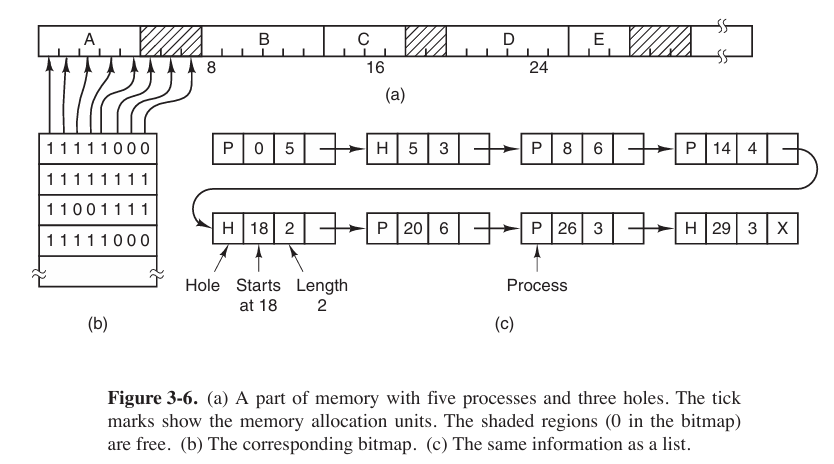
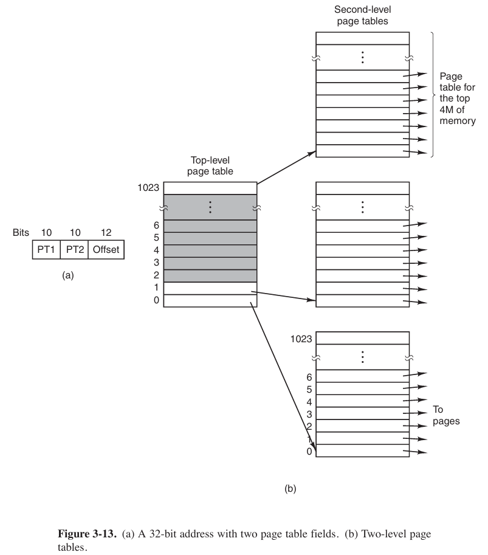

## No Memory Abstraction

The simplest memory abstraction is to have no abstraction at all.

Even with no memory abstraction, it is possible to run multiple programs at the same time. What the operating system has to do is save the entire contents of memory to a disk file, then bring in and run the next program. As long as there is only one program at a time in memory, there are no conflicts.

With the addition of some special hardware, it is possible to run multiple programs concurrently, even without swapping. It is shown as below. The figure (C) was the combination of program of (a) and (b)

Modify the second program on the fly as it loaded it into memory using a technique known as **static relocation**. It worked like this: When a program was loaded at address 16,384, the constant 16,384 was added to every program address during the load process (so “JMP 28” became “JMP 16,412”, etc.). While the **dynamic relocation** (动态重定位) is to add a base address to the program.

Static relocation is like printing a map where all of addresses can easy to find, but once the map is printed, the location would have settled. And the dynamic relocation is like using GPS that knows your currently address, once you move to different location, address would change.

But the physical memory of the computer isn’t large enough to hold all the processes often, so we need a strategy to manage the processes.

### Swapping

The operation of a swapping system is illustrated below.

### Managing Free Memory

When memory is assigned dynamically, the operating system must manage it. We have two ways to manage the operating system.

- with bitmap
    Memory is divided into allocation units (small as a few words, large as several kilobytes). Corresponding to each allocation unit is a bit in the bitmap, which is 0 if the unit is free and 1 if it is occupied (or vice versa).

- with linked lists
    Another way is to maintain a linked list of allocated and free memory segments, where a segment either contains a process (P) or is an empty hole (H) between two processes.

Both methods have their pros and cons. Bitmap is simple. The main problem is that when it has been decided to bring a k-unit process into memory, the memory manager must search the bitmap to find a run of $k$ consecutive 0 bits in the map. Searching a bitmap for a run of a given length is a slow operation. And the linked lists might be too large when there are too many processes.

When the processes and holes are kept on a list sorted by address, several algorithms can be allocate memory for a created process.

- first fit
    Simplest algorithm. The memory manager scans along the list of segments until it finds a hole that is big enough.

- next fit
    The same way as first fit, except that it keeps track of where it is whenever it finds a suitable hole.

- best fit
    Searches the entire list, from beginning to end, and takes the smallest hole that is adequate.

- worst fit
    Always take the largest available hole, so that the new hole will be big enough to be useful.

## Virtual Memory

The basic idea behind virtual memory is that each program has its own address space, which is broken up into chunks called pages. Each page is a contiguous range of addresses. These pages are mapped onto physical memory, but not all pages have to be in physical memory at the same time to run the program.

### Paging

Those program-generated addresses are called **virtual addresses** and form the **virtual address space**. When virtual memory is used, the virtual addresses do not go directly to the memory bus. Instead, they go to an **MMU** (**Memory Management Unit**) that maps the virtual addresses onto the physical memory addresses.

The virtual address space consists of fixed-size units called pages. The corresponding units in the physical memory are called **page frames**. The pages and page frames are generally the same size.

In the actual hardware, a **Present/absent bit** keeps track of which pages are physical present in memory. If the program references an unmapped address, it will cause CPU to trap to the operating system. This trap is called a **page fault**. The operating system picks a little-used page frame and writes its contents back to the disk (if it is not already there), and then fetches (also from the disk) the page that was just referenced into the page frame just freed, change the map, and restarts the trapped instruction.

The page number is used as an index into the **page table**, yielding the number of the page frame corresponding to that virtual page.

### Page Tables

The purpose of the page table is to map virtual pages onto page frames.


NOTES:

- page table (页表)
- Because in this case the pages occupied 4KB (or $2^{12}$ bit), we take the back 12 bits (The lowest $\log _2B$ bits) to contain the offset.
- There are 16 pages, so we take the front 4 bits to contain the virtual page number.




Usually, each process has its own page table.


We could see that

- the *Caching disable* bits tell whether being caching is permitted.
- the *Protection* bits tell what kind of access are permitted.
- the *Modified* and *Referenced* bits keep track of page usage. If the page in it has been modified (修改), it must be written back to the disk, and it also called dirty bit. The Reference bit is set a page is referenced, either for reading or for writing.
- the *Present/absent* bits tells whether this virtual page is in the physical memory.

### Speeding Up Paging

In any paging system, two issues must be faced:

1. The mapping from virtual address to physical address must be fast.
2. If the virtual address space is large, the page table will be large.

The former is easier but the latter would be harder. In order to solve the problem we would add a devise called **TLB** (**Translation Lookaside Buffer** 页表缓存).

When software TLB management is used, it is essential to understand the difference between different kinds of misses. A **soft miss** occurs when the page referenced is not in the TLB, but is in memory. All that is needed here is for the TLB to be updated. No disk I/O is needed. In contrast, a **hard miss** occurs when the page itself is not in memory (and of course, also not in the TLB). A disk access is required to bring in the page, which can take several milliseconds, depending on the disk being used.

The error that we do not need to access the disk again, but merely map the page appropriately in the page tables. This is a pretty soft miss that is known as a **minor page fault**. A **major page fault** occurs if the page needs to be brought in from disk. And it is possible that the program simply accessed an invalid address and no mapping needs to be added in the TLB at all. In that case, the operating system typically kills the program with a **segmentation fault**.

### Page Table for Large Memories

#### multilevel page tables


As an example, consider the 32-bit virtual address 0x00403004. This virtual address corresponds to `PT1 = 1`, `PT2 = 3`, and `Offset = 4`. The MMU first uses `PT1` to index into the top-level page table and obtain entry 1, which corresponds to addresses 4M to 8M − 1. It then uses `PT2` to index into the second-level page table just found and extract entry 3, which corresponds to addresses 12288 to 16383 within its 4M chunk. This entry contains the page frame number of the page containing virtual address 0x00403004.


#### Inverted Page Tables

Operating system only maintains a global page table. Physical address is just a index by hash on virtual page, and attaches a string of virtual addresses.

Inverted Page Tables can obviously cut down physical memory occupied, but the speed of address transferring is relatively slow.

## Page Replacement Algorithms

Now we are trying to find out algorithms that can avoid page fault occurring most.

### The Optimal Page Replacement Algorithm (OPT)

It is the best possible replacement algorithm. And it goes like this: at the moment that a page fault occurs, the page with the highest number of instructions that will be execute before that page is first referenced should be removed.

### The First-In First-Out (FIFO) Replacement Algorithm

It is easy to figure out.

### The Second-Chance Page Replacement Algorithm

A progress in FIFO algorithm.

### The Clock Page Replacement Algorithm

### The Last Recently Used (LRU) Page Replacement Algorithm

When a page fault occurs, the **Last Recently Used** (**LRU**) algorithm throws out the page that has been unused for the longest time.

But this algorithm has a problem: it is not cheap by a long shot. To fully implement LRU, it is necessary to maintain a linked list of all pages in memory, with the most recently used page at the front and the least recently used page at the rear. The difficulty is that the list must be updated on every memory reference.

### Simulating LRU in Software

One possibility is called the **NFU** (**Not Frequently Used**) algorithm. When a page fault occurs, the page with the lowest counter is chosen for replacement.

The main problem with NFU is that it never forgets anything. Consequently, the operating system will remove useful pages instead of pages no longer in use. So there is a modification to NFU, known as **aging**.

## Design Issues for Paging Systems

### Page Size

We stand $s$ bytes for average process size, $p$ bytes for page size, $e$ bytes for each page entry. So its overhead (开销) can be figure out

$$
\text{overhead}=\frac{se}{p}+\frac{p}{2}
$$

take the first derivative

$$
-\frac{se}{p^2}+\frac{1}{2}=0
$$

So the optimum page size is

$$
p=\sqrt{2se}
$$

### Share Pages

When more processes share some code, a problem occurs with the shared pages. If one process is removed from the memory, evicting all its pages, others will generate large number of page faults. So when a process terminates, special page data structures are needed to keep track of shared pages.

Sharing data is more tricker than sharing code, and what is often done is to give each of these processes its own page table and have both od them point to the same set of pages. However, all the data pages are mapped into both processes as `READ ONLY`. As soon as one process updates a memory system, the violation of the read-only protection causes a trap to the operating system. A copy is then made of the offending page so that each process now has its own **private copy** (专用副本). All copies are now set to `READ/WRITE`, so subsequent writes to one copy proceed without trapping. This strategy means that those pages that are never modified (including all the program pages) need not be copied. Only the data pages that are actually modified need to be copied. This approach, called **copy on write**(**COW**), improves performance by reducing copying.

### Shared Libraries


This part should be linked to file system.


Statically linking hundreds of programs with all these libraries would waste a tremendous amount of space on the disk as well as wasting space in RAM when they were loaded since the system would have no way of knowing it could share them. This is where shared libraries come in. When a program is linked with shared libraries, instead of including the actual function called, the linker includes a small stub routine (存根例程) that binds to the called function at run time.

Note that when a library is loaded or used, the entire library is not read into memory whole. It is paged in, page by page, as needed.

As shared library, `.so` on Linux, `.dll` on Windows, inner data and code must use relative addresses.


Shared library uses relative address instead of absolute address. When program loading shared library, it will map shared library to address space while running, so using relative address can let shared library load to different memory addresses.


### Mapped Files

Shared libraries are really a special case of a more general facility called **memory-mapped files**. The idea here is that a process can issue a system call to map a file onto a portion of its virtual address space.

We can imagine “copying” file to a portion of virtual memory, where program can treat file as common memory.


So in C language and C++, before operating a file, define a file pointer is necessary.


Mapped files provide an alternative model for I/O. Instead, of doing `read()` and `write()`, the file can be accessed as a big character array in memory.

If two or more processes map onto the same file at the same time, they can communicate over shared memory. Writes done by one process to the shared memory are immediately visible when the other one reads from the part of its virtual address spaced mapped onto the file.

## Implementation issues

### Locking Pages in Memory

Consider a process that has just issued a system call to read from some file or device into a buffer within its address space. While waiting for the I/O to complete, the process is suspended and another process is allowed to run. This other process gets a page fault. So we need to lock this page in memory to avoid it happened.

So locking pages in memory means keeping physical address corresponded with certain virtual address forcibly, not allowing operating system swap these pages to disk.

Excessive locking pages will decline available space of physical memory, and more page faults would be happened on other processes.
