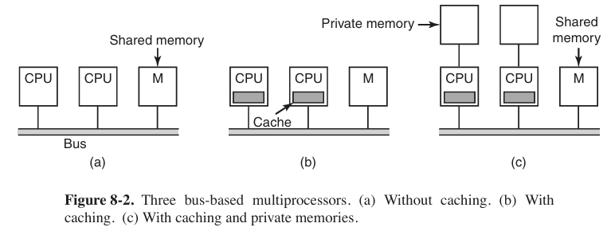

## Multiple Processor System

There are 3 types of sharing multiple processor.


Multicomputer and Message Passing is not the same concept. Multicomputer is just like an apartment with many rooms, everyone in rooms (processors) has own tables and file chests (local memory), while message passing is like people sent information via phones or mails, but not rush to other’s room to take file immediately.


### Multiprocessors

A shared-memory multiprocessor is a computer system in which two or more CPUs share full access to a common RAM.

#### Multiprocessor Hardware

Although all multiprocessors have the property that every CPU can address all of memory, some multiprocessors have the additional property that every memory word can be read as fast as every other memory word. These machines are called **UMA** (**Uniform Memory Access** 统一内存访问) multiprocessors. In contrast, **NUMA** (**Nonuniform Memory Access**) multiprocessors do not have this property.

- UMA Multiprocessors with Bus-Based Architectures

    The simplest multiprocessors are based on a single bus.

    

    With two or three CPUs, contention for the bus will be manageable; with 32 or 64 it will be unbearable. The system will be totally limited by the bandwidth of the bus, and most of the CPUs will be idle (空闲的) most of the time.

    The solution to this problem is to add a cache to each CPU. Each cache block is marked as being either read only (in which case it can be present in multiple caches at the same time) or read-write (in which case it may not be present in any other caches). If a CPU attempts to write a word that is in one or more remote caches, the bus hardware detects the write and puts a signal on the bus informing all other caches of the write.

    Yet another possibility is the design of Fig. 8-2(c), in which each CPU has not only a cache, but also a local, private memory which it accesses over a dedicated (private) bus.

- UMA Multiprocessors Using Crossbar Switches

    The simplest circuit for connecting $n$ CPUs to $k$ memories is the **crossbar switch**.

    

    One of the nicest properties of the crossbar switch is that it is a **nonblocking network**, meaning that no CPU is ever denied the connection it needs because some crosspoint or line is already occupied.

    One of the worst properties of the crossbar switch is the fact that the number of crosspoints grows as $n^2$. With 1000 CPUs and 1000 memory modules we need a million crosspoints. Such a large crossbar switch is not feasible (可行的). Nevertheless, for medium-sized systems, a crossbar design is workable.

- UMA Multiprocessors Using Multistage Switching Networks

    similar to a router, we can set a router to multiprocessors.

    

- NUMA Multiprocessors

    NUMA machines have three key characteristics that all of them possess and which together distinguish them from other multiprocessors:

    1. There is a single address space visible to all CPUs.
    2. Access to remote memory is via LOAD and STORE instructions.
    3. Access to remote memory is slower than access to local memory.
    
    When the access time to remote memory is not hidden (because there is no caching), the system is called NC-NUMA (Non Cache-coherent NUMA). When the caches are coherent, the system is called CC-NUMA (Cache-Coherent NUMA).

### Multiprocessors Operating System Types

- Each CPU Has Its Own Operating System

    

    This scheme is still better than having $n$ separate computers since it allows all the machines to share a set of disks and other I/O devices, and it also allows the memory to be shared flexibly.

- Master-Slave Multiprocessors

    

    The master-slave model solves most of the problems of the first model. And the problem with this model is that with many CPUs, the master will become a bottleneck. After all, it must handle all system calls from all CPUs. If, say, 10% of all time is spent handling system calls, then 10 CPUs will pretty much saturate (饱和) the master, and with 20 CPUs it will be completely overloaded.

- **SMP** (**Symmetric Multiprocessors** 对称多处理器)

    

    When a system call is made, the CPU on which the system call was made traps to the kernel and processes the system call.

    But it introduces its own problems. In particular, if two or more CPUs are running operating system code at the same time, disaster may well result. Imagine two CPUs simultaneously (同时) picking the same process to run or claiming the same free memory page. The simplest way around these problems is to associate a mutex (i.e., lock) with the operating system, making the whole system one big critical region. This approach is somethings called a **big kernel lock**.

### Multiprocessors Synchronization

Now think about what could happen on a multiprocessor. We see the worst-case timing, in which memory word 1000, being used as a lock, is initially 0. In step 1, CPU 1 reads out the word and gets a 0. In step 2, before CPU 1 has a chance to rewrite the word to 1, CPU 2 gets in and also reads the word out as a 0. In step 3, CPU 1 writes a 1 into the word. In step 4, CPU 2 also writes a 1 into the word. Both CPUs got a 0 back from the TSL instruction, so both of them now hav e access to the critical region and the mutual exclusion fails.

To prevent this problem, the **TSL** (**Test and Set Lock**), an atomic operation, instruction must first lock the bus, preventing other CPUs from accessing it, then do both memory accesses, then unlock the bus.

Problem: put a massive load on the bus or memory, slowing down all other CPUs trying to do their normal work.

An even better idea is to give each CPU wishing to acquire the mutex its own private lock variable to test.

### Multicomputer Virtualization

- Type I Hypervisor (监视器)
    In reality, it is the operating system, since it is the only program running in kernel mode. Its job is to support multiple copies of the actual hardware, called virtual machines, similar to the processes a normal operating system supports.
- Type II Hypervisor
    It is just a user program running on, say, Windows or Linux that “interprets” the machine’s instruction set, which also creates a virtual machine. We put “interprets” in quotes because usually chunks of code are processed in a certain way and then cached and executed directly to improve performance, but in principle, full interpretation would work, albeit (尽管) slowly.

## Security

### Goals and Threats

Many security texts decompose the security of an information system in three components: confidentiality (保密性), integrity (完整性), and availability (可用性). And preventing the threads of exposure of data (数据泄露), tampering with data (篡改数据) and denial of service (拒绝服务).

### Formal Models of Secure Systems - Covert Channels

In this instance, the first process, the client, wants some work performed by the second one, the server. For example, the server’s job is to help clients with filling out their tax forms. The clients are worried that the server will secretly record their financial data, for example, maintaining a secret list of who earns how much, and then selling the list. The server is worried that the clients will try to steal the valuable tax program.

The third process is the collaborator (合作者), which is conspiring (共谋) with the server to indeed steal the client’s confidential data. The collaborator and server are typically owned by the same person. The object is to design a system in which it is impossible for the server process to leak to the collaborator process the information.

From the system designer’s point of view, the goal is to encapsulate (封装) or confine (限制) the server in such a way that it cannot pass information to the collaborator. Unfortunately, more subtle communication channels may also be available. This communication channel is known as a **covert channel**.

### Exploiting Software - Buffer Overflow Attacks

One rich source of attacks has been due to the fact that virtually all operating systems and most systems programs are written in the C or C++ programming languages (because programmers like them and they can be compiled to extremely efficient object code). Unfortunately, no C or C++ compiler does array bounds checking.

In Fig. 9-21(a), we see the main program running, with its local variables on the stack. At some point it calls the procedure $A$, as shown in Fig. 9-21(b). The standard calling sequence starts out by pushing the return address (which points to the instruction following the call) onto the stack. It then transfers control to $A$, which decrements the stack pointer by 128 to allocate storage for its local variable (buffer B).

So what exactly will happen if the user provides more than 128 characters? Figure 9-21(c) shows this situation. The function copies all the bytes into and beyond the buffer, overwriting possibly many things on the stack, but in particular overwriting the return address pushed there earlier. In other words, part of the log entry now fills the memory location that the system assumes to hold the address of the instruction to jump to when the function returns. As long as the user typed in a regular log message, the characters of the message would probably not represent a valid code address. As soon as the function A returns, the program would try to jump to an invalid target—something the system would not like at all. In most cases, the program would crash immediately.

Now assume that this is not a benign (良性) user who provides an overly long message by mistake, but an attacker who provides a tailored message specifically aimed at subverting (破坏) the program’s control flow. Say the attacker provides an input that is carefully crafted to overwrite the return address with the address of buffer B. The result is that upon returning from function A, the program will jump to the beginning of buffer B and execute the bytes in the buffer as code. Since the attacker controls the content of the buffer, he can fill it with machine instructions—to execute the attacker’s code within the context of the original program. In effect, the attacker has overwritten memory with his own code and gotten it executed.

### Malware (恶意软件)

#### Trojan Horses

When the free program is started, it calls a function that writes the malware to disk as an executable program and starts it. The malware can then do whatever damage it was designed for, such as deleting, modifying, or encrypting files (加密文件). It can also search for credit card numbers, passwords, and other useful data and send them back to Mal over the Internet. More likely, it attaches itself to some IP port and waits there for directions, making the machine a zombie, ready to do whatever its remote master wishes. Usually, the malware will also invoke (调用) the commands necessary to make sure the malware is restarted whenever the machine is rebooted.

#### Virus

What is a virus, anyway? To make a long story short, a virus is a program that can reproduce itself by attaching its code to another program, analogous (类似) to how biological viruses reproduce. The virus can also do other things in addition to reproducing itself.

Once installed on the victim’s machine, the virus lies dormant (休眠) until the infected program is executed. Once started, it usually begins by infecting other programs on the machine and then executing its payload. In many cases, the payload may do nothing until a certain date has passed to make sure that the virus is widespread before people begin noticing it.

#### Worms

Technically, the worm consisted of two programs, the bootstrap and the worm proper. The bootstrap was compiled and executed on the system under attack. Once running, it connected to the machine from which it came, uploaded the main worm, and executed it. After going to some trouble to hide its existence, the worm then looked through its new host’s routing tables to see what machines that host was connected to and attempted to spread the bootstrap to those machines.

### Protection

#### cryptography (密码学)

- Public-Key Cryptography

The way public-key cryptography works is that everyone picks a (public key, private key) pair and publishes the public key. The public key is the encryption key; the private key is the decryption key. Usually, the key generation is automated, possibly with a user-selected password fed into the algorithm as a seed. To send a secret message to a user, a correspondent (通信方) encrypts the message with the receiver’s public key. Since only the receiver has the private key, only the receiver can decrypt the message.

- one-way functions

In various situations that we will see later it is desirable to have some function, $f$, which has the property that given $f$ and its parameter $x$, computing $y=f(x)$ is easy to do, but given only $f(x)$, finding $x$ is computationally infeasible (不可行的). Such a function is called a **cryptographic hash function**.

- RSA

    
    totient (欧拉函数) $f(n)$ of $n$
    $f(n)$ is a function that computes $n$ with the result is the quantity of numbers that smaller than $n$ and are coprime (互质) with $n$ in $[1~n]$.

    Euler’s theorem makes sense only when for any numbers $a$ and $n$, as long as the numbers are coprimed, satisfies

    $$
    a^{\phi (n)} \equiv 1 \mod n
    $$

    examples:

    $$
    \begin{array}{c}
    a=3 & n=10 & \phi(10)=4 & 3^4=81\equiv 1 \mod 10 \\
    a=2 & n = 11 & \phi(11)=10 & 2^{10}=1024\equiv1 \mod 11
    \end{array}
    $$

    

    1. choose two pretty huge prime numbers $p$ and $q$.
    2. let $n=p\ \cdot \ q$.
    3. let $f(n)=(p-1)\ \cdot\ (q-1)$.
    4. choose a number $e$, satisfying $e\leq n$ and coprimed with $f(n)$.
    5. choose a number $d$, satisfying $e\ \cdot \ d \mod f(n) = 1$.
    6. so the public key is $(e,n)$, private key is $d$.

    encrypt message $m$ : $c=m^e \mod n$
    decrypt message $c$ : $m=c^d \mod n$

    Why can decrypt? According to Euler’s theorem,

    $$
    c^d\mod n=m^{ed} \mod n=m{kf(n)+1} \mod n=m
    $$

- Digital signature

    

    In order to ensure original document is not tampered. We append a signature. The private key encrypts document’s MD5 value, while public key decrypts the signature and get its MD5 value.

#### mechanism

- protection domains

    A domain is a set of (object, rights) pairs. Each pair specifies an object and some subset of the operations that can be performed on it. A right in this context means permission to perform one of the operations.

