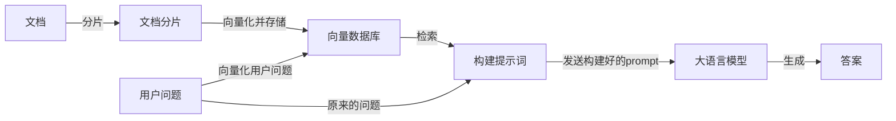

参考文献
- [https://developer.aliyun.com/article/1662485](https://developer.aliyun.com/article/1662485)
- [https://www.zhihu.com/tardis/zm/art/675509396](https://www.zhihu.com/tardis/zm/art/675509396)

## RAG 解决了什么问题

1. 知识更新滞后。LLM 是离线训练的，一旦训练完成后，它们无法获取新信息，因此，它们无法回答训练数据时间点后发生的事件。
2. 幻觉现象。LLM 的回答是根据已有的训练数据和概率预测得来的，当面对没有在训练中见过的问题时，模型很可能会胡编。

## RAG 架构

RAG 的机制并不难理解，就是通过检索获取相关的知识并将其融入 prompt，让大模型能够参考相应的知识从而给出合理回答。这也是其名字“检索增强生成”的由来。



完整的 RAG 应用流程主要包括以下阶段

[数据准备阶段](#数据准备阶段)：[数据提取](#数据提取) $\rightarrow$ [文本分割](#文本分割) $\rightarrow$ [向量化](#向量化) $\rightarrow$ [入库](#入库)
[应用阶段](#应用阶段)：[用户提问](#用户提问) $\rightarrow$ [数据检索](#数据检索) $\rightarrow$ [注入 prompt](#注入-prompt) $\rightarrow$ 生成答案


## 数据准备阶段

### 数据提取

在我个人搭建的简单 RAG 中，对数据提取一般仅限于固定的文档格式。对于这种情形，工厂模式 + 策略模式提供多种解析器就成为解析文件的最佳实践。

#### 工厂模式

该设计模式用于快速从众多已实现的解析器 Bean 里找到一个适合的出来。

```java
@Slf4j
@Component
@RequiredArgsConstructor
public class DocumentParserFactory {

	private final List<DocumentParser> parsers;

	public String parse(InputStream inputStream, String filename) throws Exception {
		for (DocumentParser parser : parsers) {
			if (parser.supports(filename)) {
				log.info("使用 {} 解析文件: {}", parser.getClass().getSimpleName(), filename);
				return parser.parse(inputStream, filename);
			}
		}
		
		throw new IllegalArgumentException("不支持的文件类型: " + filename);
	}
}
```

`supports` 方法在目前的实现类中均为后缀校验，那能不能舍弃呢？一般来说还是不建议的。该方法还可以实现以下功能
- `.txt` 的 UTF8 和 GBK 编码，可以使用两个解析器分别解析，并通过该方法去校验。
- 校验 `.log` 是 json 格式还是 Java 程序的调式信息格式，还是纯文本。
- 舍弃后需要每次新增解析器时在工厂类中新增一项判定条件，违背开闭原则。

#### 策略模式

策略模式简单来说就是“我只提供规范，其他你们看着办”，适合有很多种实现的情况。首先我们定义一组接口

```java
/**
 * 文档解析器接口
 */
public interface DocumentParser {
	
	/**
	 * 解析文档内容
	 * @param inputStream 文件输入流
	 * @param filename 文件名
	 * @return 解析后的文本内容
	 * @throws Exception 解析异常
	 */
	String parse(InputStream inputStream, String filename) throws Exception;
	
	/**
	 * 判断是否支持该文件类型
	 * @param filename 文件名
	 * @return 是否支持
	 */
	boolean supports(String filename);
}
```

以 `.txt` 等文本文件为例，以下是一种解析器实现示例

```java
@Slf4j
@Component
public class TextParser implements DocumentParser {

	@Override
	public String parse(InputStream inputStream, String filename) throws Exception {
		try (BufferedReader reader = new BufferedReader(new InputStreamReader(inputStream, StandardCharsets.UTF_8))) {
			return reader.lines().collect(Collectors.joining("\n"));
		}
	}

	@Override
	public boolean supports(String filename) {
		String lower = filename.toLowerCase();
		return lower.endsWith(".txt") || lower.endsWith(".md") || lower.endsWith(".log");
	}
}
```

常见的文件解析需求有 PDF、Word、Excel、CSV、图片、音频等，技术选型有 PDFBox、POI、OCR、ASR 等。如果需要解析 URL 中的文件，一般还是建议先本地下载好再放到解析器里，不应该让解析器分担太多功能。

### 文本分割

文本分割好了 embedding 模型才能搜得快。文本分割主要考虑两个因素，一个是 embedding 模型的 token 限制情况，另一个是语义完整性对整体的检索效果的影响。一般文本分割有两种方式
- 句分割：以“句”为粒度进行分割，保留一条句子的完整语义。常见分割符为句号、感叹号、问号等。
- 固定长度分割，以 token 为单位进行分割，这种切分方式可能会损失很多信息，一般通过添加相关信息，或者增加一定的冗余量来缓解。

以下为在 service 类中，使用 spring ai，将文件从原始文件到多个按 token 分块的简单过程。省略了异常处理和校验模块等内容。

```java
String docId = UUID.randomUUID().toString();
log.info("开始处理文档: {}, docId: {}", file.getOriginalFilename(), docId);

// 使用工厂解析文档内容
String content = documentParserFactory.parse(file.getInputStream(), file.getOriginalFilename());

Document fullDocument = new Document(content);
List<Document> documents = List.of(fullDocument);

// 文本分割 - 每 500 个 token 一个块，重叠 50 个 token（缓解语义割裂），
// 最小块长度为 5，最大 token 数为 10000，按 token 分割的模式为 true。
TokenTextSplitter splitter = new TokenTextSplitter(500, 50, 5, 10000, true);
List<Document> chunks = splitter.apply(documents);

// 为每个块添加元数据，用于检索溯源/过滤
chunks.forEach(chunk -> {
    chunk.getMetadata().put("docId", docId); // 原始文档 id
    chunk.getMetadata().put("collection", collection); // 向量库集合隔离。如果方法没传这个参数可以忽略
    chunk.getMetadata().put("filename", file.getOriginalFilename()); // 来源文件名
});
```

`Document` 是 spring ai 中文本内容 + 元数据的标准封装容器，它贯穿 RAG 从分割到 prompt 注入的全流程，是 spring ai 组件间交互的通用数据格式。

Transformer 模型具有固定的输入序列长度，即使输入上下文窗口很大，一个句子或几个句子的向量也比几页文本的向量更能代表其语义含义。说人话就是，小块语义更清晰，检索更准。

分块大小是一个需要重点考虑的问题。太大了不符合 embedding 模型的要求，太小了语义完整性受影响。不一定要按源码中的格式来。块的大小取决于使用的 embedding 模型及使用的 token 的容量，不同的 embedding 模型有不同的适配方案，如 BERT 常用 512，OpenAi ada-002 支持 8191。

### 向量化

向量化是一个将文本数据转化为向量矩阵的过程。该过程会直接影响到后续搜索的结果。向量化需要专门的 embedding 大模型解决。这些模型的目标是使得具有相似语义的文字序列对应的向量尽可能靠近，而语义不同的文字序列对应的向量尽可能远离，从而通过数学计算向量之间的距离，快速检索处相似度最高的文字序列。

目前常用的 embedding 模型有 ChatGPT-Embedding (OpenAi)、Qwen-Embedding (Alibaba)、ERNIE-Embedding (百度)，等等。

通过对编码器微调，可以提升特定场景下的 embedding 质量。但其收益有限，一般在后期优化。


有时候需要指定 embedding 大模型的**向量维度**，也就是模型把一段文本转换成的**浮点数数组的长度**。

维度越高，模型能表达的语义细节，概念区分，上下文关系越丰富。但同时，维度越大，每个文本块占用的存储空间就越大，且检索速度就越慢。且对于 ANN 索引来说，维度越大，构建索引的速度也就越慢。

一般我们使用 512 / 768 维构建内部知识库，1024 维构建通用 RAG 或企业级知识库，2048 维及以上构建学术等专业知识库。一般不同的 embedding 允许的维度不一样，直接用官方默认的最省事。


### 入库

入库指将文本向量化后，把向量及关联元数据写入存储载体的过程。这里的 “存储载体” 并非传统关系型数据库，而是向量存储。可以使用纯内存、redis、关系型数据库（需支持向量类型）、ES来存储向量库。一般而言，小体量知识库用 redis 较多，大体量知识库用 ES 较多。

以 redis 为例，向量库的配置 Bean 如下：

```java
@Slf4j
@Configuration
@ConditionalOnProperty(prefix = "spring.ai.model.rag", name = "enabled", havingValue = "true")
public class RagConfig {
	@Value("${spring.data.redis.host:localhost}")
	private String redisHost;
	@Value("${spring.data.redis.port:6379}")
	private int redisPort;
	@Value("${spring.data.redis.password:}")
	private String redisPassword;
	@Value("${spring.data.redis.database:0}")
	private int redisDatabase;

    // 1. 构建Redis连接池（JedisPooled）：Spring AI的RedisVectorStore依赖Jedis客户端
	@Bean
	public JedisPooled jedisPooled() {
		if (StringUtils.hasText(redisPassword)) {
			return new JedisPooled(redisHost, redisPort, null, redisPassword);
		} else {
			return new JedisPooled(new HostAndPort(redisHost, redisPort));
		}
	}

    // 2. 构建DashScope（阿里通义）向量存储：默认实现
	@Bean
    public VectorStore dashscopeVectorStore(@Qualifier("dashscopeEmbeddingModel") EmbeddingModel embeddingModel, JedisPooled jedisPooled) {
        // Builder 配置：redis 连接池 + embedding 配置 + 索引名 + key 前缀
        return RedisVectorStore.builder(jedisPooled, embeddingModel)
			.indexName("rag-vectors-dashscope")
			.prefix("rag")
			.build();
    }

    // 3. 构建OpenAI向量存储：仅当配置文件指定provider=openai时生效（条件注入）
	@Bean
	@ConditionalOnProperty(
		prefix = "spring.ai.model",
		name = "provider",
		havingValue = "openai"
	)
	public VectorStore openAiVectorStore(@Qualifier("openAiEmbeddingModel") EmbeddingModel embeddingModel, JedisPooled jedisPooled) {
		return RedisVectorStore.builder(jedisPooled, embeddingModel)
			.indexName("rag-vectors-openai")
			.prefix("rag")
			.build();
	}
}
```

在海量数据下，搜索索引应该采用向量索引，使用 FAISS/NMSLiB/HNSW 等 ANN 索引加速。在超大型数据库中，处理块的一个有效方法就是创建两个索引：一个由摘要组成，一个由文档块组成，然后分两步进行搜索。还可以存储元数据，并使用元数据过滤器来按照日期、来源等条件进行信息检索。

## 应用阶段

### 用户提问

**查询转换**
用户提问的内容不一定需要原样保存，还可以使用 LLM 作为推理引擎来修改用户输入以提高检索质量。例如，将复杂的查询拆分为多个子查询。如问“在 GitHub 上，Langchain 和 LlamaIndex 哪个更受欢迎？”，此时大模型可以将其拆分为两个更简单合理的例子查询：“Langchain 在 GitHub 上有多少星？”和“LlamaIndex 在 GitHub 上有多少星”。

还可以根据用户的问题，生成更通用的上层查询，以补充背景知识。

### 数据检索

数据检索的方式有两种：一种是相似性检索，一种是全文检索。
- 相似性检索：通过余弦相似性、欧氏距离、曼哈顿距离等算法计算查询向量和所有存储向量的相似性得分，并返回得分高的记录。其核心依赖 embedding 模型的语义理解能力。
- 全文检索：直接通过倒排索引或其他方式搜索。无语义理解能力。

以下是进行相似性检索的代码，忽略空值检测和错误处理。

```java
// prompt 为用户的问题，会自动转为向量；topK 为返回最相似的前 N 条结果
public List<String> search(String query, String collection, int topK) {
    // 构造搜索请求
    SearchRequest request = SearchRequest.builder()
        .query(query)
        .topK(topK)
        .similarityThreshold(0.5) // 相似度阈值，过滤低于 0.5 的低相关性结果。
        .build();

    List<Document> results = vectorStore.similaritySearch(request);

    // 过滤指定 collection 的结果并提取内容
    return results.stream()
        .filter(doc -> collection.equals(doc.getMetadata().get("collection")))
        .map(Document::getContent)
        .collect(Collectors.toList());
}
```


**融合搜索**或**混合搜索**
同时结合基于关键字的搜索和现代语义或向量搜索，并将其结果组合在一个检索结果中。这里的唯一关键是如何组合不同相似度分数的检索结果，可以使用 Reciprocal Rank Fusion 算法对检索结果进行重排。在 LangChain 中称为 `EnsembleRetriever`。



### 注入 prompt

将搜索完成的结果注入到用户的 prompt 里。以下是一种参考实现

```java
public String chatWithContext(String question, String collection, int topK) {
    log.info("RAG 问答: {}", question);

    // 1. 检索相关文档
    List<String> contexts = search(question, collection, topK);

    if (contexts.isEmpty()) {
        return "未找到相关文档，无法回答该问题。";
    }

    // 2. 构建提示词
    String contextText = String.join("\n\n", contexts);
    String promptText = String.format(
        "基于以下文档内容回答问题。如果文档中没有相关信息，请说明无法回答。\n\n" +
            "文档内容：\n%s\n\n" +
            "问题：%s\n\n" +
            "回答：",
        contextText, question
    );

    // 3. 调用 LLM 生成答案
    Prompt prompt = new Prompt(promptText);
    return chatModel.call(prompt).getResult().getOutput().getText();
}
```


**内容增强**
将相关的上下文组合起来供 LLM 推理，检索较小的块，以获得更好的搜索效果。内容增强一般有两种选择。
- 语句窗口检索器：适用于句子级 embedding，在检索到句子后，把前后 `k` 句一起送给 LLM。
- 自动合并检索器：拆成用于检索的子块和用于推理的父块，若多个子块命中统一父块，则直接返回父块。

