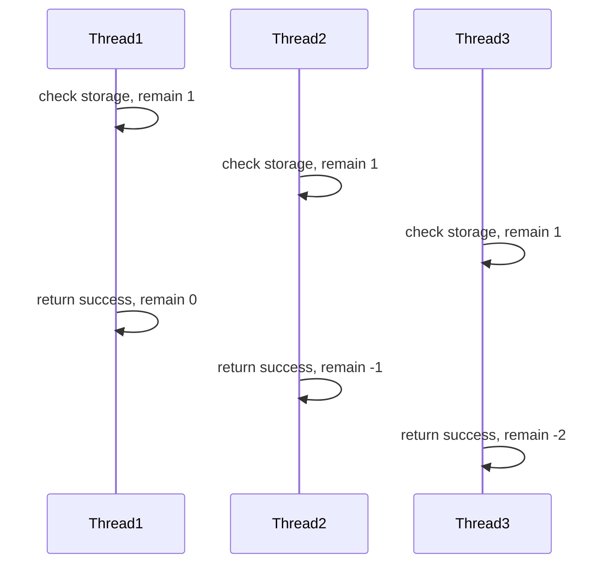
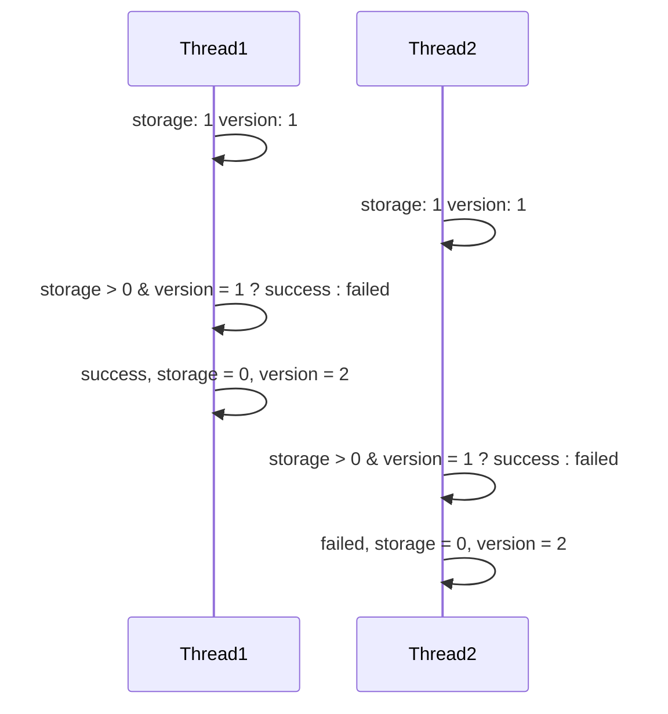
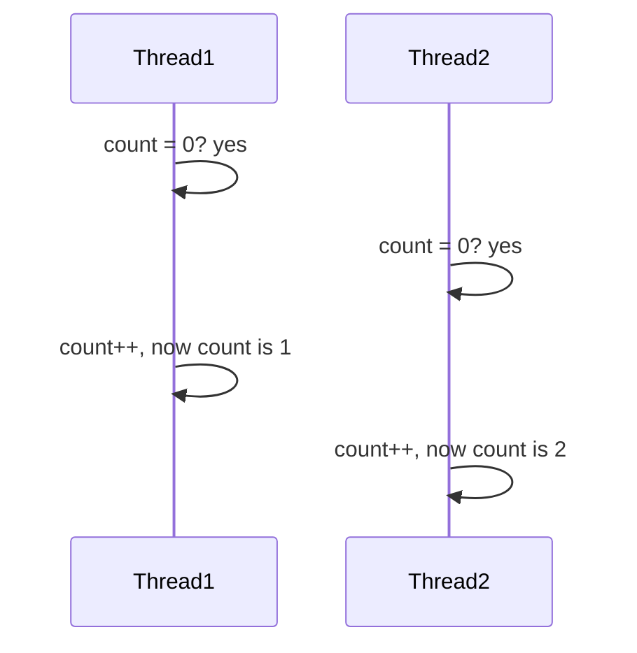
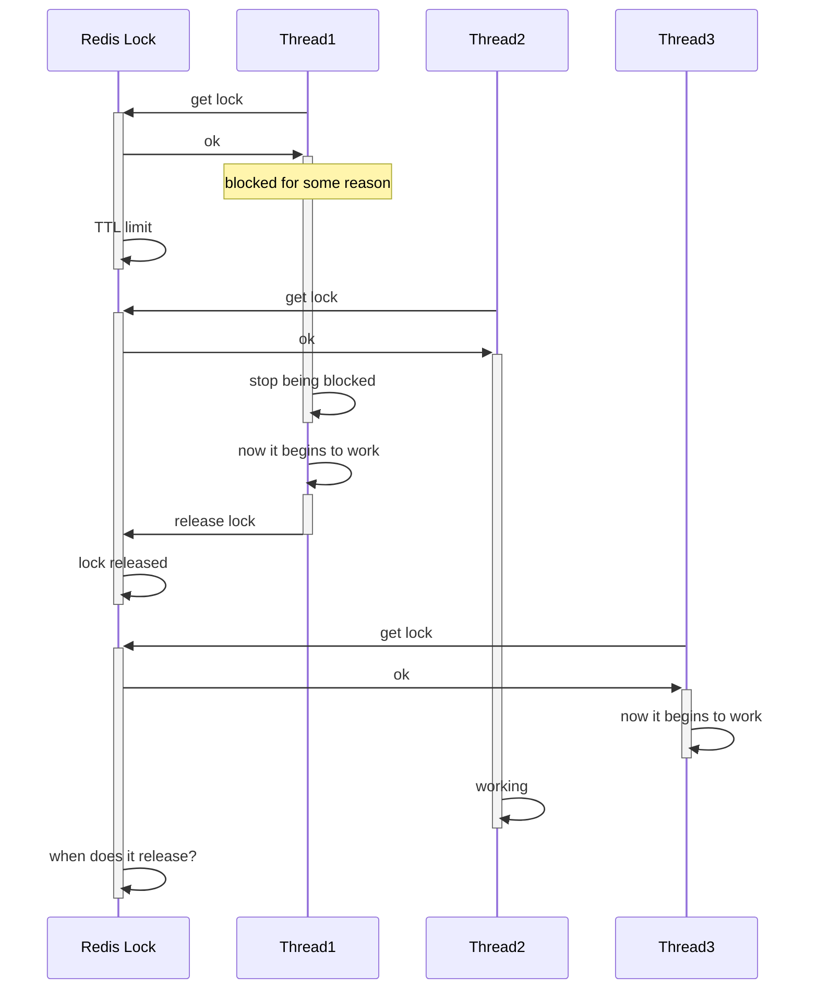
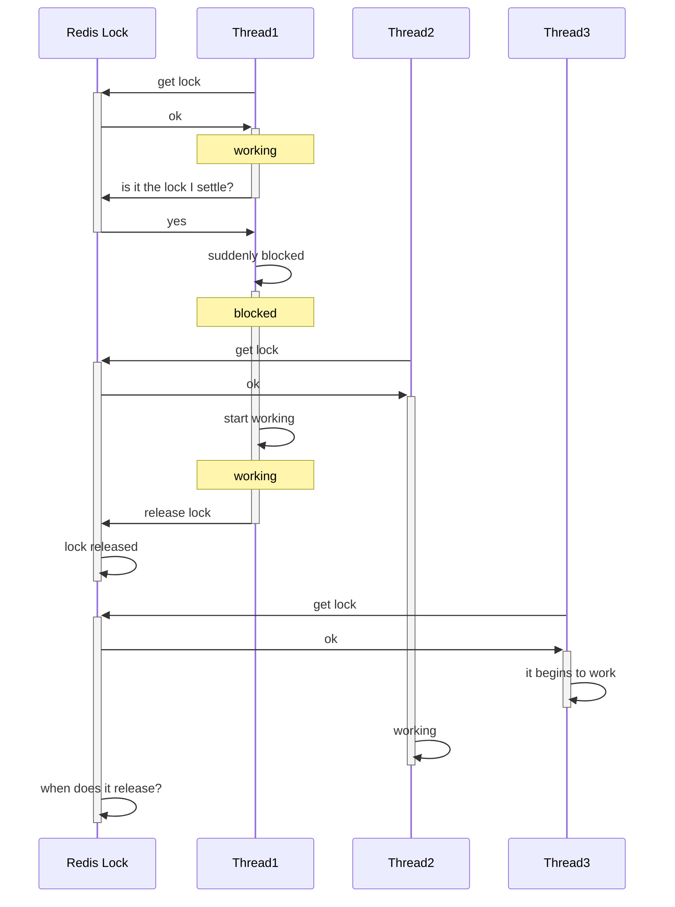

## 超卖问题与一人一单

以下以优惠券（或者理解成门票也行）的抢购为例，列举并解决高并发下各种可能发生的情况。

优惠券的抢购规则如下：提供N张优惠券，在指定时间内可以进行抢购，一人只能抢一张，抢完为止。在一般的服务器中，该需求执行流程如下

1. 向数据库查询用户是否抢到过了，抢到过就报错。
2. 向数据库查询是否还有库存，没有就报错。
3. 没问题就返回成功信息。

可以发现，在高并发状态下，数据库中的一个数据可能同时会被多个线程同时访问，从而导致只有一个线程会读取到正确的数据，最后导致超卖问题。而如果使用正常的互斥锁，就会造成大量无用的性能消耗，严重拖慢响应速度，影响体验。

因此引入乐观锁的概念。普通的互斥锁可以视作悲观锁，因为这种锁假定线程安全问题一定发生。而乐观锁则认为线程安全问题不一定发生，只需要检查在修改数据前读取到的数据有没有发生更改。若发生了更改，说明有其他线程正在使用该关键区，则进行等待，反之则说明没有其他线程使用，可以放心修改数据。

一种比较经典的乐观锁方案叫做CAS(Compare and Swop)，它的工作原理与上文一样，通过直接比较需要更改的值前后两次读取的值是否一样。但单纯的CAS方案可能会引起ABA问题：另一个线程在两次读取期间，将关键区数据由A变成B再变成A，但此时本线程仍然认为没有改变，从而进行更改。作为改进，乐观锁通常使用单独的版本号替代关键区数据。

而在实际操作中，后一次version的判断往往在MySQL中进行，这样就保证了判断相等与改变数据的原子性——其实就是把应该原子化操作的部分扔给MySQL完成了。上图的示例演示了优惠券刚好减到0的状况，如果不是0，没抢到关键区的线程还需要再重试。

对于一人一单问题，如果单纯加一层判断，那么就可能出现和上面超卖问题中类似的问题

因此也需要在修改的时候加锁。

## 分布式锁

对于存在多个后端服务器的场景，就容易出现自己jvm中线程的锁无法顾及另一个jvm的情况，因此需要将一些锁放到redis中，称为分布式锁。在redis中，有命令`setnx`来方便地设置类似锁的键值对。我们可以通过在Spring中操作`setnx`操作来获取锁，通过操作的返回值判断获取成功与否。若获取成功后再释放锁，则通过`del`操作解决。当然，为了解决死锁或其他问题，可以在`setnx`后添加`ex`属性，设置超时时间expire time。但是，分布式锁可能会存在一些问题。

### 误删锁

本不应该释放的锁却因为其他原因释放了，导致最后有两个线程在关键区域工作。因此，创建锁的时候要给这个锁创建一个标识（可以是UUID），释放锁的时候要先查看锁是不是自己创建的，若不是自己创建的则释放失败。

### 原子性操作

当判断锁的表示与释放锁不在同一个原子操作时，就可能出现上述情况。因此需要保证判断和释放锁的操作为一个原子操作。而这个只能通过操作lua脚本实现。


redis是用C语言写的，但也支持使用lua脚本语言执行批处理操作。在这个脚本中的操作redis保证实现原子性。
