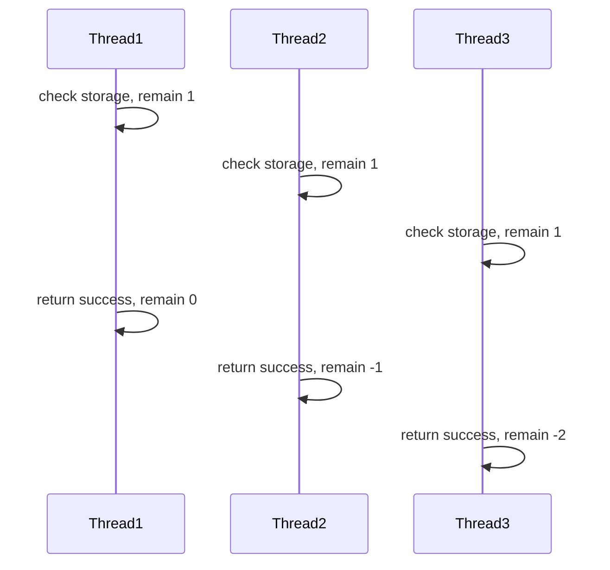
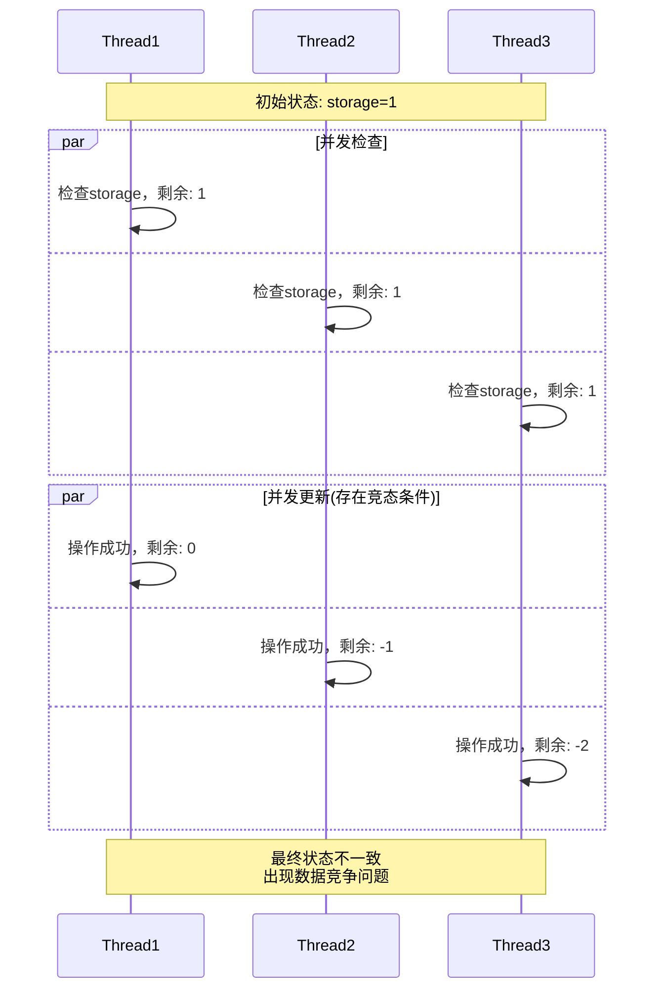
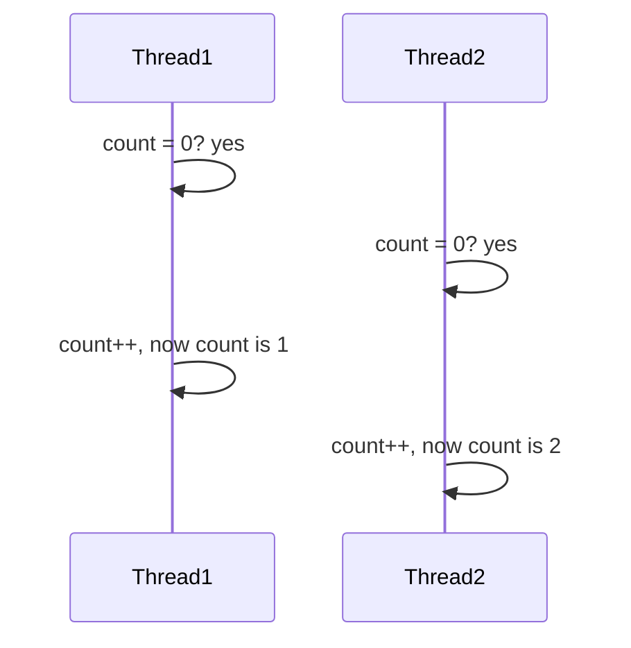

## 超卖问题与一人一单


美团后台开发 - 暑期实习, 一面.


以下以优惠券（或者理解成门票也行）的抢购为例，列举并解决高并发下各种可能发生的情况。

优惠券的抢购规则如下：提供N张优惠券，在指定时间内可以进行抢购，一人只能抢一张，抢完为止。在一般的服务器中，该需求执行流程如下

1. 向数据库查询用户是否抢到过了，抢到过就报错。
2. 向数据库查询是否还有库存，没有就报错。
3. 没问题就返回成功信息。

```mermaid
sequenceDiagram
    participant t1 as Thread1
    participant t2 as Thread2
    participant t3 as Thread3

    t1->>t1: check storage, remain 1
    t2->>t2: check storage, remain 1
    t3->>t3: check storage, remain 1
    t1->>t1: return success, remain 0
    t2->>t2: return success, remain -1
    t3->>t3: return success, remain -2
```

可以发现，在高并发状态下，数据库中的一个数据可能同时会被多个线程同时访问，从而导致只有一个线程会读取到正确的数据，最后导致超卖问题。而如果使用正常的互斥锁，就会造成大量无用的性能消耗，严重拖慢响应速度，影响体验。

因此引入乐观锁的概念。普通的互斥锁可以视作悲观锁，因为这种锁假定线程安全问题一定发生。而乐观锁则认为线程安全问题不一定发生，只需要检查在修改数据前读取到的数据有没有发生更改。若发生了更改，说明有其他线程正在使用该关键区，则进行等待，反之则说明没有其他线程使用，可以放心修改数据。

一种比较经典的乐观锁方案叫做CAS(Compare and Swop)，它的工作原理与上文一样，通过直接比较需要更改的值前后两次读取的值是否一样。但单纯的CAS方案可能会引起ABA问题：另一个线程在两次读取期间，将关键区数据由A变成B再变成A，但此时本线程仍然认为没有改变，从而进行更改。作为改进，乐观锁通常使用单独的版本号替代关键区数据。

```mermaid
sequenceDiagram
    participant t1 as Thread1
    participant t2 as Thread2
    participant t3 as Thread3

    Note over t1, t3: 初始状态: storage=1

    par 并发检查
        t1->>t1: 检查storage，剩余: 1
    and
        t2->>t2: 检查storage，剩余: 1
    and
        t3->>t3: 检查storage，剩余: 1
    end

    par 并发更新(存在竞态条件)
        t1->>t1: 操作成功，剩余: 0
    and
        t2->>t2: 操作成功，剩余: -1
    and
        t3->>t3: 操作成功，剩余: -2
    end

    Note over t1, t3: 最终状态不一致<br/>出现数据竞争问题
```


除了ABA这个最经典的问题，在高并发场景下，CAS操作可能会频繁失败，导致线程不断重试，增加CPU开销。可以加一个自选次数的限制，超过次数就升级锁。


而在实际操作中，后一次version的判断往往在MySQL中进行，这样就保证了判断相等与改变数据的原子性——其实就是把应该原子化操作的部分扔给MySQL完成了。上图的示例演示了优惠券刚好减到0的状况，如果不是0，没抢到关键区的线程还需要再重试。

对于一人一单问题，如果单纯加一层判断，那么就可能出现和上面超卖问题中类似的问题

```mermaid
sequenceDiagram
    participant t1 as Thread1
    participant t2 as Thread2

    t1->>t1: count = 0? yes
    t2->>t2: count = 0? yes
    t1->>t1: count++, now count is 1
    t2->>t2: count++, now count is 2
```

因此也需要在修改的时候加锁。


若在秒杀场景下，请求仍然过多，仍然可以通过实现多种限流算法，如计数器限流、令牌桶或漏桶算法等。


## 持久化


腾讯混元 - 实习, 一面.


redis中将数据持久化的方式有两种：RDB (快照) 和AOF (只追加文件)，二者可以同时使用
- RDB 持久化机制可以在指定时间间隔内将redis某一时刻的数据保存到磁盘上的RDB文件中，redis重启时，可以加载这个RDB文件来恢复数据。
    RDB持久化可以通过`save`和`bgsave`命令手动触发（前者会阻塞redis进程，后者会fork一个子进程），也可以通过配置文件中的`save`指令自动触发。
    除了自动触发，在主从复制，从节点第一次链接到主节点时，主节点会自动执行`bgsave`生成RDB文件，并将其发给从节点；在没有开启AOF的情况下执行`shutdown`指令时，redis也会自动保存一次RDB文件。
- AOF 通过记录每个写操作指令，并将其追加到AOF文件实现持久化。当redis执行写操作时，会将命令追加到AOF缓冲区`server.aof_buf`，redis会根据同步策略将缓冲区的数据写入到AOF中。AOF文件过大时，redis会进行AOF的重写，以剔除多余的指令（如`set`和`del`的组合）。

### AOF

在配置文件中设置`appendonly yes`即可开启AOF持久化了。

AOF在进行持久化时
1. `append` 所有的写命令追加到AOF缓冲区中
2. `write` 将AOF缓冲区的数据写入到AOF文件中，这一步需要调用`write`函数，将数据写入到了系统内核缓冲区
3. `fsync` AOF依据持久化方式，向磁盘做同步操作
4. `rewrite` 定期对AOF文件重写，达到压缩目的

其刷盘策略分为三种，区别在于redis执行将OS缓冲区数据刷新到磁盘的系统调用`fsync`执行的时机。
- `always` 每次写命令都调用`fsync`同步到磁盘
- `everysec` 每秒调用一次`fsync`
- `no` 不主动调用`fsync`，由操作系统决定

开启AOF的重写功能，可以调用`BGREWRITEAOF`命令手动执行，也可以配置下面两个配置项
- `auto-aof-rewrite-min-size` 触发AOF重写的阈值，默认为64Mb
- `auto-aof-rewrite-percentage` 执行AOF重写时，当前AOF大小和上一次重写时AOF大小的比值。默认为100，为0时禁止自动重写

在Redis执行AOF重写期间，系统会创建一个AOF重写缓冲区，用于记录从创建子进程开始，主进程执行的所有写命令。此时，子进程会复制父进程的数据副本，遍历内存数据并生成可重建键值对的最精简指令集。同时，主进程接收的写命令不仅写入原有AOF文件，也会同步至重写缓冲区。当子进程完成重写后，主进程会将缓冲区中的命令追加到新AOF文件末尾，最后通过操作系统的`rename`操作以新文件替换旧AOF文件，完成整个重写过程。

由于新旧AOF文件在物理上是完全独立的，所有新的写命令会同时写入当前的（旧）AOF文件与重写缓冲区。待子进程完成新AOF文件的创建后，主进程再将重写缓冲区的内容追加到新文件。最后，通过一次原子性的 `rename` 操作，用新文件整体替换旧文件。这种机制确保了旧文件中的数据不会被重复写入新文件，从而避免了命令重复。

在配置文件中设置`aof-use-rdb-preamble yes`，可以开启混合持久化。在Redis 4.0引入的混合持久化模式下，AOF文件由前端的RDB格式快照与后端的AOF格式增量命令共同组成。启动加载时，Redis会先校验文件头的RDB部分，若校验失败则直接拒绝启动。通过校验后，服务会加载RDB快照以恢复基础数据，随后开始按AOF格式重放其后的增量命令；此过程中若指令解析出错，服务将中止加载并报错，但此前已成功加载的RDB数据依然可用。此模式结合了RDB的快速恢复与AOF的数据可靠性，但牺牲了纯AOF文件的可读性。

若redis保存的数据丢失一些也没有什么影响的话，可以选择使用RDB，若保存的数据安全性要求比较高的话，建议两种策略都开启或者开启混合持久化。不建议单独启动AOF，因为时不时地创建一个 RDB 快照可以进行数据库备份、更快的重启以及解决 AOF 引擎错误。

## 内存管理

可以通过 `redis-cli INFO memory` 命令查看redis中的内存使用情况，看看是否发生内存不足的问题。可以修改`redis.conf`中的`maxmemory`数据，改变其最大内存限制。或者修改`maxmemory-policy` 调整内存淘汰策略。

在接近maxmemory限制时，redis会按照内存淘汰策略来决定删除哪些key来缓解内存压力
- `noeviction` 不删除任何key，直接报错
- `allkeys-lru` 使用LRU算法删除最近最少使用key，更适合有时间局部性的场景
- `allkeys-lfu` 使用LFU算法删除访问频率最低的key，更适合有长期访问模式的场景
- `random` 随机删除一些key
- `volatile-lru` `volatile-lfu` `volatile-ttl` `volatile-random` 针对设置了过期时间的删除操作