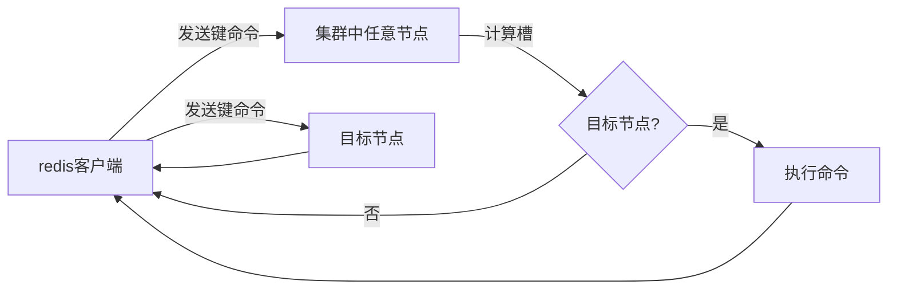

## 阻塞队列

在抢单业务中，同一时间内会有大量的请求，但MySQL中的写速度总是有限的，因此就需要通过读写分离来提高响应速度。优化的内容在第二篇中已经提到过，此处主要是读写不均衡下队列的一种实现方式。

阻塞队列与其他队列不一样的地方在于，当队列为空时，若一个线程试图从队列中取出元素，那么这个操作将被**阻塞**，直到有元素被放入为止；当队列为满时，若一个线程试图向队列中放入元素，那么这个操作也会被阻塞，直到有元素被取出为止。也就是说，阻塞队列是一种更加智能的生产-消费者模型。

## 消息队列

阻塞队列也存在问题，例如超过上限时处理速度仍然较慢，而且由于没有持久化，阻塞队列中容易出现安全问题。使用消息队列就容易解决这些问题。消息队列仍然是一种更智能的生产-消费者模型。在redis中，可以通过stream类型实现消息队列的功能。当然，更常用的还是Rabbit MQ。

在redis 2.0前，只能通过List的`rpush/rpop`或`lpush/lpop`来实现简易版消息队列。但这样可能会存在性能问题。在redis 2.0后，5.0前，可以使用发布/订阅功能（`pub`/`sub`），解决了List没有广播机制的问题。在redis 5.0后，可以使用`Stream`来实现消息队列，Stream是一个有序的消息列表，可以满足一个消息队列的基本要求。不过，其在实际使用中依然会有一些小问题。

## Feed流的实现方案

Feed流可以为用户持续提供的“沉浸式”体验，通过无限下拉刷新获取信息。而Feed流产品有两种实现方式，一种是不做内容筛选，简单的按照内容发布时间排序，常用于好友或关注。如关注栏和朋友圈等；而另一种则是利用智能算法屏蔽掉用户不感兴趣的内容，推送用户感兴趣的内容来吸引用户。

对于其中的第一种实现方式，有3种不同的解决方案

- 拉模式
    拉模式也叫做读扩散。每个内容发布者准备一个发件箱，内容发布者在发布内容时，将内容和时间戳一起放到发件箱内。普通用户有一个收件箱。收件箱平时为空，只有在普通用户需要观看时才将所有人的发件箱消息全部拉到收件箱里去，并按时间顺序排列。
    由于收件箱是一次性的，因此该方法能节省内存。但是由于每一次读取时都要重新找发件箱内的消息，所以读取速度较慢。

- 推模式
    推模式也叫做写扩散。与拉模式不同，每个普通用户准备一个收件箱。内容发布者向关注他的所有粉丝的收件箱。
    一份消息需要储存多次，因此内存消耗较大。但用户直接打开收件箱即可，因此读取速度较快。因此适用于用户量较少，没有大V的应用。

- 推拉结合
    空间与时间总是不能兼容，因此需要在二者之中进行取舍。内容发布者都有发件箱，普通用户都有收件箱。对粉丝少的内容发布者使用推模式，对粉丝多的内容发布者，对活跃粉丝使用推模式，对僵尸粉使用拉模式。适合超千万的用户量，大V云集的应用。

## 位图

可以将位图看作是一个存储0或1的数组，其下标称为offset（偏移量）。在redis中，位图多用于统计用户的签到信息，使用日期为Key，用户id为offset，或反过来。

## 统计

对日活量的统计可以分为两个统计指标

- **UV** (Unique Visitor): 独立访客量，通过互联网访问、浏览这个网页的人。一天内同一个用户多次访问该网站，只记录一次。
- **PV** (Page View): 页面访问量，用户每访问一个页面就记录一次，访问多次就记录多次。

因为对用户的统计信息需要存储，因此这种统计在服务器段做会比较麻烦，就是在redis中进行缓存，数据量也会很恐怖。因此对于UV统计，常用的方法是使用redis内置的HyperLogLog功能，该功能能确定非常大的集合的基数，但统计会有误差，误差为小于0.81%。

使用`pfadd key:uv user`来在key中的Hyperloglog添加用户，使用`pfcount key:uv`对key中进行UV统计。

## GEO

GEO用于存储和查询地理位置信息，其底层基于ZSet实现，用过Geohash算法把经纬度编码成score。

## 搜索引擎

对于小型项目，可以使用`RedisSearch`，搭配`RedisJSON`，可以作为搜索引擎使用。然而在比较复杂的场景下，则需要使用`Elasticsearch`。前者适用于快速数据存储、缓存和简单查询的场景，后者适用于全文搜索、复杂查询、实时数据分析和聚合的场景。

## 主从复制

和数据库一样，redis也可以进行主从复制，读写分离。除了减轻主节点压力的考虑，还可以将从节点当作主节点的数据备份，当主节点发生故障时，可以快速将从节点升级为主节点。

当主节点宕机、网络波动或主节点内存压力过大（从而导致启用了淘汰策略，某些键被自动删除）时，可能会导致主从不一致的问题。可以在配置层面适当增大复制的挤压缓冲区的大小和存活时间，以便从节点重连后进行增量同步而不是全景同步，以最大程度减少主从同步的延迟。

```shell
repl-backlog-size 1mb # 默认值1mb，表示主节点复制缓冲区的大小
repl-backlog-ttl 3600 # 默认值3600秒，表示主节点的复制缓冲区存活时间
```

常见的主从拓补结构可分为一主一从，一主多从，树状主从结构。

redis主从复制通过异步机制将主节点的数据变更到从节点，其核心流程课分为三阶段
1. 建立连接
    从节点执行`replicaof`命令链接主节点，发送`psync`命令发起同步请求。主节点接受链接后，会为从节点创建响应的链接上下文和复制缓冲区
2. 数据同步
    - 全量同步
        当从节点首次链接或缺少有效复制偏移量时，主节点会fork子进程生成RDB快照，同时在生成期间将接收到的写命令缓存到复制缓冲区。文件生成后，主节点将其发送至从节点，从节点清空本地数据并加载RDB。随后，主节点将缓冲区中积累的写命令发送给从节点执行，确保数据最终一致。
    - 增量同步
        若从节点具备有效的复制偏移量，主节点会从复制积压缓冲区 `repl-backing-buffer` 中发送字该偏移量后的所有写命令，实现断线后的快速恢复。
3. 命令传播
    完成全量同步后，主节点会持续将每个接收到的写命令实施转发给所有从节点，保持主从数据的持续同步。复制积压缓冲区作为唤醒缓存，也用于在网络闪断或从节点重连时，提供增量命令的重新获取能力。

redis主从复制的最大特点来自它的异步特性，主节点处理完写命令后会立即响应客户端，而不会等待从节点确认。这在某些情况下可能会出现数据不一致。另一个常见的问题是全量同步对系统的冲击，全量同步会占用大量的CPU和IO资源，从而导致主节点性能下降。

### 脑裂

在redis中的哨兵架构，脑裂的典型表现为：主节点和哨兵、从节点之间的网络发生故障了，但和客户端的链接还是正常的，就会出现两个“主节点同时对外提供服务。

为了防止这种数据丢失，redis提供了两种参数

```shell
min-slaves-to-write 1 # 设置主节点能进行数据同步的最少从节点数量
min-slaves-max-lag 10 # 设置主从节点间进行数据同步时，从节点给从节点发送ACK消息的最大延迟（以秒为单位）
```

设置这两个参数后，若主节点连接不到指定数量的从节点，或者从节点响应超时，主节点会拒绝写入请求，从而避免脑裂期间的数据冲突。同时在网络的另一侧，哨兵会检测到主节点“下线”，正常选举一个主节点，由于原主节点已经停止接受写入，所以不会产生新的数据变更，等网络恢复后，即使原主节点降级为从节点并进行全量同步，也不会丢失网络分区期间的写入数据（因为根本就没有写入）。

## 哨兵机制

redis中的哨兵用于监控主从集群的运行状态，并在主节点故障时自动进行故障转移。

其本质仍然是 [Raft 算法](https://ivanclf.github.io/2025/11/08/distributed/#Raft-%E7%AE%97%E6%B3%95)

相关参数为

```shell
sentinel monitor mymaster 127.0.0.1 6379 2 # 监控主节点信息 + 多少个哨兵同意才算宕机
sentinel down-after-milliseconds mymaster 5000 # 多久不响应就标记为“主观下线”
sentinel failover-timeout mymaster 60000 # 故障转移超时时间
sentinel parallel-syncs mymaster 1 # 同时允许多少个从节点同步新主节点数据
```

### 工作原理

哨兵通过定期向所有 Redis 节点发送 ping 命令进行可达性检测。若在指定时间内未收到回复，哨兵会将该节点标记为“主观下线”。

对于主节点，一旦判断为主观下线，哨兵会询问其他哨兵的意见。若同意下线的哨兵达到法定人数，主节点将被标记为“客观下线”，随后触发故障转移流程。

故障转移首先选举出一个哨兵领导者，该领导者依据复制偏移量、优先级等标准，从从节点中选出新的主节点。接着，哨兵向新主节点发送 `slaveof no one` 命令使其升级，并向其他从节点发送 `slaveof` 命令指向新主节点。最后，通过发布/订阅机制通知客户端主节点已变更。

整个过程可归纳为四个步骤：定时监控、主观下线、[领导者选举](#领导者选举)、故障转移。

实际部署时，建议至少部署三个哨兵节点并分布在不同物理机上，法定人数通常设为哨兵总数的一半加一，以确保高可用并避免脑裂。

### 领导者选举

任何一个确认主节点客观下线的哨兵，都可以发起选举。它会将自己的当前**纪元**（这是一个全局递增的选举周期编号）加一，并首先为自己投一票，然后向其他所有哨兵广播投票请求。

每个哨兵在同一个纪元内，对第一个收到的投票请求进行响应，且只能投票一次。只要它尚未在本纪元投过票，就必须同意并将票投给该发起者。

发起选举的哨兵会统计收到的同意票。如果获得的总票数超过哨兵总数量的一半，则选举成功，它成为领导者。

如果未能在规定时间内获得足够票数，选举失败。系统会等待一个随机的超时时间，然后由新的哨兵发起新一轮选举（纪元号再次增加），重复此过程，直到成功选出领导者为止。

### 挑选新主节点

选上的哨兵节点会挑选出一个新的主节点。首先，哨兵会对所有从节点进行一轮基础筛选，排除掉已下线节点，连接不稳定的节点，以及优先级设为0，明确不参与挑选的节点。然后，哨兵节点按照以下标准进行排序，选出最合适的节点。
1. `slave-priority` 参数的值越小，优先级越高
2. 复制偏移量越大，优先级越高
3. 若优先级和偏移量都相同，就比较运行id的字典序，字典序小的优先

选出新主节点后，哨兵会向其发送`slaveof no one`命令将其提升为主节点。之后，哨兵会等待新主节点的角色转换完成，发送`info`命令检查其角色是否已变为`master`来确认。成功后会更新所有从节点的复制目标，使其指向新的主节点。

## 集群

集群架构是对前两种方案的进一步扩展和完善，通过数据分片解决redis单机内存大小的限制。当用户基数从百万增长到千万量级时，只需要简单地向集群中添加节点，就能应对不断增长的数据量和访问压力。

### redis cluster

#### 概述

redis cluster是redis官方提供的分布式数据库解决方案。每一个节点都可以通过参数`cluster-enabled yes`打开，然后通过`cluster meet <ip> <port>`进行握手。

它允许用户将数据自动分片到多个redis节点上。该工具具有如下特性
- 数据分片
    redis cluster将所有的数据分为16384和哈希槽。在创建集群时，用户需要指定每个主节点存储哪些范围的哈希槽。然后，在客户端许需要存储一个键值对时，redis cluster会对键名进行CRC16校验，然后对16384取模，放入不同的哈希槽中所对应的节点上。
- 高可用性和主从复制
    redis cluster同样采用了经典的主从架构，一般配置3个主节点和3个从节点。
- 无中心架构
    集群中的每个节点都平等，每个节点都保存了整个集群的元数据信息，包括哪些节点存在、它们负责哪些槽、节点是主还是从，等等。节点之间通过`Gossip`协议通信，交换彼此的信息。

在redis cluster中的分区方式为哈希槽，除了该方法还可以使用节点取余，即哈希值对节点数量取余的方式，但该方法在增删节点的时候会导致大部分缓存失效。因此也可以使用一致性哈希分区，即将整个哈希值空间想象成一个环，节点和数据都映射到这个环上。但该方法可能会导致数据分配不均匀。因此最后使用了哈希槽方法。

#### 通信

假设A、B节点正在进行握手操作，在节点A上执行`cluster meet`。在创建完`clusterNode`用于存储目标节点信息后，节点A发送一条`meet`信息。节点B收到`meet`信息后，会为节点A创建一个`clusterNode`结构，并回复一条`PONG`信息。节点A收到后，便会再发送一条`PING`信息，节点B收到消息后，就知道节点A也受到了，至此握手完成。


本质上是TCP三次握手。


二者完成握手后，会通过`Gossip`协议将节点B的信息传播给集群中的其他节点。集群中的其他节点收到节点B的`Gossip`信息后，会主动和B进行握手。最后，集群中的其他节点都会认识节点B。

每秒钟，节点会向一定数量的随机节点发送`PING`消息，当发现某个节点长时间未响应该消息时，便会标记为主观下线。若超半数的主节点都认为某节点主观下线时，这个节点就会被标记为客观下线。

#### 动态伸缩

动态伸缩往往通过重新分配哈希槽实现。

需要扩容时，在已启动的新节点上使用 `redis-cli --cluster add-node` 命令将新节点接入集群。此命令能自动处理节点发现。然后使用`redis-cli --cluster reshared`命令，按提示操作，工具会自动完成槽的迁移。最后可以使用`cluster replicate <master-node-id>`命令为其添加从节点。

需要缩容时，先将待删除主节点上的所有数据迁移到其他主节点。同样使用`redis-cli --cluster reshared`命令，将槽全部移走。然后使用`redis-cli --cluster del-node`移除节点。

整个伸缩过程均支持在线操作，这得益于redis集群的MOVED和ASK重定向机制。

MOVED重定向反应的是哈希槽的永久性变更。当客户请求一个键，但键不再当前节点时，节点会返回MOVED响应，告诉客户端这个槽现在归属于那个节点，应该去那边找。这通常发生在集群完成重新分片后，槽的分配关系已经稳定。



ASK重定向出现在槽迁移的过程中，表示请求的键可能已经从源节点迁移到了目标节点，但迁移尚未完成。


### 无底洞问题

随着缓存节点数量的增加，虽然总的存储容量和理论的吞吐量都在增长，但单个请求的响应时间变长了，因为节点间的通信开销变大了。
一般解决方法有
- 使用哈希标签`{}`强制相关数据存储到同一个节点上。
- 将同一节点的多个请求合并成一个批量请求，减少网络往返次数。
- 再设计阶段就要考虑数据分布了
- 客户端并行执行操作

## 批量操作

一个redis命令需要通过发送指令、命令排队、命令执行、返回结果4步。使用批量操作可以减少第1步和第4步的时间总花销，还可以减少socket IO成本。

### 原生指令

redis中有许多支持批量操作的指令，如 `mget` `mset` `hmget` `hmset` `sadd`，等等。不过这些在集群环境下多多少少有点问题，比如没办法让`mget`的数据都在一个哈希槽上，也因此可能无法保证原子操作，等等。

### pipeline

不支持批量操作的命令可以使用pipeline（流水线）将一批redis命令封装成一组。

```java
redisTemplate.executePipelined(new RedisCallback<Object>() {
            @Override
            public Object doInRedis(RedisConnection connection) throws DataAccessException {
                for (User user : users) {
                    String key = "user:" + user.getId();
                    byte[] keyBytes = key.getBytes();
                    byte[] valueBytes = serialize(user);
                    
                    connection.set(keyBytes, valueBytes);
                }
                return null; // Pipeline不需要返回值
            }
        });
```

当然，pipeline不是越大越好，一般在1000到5000条指令即可。


pipeline和redis事务的区别在于，事务是原子操作（虽然不保证原子性），不同的pipeline可以同时以交错的方式进行，并且redis事务中每个命令都需要发送到服务端，而pipeline只需要发送一次。


