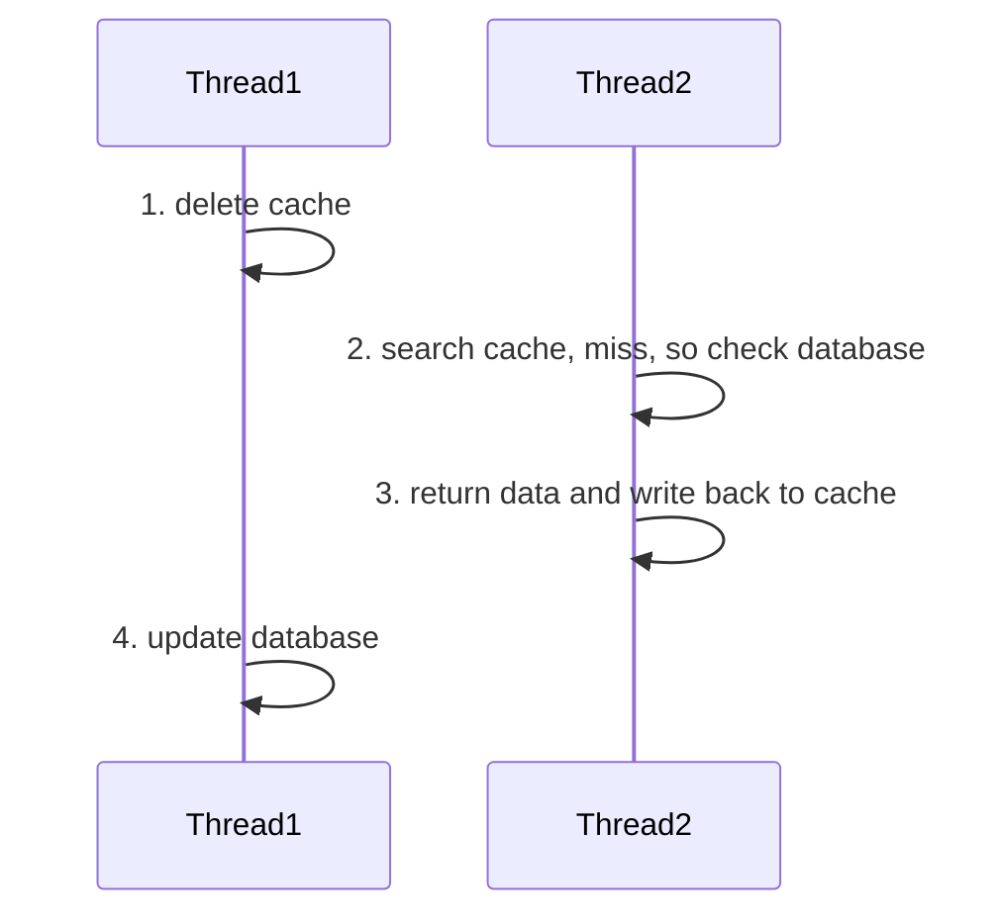
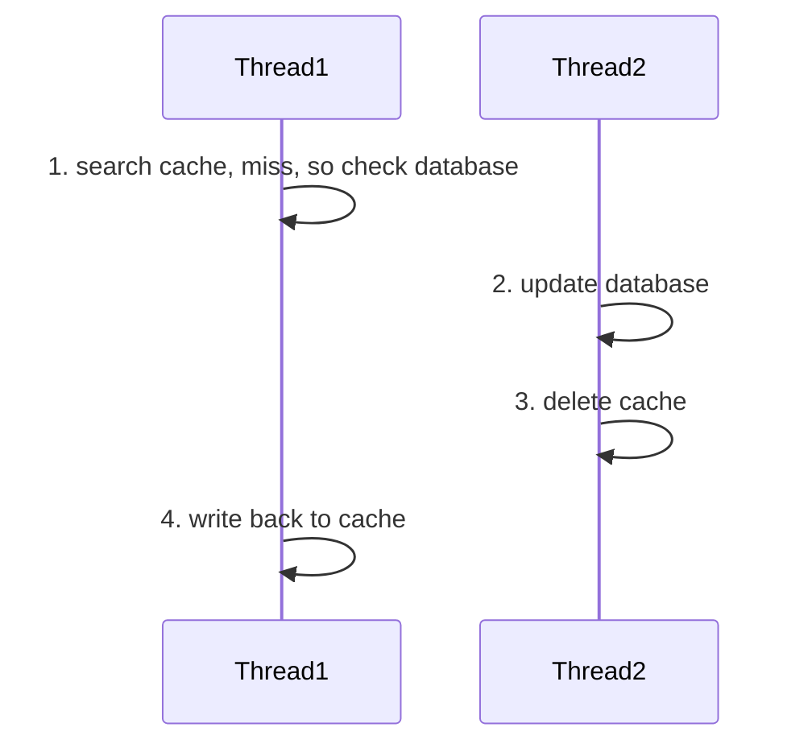
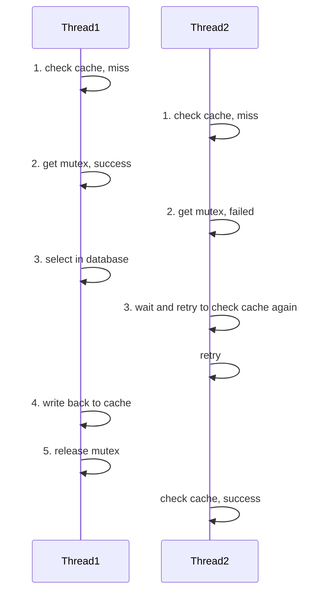
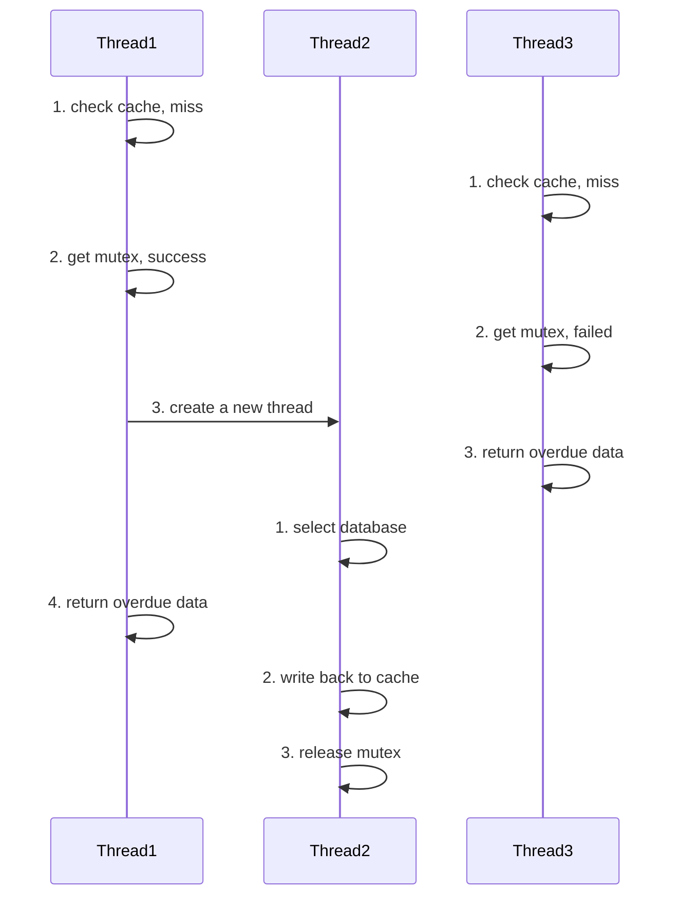


[https://www.bilibili.com/video/BV1cr4y1671t](https://www.bilibili.com/video/BV1cr4y1671t)

[https://javabetter.cn/sidebar/sanfene/redis.html](https://javabetter.cn/sidebar/sanfene/redis.html)

[https://javaguide.cn/database/redis/redis-questions-01.html](https://javaguide.cn/database/redis/redis-questions-01.html)



Spring的底层Servlet中，一个请求对应一个线程。为了提高网页响应速度，提供缓存并进行维护，使得缓存满足高并发状态下的请求，就显得非常重要。此处使用redis，解决部分高并发问题。

redis核心就是单线程，不容易出现线程问题。但redis也采用了多线程的IO多路复用技术，可以在只有一个线程的情况下同时监听多个客户端链接。

redis 4.0后，redis引入了多线程机制，用于清理脏数据、释放无用链接、删除大key.而redis 6.0后，多线程仅用于把网络IO和命令执行分开，将网络IO交给线程池来处理。从而提高性能。


IO多路复用的核心思想是，让单个线程可以等待多个文件描述符就绪，然后对就绪的描述符进行操作。这样就可以在不使用多线程的情况下进行并发连接。其主要的实现机制包括select、poll、epoll、kqueue和IOCP等
- select的缺点是单个进程能远程监视的文件描述符数量有限，一般为1024个，并且每次调用都需要将文件描述符集合从用户态复制到内核态，然后遍历找出就绪的描述符，性能较差
- poll的优点是没有大文件描述符数量的限制，但仍然涉及内核态，和遍历，性能较差
- epoll是Linux独有的机制，其工作原理是将文件描述符注册到多核中，然后通过时间通知机制来处理就绪的文件描述符，不需要轮询，所以性能非常高
- kqueue是BSD/macOS系统下的IO多路复用机制，与epoll类似
- IOCP是Windows系统下的IO多路复用机制，使用完成端口模型而非事件通知



单线程的redis其QPS通常可以达到每秒10万左右。


[点击这里](https://www.runoob.com/redis/redis-tutorial.html)学redis基础操作。在Java中，涉及redis的操作一般可以通过特定形式的API解决。


## 为什么需要缓存？

一般的前后端分离项目中，遵循以下结构


为了在多后端的集群（或微服务）中对多种多样的请求进行中转，需要在`step 1`中插入nginx作为中间件，而大量重复的请求（如登录校验、热点信息查询）会导致MySQL这些数据库压力过大，并使得用户访问速度较慢。因此`step 2`中需要非关系型数据库作为缓冲，减少大量重复或不必要的数据库读取。Redis就是非关系型数据库的一种。

比如，在实现登录状态持久化的功能时，常用的手段包括jwt和存在redis中的token。

- jwt(JSON Web Token): 在用户登录时，后端将存有用户信息、有效期的JSON文件通过Base64解码并进行数字签名后传输给客户。客户在后续的请求中带上jwt。
- 存在redis中的token: 在用户登录时，后端将随机token发送给用户，同时存一份到Redis中。客户在后续的请求中带上token。

后一种能够实现主动登出服务，并且对有效期的管理更加灵活（例如在用户发送请求时由redis动态调整有效期），在某些需求下更受青睐。

## 为什么是redis

分布式缓存除了redis，还有Memcacheed方案，这种在分布式缓存最开始兴起那会常用，但现在用得不多。其他的分布式缓存方案也比较多，例如`Dragonfliy`、`KeyDB`等。

## redis数据类型指北

- `String`可以把序列化后的对象存进去，最大容量是512Mb。
- 相比于`Hash`，`String`适合存储对象数据，但如果需要频繁操作对象的部分字段或节省内吨，那么`Hash`可能更好。
- redis的`String`类型的底层实现并不是C语言的字符串，而是自己编写了SDS（`Dimple Dynamic String` 简单动态字符串）来作为底层实现。相比C语言的字符串，SDS可以快捷获取字符串长度，保证缓冲区安全和二进制安全，使用更聪明的内存分配策略等。
    忽略其不同字节下的实现方式变化，其定义方式如下

    ```c
    struct sdshdr {
        unsigned int len;
        unsigned int free;
        unsigned char flags; // 低3位保存类型状态
        char buf[];
    };
    ```

    其中的`len`和`free`中的`unsigned int`会随着其初始化长度，改变为`uint8_t`、`uint16_t`、`uint32_t`或`uint_64t`几种类型
- `List`的内部实现方式为quicklist，即将一条压缩列表拆分为多条小的压缩列表，然后通过指针连接成一个双向链表。
- `Hash`的内部实现方式与JDK 1.8前的HashMap类似
- `Set`中可以使用`srandmember`来随机获取集合中的元素
- `Set`的集合操作命令：`SINTER`（交集）、`SINTERSTORE` （交集）、`SUNION` （并集）、`SUNIONSTORE`（并集）、`SDIFF`（差集）、`SDIFFSTORE` （差集）。
- `ZSet`的底层基于跳表实现。


当有序集合元素小于64字节，且个数小于128时，会使用`ziplist`（压缩列表），这两个阈值的配置为

```shell
zset-max-ziplist-value 64
zset-max-ziplist-entries 128
```

压缩链表是redis为了节省内存而设计的一种紧凑型数据结构，它会把所有数据连续存储在一块内存中。每个结构包含总字节数、尾部偏移量、节点数量等数据。每个节点包含前一个节点的长度、编码的类型和实际的数据。不过这种压缩列表可能会导致插入或删除节点时连锁更新后续节点数据的问题，导致算法复杂度可能退化到$O(n^2)$

一旦超过其中的一个阈值，就会变为`skiplist`（跳表，但实际上是字典+跳表，使用字典来提高获取速率）。跳表可以在链表的基础上，建立多级索引，将增删改查的时间复杂度变为$O(\log n)$

跳表节点的定义如下

```c
typedef struct skiplistNode {
    double score;                    // 分值（用于排序）
    robj *obj;                      // 数据对象
    struct skiplistNode *backward;   // 后退指针
    struct skiplistLevel {
        struct skiplistNode *forward; // 前进指针
        unsigned int span;           // 跨度（到下个节点的距离）
    } level[];                      // 层级数组
} skiplistNode;
```

跳表本身的定义如下

```c
typedef struct skiplist {
    struct skiplistNode *header, *tail; // 头尾节点
    unsigned long length;               // 节点数量
    int level;                         // 最大层数
} skiplist;
```

以下图为例


假如我们需要查询元素 6，其工作流程如下：
1. 从 2 级索引开始，先来到节点 4。
2. 查看 4 的后继节点，是 8 的 2 级索引，这个值大于 6，说明 2 级索引后续的索引都是大于 6 的，没有再往后搜寻的必要，我们索引向下查找。
3. 来到 4 的 1 级索引，比对其后继节点为 6，查找结束。

理想状态下，每一层索引都是下一层元素个数的二分之一。其高度生成算法如下
1. 链表的高度为1。
2. 进行一次随机运算，数值范围为0.5。若随机数大于0.5则为当前元素增加以及索引。同理索引也这么操作。

于是插入算法可以如下操作
1. 查找前置节点
2. 随机生成层级
3. 链接节点

删除操作如下
1. 查找目标节点及其前置节点
2. 解除链接
3. 更新跳表层数

为什么有序集合使用跳表，而非平衡树、红黑树或者B+树呢？相比平衡树，跳表使用概率平衡而非严格强制的平衡，因此跳表的插入和删除算法相比平衡树的算法高效得多；相比红黑树，跳表按照区间查找的速率更高；相比B+树，跳表能节省更多的内存。



- redis的字典分为三层，最外层是一个dict结构，包含两个哈希表`ht[0]` `ht[1]`，用于存储键值对。每个哈希表都由数组的链表组成。


字典最核心的特点是渐进式rehash。当负载因子大于等于1或小于0.1时，会触发rehash。平时不启用的`ht[1]`开始启用。扩展时的`ht[1]`的大小为`ht[0]`的两倍，缩小时的大小为`ht[0]`的一半，然后将`rehashidx`设置为0。接下来，redis不会一次性把所有的数据从哈希表中迁移，而是在每次操作字典时，顺便迁移`ht[0]`中`rehashidx`位置上的所有键值对。迁移完一个槽位后，`rehashidx`递增，直到整个哈希表0都迁移完成。




redis中过期key的删除策略有以下4种
- 惰性删除
    只有在取出/查询的key的时候才对数据进行过期检查，对CPU友好，对内存不友好
- 定期删除
    周期性随机抽查一批，检查是否过期，对CPU不太友好，对内存较友好
- 延迟队列
    设置过期时间的key放到一个延迟队列里，到期就删除key，但维护延迟队列太麻烦，队列本身也占用资源
- 定时删除
    到达时间后立即被删除，对CPU压力最大，因为要为每个键都设置一个定时器

redis中采用定期删除+惰性删除的方式。其中定期删除会受到其他影响
- 执行时间超过了阈值，那么就中断这一次定期删除循环
- 过期key的比例超过阈值，就会重复执行定期删除流程。若过期key比例低于阈值，就会中断定期删除循环。

在redis 7.2中执行时间阈值为25ms，过期key比例设定值为10%。定期检查时，随机抽查的数量为20，频率为每秒10次，也可以通过开启`dynamic-hz`动态改变抽查次数。




很短时间内被访问频繁的键可能会称为热key。大量请求集中到同一个键可能会导致该redis节点的CPU使用率飙升。响应时间变长。可以使用`redis-cli -h <address> -p <port> -a<password> — hotkey`监控热key。

一般可以将热key缓存到本地内存中，或者将某些特别热的key拆分成多个子key，然后随机分布到不同的redis节点上。

占用较大内存的缓存键称大key，比如超过10M的键值对。可以使用`redis-cli -h <address> -p <port> -a<password> --bigkeys`查找

对于大key，最根本的方法是拆分成多个小key存储，对于JSON数据可以进行Gzip压缩后再存储。


## 缓存更新

既然是把同一份数据存了两遍。那么当数据库中的某些数据已经更改，redis中的数据应该在什么时候更新呢？为了保证数据库与redis的高一致性，每次更新数据库后，都需要同步对redis进行操作。


除了每次更新数据库都同步更新外，还有其他办法。例如将缓存与数据库合并成一个服务，再插入一个中间件；或者使用写回法，调用者只操作缓存，由其他线程将缓存数据持久化到数据库中。


更新缓存时可能会产生无效更新，且可能导致线程安全问题，因此在更新数据库时直接删除redis中的相关条目。这样，当用户查询到这条数据时，就可以直接查数据库，从而同步到redis中。

如何保证缓存和数据库的操作同时成功或失败呢？对于单体系统，可以将缓存与数据库放在一个事务中。而在分布式系统中，可以利用TCC等分布式解决方案。


事务是MySQL中的一个概念，用于将多个操作合并为一个独立的工作单元。事务必须满足四个特性(ACID)：原子性、一致性、隔离性、持久性。该特性用于保证成批的SQL语句一起执行——即要么全部执行成功、要么全部执行失败。Spring中也借用了这一概念。

[TCC (Try-Confirm-Cancel)](https://ivanclf.github.io/2025/11/08/distributed/#TCC)用于解决分布式系统中传统的数据库ACID事务只能保证单个数据库的原子性问题。首先在Try阶段创建一个状态为“待确认”的订单。若所有的Try操作都成功，则跳转至Confirm阶段，将订单状态从“待确认”更新为“已确认”；若任何一个Try操作失败，则执行Cancel操作，将订单状态更新为“已取消”，回滚语句并释放资源。

而在redis中，也支持简单的事务处理
- `multi` 开始事务
- `exec` 执行事务
- `discard` 取消事务，清空事务队列中保存的所有命令
- `watch` 监听指定的key，若事务在执行时，监听的key被其他客户端修改，则事务不会被执行（但若watch和事务在同一个Session中，则事务是可以被执行成功的）

由于redis的单线程特性，事务的执行过程不会被其他命令打断，也就不会被其他事务打断。但需要注意的是，redis的事务不支持回滚，即使有些命令执行失败。因此可以使用Lua脚本代替事务。但Lua脚本中途结束后不会执行后续操作，也不会回滚，分布式系统下的原子性也保证不了。


先操作缓存还是先操作数据库呢？这个需要考虑读写线程可能引起的并发问题。



在先删除缓存再操作数据库的情况下，由于更新数据库的速度较慢，所以上图中的状况很有可能发生。最后导致缓存中的数据是老数据而数据库中的数据是新数据。



在先操作数据库再删除缓存的情况下，可能的不一致问题如上图。但写的时间一般远远大于读的时间，因此上图发生的概率极小。因此，**一般先操作数据库**。

若真要很高的一致性，可以尝试以下方法。
- 引入消息队列，比如在数据库更新的事务中插入一条本地消息记录，事务提交后异步发送给MQ进行缓存删除。即使缓存删除失效，消息队列的重试机制也能保证最终的一致性。
- 使用Canal监听MySQL中的binlog，在数据更新时，将数据变更记录到消息队列中，消费者信息监听到后去删除缓存。
- 对于简单一点的项目，可以采用延迟双删的策略——再删一次。这种方式主要针对缓存不存在，但写入了脏数据的情况。


## 缓存穿透

当客户端请求的数据不存在时，缓存永远都不会生效，而且这些请求都会打到数据库上。这样要是有大量重复的数据打进来，服务就崩了。

解决缓存穿透的办法有两个：一个是在第一次发现不存在时，向redis写入一个空对象，这样简单好用，但会造成额外的内存开销与短时间的不一致问题。另一种是使用布隆过滤器，通过过滤器的请求才能进入到redis中，这样不需要太多额外内存，也不会产生不一致问题，但可能会误判，并且删除数据较为困难。


布隆过滤器是一大串位列表。将数据添加到布隆过滤器时，我们提供数个不同的哈希函数中，将各自算出的值置为1。当请求获得的哈希值与布隆过滤器不匹配时拒绝，并返回空对象，反之放行。当某个空对象刚好能匹配先前其他元素生成过的1时，它也能透过过滤器。

而且，布隆过滤器并不支持删除操作，若真想实现删除操作，可以使用计数布隆过滤器，但这样会增加内存开销。


而在实际项目中，还需要在接口层面做一些处理，比如参数校验，拦截不合理的请求，对疑似攻击的IP进行限流或者封禁等。

## 缓存雪崩

在同一时段内若有大量的缓存key同时失效或者redis服务宕机，那么大量的请求会直接到达数据库，造成巨大的压力。

- 对于大量缓存key同时失效的问题，直接给key的TTL设置随机时间即可。
- 对于redis宕机的问题则比较麻烦。常见的解决方案有设计redis集群、设置多级缓存策略（比如使用本地缓存`Caffeine`来作为二级缓存。注意，在redis进行更新时，要通过pub/sub机制向本地缓存更新通知）。
- 对于请求量超过了缓存的正常服务的承载能力，则需要采用限流和降级措施。
- 对于刚开机时可能出现的情况，则使用`xxl-job`或`Kafka`在缓存中提前放入数据即可。


若确实存在大量key集中过期的需求，则可以修改`redis.conf`文件，将`lazyfree-lazy-expire`参数设置为`true`。开启后，redis会在后台异步删除过期的key不会阻塞主线程进行。


## 缓存击穿

一个高频访问并且重建缓存重建业务较为复杂的key突然失效了，大量的请求会挤进数据库里，并且大量申请写入redis的请求也会形成，从而造成巨大压力。为了防止这种情况，可以使用互斥锁或者逻辑过期方法。

在互斥锁解决方案中，在进行缓存重建时，一群请求中只有一个可以进入数据库中，其余的请求都在等待。而在写入缓存后，其他的请求都直接从缓存中读取。



逻辑过期与物理过期存在很大的差别。当使用逻辑过期时，物理过期时间可能会特别长甚至没有。逻辑过期结束时会另发线程更新数据，而在数据更新完成前，另外的线程都会使用旧数据。



这两种方法适用于不同的情形。互斥锁适用于需要在每次数据库更新是都需要缓存重建的场景，一致性强且实现较为简单。但线程的等待时间较长。而逻辑过期方案适用于定期更新缓存的场景，一致性弱但不会出现线程等待的问题。

