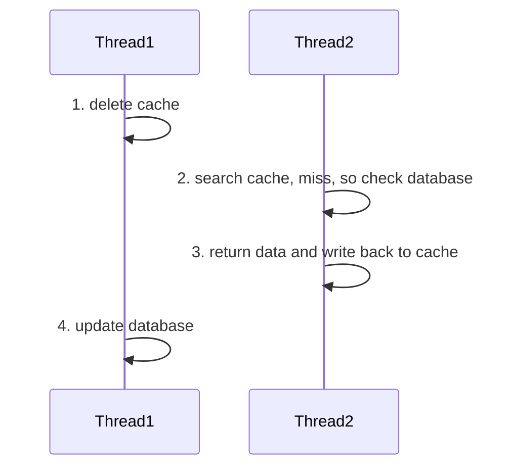
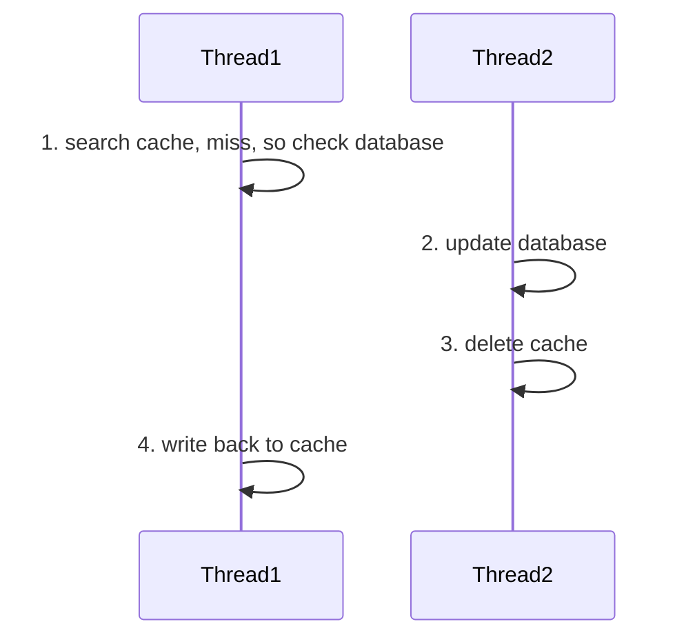
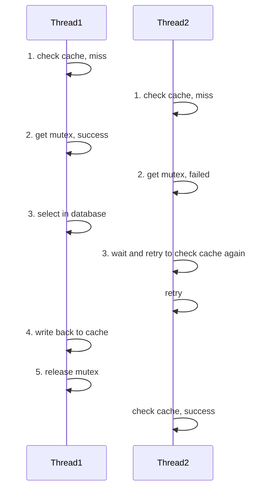
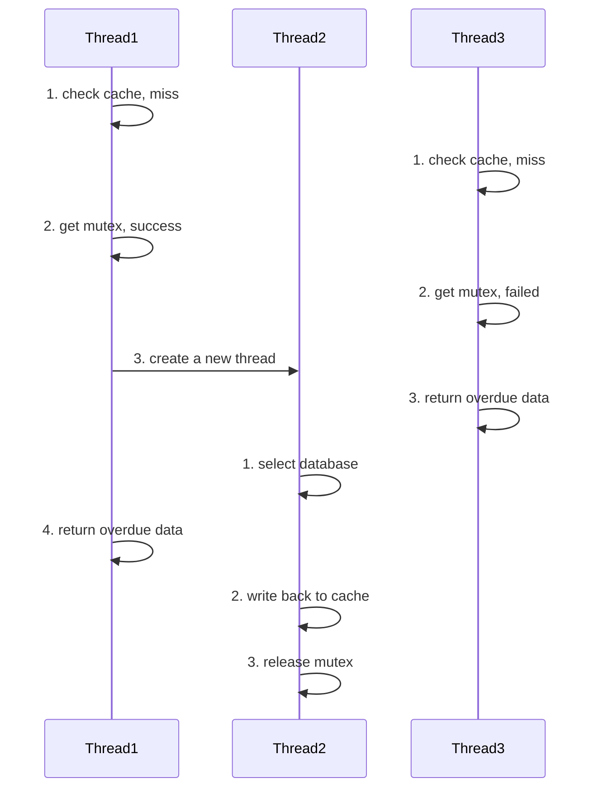

Spring的底层Servlet中，一个请求对应一个线程。为了提高网页响应速度，提供缓存并进行维护，使得缓存满足高并发状态下的请求，就显得非常重要。此处使用redis，解决部分高并发问题。
redis本身就是单线程，不容易出现线程问题。

[点击这里](https://www.runoob.com/redis/redis-tutorial.html)学redis基础操作。在Java中，涉及redis的操作一般可以通过特定形式的API解决。


## 为什么需要缓存？

一般的前后端分离项目中，遵循以下结构

为了在多后端的集群（或微服务）中对多种多样的请求进行中转，需要在`step 1`中插入nginx作为中间件，而大量重复的请求（如登录校验、热点信息查询）会导致MySQL这些数据库压力过大，并使得用户访问速度较慢。因此`step 2`中需要非关系型数据库作为缓冲，减少大量重复或不必要的数据库读取。Redis就是非关系型数据库的一种。

比如，在实现登录状态持久化的功能时，常用的手段包括jwt和存在redis中的token。

- jwt(JSON Web Token): 在用户登录时，后端将存有用户信息、有效期的JSON文件通过Base64解码并进行数字签名后传输给客户。客户在后续的请求中带上jwt。
- 存在redis中的token: 在用户登录时，后端将随机token发送给用户，同时存一份到Redis中。客户在后续的请求中带上token。

后一种能够实现主动登出服务，并且对有效期的管理更加灵活（例如在用户发送请求时由redis动态调整有效期），在某些需求下更受青睐。

## 缓存更新

既然是把同一份数据存了两遍。那么当数据库中的某些数据已经更改，redis中的数据应该在什么时候更新呢？为了保证数据库与redis的高一致性，每次更新数据库后，都需要同步对redis进行操作。


除了每次更新数据库都同步更新外，还有其他办法。例如将缓存与数据库合并成一个服务，再插入一个中间件；或者使用写回法，调用者只操作缓存，由其他线程将缓存数据持久化到数据库中。


更新缓存时可能会产生无效更新，且可能导致线程安全问题，因此在更新数据库时直接删除redis中的相关条目。这样，当用户查询到这条数据时，就可以直接查数据库，从而同步到redis中。

如何保证缓存和数据库的操作同时成功或失败呢？对于单体系统，可以将缓存与数据库放在一个事务中。而在分布式系统中，可以利用TCC等分布式解决方案。


事务是MySQL中的一个概念，用于将多个操作合并为一个独立的工作单元。事务必须满足四个特性(ACID)：原子性、一致性、隔离性、持久性。该特性用于保证成批的SQL语句一起执行——即要么全部执行成功、要么全部执行失败。Spring中也借用了这一概念。

TCC(Try-Confirm-Cancel)用于解决分布式系统中传统的数据库ACID事务只能保证单个数据库的原子性问题。首先在Try阶段创建一个状态为“待确认”的订单。若所有的Try操作都成功，则跳转至Confirm阶段，将订单状态从“待确认”更新为“已确认”；若任何一个Try操作失败，则执行Cancel操作，将订单状态更新为“已取消”，回滚语句并释放资源。


先操作缓存还是先操作数据库呢？这个需要考虑读写线程可能引起的并发问题。

在先删除缓存再操作数据库的情况下，由于更新数据库的速度较慢，所以上图中的状况很有可能发生。最后导致缓存中的数据是老数据而数据库中的数据是新数据。

在先操作数据库再删除缓存的情况下，可能的不一致问题如上图。但写的时间一般远远大于读的时间，因此上图发生的概率极小。因此，一般先操作数据库。

## 缓存穿透

当客户端请求的数据不存在时，缓存永远都不会生效，而且这些请求都会打到数据库上。这样要是有大量重复的数据打进来，服务就崩了。

解决缓存穿透的办法有两个：一个是在第一次发现不存在时，向redis写入一个空对象，这样简单好用，但会造成额外的内存开销与短时间的不一致问题。另一种是使用布隆过滤器，通过过滤器的请求才能进入到redis中，这样不需要太多额外内存，也不会产生不一致问题，但可能会误判，并且删除数据较为困难。


布隆过滤器是一大串位列表。将数据添加到布隆过滤器时，我们提供数个不同的哈希函数中，将各自算出的值置为1。当请求获得的哈希值与布隆过滤器不匹配时拒绝，并返回空对象，反之放行。当某个空对象刚好能匹配先前其他元素生成过的1时，它也能透过过滤器。


## 缓存雪崩

在同一时段内若有大量的缓存key同时失效或者redis服务宕机，那么大量的请求会直接到达数据库，造成巨大的压力。

对于大量缓存key同时失效的问题，直接给key的TTL设置随机时间即可。但对于redis宕机的问题则比较麻烦。常见的解决方案有设计redis集群、给缓存业务设置降级策略以及设计多级缓存等。

## 缓存击穿

一个高频访问并且重建缓存重建业务较为复杂的key突然失效了，大量的请求会挤进数据库里，并且大量申请写入redis的请求也会形成，从而造成巨大压力。为了防止这种情况，可以使用互斥锁或者逻辑过期方法。

在互斥锁解决方案中，在进行缓存重建时，一群请求中只有一个可以进入数据库中，其余的请求都在等待。而在写入缓存后，其他的请求都直接从缓存中读取。

逻辑过期与物理过期存在很大的差别。当使用逻辑过期时，物理过期时间可能会特别长甚至没有。逻辑过期结束时会另发线程更新数据，而在数据更新完成前，另外的线程都会使用旧数据。

这两种方法适用于不同的情形。互斥锁适用于需要在每次数据库更新是都需要缓存重建的场景，一致性强且实现较为简单。但线程的等待时间较长。而逻辑过期方案适用于定期更新缓存的场景，一致性弱但不会出现线程等待的问题。
