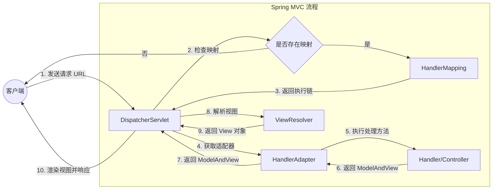

## 注解杂记

### 数据获取

- 可以使用 `@Value(${})` 注入配置文件中的单个属性值，也可以使用 `@ConfigurationProperties(prefix = "")` 读取配置信息并和 Bean 绑定。
- 使用 `@PropertySource` 注解允许加载自定义配置文件
- `@PathVariable` 用于在 URL 路径中获取参数
- `@RequestParam` 用于绑定查询参数
- `@RequestBody` 用于读取 Request 请求的 Body 部分并且 Content-type 为 application/json 格式的数据，接收到数据后会自动将数据绑定到 Java 对象上去。一个方法只能有一个 `@RequestBody`，但能有多个 `@PathVariable` 和 `@RequestParam`

### 数据校验

Bean Validation 是一套定义 JavaBean 参数校验标准的规范，它提供了一系列注解，可以直接用于 JavaBean 属性上。其本身只是一套规范，我们需要一个实现了这套规范的具体框架来执行校验逻辑。目前，Hibernate Validator 是 Bean Validation 规范最权威最广泛的实现方式。此处的注释不仅能加在实体类上，还能加在控制类的参数里。

**空值检查**

|注释|说明|
|-|-|
|`@Null`|必须为 null|
|`@NotNull`|必须不为 null|
|`@NotEmpty`|不为 null 且长度/大小必须大于 0|
|`@NotBlank`|不为 null 且包含至少一个非空字符|

**布尔值检查**

|注释|说明|
|-|-|
|`@AssertTrue`|必须为 true|
|`@AssertFalse`|必须为 false|

**数值检查**

|注释|说明|
|-|-|
|`@Min()` `@Max()`|指定数字最小（大）值|
|`@DecimalMin()` `@DecimalMax()`|指定大数字最小（大）值|
|`@Digits(Integer = 6, fraction = 2)`|指定整数位和小数位限制|
|`@Positive` `@Negative`|必须是正（负）数|
|`@PositiveOrZero` `@NegativeOrZero`|必须不是负（正）数|

**字符串检查**

|注释|说明|
|-|-|
|`@Size(min = 2, max = 50)`|长度范围|
|`@Pattern(regexp = "^[a-zA-Z0-9._%+-]+@[a-zA-Z0-9.-]+\\.[a-zA-Z]{2,}$")`|输入正则表达式|
|`@Email`|邮箱格式|

**日期**

|注释|说明|
|-|-|
|`@Past` `@Future`|必须是过去（未来）时间|
|`@PostOrPresent` `@FutureOrPresent`|必须是过去（未来）和现在时间|

**集合和数组检查**

|注释|说明|
|-|-|
|`@Size(min = 1, max = 10)`|集合大小限制|
|`@NotEmpty`|非空集合|

**常用组合注解**

|注释|说明|
|-|-|
|`@CreditCardNumber`|信号卡号格式|
|`@URL`|URL 格式|
|`SafeHtml`|安全的 HTML（防 XSS）|
|`@Range(min = 18, max = 100)`|数值范围|

在这些信息后添加 `message` 属性，可以添加提示信息

### JPA

|注释|说明|
|-|-|
|`@Entity`|声明一个类为 JPA 实体类，和数据库中的表映射|
|`@Table(name = "")`|指定对应的表名|
|`@id`|声明主键|
|`@GeneratedValue`|指定主键生成的策略。有以下4种：<br>`GenerationType.TABLE` 通过数据库表生成<br>`GenerationType.SEQUENCE` 通过数据库序列生成，适用于 Oracle 等数据库<br>`GenerationType.IDENTIFY` 主键自增，适用于 MySQL 等数据库<br>`GenerationType.AUTO` 自动选择|
|`@Column`|指定实体字段与数据库列的映射关系，指定属性为 `name` `nullable` `length` `columnDefinition` 等|
|`@Transient`|不需要写入数据库的字段|
|`@Lob`|声明大字段|
|`@Enumerated()`|将枚举类型映射为数据库字段，策略为<br>`EnumType.ORDINAL` 默认的存序号<br>`EnumType.STRING` 存名称<br>两种|
|`@EnableJpaAuditing`|开启 JPA 审计功能|
|`@Modifying`|标识修改和删除操作，必须和 `@Transactional` 注解一起用|
|`@OneToOne` `@OneToMany` `@ManyToOne` `@ManyToMany`|JPA 的四种关联关系，分别是一对一、一对多、多对一、多对多|

### Lomlok

|注释|说明|
|-|-|
|`@Getter` `@Setter`|生成 getter 和 setter|
|`@ToString`|生成 toString|
|`@EqualsAndHashCode`|生成 equals 和 hashCode|
|`@NoArgsConstructor`|生成无参构造方法|
|`@AllArgsConstructor`|生成全参构造方法|
|`@RequiredArgsConstructor`|生成构造方法，参数为所有 `@NotNull` 和 final 字段|
|`@Data`|包含 `@Getter` `@Setter` `@EqualsAndHashCode` `@RequiredArgsConstructor`|
|`@Value`|不可变对象的 `@Data`|
|`@Builder`|提供建造者模式|
|`@SneakyThrows`|偷偷抛出受检异常，无需在方法签名中声明|
|`@Cleanup`|默认关闭资源（如IO流）|
|`@Slf4j` `Log4j`|自动注入一个日志记录器|

### JSON

- `@JsonIgnoreProperties({})` 过滤掉特定属性，若允许未知属性进入，可添加 `ignoreUnknown = true`
- `@JsonIgnore` 作用于字段或 `getter/setter` 方法级别，用于指定在序列化/反序列化时忽略该特定特性
- `@JsonFormat(shape = JsonFormat.Shape.STRING, pattern = "yyyy-MM-dd'T'HH:mm:ss.SSS'Z'", timezone = "GMT")` 指定属性在序列化/反序列化时的格式，常用于日期时间类型的格式化
- `@JsonUnwrapped` 作用于字段上，用于在序列化时将其嵌套对象的属性“提升”到当前对象的层级。反序列化时执行反操作

### 测试

- `@ActiveProperties` 一般用于测试类上，用于声明生效的 spring 配置文件
- `@Test` 是 JUnit 框架下提供的注解，用于标记一个方法是测试方法
- `@WithMockUser` 是 spring security test 模块下提供的注解，用于在测试期间模拟一个已认证的用户

## 事务

spring 中的事务分两种：编程式事务和声明式事务。
- 编程式事务：在代码中硬编码，在分布式系统中推荐使用。通过 `TransactionTemplate` 或者 `TransactionManager` 手动管理事务。若事务范围过大，会出现事务未提交导致超时，因此事务比锁的粒度更小
- 声明式事务：在 xml 配置文件中配置或者直接基于注解，实际通过 AOP 实现（使用注解 `@Transaction` 最多）

### 事务传播行为 `propagation`

当事务方法被另一个事务方法调用时，必须指定事务应该如何传播，是继续在现有事务中运行，还是新开一个事务。正确的事务传播薪给的值如下：
1. `TransactionDefinition.PROPAGATION_REQUIRED`
    使用最多的一个事务行为，默认值。若当前存在事务则加入该事务；若当前没有事务则创建一个新事务
2. `TransactionDefinition.PROPAGATION_REQUIRES_NEW`
    创建一个新事务。若当前存在事务，则将当前事务挂起。不管外部方法是否开启事务，该方法都会开启新事务
3. `TransactionDefinition.PROPAGATION_NESTED`
    若当前存在事务，则创建一个事务作为当前事务的嵌套事务进行；若当前没有事务，则创建一个新事务
4. `TransactionDefinition.PROPAGATION_MANDATORY`
    若当前存在事务，则加入该事务；若当前没有事务，则抛出异常

以下三种级别，事务在发生错误时可能不会回滚

5. `TransactionDefinition.PROPAGATION.SUPPORT`
    若当前存在事务，则加入该事务；若当前没有事务，则以非事务的方式运行
6. `TransactionDefinition.PROPAGATION_NOT_SUPPORT`
    非事务方式运行，若存在事务则把当前事务挂起
7. `TransactionDefinition.PROPAGATION_NEVER`
    非事务方式进行，若存在事务则抛出异常

### 事务隔离级别 `isolation`

和数据库一样，spring 也支持事务隔离，其级别和 SQL 差不多
- `TransactionDefinition.ISOLATION_DEFAULT`
    使用后端数据库默认的隔离级别
- `TransactionDefinition.ISOLATION_READ_UNCOMMITTED`
    读未提交
- `TransactionDefinition.ISOLATION_READ_COMMITTED`
    读已提交
- `TransactionDefinition.ISOLATION_REPEATABLE_READ`
    可重复读
- `TransactionDefinition.ISOLATION_SERIALIZABLE`
    可串行化

四种隔离级别的区别详见[https://ivanclf.github.io/2025/10/11/sql-2/#隔离级别](https://ivanclf.github.io/2025/10/11/sql-2/#%E9%9A%94%E7%A6%BB%E7%BA%A7%E5%88%AB)

### 声明式事务

当在配置类上使用 `@EnableTransactionManagement` 后，spring 容器会向容器中注册一个关键的 Bean 后处理器—— `InfrastructureAdvisorProxyCreator`。这个类的作用很明确，就是一个“自动代理创建器”，用于在 Bean 初始化后阶段，扫描容器中所有的 Bean，判断哪些 Bean 存在 `@Transactional` 注解，需要被代理。

如果匹配成功，spring 会通过 JDK 动态代理或 Cglib 代理来创建代理。

在调用该代理对象的方法时，代理对象会拦截所有的方法调用，检查被调用的方法是否有 `@Transactional` 注解。如果有，就解析其属性（`propagation` `isolation` `rollbackfor` 等），执行事务拦截器。该十五拦截器的逻辑如下
- 通过 `PlatformTransactionManager` 事务管理器，根据当前的事务属性，判断是加入现有事务还是开启一个新事务。然后通过事务管理器开启一个新的事务，并从数据库连接池中获取一个链接，关闭其自动提交
- 调用**原始目标对象**的对应方法
- 根据目标执行方法的执行情况来决定事务的最终状态。若正常返回则提交事务，若抛出异常，则事务拦截器会捕获它，检查抛出的异常是否匹配 `@Transactional.rollbackfor` 指定的规则，匹配则回滚事务，不匹配则提交事务
- 无论事务是提交还是回滚，拦截器都会释放数据库链接

在以下情况下，`@Transactional` 注解会失效
- 自调用。spring 事务基于 AOP 代理，自调用绕过了代理机制
    这是最常见的一个问题。是因为方法 A 在调用方法 B 时，用的是 `this` 引用，绕过了 spring 的代理对象，也就导致代理对象中的事务逻辑没有机会执行。解决犯法是把当前类作为一个 Bean 注入到自己中，然后通过这个注入的 Bean 来调用方法 B
- 捕获异常未抛出，而是通过其他处理方式解决
- 抛出未受检异常
    spring 事务默认只对 `RuntimeException` 和 `Error` 类型的异常进行回滚。若一个异常是 `Exception` 的子类但不是 `RuntimeException` 的子类则不会回滚。需要指定为 `@Transactional(rollbackfor = Exception.class)`
- 不是 `public` 方法，spring 创建不了代理
- `@Async` 和 `@Transactional` 混用，异步方法在另一个线程执行，事务不生效

## spring MVC

spring  MVC 的核心组件有以下几种
- `DispatcherServlet` 核心的中央处理器，负责接收请求、分发，并给予客户端响应
- `HandlerMapping` 处理器映射器，根据 URL 去匹配查找能处理的 `Handler`，并会将请求涉及到的拦截器和 `Handler` 一起封装
- `HandlerAdapter` 处理器适配器，根据找到的 `Handler` 去适配执行对应的 `Handler`
- `Handler` 请求处理器，处理实际请求的处理器
- `ViewResolver` 视图解析器，根据 `Handler` 返回的逻辑视图/视图，解析并渲染真正的驶入，并传递给 `DispatcherServlet` 客户端

### 工作原理

1. 当一个 HTTP 请求到达服务器时，首先由 `DispatcherServlet` 接收。它负责将请求分发到合适的处理器，也就是 `@Controller` 中的方法，并协调其他组件的工作。
2. `DispatcherServlet` 查询配置的 `HandlerMapping`。后者扫描是所有带有 `@Controller` 或 `@RestController` 的 Bean，找到对应路由的具体方法。
3. 找到对应方法后，`DispatcherServlet` 会委托给 `HandlerAdapter` 进行调用。在注解驱动开发中，常用的是 `RequestMappingHandlerAdapter`，这一层会把请求参数自动注入到方法形参中，并调用 Controller 执行实际的业务逻辑。
4. Controller 方法最终会返回结果，比如视图名称、ModelAndView 或直接返回 JSON 数据
5. 渲染完成的 HTML 或者换好的 JSON 数据，通过 `HttpServletResponse` 返回给客户端

其中的 `HandlerAdapter` 用于处理多种风格的处理器调用方式，屏蔽不同控制器的差异。



传统的 MVC 中，返回的数据通常是 HTML 页面。但在 RESTful 架构中，通常返回的是 JSON 或 XML，而不再是一个完整的页面。当一个类上使用 `@RestController` 时，它会告诉 spring 这个类中所有方法的返回值都应该直接写入 HTTP 响应体中，而不再被解析为视图。`@ResponseBody` 是其在方法级别的呈现。

## spring boot

spring boot 是 spring 生态的一个重大突破，它极大简化了 spring 应用和开发过程。“约定大于配置”是 spring boot 最核心的概念。它预设了很多的默认配置。

比如 `@SpringBootApplication` 标志着一个 spring boot应用的入口，包含了 `@Configuration`、`@EnableAutoConfiguration`、`@ComponentScan` 等注解

### 自动装配

开启自动装配的注解是 `@EnableAUtoConfiguration`。这个注解会告诉 spring 去扫描所有可用的自动配置类。当 main 方法执行的时候，spring 回去类路径下找 `spring.factory` 这个文件，读取里面配置的自动配置类列表。在每个自动配置类的内部，通常会有一个 `@Configuration` 注解，同时结合各种 `@Conditional` 注解来做控制。常用的条件注解为

|注解|作用|
|-|-|
|`@ConditionalOnClass`|类路径下存在指定类时生效|
|`@ConditionalOnMissingClass`|类路径下不存在指定类时生效|
|`@ConditionalOnBean`|容器中存在指定 Bean 时生效|
|`@ConditionalOnMissingBean`|容器中不存在指定 Bean 时生效|
|`@ConditionalOnProperty`|配置文件中存在指定属性时生效|
|`@ConditionalOnWebApplication`|当前是 web 应用时生效|
|`@ConditionalOnExpression`|SpEL 表达式为 true 时生效|

### 创建 spring boot starter

1. 创建 starter 项目结构
    通常将 starter 分成两个模块：启动器模块和自动配置模块。
    
    启动器模块的 `pom.xml` 如下。其中只包含依赖声明

    ```xml
    <project>
        <modelVersion>4.0.0</modelVersion>
        <groupId>com.example</groupId>
        <artifactId>hello-spring-boot-starter</artifactId>
        <version>1.0.0</version>
    
        <dependencies>
            <!-- 引入自动配置模块 -->
            <dependency>
                <groupId>com.example</groupId>
                <artifactId>hello-spring-boot-starter-autoconfigure</artifactId>
                <version>1.0.0</version>
            </dependency>
        </dependencies>
    </project>
    ```

    自动配置模块的 `pom.xml` 配置如下。其中包含核心配置逻辑

    ```xml
    <dependencies>
        <dependency>
            <groupId>org.springframework.boot</groupId>
            <artifactId>spring-boot-starter</artifactId>
        </dependency>
        <dependency>
            <groupId>org.springframework.boot</groupId>
            <artifactId>spring-boot-autoconfigure</artifactId>
        </dependency>
        <dependency>
            <groupId>org.springframework.boot</groupId>
            <artifactId>spring-boot-configuration-processor</artifactId>
            <optional>true</optional>
        </dependency>
    </dependencies>
    ```

    创建一个自动配置类，该类的作用是根据配置文件中的属性来创建和配置 Bean

    ```java
    @Configuration
    @EnableConfigurationProperties(MyStarterProperties.class)
    public class MyServiceAutoConfiguration {

        @Bean
        @ConditionalOnMissingBean
        public MyService myService(HelloProperties properties) {
            return new MyService(properties.getMessage());
        }
    }
    ```

2. 定义配置属性类。
    使用 `@ConfigurationProperties` 绑定外部配置，让用户可以在 `application.yml` 或其他文件中自定义参数

    ```java
    @ConfigurationProperties(prefix = "example.hello")
    public class HelloProperties {
        private String prefix = "Hello";
        private String suffix = "!";
    }
    ```

3. 编写业务服务类
4. 创建自动配置类
    使用条件注解控制何时生效

    ```java
    @Configuration
    @EnableConfigurationProperties(HelloProperties.class)
    @ConditionalOnProperty(prefix = "example.hello", value = "enabled", matchIfMissing = true)
    public class HelloAutoConfiguration {
        @Bean
        @ConditionalOnMissingBean // 容器中不存在HelloService时创建
        public HelloService helloService() {
            return new HelloService(properties);
        }
    }
    ```

5. 注册自动配置类
    在 `resources/META-INF/` 下创建 `spring.factory` 文件

    ```properties
    org.springframework.boot.autoconfigure.EnableAutoConfiguration=\
    com.example.hello.HelloAutoConfiguration
    ```

6. 使用自定义 starter
    引入依赖

    ```xml
    <dependency>
        <groupId>com.example</groupId>
        <artifactId>hello-spring-boot-starter</artifactId>
        <version>1.0.0</version>
    </dependency>
    ```

    在 `application.properties` 下配置参数

    ```properties
    example.hello.prefix=Hi
    example.hello.suffix=!!!
    ```

### 启动

#### `@SpringBootApplication` 注解

执行该注解的内容。该注解包括三个内容
- `@SpringBootConfiguration` 标记这个类是一个 spring boot 配置类，相当于一个 spring 配置文件
- `@EnableAutoConfiguration` 标记 spring boot 可以进行自动配置，自动注册各种组件
- `@ComponentScan` 扫描当前包及其子包下的组件，注册为 Bean


main 方法里的 run 方法怎么会识别到 main 方法外的 `@SpringBootApplication` 注解呢？因为在 run 方法中已经传入了 `Application.class`，这个类中有对应的注解，自然就知道了。


#### 创建 `SpringApplication` 实例

要执行 `SpringApplication.run()` 前，首先需要创造一个 `SpringApplication` 的实例。在构造方法中，主要完成了以下几件关键的事情：
1. 推断应用类型：根据类路径判断是 Servlet Web、响应式 Web 还是非 Web 应用。
2. 加载初始化器与监听器：从 META-INF/spring.factories 加载 `ApplicationContextInitializer` 和 `ApplicationListener` 实现类，用于容器初始化和事件监听。
3. 推断主配置类：根据 main 方法定位主配置类。

### 启动 `run()` 方法

1. 启动计时器，创建并配置环境，加载配置源。
2. 发布 `ApplicationEnvironmentPreparedEvent` 事件，触发配置加载（如 `application.yml`）。
3. 根据应用类型创建对应的 `ApplicationContext`（如 Web 应用使用 `AnnotationConfigServletWebServerApplicationContext`）。
4. 准备上下文：设置环境、执行初始化器，发布 `ApplicationContextInitializedEvent`。
5. 刷新上下文（核心步骤）：
    1. 准备 `BeanFactory`，配置基础组件。
    2. 调用 `BeanFactoryPostProcessor`，解析配置类，处理 `@SpringBootApplication`。
    3. 执行自动配置：通过 `AutoConfigurationImportSelector` 读取 `spring.factories`，按条件加载配置类。
    4. 注册 `BeanPostProcessor`，初始化事件广播器。
    5. 在 `onRefresh()` 中创建并启动内嵌 Web 服务器。
    6. 初始化剩余单例 Bean，完成刷新，发布 `ContextRefreshedEvent` 等事件。
6. 停止计时，输出启动日志。


spring MVC 是 spring 的一个模块，专门用来做 Web 开发，处理 HTTP 请求和响应。而 spring boot 的目标是简化 spring 应用的开发过程，可以通过 starter 的方式快速集成 spring MVC


## 工具

### spring data JPA

JPA 是 Java EE 的一个 ORM 标准。

使用 JPA，在数据库中非持久化一个字段，可以使用以下方式
- 将其变成 `static`
- 将其变成 `final`
- 使用 `transient` 修饰
- 使用 `@Transient` 注释修饰

可以使用 `@CreatedDate` 表示改字段是创建时间字段，当这个实体被 insert 时，会设置值
可以使用 `@CreatedBy` 表示该字段为创建人，在这个实体被 insert 时，会设置值
`@LastModifiedDate` `@LastModifiedBy` 同理

### spring security

spring security 是 spring 提供的安全框架，核心功能包括认证和授权。其控制请求访问权限的方法如下
|权限|描述|
|-|-|
|`permitAll()`|无条件允许任何形式访问，不管你登录还是没有登录|
|`anonymous()`|允许匿名访问，也就是没有登录才可以访问|
|`denyAll()`|无条件决绝任何形式的访问|
|`authenticated()`|只允许已认证的用户访问|
|`fullyAuthenticated()`|只允许已经登录或者通过 `remember-me` 登录的用户访问|
|`hasRole(String)`|只允许指定的角色访问|
|`hasAnyRole(String)`|指定一个或者多个角色，满足其一的用户即可访问|
|`hasAuthority(String)`|只允许具有指定权限的用户访问|
|`hasAnyAuthority(String)`|指定一个或者多个权限，满足其一的用户即可访问|
|`hasIpAddress(String)`|只允许指定 ip 的用户访问|

实现密码加密需要实现 `PasswordEncoder` 接口

```java
public interface PasswordEncoder {
    // 加密也就是对原始密码进行编码
    String encode(CharSequence var1);
    // 比对原始密码和数据库中保存的密码
    boolean matches(CharSequence var1, String var2);
    // 判断加密密码是否需要再次进行加密，默认返回 false
    default boolean upgradeEncoding(String encodedPassword) {
        return false;
    }
}
```

### spring cloud

spring cloud 是一套基于 spring boot 的微服务全家桶。而 spring boot Alibaba 在 spring boot 的基础上，增加了如下组件

|组件|功能|
|-|-|
|Nacos|提供服务注册和发现、动态配置管理等功能|
|Sentiel|提供流量控制、熔断降级和系统自适应保护等功能|
|Seata|分布式事务解决方案|
|RocketMQ|分布式消息中间件|
|Dubbo|高性能的 Java RPC 框架|

### spring task

spring task 是 spring 框架提供的轻量级任务调度框架。要使用该框架，首先使用 `@EnableScheduling` 开始定时任务的支持。然后在需要定时任务的方法加上 `@Schedule` 注解，支持 fixedRate、fixedDelay、cron 三种表达式。

默认情况下，spring task 会使用单线程执行所有定时任务。若某个任务执行时间过长或任务数量多，就会造成阻塞。因此可以通过线程池解决这个问题

```java
@Configuration
@EnableScheduling
public class ScheduleConfig implements SchedulingConfigurer {
    @Override
    public void configureTasks(ScheduledTaskRegistrar taskRegistrar) {
        taskRegistrar.setScheduler(Executors.newScheduledThreadPool(10));
    }
}
```

另外可以将 spring task 迁移到其他框架（例如 `Quartz` 等）。

### spring cache

spring cache 是 spring 框架提供的一套缓存抽象，通过提供统一的接口支持多种缓存的实现，如 redis、Caffeine 等。

spring cache 本身只是提供了一套统一的接口和注解来管理缓存，本身并不具备缓存能力，而 redis 是具体的缓存实现。
