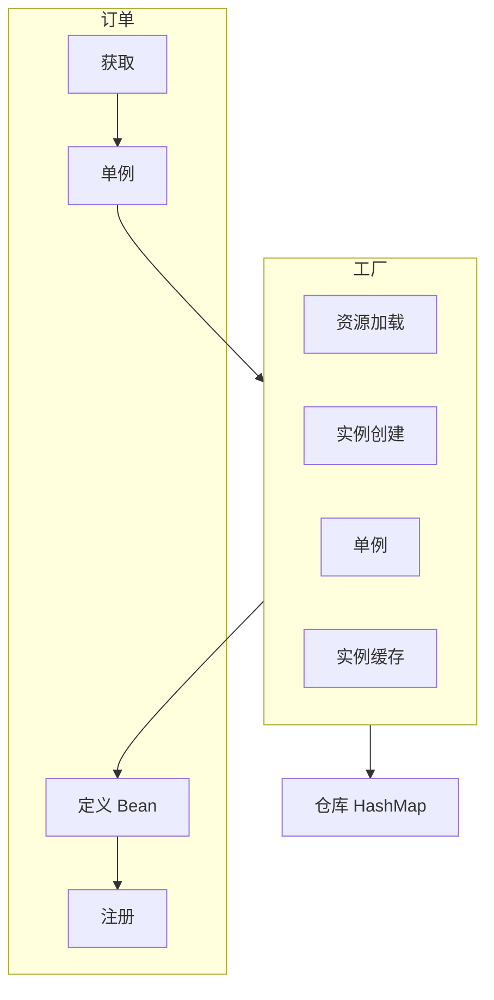


参考文献

- [https://javabetter.cn/sidebar/sanfene/spring.html](https://javabetter.cn/sidebar/sanfene/spring.html)
[https://javaguide.cn/system-design/framework/spring/spring-knowledge-and-questions-summary.html](https://javaguide.cn/system-design/framework/spring/spring-knowledge-and-questions-summary.html)



Spring 框架一般指 Spring Framework，它是多模块的集合，讲究开箱即用。其最核心的两个特性为
- [IoC 控制反转](#ioc-机制)
    以前用一个对象要自己 new 出来，现在只需要告诉 spring 需要什么对象就行
- [AOP 面向切面编程](#aop)
    在某些通用步骤（如鉴权、事务管理、日志记录）提供统一的代码

## 包含模块


- Core Container 核心模块，提供IoC依赖注入功能的支持
    - spring-core 
        基本的核心工具类，包括IoC和DI功能，关键组件是 `BeanFactory` ，它是工厂模式的实现，负责创建和管理 Bean 对象
    - spring-beans 
        提供对 `BeanFactory` 的实现，负责创建、配置和管理 Bean 及其之间的依赖关系
    - spring-context 
        在前两者的基础上构建，以一种更面向框架的方式访问对象，类似于 JNDI 注册表。`ApplicationContext` 接口是 Context 模块的焦点。它增加了企业级功能，如国际化、事件传播、资源加载等
    - spring-expression 
        提供对表达式语言（Spring Expression Language） SpEL 的支持。用于在运行时查询和操作对象图。它支持在 Bean 中设置属性值和执行方法
- AOP 
    - spring-aop
        提供了面向切面的编程实现，允许将横切关注点与业务逻辑分离。它基于代理模式实现
    - spring-aspects
        提供了与 AspectJ （一个更成熟的AOP框架）的继承支持
    - spring-instrumentation
        提供类植入和类加载器实现，主要用于应用服务器
- Data Access/Integration 提供与数据库交互和数据集成的支持
    - spring-JDBC
        提供一个 JDBC 抽象层，极大简化了 JDBC 编码和错误处理，不需要再编写繁琐的 `try-catch` 语句来处理链接了
    - spring-ORM
        提供与主流对象关系映射框架的继承支持，如 Hibernate、 JPA、 Mybatis 等。spring还可以统一这些ORM框架的配置和事务管理
    - spring-OXM
        提供对 Object/XML 映射实现的抽象层支持，如 JAXB、 Castor、 XStream 等
    - spring-Transactions
        支持编程式和声明式事务管理，是 spring 数据访问层的核心功能
- Web
    - spring-web
        面向 Web 的基本的集成功能。如多部份文件上传、初始化IoC容器等
    - spring-web-MVC
        包含了 spring 的 MVC 实现，用于构建 Web 应用程序
    - spring-websocket
        提供了 WebSocket 通信的全双工协议支持
    - spring-webflux
        spring 5 引入的响应式 web 框架，用于构建非阻塞、异步、事件驱动的服务。与 spring MVC 不同，它不需要 Servlet API，是完全异步的
- test
    - spring-test
        支持使用 JUnit 或 TestNG 对 spring 组件进行单元测试和集成测试。还提供了用于测试 web 应用的 `Mock` 对象

spring 旨在简化 Java EE 开发，而 spring boot 旨在简化 spring 开发，大大减少了配置文件。

## IoC 机制

IoC (`Inversion of Control`) 机制带来的好处是显而易见的，它使得对象之间的耦合度或者依赖程度降低，资源也变得更加容易管理。


而 DI，也就是依赖注入，是实现 IoC 这种思想的具体技术手段，在 spring 里使用 `@Autowired` 注解就是在用 DI 的字段注入方式。DI 可以实现字段注入、构造方法注入、Setter 方法注入三种方式。除了 DI，IoC 还能通过 Service Locator （实现 `ApplicationContextAware` 接口）模式获取 spring 容器中的 Bean


### Bean

#### 定义

我们使用 Bean 代指那些被IoC容器所管理的对象。一般我们需要在专门的XML文件、注解或者Java配置类来配置元数据以定义 Bean 。

将一个类声明为 Bean 的注解有
- `@Component` 通用注解，如果一个 Bean 不知道在哪个层，就可以用这个注解
- `@Repository` 持久层，即 Dao 层，用于数据库相关操作
- `@Service` 服务层，主要涉及一些复杂的逻辑，需要用到 Dao 层
- `@Controller` 对应 spring MVC 控制层，主要用于接受用户请求，并调用 service` 层返回数据给前端
- `@RestController` 对应 RESTful API 下的控制层，是 `@Controller` 和 `@ResponseBody` 的结合。被它标注的类，其所有方法返回的数据都会直接 HTTP 响应体
- `@Configuration` 配置类，其内部可以包含使用 `@Bean` 的方法，它本身也会被 spring 容器管理

`@Bean` 是唯一的方法级别注解。被注释的方法会返回一个对象，该对象会被 spring 容器注册为一个 Bean。

这些被注释的对象（或方法）会被 spring 容器管理。在需要注入时，使用如下方法
- `@Autowired` spring 内置的注解，默认注入逻辑为先按类型匹配，若存在多个同类型 Bean，再尝试按名称筛选
    当注入接口但接口有多个实现类时，spring 会抛出 `NoUniqueBeanDefinitionException` 异常，因此可以在该注解后面追加 `@Qualifier()` 注解，指明是哪个实现类，或者在默认使用的 Bean 前加 `@Primary` 注解
- `@Resource` JDK 提供的注解，默认注入逻辑为先按名称匹配，若存在多个同名 Bean，则再尝试按类型匹配
    该注解可以指定 name 和 type

#### 注入

注入 Bean 的方式有以下几种
- 构造函数注入
    ```java
    @Service
    public class UserService {
    private final UserRepository userRepository;
    public UserService(UserRepository userRepository) {
        this.userRepository = userRepository;
    }
    //...
    }
    ```
- Setter 注入
    ```java
    @Service
    public class UserService {
        private UserRepository userRepository;
        @Autowired
        public void setUserRepository(UserRepository userRepository) {
            this.userRepository = userRepository;
        }
        //...
    }
    ```
- Field 注入
    ```java
    @Service
    public class UserService {
        @Autowired
        private UserRepository userRepository;
        //...
    }
    ```

相比 setter 注入，spring 官方推荐构造注入。构造注入有以下优势
- 依赖可声明为 `final`，创建不可变的 Bean，保证线程安全和业务逻辑安全
- 保证依赖不为空
- 在不使用 spring 容器下进行单元测试也非常方便

而 Field 注入则更不推荐了，该方法虽然方便，但
- 破坏封装性
- 测试困难，需要依赖 spring 容器。而构造函数注入可以直接 mock 依赖
- 隐藏了依赖关系，外部看不出需要什么依赖
- 注入的对象可能是 null
- 可能会导致循环依赖问题
    ```java
    @Service
    public class ServiceA {
        @Autowired
        private ServiceB serviceB;
    }

    @Service
    public class ServiceB {
        @Autowired
        private ServiceA serviceA;  // 循环依赖！
    }
    ```
- 字段注入的依赖是可变的


`@Autowired` 注入在 Bean 生命周期的属性填充阶段执行。首先，spring 会扫描 Bean 类，找出所有 `@Autowired` 注解的字段和方法。然后，spring 根据字段/参数类型在容器中查找匹配的 Bean。最后，通过**反射**设置字段值，将找到的 Bean 注入到目标字段。对于字段注入，会调用 `Field.set()` 方法，对于 setter 注入，会调用 `Method.invoke()` 方法。



对于 Field 或 Setter 注入时可能产生的循环依赖问题，spring 通过三级缓存机制，巧妙解决了单例 Bean 场景下的循环依赖问题。

在 spring 的 `DefaultSingletonBeanRegistry` 类中，维护了三个重要的 Map，也就是我们常说的三级缓存：
1. 一级缓存 `singletonObjects` ：存放已完成实例化、注入、初始化的 Bean。我们平时从 spring 容器中获取到的就是这里的 Bean
2. 二级缓存 `earlySingletonObjects` ：存放已实例化，但未注入、初始化的 Bean。用于解决循环依赖
3. 三级缓存 `singletonFactories` ：存放一个 `ObjectFactory` （对象工厂）。这个工厂可以返回一个目标 Bean 的早期引用（通过动态代理等技术），以便后面有机会创建代理对象

以 A 依赖 B，B 依赖 A 为例，

1. 开始创建 A
    - 在 `getBean("a")` 时，spring 还没意识到 A 还没被创建，正常创建
    - 调用 A 的构造器，实例化 A 对象。此时 A 还是个半成品，属性 b 为 null
    - spring 将构建好的 A 对象包装成一个 `ObjectFactory`，并放入**三级缓存**，同时从**二级缓存**移除 A （若存在）。
2. 为 A 进行属性填充
    - spring 发现 A 依赖 B，于是执行 `getBean("b")` 获取 B
3. 开始创建 B
    - 和创建 A 的过程一样，实例化 B 对象，放入**三级缓存**
4. 为 B 进行属性填充
    - spring 发现 B 依赖 A，于是执行 `getBean("a")` 获取 A
5. **关键步骤** 获取早期引用
    - 这次的 `getBean("a")` 不会从头开始创建 A，因为在第一级、第二级没找到，但在第三级找到了 A 的 `ObjectFactory`
    - spring 通过 `ObjectFactory.getObject()` 方法，获取到 A 对象的早期引用（这个引用可能是一个代理对象，也可能就是原始对象）
    - 然后 spring 将这个早期引用放入**二级缓存**，并从**三级缓存**中移除 A 的工厂
    - 最后，将这个早期引用返回给 B。至此，B成功完成了属性注入，属性 a 指向了 A 的早期引用
6. B 完成初始化
    - B 在注入 A 的早期引用后，继续执行后续步骤。最后变成一个完全初始化的 Bean
    - spring 将初始化好的 B 对象放入第一级缓存，并清除二级和三级缓存中关于 B 的记录
7. A 完成初始化
    - B 创建完成后，步骤 2 中的 `getBean("b")` 的调用成功返回了完整实例
    - A 成功注入 B 并完成初始化


**那为什么需要三级缓存呢？**

主要是为了解决 [AOP](#aop) 的问题。关键在于三级缓存存储的是一个工厂，而不是直接的对象。这个工厂的核心作用是调用 `getEarlyBeanReference` 方法。这个方法在 Bean 存在 AOP 时至关重要。

如果缺少了三级缓存，在 B 注入 A 时，我们只能从二级缓存拿到 A 的原始对象。但如果 A 最终需要被 AOP 代理，那么 B 注入就是一个原始对象，而不是代理对象，这会导致问题（同一个 Bean 居然会产生两个实例）。有了三级缓存，B 注入 A 时会通过三级缓存中的`ObjectFactory` 来获取 A 的调用。若 A 需要被代理，那么 `getEarlyBeanReference` 方法会在这里提前生成并返回代理对象，如果不需要，则返回原始对象。这样就保证了 B 注入的 A 和最终放入一级缓存的 A 是同一个对象，保证了行为一致性。

如果缺少了二级缓存，那么在三个及以上（假设为 A、B、C）的 Bean 构成间接依赖时，每次 B 或 C 需要获取 A 时，都需要调用 A 中的 `ObjectFactory.getObject()` 方法。这意味着如果 A 需要被代理的话，代理对象可能会重复创建多次。

以下情况的循环依赖 spring 无法被创建出来：
- 若使用构造器注入的循环依赖，构造时对象还没创建出来，无法放入三级缓存，spring 会直接抛出 `BeanCurrentlyInCreationException`
- 原型 Bean 循环依赖，由于 spring 不缓存 Prototype Bean，所以无法暴露其早期引用
- `@Async` 方法导致的循环依赖，因为 `@Async` 的大力创建时机交完，在三级缓存机制后，可能导致注入的不是最终的代理对象



#### 作用域

spring 中 Bean 的作用域可以通过注释 `@Scope()` 指定，通常有以下几种
- `singleton` 单例
    默认作用域。在整个 spring IoC 容器中，只存在一个该 Bean 的共享实例，该实例在容器启动或第一次请求时创建，容器关闭时销毁
- `prototype` 原型
    每次通过容器获取 Bean 时，都会创建一个新的实例。其销毁由 GC 决定。注意，在 singleton Bean 中注入 prototype Bean 时要小心，因为 singleton Bean 只创建一次，所以 prototype Bean 也只会创建一次，这时候可用 `@Lookup` 注解或者 `ApplicationContext` 动态获取
- `request` 请求 `WebApplicationContext.SCOPE_REQUEST`
    **仅 Web 应用可用**，为每一个 HTTP 请求创建一个新的 Bean，请求结束时销毁
- `session` 会话 `WebApplicationContext.SCOPE_SESSION`
    **仅 Web 应用可用**，为每一个 HTTP Session 创建一个新的 Bean，Session 失效时销毁
- `application` 应用 `WebApplicationContext.SCOPE_APPLICATION`
    **仅 Web 应用可用**，为整个 Web 应用创建一个 Bean，其与 `singleton` 的区别在于，前者在整个 Web应用中共享，无论几个 spring 容器均只有一个，后者在每个 JVM 中一个 Bean
- `websocket` 
    **仅 Web 应用可用**，为每一个 `websocket` 会话创建一个 Bean，绘画结束后销毁

无状态的服务类使用默认的 `singleton`。

单例作用域下，由于只有一个 Bean，所以可能会存在线程安全问题，而在原型作用域下，则不太可能产生线程安全问题。不过，大部分 Bean 都是无状态（没有可变的成员变量）的，也就不存在资源竞争的问题，线程安全。

对于状态单例下的 Bean 线程安全问题，常见的解决办法是
- 避免存在可变成员变量，尽量设计其为无状态
- 将可变成员变量存在 `ThreadLocal` 中
- 使用各种锁进行同步控制

#### 生命周期

1. 实例化
    spring 容器通过 Bean 的构造方法（默认是无参构造，或指定的有参构造）来创建一个新的对象实例。此时的对象属性还是默认值。
2. 属性赋值/依赖注入
    通过 `@Autowired` `@Resource` 注入依赖对象，通过 `@Value` 注入配置值。
3. 初始化
    Bean 的属性已注入完毕，但可能还需要执行一些自定义的初始化逻辑。初始化的顺序如下
    1. `BeanPostProcessor.postProcessBeforeInitialization`
        容器级别的处理器，对所有 Bean 生效，对 Bean 的任何初始化方法都在被调用前执行，可用于修改 Bean 的包装类，进行某些检查等
    2. `Aware` 接口回调
        如果 Bean 实现了这种接口，spring 容器就会回调响应的方法，将容器本身的一些信息“感知”给 Bean。
        常用的接口为 `ApplicationContextAware` （设置 `ApplicationContext`，让 Bean 获取到 `ApplicationContext` 本身）、`BeanNameAware` （设置 Bean 的 ID/名字）、`BeanFactoryAware` （设置 BeanFactory）、`BeanClassLoaderAware`（设置当前 Bean 的 ClassLoader）等
    3. `@PostConstruct` 注释
        这是 JSR-250 规范提供的注解，标记在方法上，在依赖注入完后立即执行。这是最推荐使用的初始化注解，因为它和 spring 解耦
    4. `InitializingBean.afterPropertiesSet`
        spring 提供的接口，用于重写该方法
    5. `init-method`
        在 Bean 定义中通过 `@Bean(initMethod = "myInit")` 指定自定义方法，这是另一种解耦的方式
    6. `BeanPostProcessor.postProcessAfterInitialization`
        在 Bean 的所有初始化方法都执行之后执行。string AOP 就是在这里为 Bean 创建代理对象的
4. 使用期
    现在的 Bean 已经随时可以使用了
5. 销毁
    在 spring 容器被关闭（调用 `applicationContext.close()` 或 web 应用关闭），容器会管理 Bean 的销毁。销毁的顺序如下
    1. `@PreDestroy` 注解
        JSR-250 规范提供的注解
    2. `DisposableBean.destroy`
        spring 提供的接口
    3. `destroy-method`
        在 Bean 定义中通过 `Bean(destroyMethod = "myDestroy")` 指定自定义方法


Aware 接口能让 Bean 感知到 spring 容器的一些内部组件。


### 容器

Java web 中的容器有两种，spring 容器和 web 容器。

web 容器是一个运行时环境，管理着 web 应用的生命周期，用于处理各种网络协议，管理 Servlet、Filter、Listener 等 web 层面的组件。在服务器启动时就初始化，如 Tomcat、Jetty、Undertow 等

spring 容器是一个IoC和Bean的管理框架，管理所有由它创建的 Bean，包括上文提到的各种 `@Component`

在一个 spring MVC web 应用中，它们的关系如下
- Tomcat 启动时，根据 `web.xml` 或 `Servlet 3.0+` 的注解，加载并初始化一个特殊的 Servlet —— `DispatchServlet`，这个容器属于 spring MVC，但运行在 Web 容器里。初始化的过程中，它会创建一个 spring 容器 (`ApplicationContext`)。然后，spring 容器开始扫描指定的包，根据注解或配置创建并组装所有的 Bean （如 `Controller`、`Service` 等）。
- 用户发起一个请求到服务器时，Tomcat 收到请求，根据 URL 映射，将请求交给 `DispatchServlet` 处理。`DispatchServlet` 开始工作，利用 spring 容器来查找对应的 `@Controller` Bean，然后逐层查找，完成业务逻辑。`Controller` 处理完毕后，返回一个视图名或数据给 `DispatchServlet`。`DispatchServlet` 完成视图解析等后续处理，最终 Tomcat 将 HTTP 响应返回给用户端。


spring MVC 和其他 web 框架一样围绕着前端控制器的模式设计，其中一个中央的 `Servlet` 就是 `DispatchServlet`，这个Servlet会把请求分发给各个处理器，并支持可配置的处理器映射、视图渲染、本地化、时区与主题渲染和文件上传等功能。


在 spring MVC 应用中，一般需要先打包一个 WAR 文件，然后将其部署到一个外部的，预先安装好的 Web 容器（如 Tomcat）中。但在 spring boot 中，应用会默认打包为一个可执行的 JAR 文件，这个 JAR 文件内部包含了一个内嵌的 Web 容器（默认为 Tomcat）。在启动应用时，spring boot 会启动内嵌的 Tomcat 示例，并自动将应用部署在上面。

于是两种容器的关系也发生了变化。在执行 JAR 包时，会首先创建 spring 容器(`ApplicationContext`)，然后在 spring 容器创建和刷新时，自动配置机制会检测到 classpath 下有 Servlet 相关的类（因为引入了 `spring-boot-starter-web`），然后启动内嵌的 web 容器，并将其集成到当前正在运行的 spring 容器里。同时，spring boot 会自动将 `DispatchServlet` 注册到这个内嵌的 web 容器里。


spring 容器会在启动时自动扫描 `@ComponentScan` 指定包下的所有类，然后根据类上的注解，来判断哪些 Bean 需要被**自动装配**。

自动装配一般有 `byType`、`byName`、`constructor`、`autodetect` 四种。`@Autowired` 下默认为 `byType`，`@Resource` 注解默认按名称装配


### IoC 实现机制

IoC 的本质是一个高度可配置、可扩展的工厂模式。其核心是 `BeanFactory` 和 `ApplicationContext` 容器。我们通过各种注解告诉工厂自己需要什么产品，产品有什么特性，需要什么原材料，等等。然后工厂里的各种生产线（在 spring 中就是各种 `BeanPostProcessor`）进行生产和缓存。工厂里还有各种缓存机制用来存放产品。



1. 加载 Bean 的定义信息。spring 会扫描我们配置的包路径。找到所有标注了相关注解的类，然后将写类的元信息封装成 `BeanDefinition` 对象，注册到容器的 `BeanDefinitionRegistry` 中，这个阶段只是收集信息，还没有真正创建对象
    
    ```java
    // Bean定义信息
    public class BeanDefinition {
        private String beanClassName;     // 类名
        private String scope;            // 作用域
        private boolean lazyInit;        // 是否懒加载
        private String[] dependsOn;      // 依赖的Bean
        private ConstructorArgumentValues constructorArgumentValues; // 构造参数
        private MutablePropertyValues propertyValues; // 属性值
    }
    ```

2. 准备 Bean 工厂，spring 会创建一个 `DefaultListableBeanFactory` 作为 Bean 工厂来负责 Bean 的创建化和管理。以 `ApplicationContext` 为例，启动过程的核心是 `refresh()` 方法，该方法包含准备 Bean 工厂、加载 Bean 定义、实例化所有单例 Bean 三步骤

3. Bean 实例化和初始化，spring 会根据 `BeanDefinition` 来创建 Bean 实例。对于单例 Bean，spring 会先检查缓存中是否已经存在，如果不存在就创建新实例。创建实例的时候会通过反射调用构造方法，然后进行属性注入，最后执行初始化回调方法。

4. 依赖注入的实现主要是通过反射来完成的。比如我们用 `@Autowired` 标注了一个字段，spring 在创建 Bean 的时候会扫描这个字段，然后从容器中找到对应类型的 Bean，通过反射的方式设置到这个字段上。


`BeanFactory` 和 `ApplicationContext` 的区别在于
||`BeanFactory`|`ApplicationContext`|
|-|-|-|
|定位|IoC 容器的基础，核心功能|在 IoC 的基础上，提供完整的应用框架上下文|
|Bean 加载策略|懒加载：只有在使用 `gerBean()` 请求时，才会实例化 Bean|预加载/饿汉式：容器启动时，立即实例化所有单例 Bean（非懒加载的）。有助于提前发现配置错误|
|容器功能|基础的 Bean 生命周期管理、依赖注入|额外提供 `BeanFactory` 外的国际化、AOP 集成、Web 应用上下文等功能|
|适用场景|资源及其受限的环境|绝大多数 Java EE 应用|



## AOP

AOP 能够将那些和业务无关，但为业务模块所共同调用的逻辑（如事务处理、日志管理、权限控制等）封装起来，便于减少系统的重复代码，降低模块间的耦合度。

实现 AOP 需要使用**代理对象**，代理对象实现与目标 Bean 相同的接口或子类，因此它和原始对象没有任何区别。然而，在代理对象的方法内部，包含了处理 AOP 的其他逻辑。

spring AOP 基于动态代理。如果要代理的对象实现了某个接口，那么 spring AOP 会使用 JDK Proxy 去创建代理对象。而对于没有实现接口的对象，spring 会使用 Cglib 生成一个被代理对象的子类来来作为代理。但在目前，主流的 AOP 框架为 AspectJ。



JDK 代理要求目标类至少实现一个接口，因为它是基于接口来实现代理的。而 Cglib 代理不需要目标类实现接口，它是通过继承目标类来创建代理的，这是两者最根本的区别。

从实现原理来说，JDK 代理是 Java 原生支持的。当我们调用代理对象的方法时，会被转发到 `InvocationHandler` 的 `invoke` 方法中，我们可以在这个方法里插入切面逻辑，然后再通过反射调用目标对象的真实方法。而 Cglib 是第三方的字节码生成库，它通过 ASM 字节码框架动态生成目标类的子类，然后重写父类的方法来插入切面逻辑。

例如，在 `@Controller` 中的类，就只能使用 Cglib 代理；而定义了接口的 `@Service`，通常首选 JDK 动态代理。

在 spring boot 2.0 后。spring AOP 默认使用 Cglib 代理。毕竟 spring boot 作为“约定优于配置”的框架，选择 Cglib 可以简化操作。

对于以下场景

```java
// 1. 接口（JDK 代理需要）
public interface UserService {
    void addUser(String username);
    void deleteUser(String username);
}

// 2. 实现类（目标对象）
public class UserServiceImpl implements UserService {
    @Override
    public void addUser(String username) {
        System.out.println("添加用户: " + username);
        // 模拟业务逻辑
    }
    
    @Override
    public void deleteUser(String username) {
        System.out.println("删除用户: " + username);
        // 模拟业务逻辑
    }
}
```

使用 JDK 动态代理时，使用方法如下

```java
public class LogInvocationHandler implements InvocationHandler {
    
    private final Object target; // 目标对象
    
    public LogInvocationHandler(Object target) {
        this.target = target;
    }
    
    @Override
    public Object invoke(Object proxy, Method method, Object[] args) throws Throwable {
        // 前置增强
        System.out.println("[JDK代理] 开始执行: " + method.getName());
        
        // 调用目标方法
        Object result = method.invoke(target, args);
        
        // 后置增强
        System.out.println("[JDK代理] 执行完成: " + method.getName());
        return result;
    }
    
    // 创建代理对象的便捷方法
    public static <T> T createProxy(T target, Class<T> interfaceClass) {
        return (T) Proxy.newProxyInstance(
            target.getClass().getClassLoader(),
            new Class<?>[]{interfaceClass},
            new LogInvocationHandler(target)
        );
    }
}

// 测试类
public class JdkProxyTest {
    public static void main(String[] args) {
        // 创建目标对象
        UserService target = new UserServiceImpl();
        
        // 创建代理对象
        UserService proxy = LogInvocationHandler.createProxy(target, UserService.class);
        
        // 通过代理对象调用方法
        proxy.addUser("张三");
        System.out.println("---");
        proxy.deleteUser("李四");
        
        // 验证代理类型
        System.out.println("代理对象类型: " + proxy.getClass());
        System.out.println("是否是JDK代理: " + Proxy.isProxyClass(proxy.getClass()));
    }
}
```

而 Cglib 的实现方式如下

```java
public class LogMethodInterceptor implements MethodInterceptor {
    
    @Override
    public Object intercept(Object obj, Method method, Object[] args, MethodProxy proxy) throws Throwable {
        // 前置增强
        System.out.println("[CGLIB代理] 开始执行: " + method.getName());
        
        // 调用目标方法 - 注意这里使用proxy.invokeSuper，而不是method.invoke
        Object result = proxy.invokeSuper(obj, args);
        
        // 后置增强
        System.out.println("[CGLIB代理] 执行完成: " + method.getName());
        return result;
    }
    
    // 创建代理对象的便捷方法
    public static <T> T createProxy(Class<T> targetClass) {
        Enhancer enhancer = new Enhancer();
        // 设置父类（目标类）
        enhancer.setSuperclass(targetClass);
        // 设置回调
        enhancer.setCallback(new LogMethodInterceptor());
        // 创建代理对象
        return (T) enhancer.create();
    }
}

// 测试类 - 注意：这里的目标类不需要实现接口
public class CglibProxyTest {
    public static void main(String[] args) {
        // 创建代理对象 - 直接基于实现类
        UserService proxy = LogMethodInterceptor.createProxy(UserServiceImpl.class);
        
        // 通过代理对象调用方法
        proxy.addUser("王五");
        System.out.println("---");
        proxy.deleteUser("赵六");
        
        // 验证代理类型
        System.out.println("代理对象类型: " + proxy.getClass());
        System.out.println("父类: " + proxy.getClass().getSuperclass());
    }
}
```



AOP 切面编程涉及到的相关术语（或者说概念）有

|术语|含义|
|-|-|
|目标 `Target`|被通知的对象|
|代理 `Proxy`|向目标对象应用通知后创建的代理对象|
|连接点 `JoinPoint`|目标对象的所属类中，定义的所有方法均为连接点|
|切入点 `PointCut`|被切面拦截/增强的连接点（切入点属于连接点）|
|通知 `Advice`|增强的逻辑/代码，拦截到目标对象的连接点后要做的事情|
|切面 `Aspect`|切入点 + 通知|
|织入 `Weaving`|将通知应用到目标对象，进而生成代理对象的过程动作|

相比 spring AOP，AspectJ 
- 通过在编译时增强、类加载时增强（直接操作字节码）而非在运行时增强（基于动态代理）
- 支持方法级、字段、构造器、静态方法等切入点，但 spring AOP 支支持方法级
- 运行时无代理开销，性能更高
- 适合高性能，高复杂度的 AOP 需求

spring AOP 是在 Bean 初始化阶段发生的，具体来说是在 Bean 生命周期的后置处理阶段。在 Bean 实例化和属性注入完成后，spring 会调用所有的 `BeanPostProcessor` 的 `postProcessAfterInitialization` 方法，AOP 代理的创建就是在这个阶段完成的。

### 通知

AOP 常见的通知类型如下
- `Before` 前置通知，在目标对象方法调用前触发
- `After` 后置通知，在目标对象方法调用后触发
- `AfterReturning` 返回通知，目标对象的方法调用完成，在返回结果前触发
- `AfterThrowing` 异常通知，目标对象的方法运行中抛出异常后触发
- `Around` 环绕通知，该通知类型可以直接拿到目标对象和要执行的方法，所以环绕通知可以在目标对象的任意时刻通知

对于多个切面的执行顺序，一般可以通过 `@Order()` 注释指定，数值越小优先级越高。也可以实现 `Ordered` 接口重写 `getOrder` 方法


AOP 和反射的区别在于，反射主要是为了让程序能够检查和操作自身的结构，而 AOP 则是为了在不修改业务的前提下，动态地为方法添加额外的行为。



AOP 和装饰器模式的区别在于，装饰器模式是通过创建一个包装类来实现的，这个包装类持有被装饰对象的引用，并在调用方法时添加额外的逻辑。而 AOP 是通过代理对象或者其他方式实现的。
