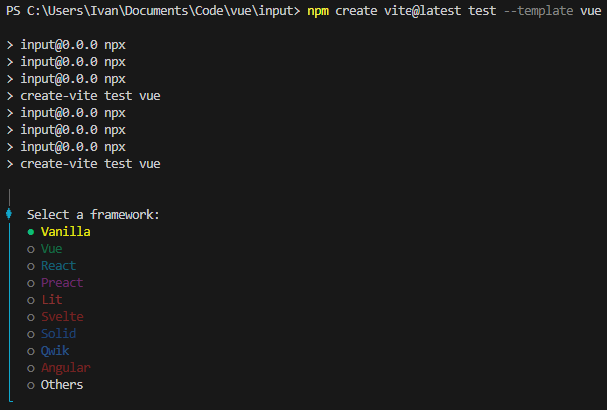

## JavaScript概要

### 变量与函数

变量声明有3种

|变量声明|概述|
|-|-|
|`const`|定义常量|
|`let`|局部变量，只在该大括号内有效|
|`var`|具有函数作用域的变量|

变量类型有许多种，变量在程序运行时动态指定变量

|类型|示例|
|-|-|
|`number`|`var x = 15`|
|`string`|`var s = "Ruirui"`|
|`boolean`|`var b = false`|
|`object.Array`|`var a = new Array(1, 2, 3)` 或 `var a = [1, 2, 3]`|
|`object`|`var person = {name: "Ruirui", age: 19, id: 7}`|
|`undefined`|`var i`|
|`null`|`var i = null`|

注解：

1. 也可以使用 "\`\`"字符生成字符串模板，在字符串模板种使用 `${variable}` 插入变量
2. 可以使用 `typeof` 方法查看变量的数据类型
3. 函数使用 `function` 声明，函数也可以使用箭头函数 `=>` 来简化操作
4. 比较用 `==`，严格比较（值和类型都相等）用 `===`，严格不等于（值和类型至少有一个不相等）用 `!==`



```js
// 传统函数
const square = function (x) {
    return x * x;
};

const square = x => x * x;
```

箭头函数形式简单，适合作为回调函数，也没有`this`


### 事件

术语为HTML的DOM事件，以下为常用的事件

|事件|描述|
|-|-|
|`onchange`|HTML元素改变|
|`onclick`|用户点击 HTML 元素|
|`onmouseover`|鼠标指针移动到指定的元素上时发生|
|`onmouseout`|用户从一个 HTML 元素上移开鼠标时发生|
|`onkeydown`|用户按下键盘按键|
|`onload`|浏览器已完成页面的加载|

更多事件可以点击[这里](https://www.runoob.com/jsref/dom-obj-event.html)

### 闭包

闭包通常在以下场景中形成：

- 当一个函数被定义在另一个函数内部时，内部函数可以访问外部函数的变量。
- 当内部函数被外部函数返回时，内部函数可以继续访问外部函数的变量，即使外部函数的执行上下文已经结束。

闭包的典型结构如下

```js
function outerFunction() {
    let outerVariable = "I am from outer function";

    function innerFunction() {
        console.log(outerVariable); // 访问外部函数的变量
    }

    return innerFunction; // 返回内部函数
}

const myClosure = outerFunction(); // myClosure 是闭包
myClosure(); // 输出: I am from outer function
```

## 环境构建

重点介绍vite方法创建vue工程

### cdn

在 `<script>` 标签中加入src路径

```html
<script src="https://unpkg.com/vue@3/dist/vue.global.js"></script>
```

### ES模板

```html
<script type="module">
  import { createApp, ref } from 'https://unpkg.com/vue@3/dist/vue.esm-browser.js'
  ...
</script>
```

### vite

在项目所在的文件夹下打开命令行，输入

```bash
npm create vite@latest <name> --template vue
```




这样，大体的框架就搭建好了，还需要按照终端上的指示行动

```bash
cd test
npm install
npm run dev
```

最后会指示一个本地端口，用于打开一个HelloWorld网页，按CTRL+C停止


保存App文件时，网页也会跟着发生改变。如果没有，就试着刷新一下



## 大体结构

在默认生成的代码中，App.vue的格式与HTML大致相同。其中，`<template>`标签定义组件的HTML结构，`<script>`标签定义组件的逻辑部分，`<style>`标签定义组件的样式。
Vue3中的应用是通过使用`createApp`函数来创建的，并必须在调用了`.mount()`方法后才会渲染出来。但这些都包含在文件`main.js`中，无需操心

注释

- `<style scoped>`: 给打包后自动给组件内的 CSS 加上作用域，避免不同组件之间相同的 CSS 类互相干扰
- `export`即导出，`import`即导入，这两个是JavaScript ES6引入的新特性，用于实现模块化。每一个 `Vue` 组件又必须有`export`（App.vue也不例外，它被main.js引入）。毕竟组件通过`export`导出一个配置对象，虽然不一定是`export default { ... }`的形式，也可以是命名导出，但总之必须`export`出去。`import`不是必须的，毕竟如果功能简单或者其他什么因素，也不需要用到别的组件
- 其中的`$mount(App)`用于将vue元素挂载到DOM元素上

    ```js
    createApp(App).mount('#app')
    ```

## 模板语法

### Mustache插值

可以通过两个大括号`{{ }}`进行直接插值

```html
<template>
  <div>
    <h2>{{ message }}</h2>
  </div>
</template>

<script>
export default {
  data() {
    return {
      message: 'Hello, Vue 3!'
    }
  }
}
</script>
```

### `v-text`

该指令可以等效于Mustache插值，但Mustache插值更为灵活

```html
<span v-text = massage></span>
<!-- equals to -->
<span>{{ message }}</span>
```

### `v-html`

该指令向属性值以HTML形式注入到响应的节点。但该内容不会在Vue中编译，且在网站上动态渲染网页易受到XSS攻击

```html
<template>
  <div v-html= html>
  </div>
</template>

<script>
export default {
  data() {
    return {
      message: 'Hello, Vue 3!',
      html: '<p>This is a paragraph</p>'
    }
  }
}
</script>
```

效果如图所示


### `v-once`

只渲染元素合组件一次，重新渲染时会被直接跳过

### `v-memo`

该指令接收一个数组，若数组中的每个值都和上次渲染时的相同，，则整个子树的更新都会跳过。当其接收的数组为空数组时，与`v-once`指令等价。

### `v-bind`

可以缩写为`:`，当使用`.prop`修饰符时，也可以缩写为`.`
用于将变量属性的绑定，以设置元素的样式，如`style`属性，`type`属性等

```html
<template>
  <div :style="style.div">
    {{ message }}
  </div>
</template>

<script>
export default {
  data() {
    return {
      message: 'Hello, Vue 3!',
    }
  },
  computed: {
    style() {
      return {
        'div': {
          color: 'red',
          fontSize: '50px',
        }
      }
    }
  }
}
</script>
```

最后结果为


### `v-on`

可以缩写为`@`符号
用于监听DOM事件，从而执行JavaScript代码

```html
<template>
  <div>
    <button @click="counter++">Increment</button>
    <p>Counter: {{ counter }}</p>
  </div>

</template>

<script>
export default {
  data() {
    return {
      counter: 0,
    }

  },
}
</script>
```

该代码最后会生成一个按钮，点击一次会产生相应反应


### `v-model`

在表单标签上加上该指令，标签上的初始值会被忽略，从而实现双向绑定
以下的代码相互等价

```html
<input v-model="value"/>
<input :value="value" @input="value = $event.target.value"
```

以下代码

```html
<template>
  <div>
    <input type="text" v-model="value"/>
    <br/>
    <p>{{ value }}</p>
  </div>

</template>

<script>
export default {
  data() {
    const value = 'test'
    return {
      value,
    }
  },
}
</script>
```

的输出结果为



v-model 指令一般用于表单的输入中，如`<input/>` `<select/>` `<radio/>` `<checkbox/>` 等等
v-bind 范围更为广泛，链接等元素也能用


v-model 有以下3种修饰符

|修饰符|作用|
|-|-|
|`.lazy`|监听的是change事件而非input事件，如当输入框失去焦点后才会响应|
|`.number`|输入框得到的数据一般是字符串格式，此处转换为数字格式|
|`.trim`|去掉输入内容前后的空格|

## 组合式api

组合式api是vue3中一种新的api形式，相比以前的选项式api更为灵活，以下两个实例可以看出二者的差别

选项式api

```js
export default {
  data() {
    return {
      count: 0
    };
  },
  methods: {
    increment() {
      this.count++;
    }
  },
  computed: {
    doubleCount() {
      return this.count * 2;
    }
  }
};
```

组合式api

```js
import { ref, computed } from 'vue';

export default {
  setup() {
    const count = ref(0);

    const increment = () => {
      count.value++;
    };

    const doubleCount = computed(() => {
      return count.value * 2;
    });

    return {
      count,
      increment,
      doubleCount
    };
  }
};
```

## 流程控制

|条件语句|作用|
|-|-|
|`v-if`|元素在false时不会渲染到DOM中|
|`v-else` `v-else-if`|配合`v-if`使用|
|`v-show`|元素总是会渲染，但元素在false时不会显示|
|`v-for`|遍历数组或对象，格式为`v-for="(value, key, index) in object"`|


不支持`v-if`和`v-for`同时出现在同一元素中


## 组件

### 组件的声明

根据引入位置的不同，可以将组件分为全局组件和局部组件

以下为全局组件的内容，若引用成功，则输出棕色字体

```html
<template>
    <h1 style="color:brown">This is a global component</h1>
</template>

<script>
export default {
    name: 'GlobalComponent'
}
</script>
```

以下为局部组件的内容，若引用成功，则输出蓝色字体

```html
<template>
    <h1 style="color: blue;">This is a part component</h1>
</template>

<script>
export default {
    name: 'PartComponent'
}
</script>
```

以下为动态组件中绑定的内容

Test1 打印绿色字体

```html
<template>
    <h1 style="color: green;">This is a test1 component</h1>
</template>

<script>
export default {
    name: 'Test1'
}
</script>
```

Test2 打印橙色字体

```html
<template>
    <h1 style="color: orange;">This is a test2 component</h1>
</template>

<script>
export default {
    name: 'Test2'
}
</script>
```

接下来需要在`main.js`中进行全局组件的注册

```js
import { createApp } from 'vue';
import App from './App.vue';

// 引入全局组件Header
import Header from './components/global.vue';

// 初始化实例
createApp(App).component('global', Header).mount('#app');
```

在`App.vue`中引入所有组件

```html
<template>
  <!-- 全局组件 -->
  <global/>
  <!-- 局部组件 -->
  <part-component/>
  <br/>
  <!-- 动态组件 -->
  <div>
    <button @click="change('Test1')">Test1</button>
    <button @click="change('Test2')">Test2</button>
    <component :is="currentComponent"/>
  </div>
</template>

<script>
import { ref } from 'vue';
import PartComponent from './components/part.vue'
import test1 from './components/test1.vue';
import test2 from './components/test2.vue';
export default {
  components: {
    // 局部组件和动态组件的声明
    PartComponent,
    Test1: test1,
    Test2: test2
  },
  setup () {
    // 动态组件的切换方法，通过改变currentComponent的值来切换组件
    const current = ref('Test1');
    const change = (component) => {
      current.value = component;
    }
    return {
      currentComponent: current,
      change
    }
  }
}
</script>
```

## 路由

使用路由，可以使网页在不重新加载页面的情况下改变URL，使用其功能

### 路由插件的安装

创建完一个VUE项目后，在终端中输入指令

```html
npm install vue-router@next --save
```

在相应目录中安装路由相关依赖

### 路由的使用

以下面的代码为例，说明路由的使用

#### App.vue

```html
<template>
<h1>
  An example of a Vue 3 router.
</h1>

<nav>
  <router-link to="/">Home</router-link>
  <br/>
  <router-link to="/about">About</router-link>
</nav>
<main>
  <router-view/>
</main>
</template>
```

不同于`<a>`标签，我们一般使用`<router-link>`标签创建链接，使用`<router-view>`组件使Vue Router知道我们想要在哪里渲染对应的路由组件


`<router-view>`组件不一定要在App.vue中，但必须在某处被导入


#### 创建路由器实例

通过调用`createRouter()`函数创建路由器实例

```js
import { createMemoryHistory, createRouter } from "vue-router";
import HomeView from "../components/HomeView.vue";
import AboutView from "../components/AboutView.vue";

const routes = [
    {path: "/", component: HomeView},
    {path: "/about", component: AboutView}
];

const router = createRouter({
    history: createMemoryHistory(),
    routes
});

export default router;
```

首先需要先引入相关库和路由指示的网页文件
其中的routes选项定义了一组路由，把URL路径映射到组件。其中，由component参数指定的组件就是先前在 App.vue 中被`<RouterView>`渲染的组件。这些路由组件通常被称为视图，但本质上它们只是普通的 Vue 组件
createMemoryHistory()选项会完全忽略浏览器的URL而使用自己的URL

#### 注册路由器插件

在`main.js`中注册

```js
import { createApp } from 'vue';
import App from './App.vue';
import router from './router/router.js';

createApp(App).use(router).mount('#app');
```

注意需要将路由器实例引入进来，以及`use()`需要在`mount()`之前调用

## Axios

Axios用于向后端服务器发送请求

### post请求

```js
axios({
  method: 'post',
  url: '/...',
  data: {
    ...
  }
});
```

### get请求

这是默认的axios请求方式

```js
axios('/user/12345');
```

也可以另外配置

```js
axios({
  method: 'get',
  url: '/...',
})
  .then(result =>{
    ...
  })
  .catch(err => {
    ...
  });
```

## Pinia

在vue3后，我们一般使用Pinia做专属动态管理库
[点击进入Pinia的官方文档](https://pinia.vuejs.org/zh/introduction.html)

### store是什么

store是一个保存状态和业务逻辑的实体，它承载着全局状态，它有3个概念`state` `getter`和`action`，我们可以假设这些概念相当于组件中的 `data`、 `computed`和`methods`。
一个Store应该包含可以在整个应用中访问的数据。这包括在许多地方使用的数据，例如显示在导航栏中的用户信息，以及需要通过页面保存的数据，例如一个非常复杂的多步骤表单。


通俗地说，store就是一个适用于全局的组件


### 定义store及其属性

#### 定义store

store用`defineStore()`定义，它的第一个参数要求是一个独一无二的名字，该名字最好是 *use…* 形式的

```js
import { defineStore } from 'pinia'

export const useAlertsStore = defineStore('counter', {

})
```

在内部方法中传入一个带有`state`、`actions`与`getters`属性的 Option 对象

```js
export const useCounterStore = defineStore('counter', {
  state: () => ({ count: 0, name: 'Eduardo' }),
  getters: {
    doubleCount: (state) => state.count * 2,
  },
  actions: {
    increment() {
      this.count++
    },
  },
})
```

由于上述所说Option属性与组件属性的相似性，也可以直接代替

```js
export const useCounterStore = defineStore('counter', () => {
  const count = ref(0)
  const doubleCount = computed(() => count.value * 2)
  function increment() {
    count.value++
  }

  return { count, doubleCount, increment }
})
```

#### 访问state

默认情况下，可以直接对state进行读写

```js
const store = useStore()
store.count++
```

注解：

- 调用store.$reset()将state重置为初始值
- 调用store.$patch()在同一时间更改多个属性，但某些变更可能会很难实现

### action

action可以异步操作

```js
actions: {
  async registerUser(login, password) {
    try {
      this.userData = await api.post({ login, password })
      showTooltip(`Welcome back ${this.userData.name}!`)
    } catch (error) {
      showTooltip(error)
      // 让表单组件显示错误
      return error
    }
  },
},
```

其中，`async`将函数标记为异步函数。`await`关键字将暂停函数执行直到该post请求被解决或拒绝
